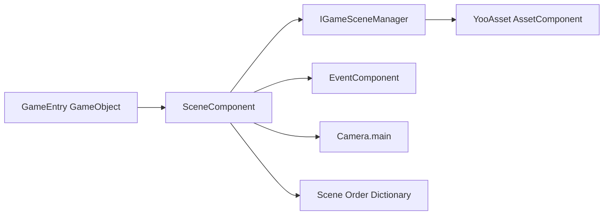

# Introduction and Features

GameFrameX Scene is a Unity scene management package based on [YooAsset](https://github.com/tuyoogame/YooAsset), providing asynchronous scene loading/unloading, event-driven state notifications, progress tracking, and active scene priority ordering capabilities. It serves as the unified entry point for the scene subsystem within the Game Frame X system.

## Quick Start

### Dependencies

| Package | Minimum Version |
|---|---------|
| `com.gameframex.unity.asset` | >= 2.5.0 |
| `com.gameframex.unity.event` | >= 1.1.0 |

### Installation (UPM Scoped Registry)

Edit the Unity project's `Packages/manifest.json`, add the GameFrameX repository in `scopedRegistries`, and add the Scene package to `dependencies`:

```json
{
  "scopedRegistries": [
    {
      "name": "GameFrameX",
      "url": "https://gameframex.upm.alianblank.uk",
      "scopes": ["com.gameframex"]
    }
  ],
  "dependencies": {
    "com.gameframex.unity.scene": "2.2.1"
  }
}
```

Source: [README.zh-CN.md](https://github.com/GameFrameX/com.gameframex.unity.scene/blob/main/README.zh-CN.md#L57-L73)

For other installation methods (Git URL / manually placing in the `Packages` directory) and detailed steps, see "Installation".

### Adding SceneComponent

Add `SceneComponent` on the GameEntry GameObject via `Add Component > GameFrameX > Scene`. The framework will automatically initialize it on startup, no additional calls required.

```csharp
[DisallowMultipleComponent]
[AddComponentMenu("GameFrameX/Scene")]
[GameFrameXAutoComponent(-4000)]
public sealed class SceneComponent : GameFrameworkComponent
```

Source: [SceneComponent.cs](https://github.com/GameFrameX/com.gameframex.unity.scene/blob/main/Runtime/Scene/SceneComponent.cs#L46-L49)

### Running Your First Scene

1. Asynchronously load a scene via `SceneComponent.LoadScene` to obtain a `SceneHandle`.
2. Set the priority via `SceneComponent.SetSceneOrder` to make it the active scene.
3. Subscribe to `LoadSceneSuccessEventArgs` callback notifications via `EventComponent`.

```csharp
var handle = await SceneComponent.LoadScene("Assets/Scenes/GameScene.unity");
SceneComponent.SetSceneOrder("Assets/Scenes/GameScene.unity", 10);

EventComponent.Subscribe<LoadSceneSuccessEventArgs>(e =>
{
    Debug.Log($"Scene {e.SceneAssetName} loaded successfully, took {e.Duration:F2}s");
});
```

Source: [README.zh-CN.md](https://github.com/GameFrameX/com.gameframex.unity.scene/blob/main/README.zh-CN.md#L107-L154)

## Features

| Capability | Description |
|------|------|
| Asynchronous Scene Loading/Unloading | `Task`-based `LoadScene` and `UnloadScene` APIs |
| `LoadSceneMode` Support | `Single` (replace all) and `Additive` (additive) two modes |
| Progress Tracking | Real-time progress via `LoadSceneUpdateEventArgs`, can drive loading UI |
| Active Scene Ordering | Set priority via `SetSceneOrder`, higher values take precedence as the active scene |
| Automatic Camera Refresh | Automatically refreshes `Camera.main` reference when active scene switches |
| Event Notifications | Subscribe to loading/unloading success, failure, and update events via `EventComponent` |
| State Queries | Query anytime via `SceneIsLoaded` / `SceneIsLoading` / `SceneIsUnloading` |
| Editor Extension | `SceneComponent` custom Inspector panel |

Source: [README.zh-CN.md](https://github.com/GameFrameX/com.gameframex.unity.scene/blob/main/README.zh-CN.md#L28-L37)

## How It Works Overview

The Scene subsystem uses `SceneComponent` as the unified entry point, internally delegating to `IGameSceneManager` and `GameSceneManager` for asynchronous scene loading, and forwarding lifecycle events to the `EventComponent` bus. Callers learn the status by subscribing to events or calling query interfaces such as `SceneIsLoaded`.



Source: [SceneComponent.cs](https://github.com/GameFrameX/com.gameframex.unity.scene/blob/main/Runtime/Scene/SceneComponent.cs#L49-L61)

## Next Steps

- For complete steps and examples of scene loading/unloading, see "Loading and Unloading Scenes"
- For the complete list of event subscriptions, see "Event Reference"
- For API quick reference and version changes, see "API Reference" and "Changelog"