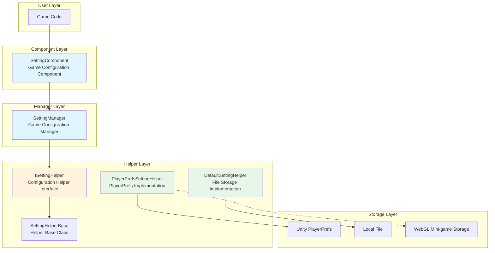
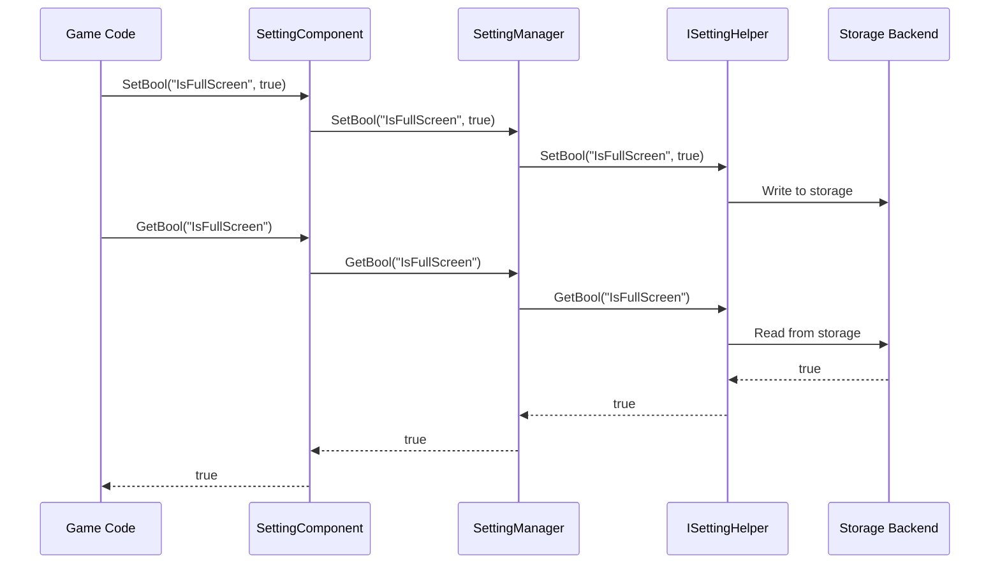

# Overview

GameFrameX Setting configuration component is one of the core components of the GameFrameX game framework, responsible for managing game configuration information and providing functionality to save and retrieve various types of configuration data. The component adopts a layered architecture design, supports multiple storage backends, making game settings management simple and efficient.

## Overview

The Setting component aims to solve the common configuration management needs in game development. During game development, developers need to save various types of settings data, such as graphics quality, volume, key bindings, game progress, etc. The traditional approach is to implement a configuration system by oneself, which not only has low code reusability but is also difficult to maintain.

GameFrameX Setting component provides a unified configuration management solution:

- **Type Safety**: Supports booleans, integers, floats, strings, and any serializable objects
- **Multiple Storage Backends**: Built-in PlayerPrefs and file storage implementations, supports custom extensions
- **Cross-platform Support**: Fully supports various Unity platforms, including WebGL mini-games (Douyin, WeChat, Kuaishou)
- **Editor Integration**: Provides Unity Editor Inspector panel for visual configuration

## Architecture Design



### Core Component Description

| Component | Description | Design Intent |
|-----------|-------------|---------------|
| SettingComponent | Unity MonoBehaviour component | Serves as bridge between framework and game code, provides editor integration and lifecycle management |
| SettingManager | Core business logic module | Responsible for settings data management, input validation, forwarding requests to helpers |
| ISettingHelper | Storage abstraction interface | Decouples storage implementation, facilitates extending new storage backends |
| SettingHelperBase | Helper base class | Provides abstract method definitions, simplifies helper implementation |

### Data Flow



## Features

### Supported Data Types

Setting component supports the following data types to meet various configuration needs in game development:

- **Boolean (bool)**: Used for toggle settings, such as fullscreen, sound effects enabled, etc.
- **Integer (int)**: Used for numeric settings, such as resolution, graphics quality level, etc.
- **Float (float)**: Used for precise numeric settings, such as volume, sensitivity, etc.
- **String (string)**: Used for text settings, such as player name, server address, etc.
- **Object (Object)**: Used for complex configurations, stored using JSON serialization, such as game progress, character data, etc.

### Storage Backends

#### PlayerPrefsSettingHelper (Default)

Based on Unity's built-in PlayerPrefs implementation, the simplest and most direct storage method:

- **Advantages**: No additional configuration needed, plug-and-play
- **Disadvantages**: Cannot get all key names, cannot batch delete
- **Applicable Scenarios**: Simple configuration storage

```csharp
// Uses PlayerPrefsSettingHelper by default
settingComponent.SetBool("IsFullScreen", true);
settingComponent.SetFloat("Volume", 0.8f);
settingComponent.Save();
```

#### DefaultSettingHelper

Based on local file storage implementation, provides more complete functionality:

- **Advantages**: Supports getting all setting item names, supports complete data management
- **Disadvantages**: Requires manual Save() call
- **Applicable Scenarios**: Games requiring complete settings management functionality

```csharp
// Uses file storage
settingComponent.SetInt("HighScore", 10000);
settingComponent.Save();
```

### Cross-platform Support

PlayerPrefsSettingHelper has special handling for different platforms:

| Platform | Storage Implementation | Special Notes |
|----------|------------------------|---------------|
| Unity Editor | Unity PlayerPrefs | Full read/write support |
| Standalone | Unity PlayerPrefs | Full read/write support |
| WebGL | Platform-specific Storage API | Douyin, WeChat, Kuaishou mini-games each adapted |
| Mobile | Unity PlayerPrefs | Full read/write support |
| Console | Unity PlayerPrefs | Full read/write support |

### Object Serialization

The component uses JSON serialization to store complex objects, supporting both generic and non-generic interfaces:

```csharp
// Define a settings class
[Serializable]
public class GameSettings
{
    public bool IsFullScreen = true;
    public int ResolutionWidth = 1920;
    public int ResolutionHeight = 1080;
    public float Volume = 0.8f;
}

// Store object
GameSettings settings = new GameSettings { IsFullScreen = true, Volume = 0.5f };
settingComponent.SetObject("GameSettings", settings);

// Load object
GameSettings loadedSettings = settingComponent.GetObject<GameSettings>("GameSettings");
```

## Related Links

- [Installation](./02.installation)
- [Quick Start](./03.getting-started)
- [Features](./04.features)
- [Helper Implementation](./05.helper-implementation)
- [Platforms](./06.platforms)
- [API Reference](./07.api-reference)
- [Troubleshooting](./08.troubleshooting)
- [Official Documentation](https://gameframex.doc.alianblank.com/)
- [GitHub Repository](https://github.com/GameFrameX/com.gameframex.unity.setting)
