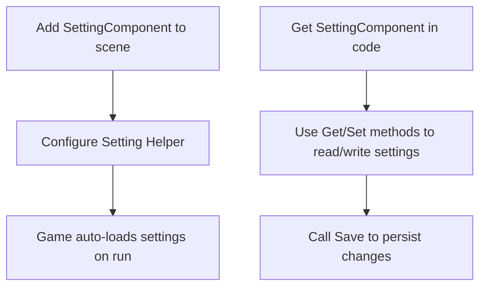
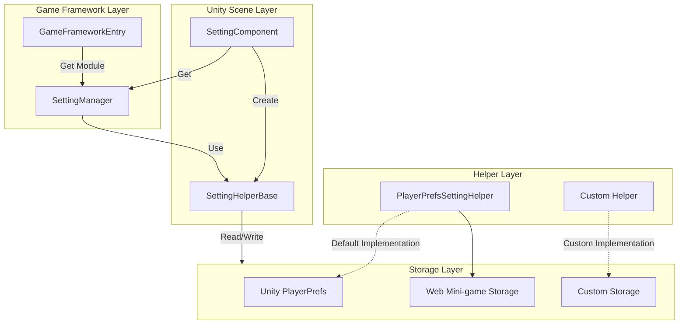

# Quick Start

This guide will help you quickly get started with the GameFrameX Setting configuration component and learn how to integrate and use the settings functionality in your Unity project.

## Overview

SettingComponent is a core component of the GameFrameX framework, specifically designed to manage game configuration information. It provides a simple API to save and load various types of game settings, including booleans, integers, floats, strings, and complex custom objects.

This component uses a modular design and supports different storage implementations through the `ISettingHelper` interface. It uses Unity's PlayerPrefs as the default storage, while also supporting extended custom storage methods.

## Quick Start Flow



## Add Component to Unity Scene

### Step 1: Create Setting Component

1. Open your game scene in Unity Editor
2. In the Hierarchy panel, create an empty GameObject or select an existing object
3. In the Inspector panel, click the **Add Component** button
4. In the search box, enter "Setting" and find the **GameFrameX/Setting** component
5. Click to add

```csharp
// SettingComponent will automatically add the following dependency component:
// - GameFrameXSettingCroppingHelper (required)
```
> Source: [SettingComponent.cs](https://github.com/GameFrameX/com.gameframex.unity.setting/blob/main/Runtime/Setting/SettingComponent.cs#L46)

### Step 2: Configure Setting Helper

SettingComponent automatically creates `PlayerPrefsSettingHelper` as the default storage helper. You can view and configure in the Inspector panel:

| Property | Type | Default Value | Description |
|----------|------|---------------|-------------|
| Setting Helper Type Name | string | "GameFrameX.Setting.Runtime.PlayerPrefsSettingHelper" | Setting helper type name |
| Custom Setting Helper | SettingHelperBase | null | Custom setting helper (optional) |

```csharp
// SettingComponent initializes the setting helper in Awake
private void Awake()
{
    // Get SettingManager module
    m_SettingManager = GameFrameworkEntry.GetModule<ISettingManager>();

    // Create setting helper
    SettingHelperBase settingHelper = Helper.CreateHelper(m_SettingHelperTypeName, m_CustomSettingHelper);

    // Set helper
    m_SettingManager.SetSettingHelper(settingHelper);
}
```
> Source: [SettingComponent.cs](https://github.com/GameFrameX/com.gameframex.unity.setting/blob/main/Runtime/Setting/SettingComponent.cs#L73-L98)

## Basic Usage Example

### Get SettingComponent in Code

In Unity games, you can get SettingComponent in multiple ways:

```csharp
// Method 1: Get via GameObject in scene
SettingComponent settingComponent = FindObjectOfType<SettingComponent>();

// Method 2: If using GameFrameX's MonoBehaviour approach
// Assuming your class inherits from custom MonoBehaviour
private SettingComponent settingComponent;

private void Start()
{
    settingComponent = GetComponent<SettingComponent>();
}
```
> Source: [README.md](https://github.com/GameFrameX/com.gameframex.unity.setting/blob/main/README.md#L86-L100)

### Save and Load Settings

SettingComponent automatically calls the `Start()` method to load saved settings when the game starts:

```csharp
// Complete settings management example
public class GameSettingsManager : MonoBehaviour
{
    private SettingComponent settingComponent;

    private void Start()
    {
        // Get SettingComponent
        settingComponent = GetComponent<SettingComponent>();

        // Set some game configurations
        settingComponent.SetBool("IsFullScreen", true);
        settingComponent.SetInt("ResolutionWidth", 1920);
        settingComponent.SetFloat("Volume", 0.8f);
        settingComponent.SetString("PlayerName", "PlayerOne");

        // Save configurations
        settingComponent.Save();
    }

    private void OnApplicationPause(bool pauseStatus)
    {
        // Save settings when application pauses (applicable to mobile platforms)
        if (pauseStatus)
        {
            settingComponent.Save();
        }
    }

    private void OnApplicationQuit()
    {
        // Save settings when application exits
        settingComponent.Save();
    }
}
```
> Source: [README.md](https://github.com/GameFrameX/com.gameframex.unity.setting/blob/main/README.md#L86-L100)

### Read Setting Values

```csharp
// Check if setting exists
bool hasVolumeSetting = settingComponent.HasSetting("Volume");

// Get setting value, use default value to prevent errors when setting doesn't exist
float volume = settingComponent.GetFloat("Volume", 0.5f);  // Returns 0.5f if doesn't exist
bool isFullScreen = settingComponent.GetBool("IsFullScreen", false);  // Default to fullscreen off
int resolutionWidth = settingComponent.GetInt("ResolutionWidth", 1920);  // Default 1920
string playerName = settingComponent.GetString("PlayerName", "Guest");  // Default Guest
```
> Source: [README.md](https://github.com/GameFrameX/com.gameframex.unity.setting/blob/main/README.md#L104-L110)

### Save and Delete Settings

```csharp
// Save all modifications
settingComponent.Save();

// Delete single setting
settingComponent.RemoveSetting("PlayerName");

// Delete all settings
settingComponent.RemoveAllSettings();
```
> Source: [README.md](https://github.com/GameFrameX/com.gameframex.unity.setting/blob/main/README.md#L114-L120)

### Save Complex Objects

SettingComponent supports saving custom objects, which are automatically serialized to JSON:

```csharp
// Define a settings class
[Serializable]
public class GamePreferences
{
    public bool IsMusicEnabled = true;
    public bool IsSoundEnabled = true;
    public float MusicVolume = 0.7f;
    public float SoundVolume = 0.8f;
    public string Language = "en";
}

// Save complex object
var preferences = new GamePreferences
{
    IsMusicEnabled = true,
    MusicVolume = 0.8f,
    Language = "en-US"
};
settingComponent.SetObject("GamePreferences", preferences);

// Load complex object
var loadedPreferences = settingComponent.GetObject<GamePreferences>("GamePreferences", new GamePreferences());
```
> Source: [PlayerPrefsSettingHelper.cs](https://github.com/GameFrameX/com.gameframex.unity.setting/blob/main/Runtime/Setting/PlayerPrefsSettingHelper.cs#L620-L623)

## Component Architecture



## Get Settings at Runtime

SettingComponent provides methods for multiple data types:

| Data Type | Read Method | Write Method |
|-----------|-------------|---------------|
| Boolean | `GetBool(name)` / `GetBool(name, default)` | `SetBool(name, value)` |
| Integer | `GetInt(name)` / `GetInt(name, default)` | `SetInt(name, value)` |
| Float | `GetFloat(name)` / `GetFloat(name, default)` | `SetFloat(name, value)` |
| String | `GetString(name)` / `GetString(name, default)` | `SetString(name, value)` |
| Object | `GetObject<T>(name)` / `GetObject<T>(name, default)` | `SetObject<T>(name, obj)` |

```csharp
// Complete example: Game settings manager
public class SettingsManager : MonoBehaviour
{
    private SettingComponent settingComponent;

    // Settings key name constants
    private const string KEY_MUSIC_ON = "setting.music.on";
    private const string KEY_MUSIC_VOLUME = "setting.music.volume";
    private const string KEY_GRAPHICS_QUALITY = "setting.graphics.quality";
    private const string KEY_PLAYER_DATA = "player.data";

    private void Awake()
    {
        settingComponent = GetComponent<SettingComponent>();
    }

    // Music settings
    public bool MusicEnabled
    {
        get => settingComponent.GetBool(KEY_MUSIC_ON, true);
        set => settingComponent.SetBool(KEY_MUSIC_ON, value);
    }

    public float MusicVolume
    {
        get => settingComponent.GetFloat(KEY_MUSIC_VOLUME, 0.5f);
        set => settingComponent.SetFloat(KEY_MUSIC_VOLUME, Mathf.Clamp01(value));
    }

    // Graphics settings
    public int GraphicsQuality
    {
        get => settingComponent.GetInt(KEY_GRAPHICS_QUALITY, 1);
        set => settingComponent.SetInt(KEY_GRAPHICS_QUALITY, value);
    }

    // Save player data
    public void SavePlayerData(PlayerData data)
    {
        settingComponent.SetObject(KEY_PLAYER_DATA, data);
        settingComponent.Save();
    }

    // Load player data
    public PlayerData LoadPlayerData()
    {
        return settingComponent.GetObject<PlayerData>(KEY_PLAYER_DATA, new PlayerData());
    }
}
```

## Common Use Cases

### Case 1: Game Settings UI

```csharp
public class SettingsUI : MonoBehaviour
{
    [SerializeField] private SettingComponent settingComponent;
    [SerializeField] private Slider volumeSlider;
    [SerializeField] private Toggle fullscreenToggle;

    private void Start()
    {
        // Load existing settings to UI
        volumeSlider.value = settingComponent.GetFloat("Volume", 0.5f);
        fullscreenToggle.isOn = settingComponent.GetBool("Fullscreen", true);
    }

    public void OnVolumeChanged(float value)
    {
        settingComponent.SetFloat("Volume", value);
        settingComponent.Save();
    }

    public void OnFullscreenChanged(bool value)
    {
        settingComponent.SetBool("Fullscreen", value);
        settingComponent.Save();
    }
}
```

### Case 2: Player Data Persistence

```csharp
[Serializable]
public class PlayerData
{
    public string playerName;
    public int level;
    public int experience;
    public List<string> achievements;
}

public class PlayerDataManager : MonoBehaviour
{
    private SettingComponent settingComponent;
    private const string KEY = "player.data";

    public void SavePlayer(PlayerData data)
    {
        settingComponent.SetObject(KEY, data);
        bool success = settingComponent.Save();
        Debug.Log($"Player data save {(success ? "succeeded" : "failed")}");
    }

    public PlayerData LoadPlayer()
    {
        return settingComponent.GetObject<PlayerData>(KEY, new PlayerData());
    }
}
```

## Notes

1. **Auto Load**: SettingComponent automatically calls `Load()` in `Start()` to load settings. You don't need to call manually.
2. **Manual Save**: After modifying settings, you must call `Save()` to persist to storage.
3. **Platform Differences**: Storage behavior may vary slightly on different platforms (such as WebGL mini-games). For details, please refer to the platform documentation.
4. **Object Serialization**: Complex objects use JSON serialization. Please ensure the class is marked with `[Serializable]`.

## Related Links

- [Features](./04.features) - Learn more about Setting architecture design
- [Helper Implementation](./05.helper-implementation) - Custom storage implementation
- [Platforms](./06.platforms) - Specific configurations for different platforms
- [API Reference](./07.api-reference) - Complete API method documentation
