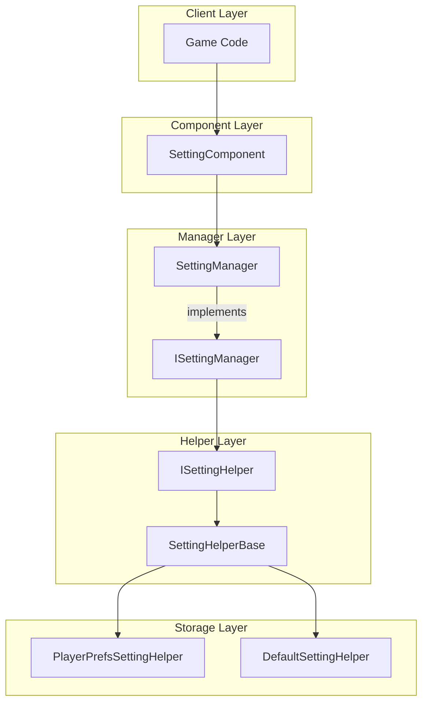
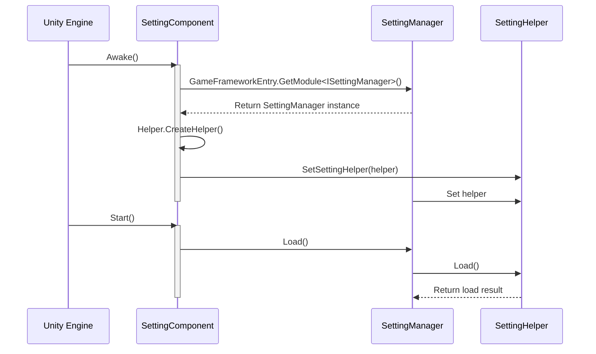

# Core Concepts

GameFrameX Setting configuration component is one of the core modules of the game framework, providing a unified configuration management abstraction layer and supporting multiple storage backends, helping developers efficiently manage game configuration data.

## Overview

Setting component uses a layered architecture design to decouple business logic from storage implementation. Core design concepts include:

1. **Unified Configuration Interface**: Provides type-safe configuration read/write methods, supporting booleans, integers, floats, strings, and complex objects
2. **Pluggable Storage Backend**: Supports different storage implementations through Strategy pattern
3. **Unity-oriented Component**: As a MonoBehaviour component, can be directly attached to game objects

## Architecture Design



### Layer Responsibilities

| Layer | Component | Responsibilities |
|-------|-----------|------------------|
| Component Layer | SettingComponent | Unity component entry, provides Unity-oriented API |
| Manager Layer | SettingManager | Business logic processing, parameter validation, exception management |
| Helper Layer | SettingHelperBase | Defines storage interface abstraction, implements type conversion |
| Storage Layer | PlayerPrefsSettingHelper / DefaultSettingHelper | Specific storage implementation |

## Core Components

### SettingComponent

SettingComponent is the entry point of the entire system, inherits from GameFrameworkComponent, and is used as a Unity component.

```csharp
[DisallowMultipleComponent]
[RequireComponent(typeof(GameFrameXSettingCroppingHelper))]
[AddComponentMenu("GameFrameX/Setting")]
public sealed class SettingComponent : GameFrameworkComponent
```
> Source: [SettingComponent.cs](https://github.com/GameFrameX/com.gameframex.unity.setting/blob/main/Runtime/Setting/SettingComponent.cs#L43-L47)

**Design Intent**: As the Unity ecosystem entry point, SettingComponent initializes SettingManager in `Awake()` and loads configuration data in `Start()`.

### ISettingManager

ISettingManager defines the core interface for configuration management, responsible for decoupling business logic layer from data access layer.

```csharp
public interface ISettingManager
{
    int Count { get; }
    void SetSettingHelper(ISettingHelper settingHelper);
    bool Load();
    bool Save();
    // ... read/write methods
}
```
> Source: [ISettingManager.cs](https://github.com/GameFrameX/com.gameframex.unity.setting/blob/main/Runtime/Setting/Setting/ISettingManager.cs#L42-L342)

**Design Intent**: Define standard interface for configuration manager, so upper-layer components don't need to care about specific implementation details.

### SettingManager

SettingManager is the implementation class of ISettingManager, inherits from GameFrameworkModule.

```csharp
public sealed class SettingManager : GameFrameworkModule, ISettingManager
{
    private ISettingHelper m_SettingHelper;
    // ... implements ISettingManager interface
}
```
> Source: [SettingManager.cs](https://github.com/GameFrameX/com.gameframex.unity.setting/blob/main/Runtime/Setting/Setting/SettingManager.cs#L43-L736)

**Design Intent**:
- Inherits GameFrameworkModule to integrate into GameFrameX framework lifecycle
- All methods include null checks and parameter validation
- Exception information is thrown uniformly through GameFrameworkException

### ISettingHelper / SettingHelperBase

ISettingHelper is the abstraction interface for storage backend, SettingHelperBase is its abstract base class.

```csharp
public interface ISettingHelper
{
    int Count { get; }
    bool Load();
    bool Save();
    // ... storage operation methods
}

public abstract class SettingHelperBase : MonoBehaviour, ISettingHelper
{
    // ... abstract method definitions
}
```
> Source: [ISettingHelper.cs](https://github.com/GameFrameX/com.gameframex.unity.setting/blob/main/Runtime/Setting/Setting/ISettingHelper.cs#L42-L332)
> Source: [SettingHelperBase.cs](https://github.com/GameFrameX/com.gameframex.unity.setting/blob/main/Runtime/Setting/SettingHelperBase.cs#L43-L333)

**Design Intent**:
- Inherits MonoBehaviour so it can be attached to GameObject
- Abstract methods require subclasses to implement specific storage logic

### Storage Backend Implementation

#### PlayerPrefsSettingHelper

Based on Unity PlayerPrefs implementation, suitable for most Unity projects.

```csharp
public class PlayerPrefsSettingHelper : SettingHelperBase
{
    // Uses Unity PlayerPrefs API
    public override bool Save()
    {
#if UNITY_WEBGL && (ENABLE_DOUYIN_MINI_GAME || ENABLE_WECHAT_MINI_GAME || ENABLE_KUAISHOU_MINI_GAME)
        return true;  // No-op for mini-game platforms
#else
        UnityEngine.PlayerPrefs.Save();
        return true;
#endif
    }
}
```
> Source: [PlayerPrefsSettingHelper.cs](https://github.com/GameFrameX/com.gameframex.unity.setting/blob/main/Runtime/Setting/PlayerPrefsSettingHelper.cs#L43-L638)

**Platform Adaptation**:
- **Editor/Standalone**: Uses Unity PlayerPrefs
- **Douyin/WeChat/Kuaishou Mini-games**: Uses each platform's native storage API

#### DefaultSettingHelper

Based on local file implementation, supports getting configuration item list.

```csharp
public class DefaultSettingHelper : SettingHelperBase
{
    private const string SettingFileName = "GameFrameworkSetting.dat";
    private string m_FilePath = null;
    private DefaultSetting m_Settings = null;
}
```
> Source: [DefaultSettingHelper.cs](https://github.com/GameFrameX/com.gameframex.unity.setting/blob/main/Runtime/Setting/DefaultSettingHelper.cs#L46-L52)

**Features**:
- Storage path: `Application.persistentDataPath/GameFrameworkSetting.dat`
- Supports `GetAllSettingNames()` method
- Uses binary serialization

### DefaultSetting

In-memory configuration data structure, stored using SortedDictionary.

```csharp
public sealed class DefaultSetting
{
    private readonly SortedDictionary<string, string> m_Settings = new SortedDictionary<string, string>(StringComparer.Ordinal);
}
```
> Source: [DefaultSetting.cs](https://github.com/GameFrameX/com.gameframex.unity.setting/blob/main/Runtime/Setting/DefaultSetting.cs#L47-L49)

## Data Type Support

Setting component supports multiple data types for configuration storage:

| Type | Read Method | Write Method | Description |
|------|-------------|-------------|-------------|
| Boolean | GetBool / GetBool(name, default) | SetBool | Internally stored as 0/1 |
| Integer | GetInt / GetInt(name, default) | SetInt | Supports int range |
| Float | GetFloat / GetFloat(name, default) | SetFloat | Uses InvariantCulture serialization |
| String | GetString / GetString(name, default) | SetString | Stored directly |
| Object | GetObject<T> / GetObject | SetObject<T> | JSON serialization storage |

## Initialization Flow



## Usage Patterns

### Basic Pattern: Using SettingComponent

```csharp
// Get SettingComponent
var settingComponent = UnityEngine.Object.FindObjectOfType<SettingComponent>();

// Save settings
settingComponent.SetBool("IsFullScreen", true);
settingComponent.SetInt("ResolutionWidth", 1920);
settingComponent.SetFloat("Volume", 0.8f);
settingComponent.SetString("PlayerName", "PlayerOne");
settingComponent.Save();

// Load settings (with default values)
bool isFullScreen = settingComponent.GetBool("IsFullScreen", false);
int resolution = settingComponent.GetInt("ResolutionWidth", 1280);
float volume = settingComponent.GetFloat("Volume", 0.5f);
string playerName = settingComponent.GetString("PlayerName", "Guest");
```
> Source: [README.md](https://github.com/GameFrameX/com.gameframex.unity.setting/blob/main/README.md#L85-L100)

### Advanced Pattern: Custom Storage Backend

```csharp
// Inherit SettingHelperBase to implement custom storage
public class CustomSettingHelper : SettingHelperBase
{
    public override int Count => /* implement count logic */;
    public override bool Load() { /* implement load logic */ }
    public override bool Save() { /* implement save logic */ }
    // ... implement other abstract methods
}
```

Then configure in Unity Editor:
1. Create GameObject with SettingComponent
2. Set Setting Helper Type Name to custom class name
3. Or directly attach custom Helper component

## Platform Support

| Platform | PlayerPrefsSettingHelper | DefaultSettingHelper |
|----------|--------------------------|----------------------|
| Unity Editor | Yes | Yes |
| Windows/Mac/Linux | Yes | Yes |
| iOS | Yes | Yes |
| Android | Yes | Yes |
| WebGL (Douyin Mini-game) | Yes (platform adapted) | Yes |
| WebGL (WeChat Mini-game) | Yes (platform adapted) | Yes |
| WebGL (Kuaishou Mini-game) | Yes (platform adapted) | Yes |

## Related Links

- [Helper Implementation](./05.helper-implementation) - Custom helper guide
- [Platforms](./06.platforms) - Platform-specific configurations
- [API Reference](./07.api-reference) - Complete API documentation
- [Troubleshooting](./08.troubleshooting) - Common issues and solutions
