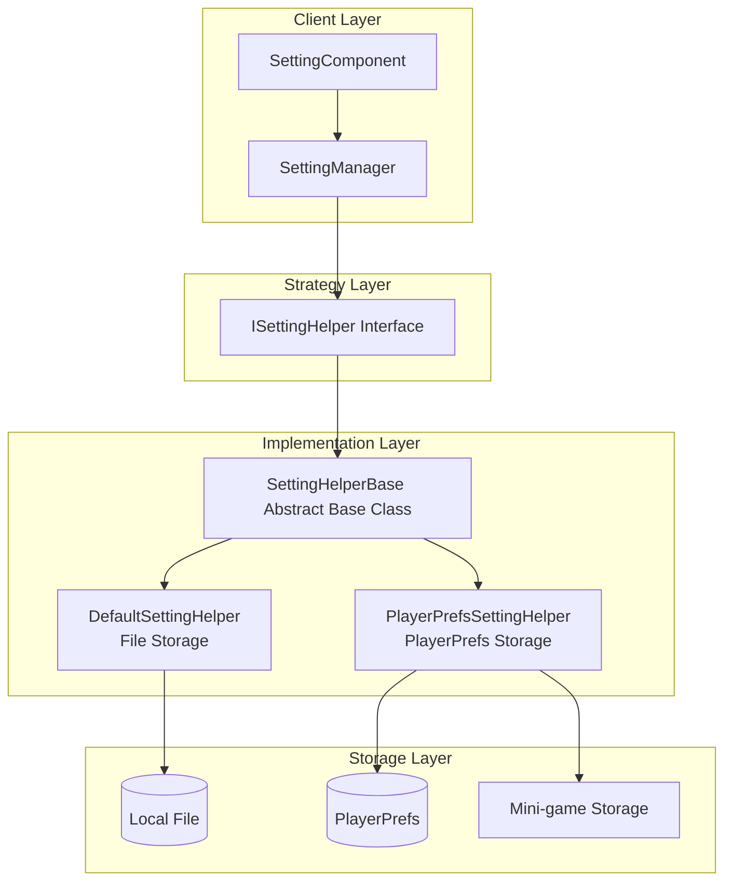

# Helper Implementation

Setting helpers are core components of the GameFrameX settings module, responsible for underlying storage and read operations of game configurations. Through Strategy pattern design, the system supports multiple storage backends, allowing developers to choose appropriate storage implementations based on project requirements.

## Overview

Setting helpers are various implementations of the `ISettingHelper` interface, responsible for persisting game settings data to different storage media. The system uses Strategy pattern, allowing storage implementations to be flexibly switched without modifying upper-layer business logic.

**Design Intent**: Separate the underlying implementation of settings storage from the business layer, allowing storage methods to be switched (such as from file storage to PlayerPrefs) without modifying business code, while supporting customized storage implementations for different platforms (Unity native, WebGL, mini-games).



### Core Component Description

| Component | Responsibilities | Applicable Scenarios |
|-----------|-------------------|---------------------|
| `ISettingHelper` | Defines unified interface for settings storage | Unified API specification |
| `SettingHelperBase` | Provides abstract base class, implements MonoBehaviour lifecycle | Extending new storage methods |
| `DefaultSettingHelper` | Binary serialization storage based on local files | Needing complete data control |
| `PlayerPrefsSettingHelper` | Key-value storage based on Unity PlayerPrefs | Simple configuration, quick prototyping |

## Built-in Helper Implementations

### DefaultSettingHelper (File Storage Helper)

`DefaultSettingHelper` stores game settings as local binary files, using custom serialization format. This implementation provides complete data control and supports advanced features like getting all configuration item names and counting.

**Storage Location**: `<persistentDataPath>/GameFrameworkSetting.dat`

> Source: [DefaultSettingHelper.cs](https://github.com/GameFrameX/com.gameframex.unity.setting/blob/main/Runtime/Setting/DefaultSettingHelper.cs#L46-L529)

```csharp
public class DefaultSettingHelper : SettingHelperBase
{
    private const string SettingFileName = "GameFrameworkSetting.dat";
    private string m_FilePath = null;
    private DefaultSetting m_Settings = null;
    private DefaultSettingSerializer m_Serializer = null;

    private void Awake()
    {
        m_FilePath = Utility.Path.GetRegularPath(Path.Combine(Application.persistentDataPath, SettingFileName));
        m_Settings = new DefaultSetting();
        m_Serializer = new DefaultSettingSerializer();
        m_Serializer.RegisterSerializeCallback(0, SerializeDefaultSettingCallback);
        m_Serializer.RegisterDeserializeCallback(0, DeserializeDefaultSettingCallback);
    }
}
```

**Features**:
- Predictable storage path, convenient for file management and backup
- Supports complete settings enumeration and counting functionality
- Binary serialization, compact file size
- Supports custom serializer extensions

### PlayerPrefsSettingHelper (PlayerPrefs Storage Helper)

`PlayerPrefsSettingHelper` is based on Unity's PlayerPrefs implementation, while providing platform-specific storage adaptation for WebGL mini-game platforms (Douyin, WeChat, Kuaishou).

> Source: [PlayerPrefsSettingHelper.cs](https://github.com/GameFrameX/com.gameframex.unity.setting/blob/main/Runtime/Setting/PlayerPrefsSettingHelper.cs#L43-L638)

```csharp
public class PlayerPrefsSettingHelper : SettingHelperBase
{
    // Platform check example: check if specified configuration item exists
    public override bool HasSetting(string settingName)
    {
#if UNITY_EDITOR
        return UnityEngine.PlayerPrefs.HasKey(settingName);
#endif
#if UNITY_WEBGL && ENABLE_DOUYIN_MINI_GAME
        return TTSDK.TTStorage.HasKeySync(settingName);
#elif UNITY_WEBGL && ENABLE_WECHAT_MINI_GAME
        return WeChatWASM.WXSDKManagerHandler.Instance.StorageHasKeySync(settingName);
#elif UNITY_WEBGL && ENABLE_KUAISHOU_MINI_GAME
        return KSWASM.KSBase.StorageHasKeySync(settingName);
#else
        return UnityEngine.PlayerPrefs.HasKey(settingName);
#endif
    }
}
```

**Supported Platform Storage**:

| Platform | Storage Implementation | Special Handling |
|----------|------------------------|------------------|
| Unity Editor | PlayerPrefs | Standard implementation |
| Unity Standalone | PlayerPrefs | Standard implementation |
| Unity WebGL (native) | PlayerPrefs | Standard implementation |
| Douyin Mini-game | TTStorage | Sync API |
| WeChat Mini-game | WXStorage | Sync API |
| Kuaishou Mini-game | KSStorage | Sync API |

**Notes**:
- `Count` property always returns `-1` (PlayerPrefs doesn't support counting)
- `GetAllSettingNames()` not supported, returns `null` with warning output
- WebGL mini-game platform Save() method is no-op (mini-games auto-save)

## Helper Base Class

`SettingHelperBase` is the abstract base class for all setting helpers, inherits from `MonoBehaviour` and implements `ISettingHelper` interface.

> Source: [SettingHelperBase.cs](https://github.com/GameFrameX/com.gameframex.unity.setting/blob/main/Runtime/Setting/SettingHelperBase.cs#L43-L333)

### Abstract Method List

| Method | Description |
|--------|-------------|
| `Count` | Get configuration item count |
| `Load()` | Load configuration |
| `Save()` | Save configuration |
| `GetAllSettingNames()` | Get all configuration item names |
| `HasSetting(name)` | Check if configuration item exists |
| `RemoveSetting(name)` | Remove specified configuration item |
| `RemoveAllSettings()` | Clear all configurations |
| `GetBool/SetBool` | Boolean read/write |
| `GetInt/SetInt` | Integer read/write |
| `GetFloat/SetFloat` | Float read/write |
| `GetString/SetString` | String read/write |
| `GetObject/SetObject` | Object serialization read/write |

## Creating Custom Helper

To create a custom setting helper, inherit `SettingHelperBase` and implement all abstract methods.

```csharp
using GameFrameX.Setting.Runtime;
using UnityEngine;

public class CustomSettingHelper : SettingHelperBase
{
    // Custom storage implementation
    private Dictionary<string, string> _storage = new Dictionary<string, string>();

    public override int Count => _storage.Count;

    public override bool Load()
    {
        // Load data from custom storage
        return true;
    }

    public override bool Save()
    {
        // Save data to custom storage
        return true;
    }

    public override string[] GetAllSettingNames()
    {
        return _storage.Keys.ToArray();
    }

    public override bool HasSetting(string settingName)
    {
        return _storage.ContainsKey(settingName);
    }

    public override bool RemoveSetting(string settingName)
    {
        return _storage.Remove(settingName);
    }

    public override void RemoveAllSettings()
    {
        _storage.Clear();
    }

    // Implement all Get/Set methods...
    // Bool, Int, Float, String, Object read/write implementation
}
```

> Source: [SettingHelperBase.cs](https://github.com/GameFrameX/com.gameframex.unity.setting/blob/main/Runtime/Setting/SettingHelperBase.cs)

## Helper Selection Configuration

In Unity Editor, you can choose which helper to use through SettingComponent:

1. Add `SettingComponent` in scene (GameFrameX/Setting menu)
2. Modify `Setting Helper Type Name` in Inspector
3. Or drag custom helper into `Custom Setting Helper` field

```csharp
// Helper creation logic in SettingComponent
private void Awake()
{
    // ... initialization code ...

    SettingHelperBase settingHelper = Helper.CreateHelper(m_SettingHelperTypeName, m_CustomSettingHelper);
    m_SettingManager.SetSettingHelper(settingHelper);
}
```

> Source: [SettingComponent.cs](https://github.com/GameFrameX/com.gameframex.unity.setting/blob/main/Runtime/Setting/SettingComponent.cs#L85-L97)

## Serialization Mechanism

### DefaultSetting Internal Data Structure

`DefaultSetting` uses `SortedDictionary<string, string>` to store all configuration items, converting all values to strings for storage.

> Source: [DefaultSetting.cs](https://github.com/GameFrameX/com.gameframex.unity.setting/blob/main/Runtime/Setting/DefaultSetting.cs#L47-L400)

```csharp
public sealed class DefaultSetting
{
    private readonly SortedDictionary<string, string> m_Settings = new SortedDictionary<string, string>(StringComparer.Ordinal);

    public void Serialize(Stream stream)
    {
        using (BinaryWriter binaryWriter = new BinaryWriter(stream, Encoding.UTF8))
        {
            binaryWriter.Write7BitEncodedInt32(m_Settings.Count);
            foreach (KeyValuePair<string, string> setting in m_Settings)
            {
                binaryWriter.Write(setting.Key);
                binaryWriter.Write(setting.Value);
            }
        }
    }
}
```

### DefaultSettingSerializer File Format

Storage file uses binary format, containing:
- **File Header**: `GFS` three bytes (for format identification)
- **Version Number**: 7-bit compressed integer
- **Data**: Key-value pair list

> Source: [DefaultSettingSerializer.cs](https://github.com/GameFrameX/com.gameframex.unity.setting/blob/main/Runtime/Setting/DefaultSettingSerializer.cs#L43-L66)

```csharp
public sealed class DefaultSettingSerializer : GameFrameworkSerializer<DefaultSetting>
{
    private static readonly byte[] Header = new byte[] { (byte)'G', (byte)'F', (byte)'S' };

    protected override byte[] GetHeader()
    {
        return Header;
    }
}
```

## Platform Differences Comparison

| Feature | DefaultSettingHelper | PlayerPrefsSettingHelper |
|---------|---------------------|------------------------|
| Storage Location | persistentDataPath/dat file | PlayerPrefs registry |
| Count Property | Yes actual count | No always returns -1 |
| GetAllSettingNames | Yes supported | No returns null |
| Cross-platform Consistency | Needs manual handling | Auto-adapted |
| File Portability | Yes can copy and move | No tied to device |
| Data Capacity | No obvious limit | ~1MB recommended upper limit |

## Related Links

- [Features](./04.features) - Core concepts of settings module
- [Platforms](./06.platforms) - Platform configuration details
- [API Reference](./07.api-reference) - Complete setting manager API documentation
