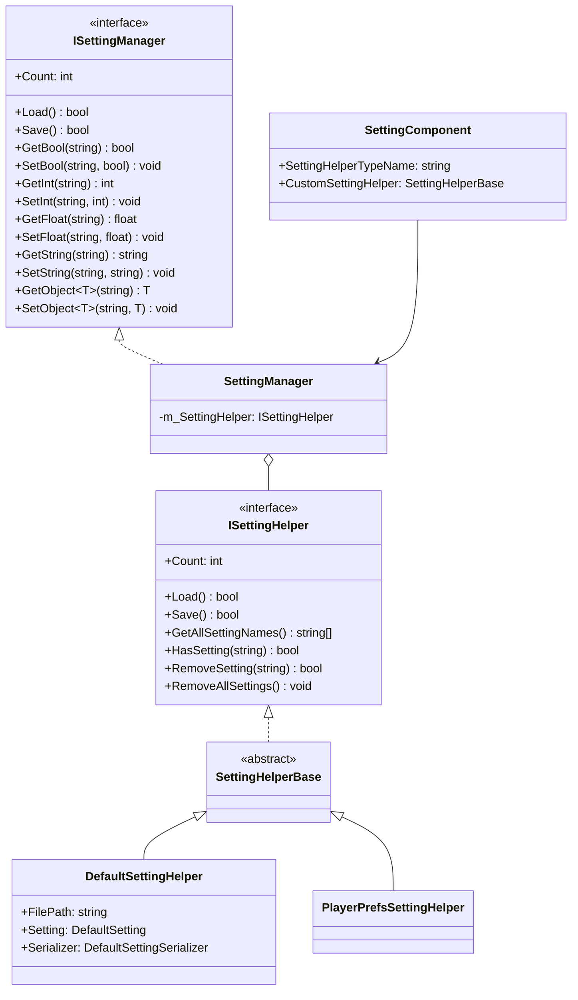
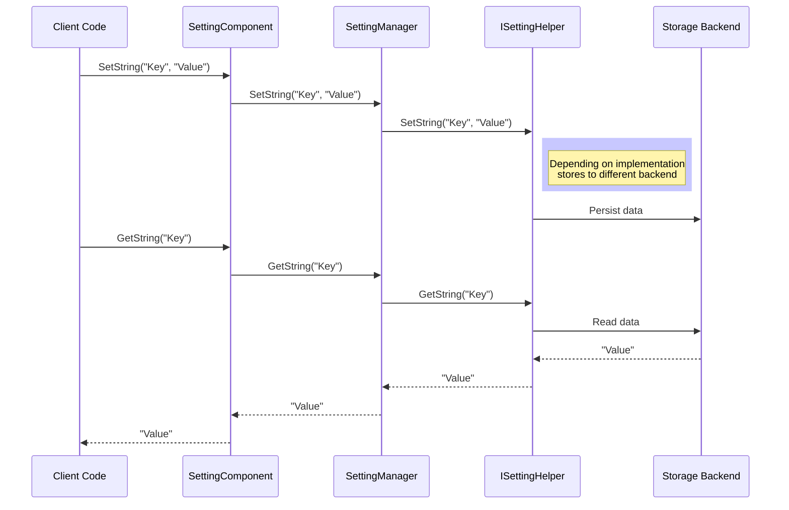

# API Reference

This document provides detailed API reference for all public APIs of the GameFrameX Setting module, including interface definitions, class descriptions, and usage methods.

## Overview

GameFrameX Setting module provides a complete game configuration management solution, supporting multiple storage backends (file storage, PlayerPrefs, mini-game platform storage). The module uses layered architecture design, implementing storage-agnostic settings management through interface abstraction.

## Architecture Overview



## ISettingManager Interface

`ISettingManager` is the core interface for settings management, defining basic operations for game settings.

> Source: [ISettingManager.cs](https://github.com/GameFrameX/com.gameframex.unity.setting/blob/main/Runtime/Setting/Setting/ISettingManager.cs#L30-L342)

### Properties

#### `Count: int`

Gets the current number of game configuration items.

```csharp
int count = settingManager.Count;
```

> Source: [ISettingManager.cs](https://github.com/GameFrameX/com.gameframex.unity.setting/blob/main/Runtime/Setting/Setting/ISettingManager.cs#L50-L51)

### Methods

#### `Load(): bool`

Loads game configuration.

**Returns:** Whether loading was successful.

```csharp
bool success = settingManager.Load();
```

> Source: [ISettingManager.cs](https://github.com/GameFrameX/com.gameframex.unity.setting/blob/main/Runtime/Setting/Setting/ISettingManager.cs#L70-L71)

---

#### `Save(): bool`

Saves game configuration.

**Returns:** Whether saving was successful.

```csharp
bool success = settingManager.Save();
```

> Source: [ISettingManager.cs](https://github.com/GameFrameX/com.gameframex.unity.setting/blob/main/Runtime/Setting/Setting/ISettingManager.cs#L80-L81)

---

#### `GetAllSettingNames(): string[]`

Gets all game configuration item names.

**Returns:** Array of all configuration item names.

```csharp
string[] names = settingManager.GetAllSettingNames();
```

> Source: [ISettingManager.cs](https://github.com/GameFrameX/com.gameframex.unity.setting/blob/main/Runtime/Setting/Setting/ISettingManager.cs#L90-L91)

---

#### `GetAllSettingNames(results: List<string>): void`

Gets all game configuration item names into a list.

**Parameters:**
- `results` (`List<string>`): List to store configuration item names.

```csharp
var names = new List<string>();
settingManager.GetAllSettingNames(names);
```

> Source: [ISettingManager.cs](https://github.com/GameFrameX/com.gameframex.unity.setting/blob/main/Runtime/Setting/Setting/ISettingManager.cs#L100-L101)

---

#### `HasSetting(settingName: string): bool`

Checks if a specified configuration item exists.

**Parameters:**
- `settingName` (string): Configuration item name to check.

**Returns:** Whether the configuration item exists.

```csharp
bool exists = settingManager.HasSetting("PlayerName");
```

> Source: [ISettingManager.cs](https://github.com/GameFrameX/com.gameframex.unity.setting/blob/main/Runtime/Setting/Setting/ISettingManager.cs#L112-L113)

---

#### `RemoveSetting(settingName: string): bool`

Removes a specified configuration item.

**Parameters:**
- `settingName` (string): Configuration item name to remove.

**Returns:** Whether removal was successful.

```csharp
bool success = settingManager.RemoveSetting("OldSetting");
```

> Source: [ISettingManager.cs](https://github.com/GameFrameX/com.gameframex.unity.setting/blob/main/Runtime/Setting/Setting/ISettingManager.cs#L122-L123)

---

#### `RemoveAllSettings(): void`

Clears all game configuration items.

```csharp
settingManager.RemoveAllSettings();
```

> Source: [ISettingManager.cs](https://github.com/GameFrameX/com.gameframex.unity.setting/blob/main/Runtime/Setting/Setting/ISettingManager.cs#L131-L132)

---

### Boolean Operations

#### `GetBool(settingName: string): bool`

Reads a boolean value from a specified configuration item.

**Parameters:**
- `settingName` (string): Configuration item name.

**Returns:** The boolean value read. Throws exception if configuration item doesn't exist.

```csharp
bool value = settingManager.GetBool("SoundEnabled");
```

> Source: [ISettingManager.cs](https://github.com/GameFrameX/com.gameframex.unity.setting/blob/main/Runtime/Setting/Setting/ISettingManager.cs#L142-L143)

---

#### `GetBool(settingName: string, defaultValue: bool): bool`

Reads a boolean value from a specified configuration item, supporting default value.

**Parameters:**
- `settingName` (string): Configuration item name.
- `defaultValue` (bool): Default value returned if configuration item doesn't exist.

**Returns:** The boolean value read or the default value.

```csharp
bool value = settingManager.GetBool("MusicEnabled", true);
```

> Source: [ISettingManager.cs](https://github.com/GameFrameX/com.gameframex.unity.setting/blob/main/Runtime/Setting/Setting/ISettingManager.cs#L154-L155)

---

#### `SetBool(settingName: string, value: bool): void`

Writes a boolean value to a specified configuration item.

**Parameters:**
- `settingName` (string): Configuration item name.
- `value` (bool): Boolean value to write.

```csharp
settingManager.SetBool("SoundEnabled", true);
```

> Source: [ISettingManager.cs](https://github.com/GameFrameX/com.gameframex.unity.setting/blob/main/Runtime/Setting/Setting/ISettingManager.cs#L165-L166)

---

### Integer Operations

#### `GetInt(settingName: string): int`

Reads an integer value from a specified configuration item.

**Parameters:**
- `settingName` (string): Configuration item name.

**Returns:** The integer value read. Throws exception if configuration item doesn't exist.

```csharp
int level = settingManager.GetInt("CurrentLevel");
```

> Source: [ISettingManager.cs](https://github.com/GameFrameX/com.gameframex.unity.setting/blob/main/Runtime/Setting/Setting/ISettingManager.cs#L176-L177)

---

#### `GetInt(settingName: string, defaultValue: int): int`

Reads an integer value from a specified configuration item, supporting default value.

**Parameters:**
- `settingName` (string): Configuration item name.
- `defaultValue` (int): Default value returned if configuration item doesn't exist.

**Returns:** The integer value read or the default value.

```csharp
int score = settingManager.GetInt("HighScore", 0);
```

> Source: [ISettingManager.cs](https://github.com/GameFrameX/com.gameframex.unity.setting/blob/main/Runtime/Setting/Setting/ISettingManager.cs#L188-L189)

---

#### `SetInt(settingName: string, value: int): void`

Writes an integer value to a specified configuration item.

**Parameters:**
- `settingName` (string): Configuration item name.
- `value` (int): Integer value to write.

```csharp
settingManager.SetInt("CurrentLevel", 5);
```

> Source: [ISettingManager.cs](https://github.com/GameFrameX/com.gameframex.unity.setting/blob/main/Runtime/Setting/Setting/ISettingManager.cs#L199-L200)

---

### Float Operations

#### `GetFloat(settingName: string): float`

Reads a float value from a specified configuration item.

**Parameters:**
- `settingName` (string): Configuration item name.

**Returns:** The float value read. Throws exception if configuration item doesn't exist.

```csharp
float volume = settingManager.GetFloat("MusicVolume");
```

> Source: [ISettingManager.cs](https://github.com/GameFrameX/com.gameframex.unity.setting/blob/main/Runtime/Setting/Setting/ISettingManager.cs#L210-L211)

---

#### `GetFloat(settingName: string, defaultValue: float): float`

Reads a float value from a specified configuration item, supporting default value.

**Parameters:**
- `settingName` (string): Configuration item name.
- `defaultValue` (float): Default value returned if configuration item doesn't exist.

**Returns:** The float value read or the default value.

```csharp
float volume = settingManager.GetFloat("MusicVolume", 0.5f);
```

> Source: [ISettingManager.cs](https://github.com/GameFrameX/com.gameframex.unity.setting/blob/main/Runtime/Setting/Setting/ISettingManager.cs#L222-L223)

---

#### `SetFloat(settingName: string, value: float): void`

Writes a float value to a specified configuration item.

**Parameters:**
- `settingName` (string): Configuration item name.
- `value` (float): Float value to write.

```csharp
settingManager.SetFloat("MusicVolume", 0.8f);
```

> Source: [ISettingManager.cs](https://github.com/GameFrameX/com.gameframex.unity.setting/blob/main/Runtime/Setting/Setting/ISettingManager.cs#L233-L234)

---

### String Operations

#### `GetString(settingName: string): string`

Reads a string value from a specified configuration item.

**Parameters:**
- `settingName` (string): Configuration item name.

**Returns:** The string value read. Throws exception if configuration item doesn't exist.

```csharp
string playerName = settingManager.GetString("PlayerName");
```

> Source: [ISettingManager.cs](https://github.com/GameFrameX/com.gameframex.unity.setting/blob/main/Runtime/Setting/Setting/ISettingManager.cs#L244-L245)

---

#### `GetString(settingName: string, defaultValue: string): string`

Reads a string value from a specified configuration item, supporting default value.

**Parameters:**
- `settingName` (string): Configuration item name.
- `defaultValue` (string): Default value returned if configuration item doesn't exist.

**Returns:** The string value read or the default value.

```csharp
string playerName = settingManager.GetString("PlayerName", "Guest");
```

> Source: [ISettingManager.cs](https://github.com/GameFrameX/com.gameframex.unity.setting/blob/main/Runtime/Setting/Setting/ISettingManager.cs#L256-L257)

---

#### `SetString(settingName: string, value: string): void`

Writes a string value to a specified configuration item.

**Parameters:**
- `settingName` (string): Configuration item name.
- `value` (string): String value to write.

```csharp
settingManager.SetString("PlayerName", "Hero");
```

> Source: [ISettingManager.cs](https://github.com/GameFrameX/com.gameframex.unity.setting/blob/main/Runtime/Setting/Setting/ISettingManager.cs#L267-L268)

---

### Object Operations

#### `GetObject<T>(settingName: string): T`

Reads an object from a specified configuration item.

**Type Parameters:**
- `T`: Object type to read, must contain parameterless constructor.

**Parameters:**
- `settingName` (string): Configuration item name.

**Returns:** The object instance read. Throws exception if configuration item doesn't exist.

```csharp
var playerData = settingManager.GetObject<PlayerData>("PlayerData");
```

> Source: [ISettingManager.cs](https://github.com/GameFrameX/com.gameframex.unity.setting/blob/main/Runtime/Setting/Setting/ISettingManager.cs#L279-L280)

---

#### `GetObject(objectType: Type, settingName: string): object`

Reads an object from a specified configuration item (non-generic version).

**Parameters:**
- `objectType` (Type): Object type to read.
- `settingName` (string): Configuration item name.

**Returns:** The object instance read.

```csharp
object playerData = settingManager.GetObject(typeof(PlayerData), "PlayerData");
```

> Source: [ISettingManager.cs](https://github.com/GameFrameX/com.gameframex.unity.setting/blob/main/Runtime/Setting/Setting/ISettingManager.cs#L291-L292)

---

#### `GetObject<T>(settingName: string, defaultObj: T): T`

Reads an object from a specified configuration item, supporting default value.

**Type Parameters:**
- `T`: Object type to read.

**Parameters:**
- `settingName` (string): Configuration item name.
- `defaultObj` (T): Default object returned if configuration item doesn't exist.

**Returns:** The object read or the default object.

```csharp
var defaultData = new PlayerData();
var playerData = settingManager.GetObject("PlayerData", defaultData);
```

> Source: [ISettingManager.cs](https://github.com/GameFrameX/com.gameframex.unity.setting/blob/main/Runtime/Setting/Setting/ISettingManager.cs#L304-L305)

---

#### `GetObject(objectType: Type, settingName: string, defaultObj: object): object`

Reads an object from a specified configuration item (non-generic version), supporting default value.

**Parameters:**
- `objectType` (Type): Object type to read.
- `settingName` (string): Configuration item name.
- `defaultObj` (object): Default object returned if configuration item doesn't exist.

**Returns:** The object read or the default object.

```csharp
var defaultData = new PlayerData();
var playerData = settingManager.GetObject(typeof(PlayerData), "PlayerData", defaultData);
```

> Source: [ISettingManager.cs](https://github.com/GameFrameX/com.gameframex.unity.setting/blob/main/Runtime/Setting/Setting/ISettingManager.cs#L317-L318)

---

#### `SetObject<T>(settingName: string, obj: T): void`

Writes an object to a specified configuration item.

**Type Parameters:**
- `T`: Object type to write.

**Parameters:**
- `settingName` (string): Configuration item name.
- `obj` (T): Object to write.

```csharp
var playerData = new PlayerData { Name = "Hero", Level = 10 };
settingManager.SetObject("PlayerData", playerData);
```

> Source: [ISettingManager.cs](https://github.com/GameFrameX/com.gameframex.unity.setting/blob/main/Runtime/Setting/Setting/ISettingManager.cs#L329-L330)

---

#### `SetObject(settingName: string, obj: object): void`

Writes an object to a specified configuration item (non-generic version).

**Parameters:**
- `settingName` (string): Configuration item name.
- `obj` (object): Object to write.

```csharp
var playerData = new PlayerData { Name = "Hero", Level = 10 };
settingManager.SetObject("PlayerData", (object)playerData);
```

> Source: [ISettingManager.cs](https://github.com/GameFrameX/com.gameframex.unity.setting/blob/main/Runtime/Setting/Setting/ISettingManager.cs#L340-L341)

---

## ISettingHelper Interface

`ISettingHelper` is the abstraction interface for settings storage, allowing different storage backends to be implemented.

> Source: [ISettingHelper.cs](https://github.com/GameFrameX/com.gameframex.unity.setting/blob/main/Runtime/Setting/Setting/ISettingHelper.cs#L30-L332)

**Interface methods are largely the same as ISettingManager, but with the following additions:**
- File serialization/deserialization operations
- All methods are abstract, provided by concrete implementation classes

**Design Intent:** This interface uses Strategy pattern, allowing different storage implementations to be switched at runtime, such as file storage, PlayerPrefs, or mini-game platform storage.

---

## SettingManager Class

`SettingManager` is the core implementation class of `ISettingManager`, inherits from `GameFrameworkModule`.

> Source: [SettingManager.cs](https://github.com/GameFrameX/com.gameframex.unity.setting/blob/main/Runtime/Setting/Setting/SettingManager.cs#L30-L737)

### Constructor

#### `SettingManager()`

Initializes a new instance of SettingManager.

```csharp
var settingManager = new SettingManager();
```

> Source: [SettingManager.cs](https://github.com/GameFrameX/com.gameframex.unity.setting/blob/main/Runtime/Setting/Setting/SettingManager.cs#L53-L57)

### Methods

#### `SetSettingHelper(settingHelper: ISettingHelper): void`

Sets the game configuration helper.

**Parameters:**
- `settingHelper` (ISettingHelper): Game configuration helper instance.

**Throws:** GameFrameworkException when settingHelper is null.

```csharp
settingManager.SetSettingHelper(new PlayerPrefsSettingHelper());
```

> Source: [SettingManager.cs](https://github.com/GameFrameX/com.gameframex.unity.setting/blob/main/Runtime/Setting/Setting/SettingManager.cs#L111-L120)

---

#### `Update(elapseSeconds: float, realElapseSeconds: float): void`

Frame polling update method. This method is a no-op because the settings manager doesn't need frame-by-frame updates.

> Source: [SettingManager.cs](https://github.com/GameFrameX/com.gameframex.unity.setting/blob/main/Runtime/Setting/Setting/SettingManager.cs#L88-L90)

---

#### `Shutdown(): void`

Closes and cleans up the settings manager. Automatically saves all unsaved settings when shutting down.

> Source: [SettingManager.cs](https://github.com/GameFrameX/com.gameframex.unity.setting/blob/main/Runtime/Setting/Setting/SettingManager.cs#L98-L101)

---

## SettingHelperBase Abstract Class

`SettingHelperBase` is the abstract base class for all setting helpers, inherits from `MonoBehaviour` and implements `ISettingHelper` interface.

> Source: [SettingHelperBase.cs](https://github.com/GameFrameX/com.gameframex.unity.setting/blob/main/Runtime/Setting/SettingHelperBase.cs#L30-L333)

**Design Intent:** Provides a Unity component-style helper base class. All concrete implementations can be attached to scenes as components.

---

## DefaultSettingHelper Class

`DefaultSettingHelper` is the default setting helper implementation, using local file storage for settings data.

> Source: [DefaultSettingHelper.cs](https://github.com/GameFrameX/com.gameframex.unity.setting/blob/main/Runtime/Setting/DefaultSettingHelper.cs#L30-L529)

### Properties

#### `FilePath: string` (Read-only)

Gets the path to the game configuration storage file.

```csharp
string path = defaultSettingHelper.FilePath;
```

> Source: [DefaultSettingHelper.cs](https://github.com/GameFrameX/com.gameframex.unity.setting/blob/main/Runtime/Setting/DefaultSettingHelper.cs#L76-L82)

---

#### `Setting: DefaultSetting` (Read-only)

Gets the game configuration data instance.

```csharp
var settings = defaultSettingHelper.Setting;
```

> Source: [DefaultSettingHelper.cs](https://github.com/GameFrameX/com.gameframex.unity.setting/blob/main/Runtime/Setting/DefaultSettingHelper.cs#L91-L97)

---

#### `Serializer: DefaultSettingSerializer` (Read-only)

Gets the game configuration serializer.

```csharp
var serializer = defaultSettingHelper.Serializer;
```

> Source: [DefaultSettingHelper.cs](https://github.com/GameFrameX/com.gameframex.unity.setting/blob/main/Runtime/Setting/DefaultSettingHelper.cs#L106-L112)

---

### Storage File

Default storage path: `Application.persistentDataPath/GameFrameworkSetting.dat`

> Source: [DefaultSettingHelper.cs](https://github.com/GameFrameX/com.gameframex.unity.setting/blob/main/Runtime/Setting/DefaultSettingHelper.cs#L48)

---

## PlayerPrefsSettingHelper Class

`PlayerPrefsSettingHelper` implements settings storage based on Unity PlayerPrefs, and supports multiple mini-game platforms.

> Source: [PlayerPrefsSettingHelper.cs](https://github.com/GameFrameX/com.gameframex.unity.setting/blob/main/Runtime/Setting/PlayerPrefsSettingHelper.cs#L30-L638)

### Platform Support

- Unity Editor
- Unity WebGL (standard)
- Douyin Mini-game (ENABLE_DOUYIN_MINI_GAME)
- WeChat Mini-game (ENABLE_WECHAT_MINI_GAME)
- Kuaishou Mini-game (ENABLE_KUAISHOU_MINI_GAME)

### Feature Notes

| Feature | Support Status |
|---------|----------------|
| Count | Not supported, always returns -1 |
| GetAllSettingNames | Not supported, returns null |
| Load | Not needed, always returns true |
| Save | No-op for WebGL mini-game platform |

> Source: [PlayerPrefsSettingHelper.cs](https://github.com/GameFrameX/com.gameframex.unity.setting/blob/main/Runtime/Setting/PlayerPrefsSettingHelper.cs#L52-L100)

---

## SettingComponent Class

`SettingComponent` is a Unity component used to integrate settings management functionality into the GameFrameX framework.

> Source: [SettingComponent.cs](https://github.com/GameFrameX/com.gameframex.unity.setting/blob/main/Runtime/Setting/SettingComponent.cs#L30-L447)

### Component Features

- Inherits from `GameFrameworkComponent`
- Auto-initializes when attached to scene
- Supports custom setting helper type

### Serialization Fields

#### `SettingHelperTypeName: string`

Type name of the setting helper. Default is `PlayerPrefsSettingHelper`.

```csharp
[SerializeField]
private string m_SettingHelperTypeName = "GameFrameX.Setting.Runtime.PlayerPrefsSettingHelper";
```

> Source: [SettingComponent.cs](https://github.com/GameFrameX/com.gameframex.unity.setting/blob/main/Runtime/Setting/SettingComponent.cs#L51)

---

#### `CustomSettingHelper: SettingHelperBase`

Custom setting helper instance.

```csharp
[SerializeField]
private SettingHelperBase m_CustomSettingHelper = null;
```

> Source: [SettingComponent.cs](https://github.com/GameFrameX/com.gameframex.unity.setting/blob/main/Runtime/Setting/SettingComponent.cs#L53)

---

### Methods

`SettingComponent` provides the same set of methods as `ISettingManager`, can be used directly in Unity scripts.

---

## Data Flow



---

## Exception Handling

| Exception Type | Trigger Condition |
|----------------|-------------------|
| GameFrameworkException | Calling method when setting helper is not set |
| GameFrameworkException | Setting name is empty or null |
| GameFrameworkException | Object type is null |

```csharp
// Typical exception handling
try {
    var value = settingManager.GetString("Key");
} catch (GameFrameworkException ex) {
    Debug.LogError($"Settings operation failed: {ex.Message}");
}
```

---

## Related Links

- [Overview](./01.overview)
- [Installation](./02.installation)
- [Quick Start](./03.getting-started)
- [Features](./04.features)
- [Helper Implementation](./05.helper-implementation)
- [Platforms](./06.platforms)
- [Troubleshooting](./08.troubleshooting)
