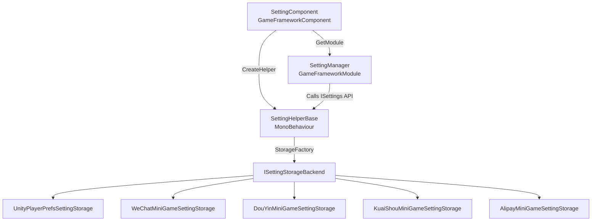

# How It Works: SettingComponent Architecture

`SettingComponent` is the entry component of the GameFrameX Settings module. It is responsible for bringing up `SettingManager` and `SettingHelper` during game startup, completing the loading and subsequent read/write of settings. This page explains how it is instantiated, how it delegates to the helper, and which storage backend the data ultimately lands in.

## Quick Start

After attaching `SettingComponent`, the framework automatically completes setting reading and initialization — no manual `new` is required in business code.

1. On the `GameFrameX` object in the startup scene, confirm that `SettingComponent` has been added (it is registered with the framework by default).
2. By default, [PlayerPrefsSettingHelper.cs](https://github.com/GameFrameX/com.gameframex.unity.setting/blob/main/Runtime/Setting/PlayerPrefsSettingHelper.cs) is used as the helper; if you want to switch to WeChat Mini Game storage, change the `m_SettingHelperTypeName` field to the corresponding Mini Game helper type name.
3. In business code, read/write settings through the `GetBool` / `GetInt` / `GetString` and other methods on `GameFrameX.Setting.Runtime.SettingComponent`.

## How It Works at a Glance

The Settings module delegates across four layers — "Component → Manager → Helper → Storage Backend" — with each layer depending only on the interface of the layer below it.



Responsibilities of each layer:

| Layer | Type | Responsibility |
|----|------|------|
| Component layer | [SettingComponent.cs](https://github.com/GameFrameX/com.gameframex.unity.setting/blob/main/Runtime/Setting/SettingComponent.cs#L48-L100) | In `Awake`, obtains `ISettingManager`, creates a `SettingHelperBase` instance, and injects it into the manager; in `Start`, triggers the first `Load()` |
| Manager layer | [SettingManager.cs](https://github.com/GameFrameX/com.gameframex.unity.setting/blob/main/Runtime/Setting/Setting/SettingManager.cs#L43-L134) | Implements [ISettingManager.cs](https://github.com/GameFrameX/com.gameframex.unity.setting/blob/main/Runtime/Setting/Setting/ISettingManager.cs), exposes the `Get/Set*` series of APIs to the upper layer, and internally forwards calls to `ISettingHelper` |
| Helper layer | [SettingHelperBase.cs](https://github.com/GameFrameX/com.gameframex.unity.setting/blob/main/Runtime/Setting/SettingHelperBase.cs#L43-L335) | Abstract `MonoBehaviour`, provides general capabilities such as setting read/write, load/unload, and serialization |
| Storage backend | [SettingStorageBackendFactory.cs](https://github.com/GameFrameX/com.gameframex.unity.setting/blob/main/Runtime/Setting/Storage/SettingStorageBackendFactory.cs) and each `ISettingStorageBackend` implementation | The actual persistence adaptation layer: Unity uses `UnityPlayerPrefsSettingStorage`, while Mini Game platforms use the corresponding platform's storage implementation |

## Startup Flow

The key steps during startup are listed below, corresponding one-to-one with the `Awake` / `Start` of `SettingComponent`:

1. **Resolve the component type** — `ImplementationComponentType = Utility.Assembly.GetType(componentType)`, telling the framework that the implementation corresponding to this interface is `SettingManager`.
2. **Obtain the manager** — Get the globally unique manager instance via `GameFrameworkEntry.GetModule<ISettingManager>()`.
3. **Create the helper** — `Helper.CreateHelper(m_SettingHelperTypeName, m_CustomSettingHelper)`, with the default type name being `"GameFrameX.Setting.Runtime.PlayerPrefsSettingHelper"`; if `m_CustomSettingHelper` is specified in the Inspector, the custom implementation takes priority.
4. **Attach the helper** — Rename the created helper to `"SettingHelper"` and attach it under `SettingComponent` itself (see [SettingComponent.cs](https://github.com/GameFrameX/com.gameframex.unity.setting/blob/main/Runtime/Setting/SettingComponent.cs#L94-L99)).
5. **Inject the manager** — Call `m_SettingManager.SetSettingHelper(settingHelper)`. This step validates that the helper is not null.
6. **First load** — `Start` executes `m_SettingManager.Load()` to read the player's locally persisted settings; failure is only logged and does not interrupt the game.
7. **Shutdown save** — `SettingManager.Shutdown()` automatically calls `Save()` when the framework shuts down, ensuring the latest values in memory are persisted.

## API Delegation

Each public method of `SettingComponent` is merely a thin wrapper around the corresponding method of `ISettingManager`. The interface signatures such as `Count` / `GetBool` / `SetInt` that business callers receive are exactly the same as those in [ISettingManager.cs](https://github.com/GameFrameX/com.gameframex.unity.setting/blob/main/Runtime/Setting/Setting/ISettingManager.cs).

| SettingComponent Method | Delegates To | ISettingManager Signature |
|----------------------|--------|----------------------|
| `Count` | → | `int Count { get; }` |
| `Save()` / `Load()` | → | `bool Load()` / `bool Save()` |
| `GetBool/SetBool(name[,defaultValue], value)` | → | Same-named methods |
| `GetInt/SetInt` | → | Same-named methods |
| `GetFloat/SetFloat` | → | Same-named methods |
| `GetString/SetString` | → | Same-named methods |
| `GetBool/Int/Float/String(..., object)` | → | Generic versions, supports object serialization |
| `HasSetting/RemoveSetting/RemoveAllSettings` | → | Same-named methods |
| `GetAllSettingNames()` | → | Returns `string[]` |
| `GetAllSettingNames(List<string>)` | → | Fills into the list |

`SettingManager` calls `EnsureSettingHelper()` and `EnsureSettingName()` before every invocation (see [SettingManager.cs L47-L61](https://github.com/GameFrameX/com.gameframex.unity.setting/blob/main/Runtime/Setting/Setting/SettingManager.cs#L47-L61)). If the helper is not injected, it throws `GameFrameworkException("Setting helper is invalid.")`; if `settingName` is empty, it throws `"Setting name is invalid."`.

## Helper and Storage Backend

`SettingHelperBase` itself only defines the abstract interface — the actual read/write is implemented by its subclasses. The default implementations provided in the repository:

- [PlayerPrefsSettingHelper.cs](https://github.com/GameFrameX/com.gameframex.unity.setting/blob/main/Runtime/Setting/PlayerPrefsSettingHelper.cs): Based on Unity `PlayerPrefs`, suitable for all common platforms.
- Mini Game platform helpers: [WeChatMiniGameSettingStorage.cs](https://github.com/GameFrameX/com.gameframex.unity.setting/blob/main/Runtime/MiniGame/WeChat/WeChatMiniGameSettingStorage.cs), [DouYinMiniGameSettingStorage.cs](https://github.com/GameFrameX/com.gameframex.unity.setting/blob/main/Runtime/MiniGame/DouYin/DouYinMiniGameSettingStorage.cs), [KuaiShouMiniGameSettingStorage.cs](https://github.com/GameFrameX/com.gameframex.unity.setting/blob/main/Runtime/MiniGame/KuaiShou/KuaiShouMiniGameSettingStorage.cs), [AlipayMiniGameSettingStorage.cs](https://github.com/GameFrameX/com.gameframex.unity.setting/blob/main/Runtime/MiniGame/Alipay/AlipayMiniGameSettingStorage.cs).

The helper selects the `ISettingStorageBackend` implementation corresponding to the current platform through `SettingStorageBackendFactory`, so business code does not need to worry about it.

## Custom Helper

```csharp
public class MySettingHelper : SettingHelperBase
{
    public override int Count => 0;
    public override bool Load() { /* Read logic */ return true; }
    public override bool Save() { /* Write logic */ return true; }
    // ... Implement other abstract members as needed
}
```

Drag the prefab containing the script to the `SettingComponent.m_CustomSettingHelper` field. The framework will prioritize using it in `Awake`; if this field is empty, it will fall back to reflection-based creation via `m_SettingHelperTypeName`.

## Next Steps

- Switching storage platforms in the Inspector: see "How to Choose a Setting Storage Backend"
- Examples of reading/writing settings in business code: see "How to Read and Write Game Settings"
- Troubleshooting platform storage backend errors: see "What to Do When Setting Loading Fails"