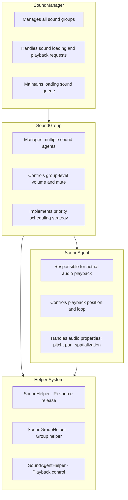
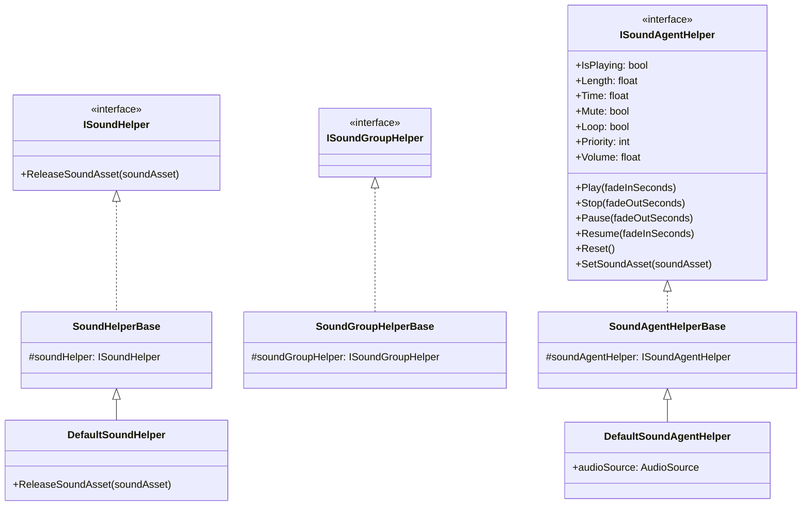
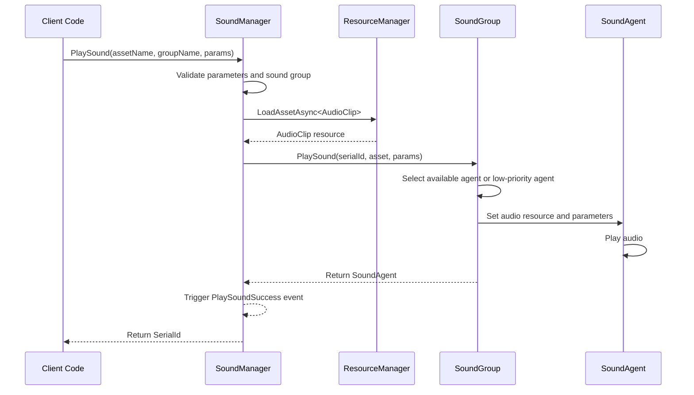
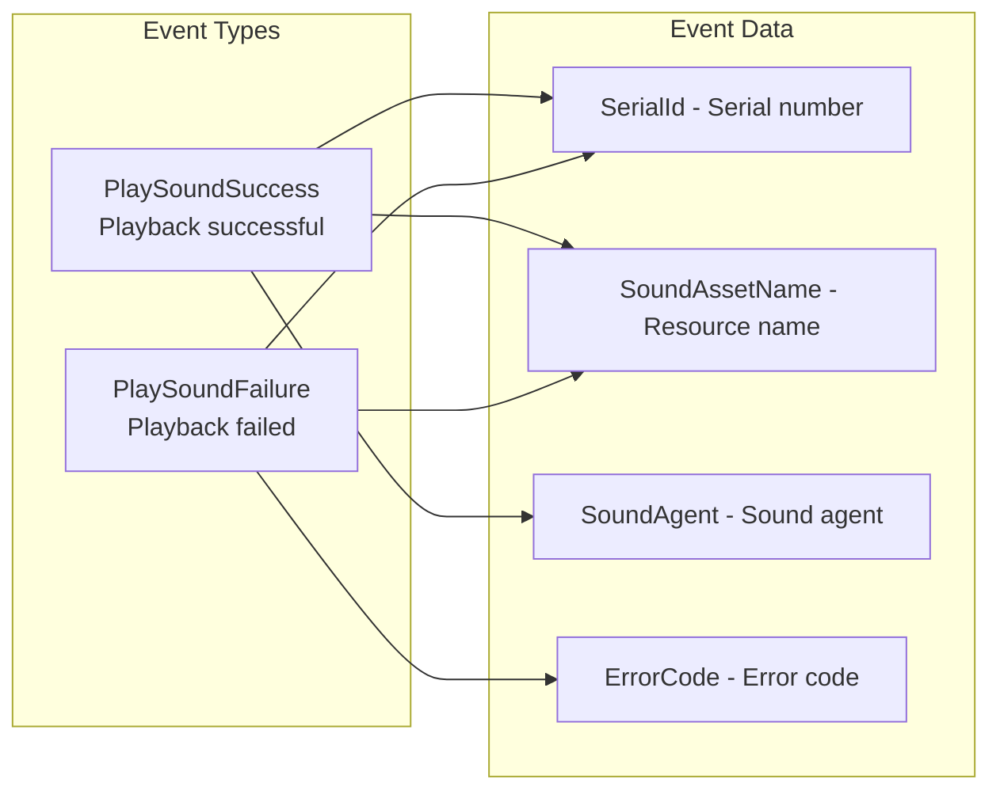

# Overview

GameFrameX Sound is the audio management system of the GameFrameX game framework, specifically designed for the Unity game engine. It provides a complete solution for sound playback, management, and control, supporting advanced audio features such as multiple sound groups, priority scheduling, and fade in/out.

## System Architecture

GameFrameX Sound adopts a three-tier architecture design: Manager (SoundManager) -> Sound Group (SoundGroup) -> Sound Agent (SoundAgent). This layered design gives the audio system excellent scalability and flexibility, capable of meeting various complex game audio requirements.



## Core Concepts

### SoundManager

SoundManager is the core component of the entire audio system, responsible for managing all sound groups and handling sound playback requests. It inherits from `GameFrameworkModule` and provides the following core functions:

- **Sound group management**: Create, query, and destroy sound groups
- **Sound playback**: Asynchronously load and play sound resources
- **Playback control**: Pause, resume, stop individual or all sounds
- **Status query**: Query sounds that are loading or playing

> For detailed API documentation, see [SoundManager](./4-core-concepts.1-sound-manager)

### SoundGroup

Sound groups are used to organize and control sounds with similar characteristics. For example, you can create a "Music" group for background music and a "SFX" group for sound effects. Each group can independently control volume and mute state.

Sound group core features:
- **Independent volume control**: Each group has independent volume settings
- **Mute management**: Can mute a single group without affecting others
- **Priority strategy**: Configurable whether same priority sounds replace each other
- **Agent pool management**: Maintains a set of sound agents for concurrent playback

> For detailed API documentation, see [SoundGroup](./4-core-concepts.2-sound-group)

### SoundAgent

SoundAgent is the component that actually executes audio playback. Each sound agent corresponds to an `AudioSource` (or custom audio implementation), responsible for:
- Play/pause/stop audio
- Set playback position
- Control loop playback
- Adjust pitch
- Set stereo pan (PanStereo)
- Spatial audio mix (SpatialBlend)
- Doppler effect (DopplerLevel)

> For detailed API documentation, see [SoundAgent](./4-core-concepts.3-sound-agent)

### Helper System

GameFrameX Sound uses the Helper pattern to achieve high extensibility:



By inheriting these helper base classes, developers can completely customize the underlying audio system implementation, for example:
- Using third-party audio middleware (such as FMOD, Wwise)
- Implementing special audio effects
- Customizing resource loading strategies

## Sound Playback Flow

When calling the `PlaySound` method, the system processes as follows:



1. **Parameter validation**: Check if sound group exists and if there are available sound agents
2. **Resource loading**: Asynchronously load audio resources through the resource manager
3. **Agent allocation**: Select appropriate agent from sound group (idle or low-priority)
4. **Playback control**: Set audio parameters and start playback
5. **Event notification**: Trigger success or failure events

## Playback Parameters

The `PlaySoundParams` class contains all configurable playback parameters:

| Parameter | Type | Default | Description |
|-----------|------|---------|-------------|
| Time | float | 0f | Playback start position (seconds) |
| MuteInSoundGroup | bool | false | Muted within group |
| Loop | bool | false | Whether to loop playback |
| Priority | int | 0 | Playback priority (higher number = higher priority) |
| VolumeInSoundGroup | float | 1.0f | Volume coefficient within group |
| FadeInSeconds | float | 0f | Fade in duration (seconds) |
| Pitch | float | 1.0f | Pitch (0.5-3.0) |
| PanStereo | float | 0f | Stereo position (-1~1) |
| SpatialBlend | float | 0f | Spatial blend amount (2D/3D) |
| MaxDistance | float | 100f | Maximum 3D distance |
| DopplerLevel | float | 1f | Doppler effect level |

> For detailed documentation, see [Playback Parameters](./5-api-reference.2-play-sound-params)

## Event System

GameFrameX Sound provides a complete event mechanism:



- **PlaySoundSuccess**: Triggered when playback succeeds, containing serial number, resource name, sound agent, and other information
- **PlaySoundFailure**: Triggered when playback fails, containing error code and error message

> For detailed documentation, see [Event Args](./5-api-reference.3-event-args)

## Usage Examples

### Basic Usage

```csharp
// Play sound via SoundComponent
var soundComponent = GameEntry.GetComponent<SoundComponent>();
int serialId = await soundComponent.PlaySound("Assets/Audio/BGM_Main.mp3", "Music");
```

### Play with Parameters

```csharp
var playParams = PlaySoundParams.Create();
playParams.Loop = true;
playParams.VolumeInSoundGroup = 0.8f;
playParams.FadeInSeconds = 1.0f;

int serialId = await soundComponent.PlaySound("Assets/Audio/BGM_Battle.mp3", "Music", playParams);
```

### Control Playback

```csharp
// Pause playback
soundComponent.PauseSound(serialId);

// Resume playback
soundComponent.ResumeSound(serialId);

// Stop playback
soundComponent.StopSound(serialId);
```

## Design Philosophy

GameFrameX Sound follows these principles:

1. **Layered management**: Through Manager -> Group -> Agent layered structure, achieves fine-grained audio control
2. **Priority scheduling**: Agent allocation strategy based on priority ensures important sounds can be played in time
3. **Helper extension**: Through Helper pattern supports custom audio implementation, facilitating integration with third-party audio libraries
4. **Asynchronous loading**: Uses UniTask for non-blocking audio resource loading
5. **Fade in/out**: Built-in volume gradient support enhances audio experience

## Related Links

- [Installation](./2-installation)
- [Getting Started](./3-getting-started)
- [API Reference - Interfaces](./5-api-reference.1-interfaces)
- [API Reference - Playback Parameters](./5-api-reference.2-play-sound-params)
- [Configuration](./6-configuration)
- [Extending](./7-extending)
- [FAQ](./8-faq)