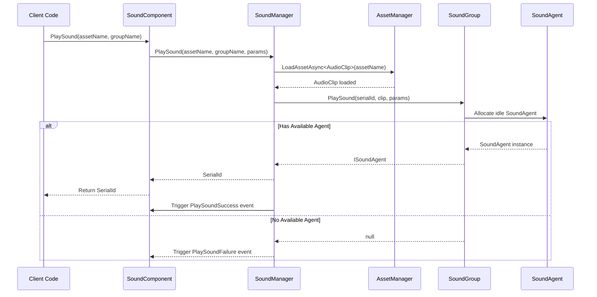

# Getting Started

This guide will help you quickly get started with the GameFrameX Sound audio management component. Through simple steps, you can integrate a professional audio system into your Unity project.

## Overview

GameFrameX Sound is the sound management component of the GameFrameX framework, providing complete sound playback, management, and control functionality. This component supports advanced features such as multiple sound group management, asynchronous resource loading, spatial audio, and sound fade in/out, meeting various game audio requirements.

**Core Features:**
- Multiple sound group management: Supports managing multiple sound groups simultaneously, each group can independently control volume and mute
- Asynchronous loading: Uses UniTask for asynchronous resource loading without blocking the game main thread
- Flexible event system: Provides playback success/failure event callbacks
- Spatial audio support: Supports 3D spatial sound effects
- Sound fade in/out: Supports fade in during playback and fade out during stop
- AudioMixer integration: Supports seamless integration with Unity AudioMixer

## Quick Usage Flow

The following are five steps to quickly integrate the Sound component into a Unity project:

### Step 1: Install Component

Add the dependency in your Unity project's `manifest.json`:

```json
{
  "dependencies": {
    "com.gameframex.unity.sound": "https://github.com/GameFrameX/com.gameframex.unity.sound.git"
  }
}
```

> Source: [README.md](https://github.com/GameFrameX/com.gameframex.unity.sound/blob/main/README.md#L10-L14)

### Step 2: Add SoundComponent

Create an empty GameObject in your Unity scene and add the `SoundComponent`:

1. Right-click in the Hierarchy panel and select **Create Empty** to create an empty object
2. Rename it to "SoundSystem" or another appropriate name
3. In the Inspector panel, click **Add Component**
4. Search for and select **GameFrameX/Sound** component

> Source: [SoundComponent.cs](https://github.com/GameFrameX/com.gameframex.unity.sound/blob/main/Runtime/Sound/SoundComponent.cs#L50-L51)

```csharp
[DisallowMultipleComponent]
[AddComponentMenu("GameFrameX/Sound")]
public sealed partial class SoundComponent : GameFrameworkComponent
```

### Step 3: Configure Sound Groups

Configure sound groups in the SoundComponent Inspector panel. Click the **Sound Groups** array and set for each element:

| Property | Description | Example Value |
|----------|-------------|---------------|
| Name | Sound group name for code reference | "Music", "SFX", "Voice" |
| Avoid Being Replaced By Same Priority | Whether to avoid being replaced by same priority sounds | false |
| Mute | Whether muted | false |
| Volume | Volume level (0-1) | 1.0 |
| Agent Helper Count | Number of concurrent playback agents | 3 |

> Source: [SoundComponent.cs](https://github.com/GameFrameX/com.gameframex.unity.sound/blob/main/Runtime/Sound/SoundComponent.cs#L175-L183)

Typical configuration scheme:
- **Background Music Group**: 1 Agent, loop playback
- **SFX Group**: 3-5 Agents, supports multiple SFX simultaneous playback
- **Voice Group**: 1-2 Agents, ensures voice clarity

### Step 4: Play Sound in Code

Playing sound through `SoundComponent` is very simple:

```csharp
// Get SoundComponent instance
var soundComponent = GameEntry.GetComponent<SoundComponent>();

// Play background music (loop)
var musicParams = PlaySoundParams.Create(true); // true means loop
await soundComponent.PlaySound("Assets/Audio/Music/MainTheme.mp3", "Music", musicParams);

// Play SFX (no loop)
await soundComponent.PlaySound("Assets/Audio/SFX/Click.wav", "SFX");

// Play 3D spatial sound effect
await soundComponent.PlaySound("Assets/Audio/SFX/Explosion.wav", "SFX", transform.position);
```

> Source: [SoundComponent.cs](https://github.com/GameFrameX/com.gameframex.unity.sound/blob/main/Runtime/Sound/SoundComponent.cs#L356-L430)

### Step 5: Control Playback

Use the returned serial number (SerialId) to control sound playback:

```csharp
// Pause sound
soundComponent.PauseSound(serialId);

// Resume playback
soundComponent.ResumeSound(serialId);

// Stop sound (with fade out effect)
soundComponent.StopSound(serialId, 0.5f); // 0.5 second fade out

// Stop all sounds
soundComponent.StopAllLoadedSounds();
```

> Source: [SoundComponent.cs](https://github.com/GameFrameX/com.gameframex.unity.sound/blob/main/Runtime/Sound/SoundComponent.cs#L532-L614)

## Playback Flow

The following flowchart shows the complete process from calling PlaySound to actual sound playback:



## Playback Parameter Configuration

The `PlaySoundParams` class provides rich playback parameter configuration:

```csharp
// Create playback parameters
var playSoundParams = ReferencePool.Acquire<PlaySoundParams>();

// Configure playback parameters
playSoundParams.Loop = true;                    // Loop playback
playSoundParams.VolumeInSoundGroup = 0.8f;    // Volume within group
playSoundParams.Priority = 100;                // Priority
playSoundParams.FadeInSeconds = 1.0f;         // Fade in duration (seconds)
playSoundParams.Pitch = 1.0f;                  // Pitch
playSoundParams.SpatialBlend = 1.0f;           // Spatial blend (3D sound)
playSoundParams.MaxDistance = 50f;             // Maximum distance

// Release back to object pool after use
ReferencePool.Release(playSoundParams);
```

> Source: [PlaySoundParams.cs](https://github.com/GameFrameX/com.gameframex.unity.sound/blob/main/Runtime/Sound/Sound/PlaySoundParams.cs#L40-L258)

**Common Parameter Description:**

| Parameter | Type | Default | Description |
|-----------|------|---------|-------------|
| Loop | bool | false | Whether to loop playback |
| VolumeInSoundGroup | float | 1.0 | Volume within sound group (0-1) |
| Priority | int | 0 | Playback priority, higher number = higher priority |
| FadeInSeconds | float | 0 | Fade in duration (seconds) |
| Pitch | float | 1.0 | Playback pitch (0.5-2.0) |
| SpatialBlend | float | 0 | Spatial blend amount (0=2D, 1=3D) |
| MaxDistance | float | 100 | 3D sound maximum attenuation distance |

## Complete Usage Example

The following is a complete usage example showing how to play background music when the game starts and play SFX when the player clicks a button:

```csharp
using UnityEngine;
using GameFrameX.Sound.Runtime;
using GameFrameX.Runtime;
using Cysharp.Threading.Tasks;

public class AudioExample : MonoBehaviour
{
    private SoundComponent _soundComponent;
    private int _bgMusicSerialId;

    private void Start()
    {
        // Get SoundComponent
        _soundComponent = GameEntry.GetComponent<SoundComponent>();

        // Subscribe to playback events
        _soundComponent.PlaySoundSuccess += OnPlaySoundSuccess;
        _soundComponent.PlaySoundFailure += OnPlaySoundFailure;

        // Play background music
        PlayBackgroundMusic();
    }

    private async void PlayBackgroundMusic()
    {
        // Create loop playback parameters
        var musicParams = PlaySoundParams.Create(true);
        musicParams.FadeInSeconds = 2.0f;
        musicParams.VolumeInSoundGroup = 0.6f;

        _bgMusicSerialId = await _soundComponent.PlaySound(
            "Assets/Audio/Music/GameTitle.mp3",
            "Music",
            musicParams
        );
    }

    // Called when player clicks button
    public void OnButtonClick()
    {
        // Play click sound effect
        _ = _soundComponent.PlaySound(
            "Assets/Audio/SFX/ButtonClick.wav",
            "SFX"
        );
    }

    // Playback success callback
    private void OnPlaySoundSuccess(object sender, PlaySoundSuccessEventArgs e)
    {
        Debug.Log($"Sound playback successful: {e.SoundAssetName}, SerialId: {e.SerialId}");
    }

    // Playback failure callback
    private void OnPlaySoundFailure(object sender, PlaySoundFailureEventArgs e)
    {
        Debug.LogWarning($"Sound playback failed: {e.SoundAssetName}, Error: {e.ErrorMessage}");
    }

    private void OnDestroy()
    {
        if (_soundComponent != null)
        {
            _soundComponent.PlaySoundSuccess -= OnPlaySoundSuccess;
            _soundComponent.PlaySoundFailure -= OnPlaySoundFailure;
        }
    }
}
```

> Source: [SoundComponent.cs](https://github.com/GameFrameX/com.gameframex.unity.sound/blob/main/Runtime/Sound/SoundComponent.cs#L655-L688)

## Sound Group Management

Dynamically manage sound groups at runtime:

```csharp
var soundComponent = GameEntry.GetComponent<SoundComponent>();

// Check if sound group exists
if (soundComponent.HasSoundGroup("Music"))
{
    // Get sound group
    var musicGroup = soundComponent.GetSoundGroup("Music");

    // Set volume
    musicGroup.Volume = 0.5f;

    // Mute/unmute
    musicGroup.Mute = true;

    // Check if playing
    bool isPlaying = musicGroup.IsPlaying(serialId);
}

// Stop all currently playing sounds
soundComponent.StopAllLoadedSounds();
soundComponent.StopAllLoadingSounds();
```

> Source: [ISoundGroup.cs](https://github.com/GameFrameX/com.gameframex.unity.sound/blob/main/Runtime/Interface/ISoundGroup.cs#L38-L87)

## Related Links

- [SoundManager](./4-core-concepts.1-sound-manager) - Learn about SoundManager's detailed functionality
- [SoundGroup](./4-core-concepts.2-sound-group) - Deep dive into sound group concepts
- [SoundAgent](./4-core-concepts.3-sound-agent) - Understand sound agent mechanism
- [API Reference - Interfaces](./5-api-reference.1-interfaces) - ISoundManager, ISoundGroup and other interfaces details
- [API Reference - Playback Parameters](./5-api-reference.2-play-sound-params) - PlaySoundParams complete parameter description
- [API Reference - Event Args](./5-api-reference.3-event-args) - Playback event details
- [Configuration](./6-configuration) - Sound system configuration options