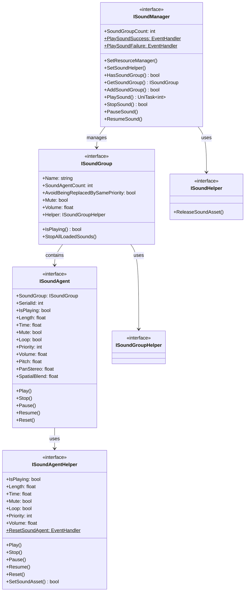

# Interface Definition

This document details all core interfaces defined in the GameFrameX sound system. The interfaces use layered design, providing complete abstraction for the sound manager, sound group, sound agent, and helpers.

## Overview

The GameFrameX sound system uses a classic layered architecture, achieving high scalability and testability through interface definitions. The system includes the following core interfaces:

- **ISoundManager** - Sound manager interface, responsible for global sound resource management and playback control
- **ISoundGroup** - Sound group interface, managing playback behavior for a group of related sounds
- **ISoundAgent** - Sound agent interface, controlling playback of a single sound instance
- **ISoundHelper** - Sound helper interface, used for resource release
- **ISoundGroupHelper** - Sound group helper interface
- **ISoundAgentHelper** - Sound agent helper interface

This layered design allows developers to implement platform-specific helpers (such as FMOD, CRIWARE) while maintaining consistency in upper-layer code.

## Interface Architecture



## ISoundManager Interface

ISoundManager is the core interface of the sound system, inheriting from GameFrameworkModule, providing global sound management functionality.

### Core Properties

| Property | Type | Description |
|----------|------|-------------|
| SoundGroupCount | `int` | Gets the number of currently added sound groups |
| PlaySoundSuccess | `EventHandler<PlaySoundSuccessEventArgs>` | Playback success event |
| PlaySoundFailure | `EventHandler<PlaySoundFailureEventArgs>` | Playback failure event |

### Core Methods

#### Set Resource Manager

```csharp
void SetResourceManager(IAssetManager assetManager)
```

Sets the resource manager for asynchronously loading sound resources.

> Source: [ISoundManager.cs](https://github.com/GameFrameX/com.gameframex.unity.sound/blob/main/Runtime/Interface/ISoundManager.cs#L62-L64)

#### Set Sound Helper

```csharp
void SetSoundHelper(ISoundHelper soundHelper)
```

Sets the sound helper for releasing sound resources.

> Source: [ISoundManager.cs](https://github.com/GameFrameX/com.gameframex.unity.sound/blob/main/Runtime/Interface/ISoundManager.cs#L67-L70)

#### Add Sound Group

```csharp
bool AddSoundGroup(string soundGroupName, ISoundGroupHelper soundGroupHelper)
bool AddSoundGroup(string soundGroupName, bool soundGroupAvoidBeingReplacedBySamePriority, bool soundGroupMute, float soundGroupVolume, ISoundGroupHelper soundGroupHelper)
```

Adds a new sound group. The first overload uses default parameters, the second overload allows specifying complete configuration.

**Parameters:**
- `soundGroupName` - Sound group name, used to identify and get sound group
- `soundGroupAvoidBeingReplacedBySamePriority` - Whether same priority sounds avoid being replaced
- `soundGroupMute` - Whether sound group is muted
- `soundGroupVolume` - Sound group volume (0.0-1.0)
- `soundGroupHelper` - Sound group helper instance

> Source: [ISoundManager.cs](https://github.com/GameFrameX/com.gameframex.unity.sound/blob/main/Runtime/Interface/ISoundManager.cs#L98-L115)

#### Get Sound Group

```csharp
bool HasSoundGroup(string soundGroupName)
ISoundGroup GetSoundGroup(string soundGroupName)
ISoundGroup[] GetAllSoundGroups()
void GetAllSoundGroups(List<ISoundGroup> results)
```

Gets already added sound groups. Supports querying by name and getting all sound groups.

> Source: [ISoundManager.cs](https://github.com/GameFrameX/com.gameframex.unity.sound/blob/main/Runtime/Interface/ISoundManager.cs#L72-L96)

#### Play Sound

```csharp
UniTask<int> PlaySound(string soundAssetName, string soundGroupName)
UniTask<int> PlaySound(string soundAssetName, string soundGroupName, int priority)
UniTask<int> PlaySound(string soundAssetName, string soundGroupName, PlaySoundParams playSoundParams)
UniTask<int> PlaySound(string soundAssetName, string soundGroupName, object userData)
UniTask<int> PlaySound(string soundAssetName, string soundGroupName, int priority, PlaySoundParams playSoundParams)
UniTask<int> PlaySound(string soundAssetName, string soundGroupName, int priority, object userData)
UniTask<int> PlaySound(string soundAssetName, string soundGroupName, PlaySoundParams playSoundParams, object userData)
UniTask<int> PlaySound(string soundAssetName, string soundGroupName, int priority, PlaySoundParams playSoundParams, object userData, int serialId)
```

Core method for playing sound resources, providing multiple overloads to meet different scenario requirements. Returns the sound's serial number (SerialId) for subsequent playback control.

**Parameters:**
- `soundAssetName` - Sound resource name
- `soundGroupName` - Sound group name
- `priority` - Load priority
- `playSoundParams` - Playback parameters (pitch, volume, loop, etc.)
- `userData` - User custom data, will be passed back in events
- `serialId` - Specified serial number

> Source: [ISoundManager.cs](https://github.com/GameFrameX/com.gameframex.unity.sound/blob/main/Runtime/Interface/ISoundManager.cs#L143-L218)

#### Stop Sound

```csharp
bool StopSound(int serialId)
bool StopSound(int serialId, float fadeOutSeconds)
```

Stops playback of the sound with the specified serial number. The second overload supports fade out effect.

> Source: [ISoundManager.cs](https://github.com/GameFrameX/com.gameframex.unity.sound/blob/main/Runtime/Interface/ISoundManager.cs#L220-L233)

#### Stop All Sounds

```csharp
void StopAllLoadedSounds()
void StopAllLoadedSounds(float fadeOutSeconds)
void StopAllLoadingSounds()
```

Stops all loaded or currently loading sounds.

> Source: [ISoundManager.cs](https://github.com/GameFrameX/com.gameframex.unity.sound/blob/main/Runtime/Interface/ISoundManager.cs#L235-L249)

#### Pause/Resume Sound

```csharp
void PauseSound(int serialId)
void PauseSound(int serialId, float fadeOutSeconds)
void ResumeSound(int serialId)
void ResumeSound(int serialId, float fadeInSeconds)
```

Pauses and resumes playback of specified sounds. Supports fade in/out effects.

> Source: [ISoundManager.cs](https://github.com/GameFrameX/com.gameframex.unity.sound/blob/main/Runtime/Interface/ISoundManager.cs#L251-L275)

#### Query Loading Status

```csharp
int[] GetAllLoadingSoundSerialIds()
void GetAllLoadingSoundSerialIds(List<int> results)
bool IsLoadingSound(int serialId)
```

Queries serial numbers of sounds currently loading.

> Source: [ISoundManager.cs](https://github.com/GameFrameX/com.gameframex.unity.sound/blob/main/Runtime/Interface/ISoundManager.cs#L124-L141)

---

## ISoundGroup Interface

ISoundGroup represents a sound group, used to manage a group of related sounds. Each sound group has its own volume control, mute settings, and replacement strategy.

### Properties

| Property | Type | Access | Description |
|----------|------|--------|-------------|
| Name | `string` | Read-only | Sound group name |
| SoundAgentCount | `int` | Read-only | Sound agent count |
| AvoidBeingReplacedBySamePriority | `bool` | Read/Write | Whether same priority sounds avoid being replaced |
| Mute | `bool` | Read/Write | Sound group mute state |
| Volume | `float` | Read/Write | Sound group volume (0.0-1.0) |
| Helper | `ISoundGroupHelper` | Read-only | Sound group helper |

> Source: [ISoundGroup.cs](https://github.com/GameFrameX/com.gameframex.unity.sound/blob/main/Runtime/Interface/ISoundGroup.cs#L38-L68)

### Methods

#### Check Playback Status

```csharp
bool IsPlaying(int serialId)
```

Checks if the sound with the specified serial number is playing. Returns false if the specified serial number is not found.

> Source: [ISoundGroup.cs](https://github.com/GameFrameX/com.gameframex.unity.sound/blob/main/Runtime/Interface/ISoundGroup.cs#L70-L75)

#### Stop All Sounds

```csharp
void StopAllLoadedSounds()
void StopAllLoadedSounds(float fadeOutSeconds)
```

Stops all loaded sounds in this sound group.

> Source: [ISoundGroup.cs](https://github.com/GameFrameX/com.gameframex.unity.sound/blob/main/Runtime/Interface/ISoundGroup.cs#L77-L86)

---

## ISoundAgent Interface

ISoundAgent represents a sound agent, which is the smallest unit that actually controls audio playback. Each sound agent corresponds to a playing or paused sound instance.

### Properties

| Property | Type | Access | Description |
|----------|------|--------|-------------|
| SoundGroup | `ISoundGroup` | Read-only | Parent sound group |
| SerialId | `int` | Read-only | Serial number |
| IsPlaying | `bool` | Read-only | Whether playing |
| Length | `float` | Read-only | Sound length (seconds) |
| Time | `float` | Read/Write | Current playback position (seconds) |
| Mute | `bool` | Read-only | Mute state |
| MuteInSoundGroup | `bool` | Read/Write | Whether muted within group |
| Loop | `bool` | Read/Write | Whether loop playback |
| Priority | `int` | Read/Write | Playback priority |
| Volume | `float` | Read-only | Current volume |
| VolumeInSoundGroup | `float` | Read/Write | Volume within group |
| Pitch | `float` | Read/Write | Pitch |
| PanStereo | `float` | Read/Write | Stereo pan (-1.0 to 1.0) |
| SpatialBlend | `float` | Read/Write | Spatial blend amount (0.0 to 1.0) |
| MaxDistance | `float` | Read/Write | Maximum distance |
| DopplerLevel | `float` | Read/Write | Doppler level |
| Helper | `ISoundAgentHelper` | Read-only | Agent helper |

> Source: [ISoundAgent.cs](https://github.com/GameFrameX/com.gameframex.unity.sound/blob/main/Runtime/Interface/ISoundAgent.cs#L38-L123)

### Methods

#### Play

```csharp
void Play()
void Play(float fadeInSeconds)
```

Starts or resumes sound playback. The second overload supports fade in effect.

> Source: [ISoundAgent.cs](https://github.com/GameFrameX/com.gameframex.unity.sound/blob/main/Runtime/Interface/ISoundAgent.cs#L125-L134)

#### Stop

```csharp
void Stop()
void Stop(float fadeOutSeconds)
```

Stops sound playback. The second overload supports fade out effect.

> Source: [ISoundAgent.cs](https://github.com/GameFrameX/com.gameframex.unity.sound/blob/main/Runtime/Interface/ISoundAgent.cs#L136-L145)

#### Pause

```csharp
void Pause()
void Pause(float fadeOutSeconds)
```

Pauses sound playback. The second overload supports fade out effect.

> Source: [ISoundAgent.cs](https://github.com/GameFrameX/com.gameframex.unity.sound/blob/main/Runtime/Interface/ISoundAgent.cs#L147-L156)

#### Resume

```csharp
void Resume()
void Resume(float fadeInSeconds)
```

Resumes paused sound playback. The second overload supports fade in effect.

> Source: [ISoundAgent.cs](https://github.com/GameFrameX/com.gameframex.unity.sound/blob/main/Runtime/Interface/ISoundAgent.cs#L158-L167)

#### Reset

```csharp
void Reset()
```

Resets the sound agent to initial state.

> Source: [ISoundAgent.cs](https://github.com/GameFrameX/com.gameframex.unity.sound/blob/main/Runtime/Interface/ISoundAgent.cs#L169-L172)

---

## ISoundHelper Interface

ISoundHelper is the simplest interface, used for releasing sound resources.

### Methods

```csharp
void ReleaseSoundAsset(object soundAsset)
```

Releases the specified sound resource.

> Source: [ISoundHelper.cs](https://github.com/GameFrameX/com.gameframex.unity.sound/blob/main/Runtime/Interface/ISoundHelper.cs#L38-L45)

---

## ISoundGroupHelper Interface

ISoundGroupHelper is the marker interface for sound group helpers. Currently defines no methods, used only as a base class identifier.

> Source: [ISoundGroupHelper.cs](https://github.com/GameFrameX/com.gameframex.unity.sound/blob/main/Runtime/Interface/ISoundGroupHelper.cs#L38-L40)

---

## ISoundAgentHelper Interface

ISoundAgentHelper is the sound agent helper interface, providing low-level audio playback control. This interface is similar to ISoundAgent but oriented toward low-level implementation.

### Properties

| Property | Type | Access | Description |
|----------|------|--------|-------------|
| IsPlaying | `bool` | Read-only | Whether playing |
| Length | `float` | Read-only | Sound length (seconds) |
| Time | `float` | Read/Write | Current playback position (seconds) |
| Mute | `bool` | Read/Write | Mute state |
| Loop | `bool` | Read/Write | Whether loop playback |
| Priority | `int` | Read/Write | Playback priority |
| Volume | `float` | Read/Write | Volume level |
| Pitch | `float` | Read/Write | Pitch |
| PanStereo | `float` | Read/Write | Stereo pan |
| SpatialBlend | `float` | Read/Write | Spatial blend amount |
| MaxDistance | `float` | Read/Write | Maximum distance |
| DopplerLevel | `float` | Read/Write | Doppler level |

### Events

```csharp
event EventHandler<ResetSoundAgentEventArgs> ResetSoundAgent
```

Event triggered when the sound agent is reset.

### Methods

#### Play

```csharp
void Play(float fadeInSeconds)
```

Plays sound with specified fade in duration.

> Source: [ISoundAgentHelper.cs](https://github.com/GameFrameX/com.gameframex.unity.sound/blob/main/Runtime/Interface/ISoundAgentHelper.cs#L107-L111)

#### Stop

```csharp
void Stop(float fadeOutSeconds)
```

Stops sound with specified fade out duration.

> Source: [ISoundAgentHelper.cs](https://github.com/GameFrameX/com.gameframex.unity.sound/blob/main/Runtime/Interface/ISoundAgentHelper.cs#L113-L117)

#### Pause

```csharp
void Pause(float fadeOutSeconds)
```

Pauses sound with specified fade out duration.

> Source: [ISoundAgentHelper.cs](https://github.com/GameFrameX/com.gameframex.unity.sound/blob/main/Runtime/Interface/ISoundAgentHelper.cs#L119-L123)

#### Resume

```csharp
void Resume(float fadeInSeconds)
```

Resumes sound with specified fade in duration.

> Source: [ISoundAgentHelper.cs](https://github.com/GameFrameX/com.gameframex.unity.sound/blob/main/Runtime/Interface/ISoundAgentHelper.cs#L125-L129)

#### Reset

```csharp
void Reset()
```

Resets the helper to initial state.

> Source: [ISoundAgentHelper.cs](https://github.com/GameFrameX/com.gameframex.unity.sound/blob/main/Runtime/Interface/ISoundAgentHelper.cs#L131-L134)

#### Set Sound Asset

```csharp
bool SetSoundAsset(object soundAsset)
```

Sets the sound resource to play. Returns whether setting was successful.

> Source: [ISoundAgentHelper.cs](https://github.com/GameFrameX/com.gameframex.unity.sound/blob/main/Runtime/Interface/ISoundAgentHelper.cs#L136-L141)

---

## Event Args

The system defines the following event argument types for callbacks:

### PlaySoundSuccessEventArgs

Event arguments triggered when sound playback succeeds.

| Property | Type | Description |
|----------|------|-------------|
| SerialId | `int` | Sound's serial number |
| SoundAssetName | `string` | Sound resource name |
| SoundAgent | `ISoundAgent` | Sound agent used for playback |
| Duration | `float` | Loading duration |
| UserData | `object` | User custom data |

> Source: [PlaySoundSuccessEventArgs.cs](https://github.com/GameFrameX/com.gameframex.unity.sound/blob/main/Runtime/EventArgs/PlaySoundSuccessEventArgs.cs)

### PlaySoundFailureEventArgs

Event arguments triggered when sound playback fails.

| Property | Type | Description |
|----------|------|-------------|
| SerialId | `int` | Sound's serial number |
| SoundAssetName | `string` | Sound resource name |
| SoundGroupName | `string` | Sound group name |
| PlaySoundParams | `PlaySoundParams` | Playback parameters |
| ErrorCode | `PlaySoundErrorCode` | Error code |
| ErrorMessage | `string` | Error message |
| UserData | `object` | User custom data |

> Source: [PlaySoundFailureEventArgs.cs](https://github.com/GameFrameX/com.gameframex.unity.sound/blob/main/Runtime/EventArgs/PlaySoundFailureEventArgs.cs)

---

## Usage Examples

### Listen to Playback Events

```csharp
var soundManager = GameFrameworkEntry.GetModule<ISoundManager>();
soundManager.PlaySoundSuccess += OnPlaySoundSuccess;
soundManager.PlaySoundFailure += OnPlaySoundFailure;

private void OnPlaySoundSuccess(object sender, PlaySoundSuccessEventArgs e)
{
    Debug.Log($"Sound playback successful: {e.SoundAssetName}, SerialId: {e.SerialId}");
}

private void OnPlaySoundFailure(object sender, PlaySoundFailureEventArgs e)
{
    Debug.LogError($"Sound playback failed: {e.SoundAssetName}, Error: {e.ErrorMessage}");
}
```

### Play Sound with Parameters

```csharp
var playParams = PlaySoundParams.Create(loop: false);
playParams.Pitch = 1.0f;
playParams.VolumeInSoundGroup = 0.8f;
playParams.Priority = 100;

int serialId = await soundManager.PlaySound("bgm_music", "BGM", playParams);
```

### Control Sound Group Volume

```csharp
ISoundGroup bgmGroup = soundManager.GetSoundGroup("BGM");
if (bgmGroup != null)
{
    bgmGroup.Volume = 0.5f;
    bgmGroup.Mute = false;
}
```

---

## Related Links

- [Playback Parameters](./5-api-reference.2-play-sound-params) - PlaySoundParams detailed configuration
- [Event Args](./5-api-reference.3-event-args) - Event args detailed description
- [SoundManager](./4-core-concepts.1-sound-manager) - SoundManager core concepts
- [SoundGroup](./4-core-concepts.2-sound-group) - SoundGroup core concepts
- [SoundAgent](./4-core-concepts.3-sound-agent) - SoundAgent core concepts