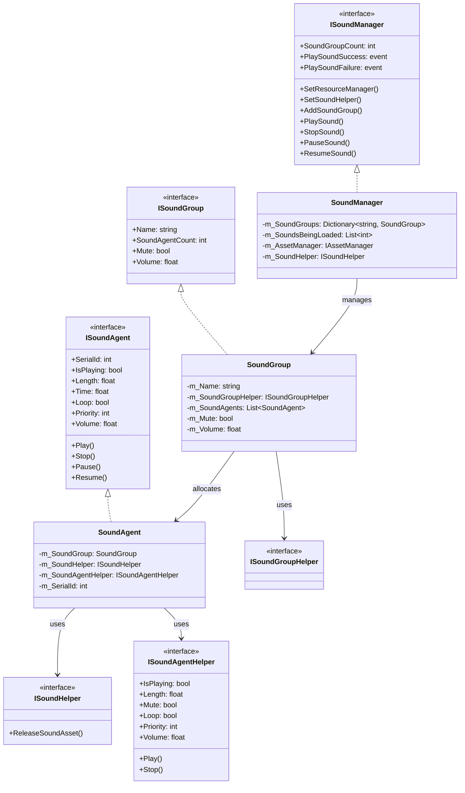
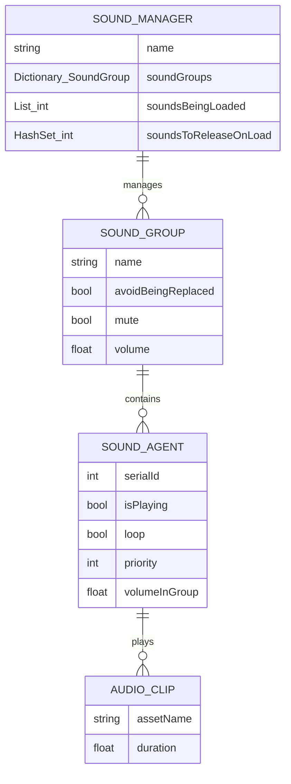
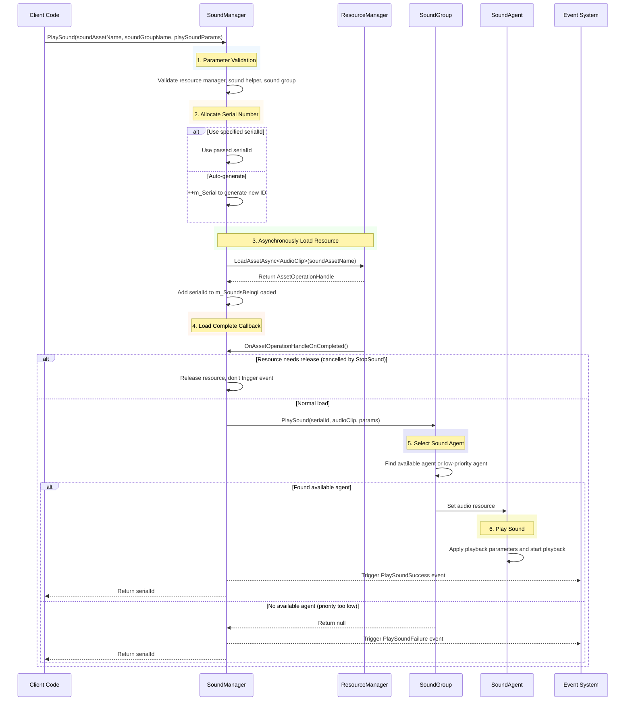
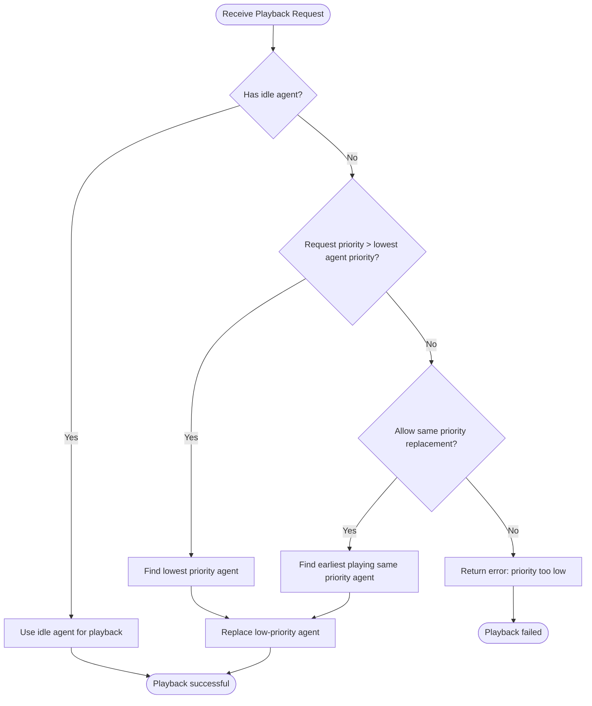

# Sound Manager

SoundManager is the core component of the GameFrameX audio module, responsible for managing core functions such as sound playback, sound groups, sound agents, and resource loading in games. It provides a unified interface to control various audio resources such as background music, sound effects, and voice, supporting advanced features like priority management, volume control, and fade in/out.

## Overview

SoundManager is the core module in the GameFrameX framework that handles all audio-related operations. As an implementation class of GameFrameworkModule, it follows the framework's modular design principles and can seamlessly integrate with other framework modules (such as resource manager, event system).

**Core Responsibilities:**
- Managing multiple sound groups (SoundGroup), each group can independently control volume and mute state
- Coordinating sound agent (SoundAgent) allocation, implementing priority scheduling and resource reuse
- Asynchronously loading audio resources, supporting YooAsset resource management system
- Triggering playback success/failure events, facilitating game logic to respond to audio state changes

**Design Intent:**
SoundManager uses a layered architecture design, separating the underlying implementation of audio playback (SoundAgent) from the management layer (SoundManager). This design allows developers to adapt to different audio engines (such as Unity AudioSource, Fmod, AudioKit) by customizing Helpers while maintaining consistency in upper-layer code. The priority mechanism ensures important sound effects can be played in time, avoiding sound loss due to agent pool being full.

```mermaid
flowchart TD
    subgraph SoundManager["SoundManager"]
        SM[Core Manager]
        SG[Sound Group Dictionary]
        SL[Loading Sound List]
        SR[Resources to Release]
    end

    subgraph External["External Dependencies"]
        AM[AssetManager]
        SH[Sound Helper]
        EC[Event Component]
    end

    subgraph SoundGroup["SoundGroup"]
        SGH[Helper]
        SAG[Sound Agent List]
    end

    subgraph SoundAgent["SoundAgent"]
        SAH[Agent Helper]
        ASSET[Audio Resource]
    end

    AM --> SM : Load audio resources
    SH --> SM : Release resources callback
    SM --> SG : Manage sound groups
    SG --> SGH
    SGH --> SAG
    SAG --> SAH
    SAH --> ASSET : Play audio
    SM --> EC : Trigger playback events
```

## Core Architecture

### Module Layer Structure

SoundManager uses a three-layer architecture design, with each layer taking different responsibilities:

1. **Interface Layer**: Defines interfaces such as ISoundManager, ISoundGroup, ISoundAgent, encapsulating business logic
2. **Implementation Layer**: Concrete implementations of SoundManager, SoundGroup, SoundAgent
3. **Helper Layer**: Various Helper interfaces and their default implementations, providing platform-specific audio processing capabilities



### Core Data Structures

SoundManager maintains three core data structures internally:



- **m_SoundGroups**: Dictionary storing all sound groups, keyed by group name, supporting O(1) lookup
- **m_SoundsBeingLoaded**: Records serial IDs of sounds currently being asynchronously loaded, used for tracking loading status
- **m_SoundsToReleaseOnLoad**: Records sound IDs that need to be released immediately after the next load completes, used for handling cases where StopSound is called during loading

## Sound Playback Flow

### Complete Playback Flow

When the PlaySound method is called, SoundManager executes the following steps:



### Sound Agent Selection Strategy

SoundGroup uses an intelligent agent selection strategy to ensure high-priority sounds can be played in time:



**Agent Selection Logic:**
1. Prefer using idle agents
2. If no idle agents, compare request priority with currently playing sound priorities
3. If request priority is higher, replace the lowest priority agent
4. If priorities are the same, decide whether to replace same priority sounds based on `AvoidBeingReplacedBySamePriority` setting

## Usage Examples

### Basic Usage

After adding SoundComponent in Unity scene, you can play sounds through the following methods:

```csharp
// Play sound effect via SoundComponent
var soundComponent = GameEntry.GetComponent<SoundComponent>();
int serialId = await soundComponent.PlaySound("Assets/Sounds/click.wav", "UI");
```

> Source: [SoundComponent.cs](https://github.com/GameFrameX/com.gameframex.unity.sound/blob/main/Runtime/Sound/SoundComponent.cs#L356-L359)

### Play with Parameters

```csharp
// Create playback parameters
var playParams = PlaySoundParams.Create(false);
playParams.VolumeInSoundGroup = 0.8f;
playParams.Priority = 100;
playParams.Loop = false;
playParams.FadeInSeconds = 0.3f;

// Play sound effect
int serialId = await soundComponent.PlaySound("Assets/Sounds/bgm_main.wav", "Background", playParams);
```

> Source: [PlaySoundParams.cs](https://github.com/GameFrameX/com.gameframex.unity.sound/blob/main/Runtime/Sound/Sound/PlaySoundParams.cs#L233-L239)

### Event Listening

```csharp
// Listen to playback success event
soundComponent.PlaySoundSuccess += OnPlaySoundSuccess;

// Listen to playback failure event
soundComponent.PlaySoundFailure += OnPlaySoundFailure;

private void OnPlaySoundSuccess(object sender, PlaySoundSuccessEventArgs e)
{
    Debug.Log($"Sound playback successful: {e.SoundAssetName}, SerialId: {e.SerialId}");
    // Can get the playback agent via e.SoundAgent for more precise control
}

private void OnPlaySoundFailure(object sender, PlaySoundFailureEventArgs e)
{
    Debug.LogWarning($"Sound playback failed: {e.SoundAssetName}, ErrorCode: {e.ErrorCode}, Reason: {e.ErrorMessage}");
}
```

> Source: [PlaySoundSuccessEventArgs.cs](https://github.com/GameFrameX/com.gameframex.unity.sound/blob/main/Runtime/EventArgs/PlaySoundSuccessEventArgs.cs#L89-L98)

### Sound Control

```csharp
// Pause specified sound
soundComponent.PauseSound(serialId);

// Resume playback
soundComponent.ResumeSound(serialId);

// Stop playback (with fade out effect)
soundComponent.StopSound(serialId, 0.5f);

// Stop all loaded sounds
soundComponent.StopAllLoadedSounds(1.0f);

// Stop all sounds being loaded
soundComponent.StopAllLoadingSounds();
```

> Source: [SoundManager.cs](https://github.com/GameFrameX/com.gameframex.unity.sound/blob/main/Runtime/Sound/Sound/SoundManager.cs#L584-L609)

### Sound Group Management

```csharp
// Add new sound group
soundComponent.AddSoundGroup("Combat", false, false, 1.0f, 4);

// Get sound group
var soundGroup = soundComponent.GetSoundGroup("UI");

// Set group volume
soundGroup.Volume = 0.5f;

// Set group mute
soundGroup.Mute = true;

// Check if sound group exists
if (soundComponent.HasSoundGroup("Background"))
{
    // Play background music
}
```

> Source: [SoundComponent.cs](https://github.com/GameFrameX/com.gameframex.unity.sound/blob/main/Runtime/Sound/SoundComponent.cs#L199-L212)

## Default Constant Values

SoundManager uses the following default constant values, which can be viewed in Constant.cs:

> Source: [Constant.cs](https://github.com/GameFrameX/com.gameframex.unity.sound/blob/main/Runtime/Sound/Sound/Constant.cs#L38-L99)

| Property | Default Value | Description |
|----------|---------------|-------------|
| DefaultTime | 0f | Default playback position |
| DefaultMute | false | Default mute state |
| DefaultLoop | false | Default non-loop |
| DefaultPriority | 0 | Default priority |
| DefaultVolume | 1f | Default volume (full) |
| DefaultFadeInSeconds | 0f | Default fade in time |
| DefaultFadeOutSeconds | 0f | Default fade out time |
| DefaultPitch | 1f | Default pitch |
| DefaultPanStereo | 0f | Default stereo position |
| DefaultSpatialBlend | 0f | Default spatial blend amount |
| DefaultMaxDistance | 100f | Default maximum distance |
| DefaultDopplerLevel | 1f | Default Doppler level |

## Error Code Description

Error codes that may occur when playing sounds:

> Source: [PlaySoundErrorCode.cs](https://github.com/GameFrameX/com.gameframex.unity.sound/blob/main/Runtime/Sound/Sound/PlaySoundErrorCode.cs#L38-L69)

| Error Code | Description |
|------------|-------------|
| Unknown | Unknown error |
| SoundGroupNotExist | Specified sound group does not exist |
| SoundGroupHasNoAgent | Sound group has no available sound agents |
| LoadAssetFailure | Failed to load audio resource |
| IgnoredDueToLowPriority | Ignored due to low priority |
| SetSoundAssetFailure | Failed to set audio resource to agent |

## Related Links

- [SoundGroup](./4-core-concepts.2-sound-group) - Learn about detailed configuration and management of sound groups
- [SoundAgent](./4-core-concepts.3-sound-agent) - Understand how sound agents work
- [Interface Definition](./5-api-reference.1-interfaces) - View complete interface definitions
- [Playback Parameters](./5-api-reference.2-play-sound-params) - View PlaySoundParams detailed parameters
- [Event Args](./5-api-reference.3-event-args) - View event parameter definitions
- [Configuration](./6-configuration) - View module configuration
- [Extending](./7-extending) - Learn how to extend the audio system