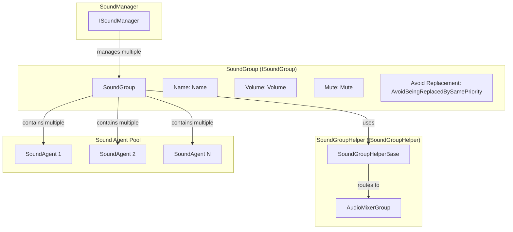
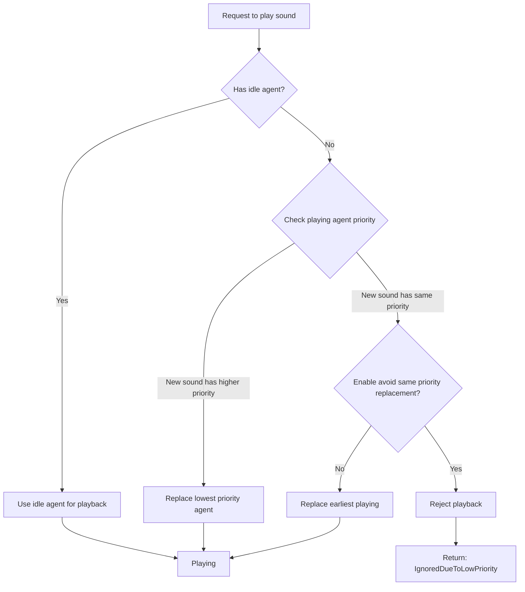

# Sound Group

Sound Group is a core concept in the GameFrameX sound system, used to organize and manage a group of related audio playback channels. Each sound group independently controls its volume, mute state, and priority strategy, providing flexible audio classification and playback capabilities.

## Overview

Sound groups solve common audio management needs in game development: how to distinguish between different types of audio such as background music, sound effects, and UI sounds, and independently control them. Through sound groups, developers can:

- **Classified management**: Assign different types of audio to different groups (such as BGM, SE, Voice)
- **Independent control**: Adjust each group's volume or mute state separately
- **Priority management**: Control sound replacement logic through priority strategy
- **Mixer integration**: Connect to Unity's mixing system through AudioMixerGroup

A sound group consists of multiple sound agents (SoundAgent), each agent responsible for playing one audio. Each sound group needs at least one agent, and the number of agents determines the upper limit of sounds that can be played simultaneously in that group.

## Architecture



### Core Components

| Component | Purpose | File Location |
|-----------|---------|---------------|
| `ISoundGroup` | Sound group interface definition | [Runtime/Interface/ISoundGroup.cs](https://github.com/GameFrameX/com.gameframex.unity.sound/blob/main/Runtime/Interface/ISoundGroup.cs#L38-L87) |
| `SoundGroup` | Sound group implementation class | [Runtime/Sound/Sound/SoundManager.SoundGroup.cs](https://github.com/GameFrameX/com.gameframex.unity.sound/blob/main/Runtime/Sound/Sound/SoundManager.SoundGroup.cs#L43-L324) |
| `ISoundGroupHelper` | Helper interface | [Runtime/Interface/ISoundGroupHelper.cs](https://github.com/GameFrameX/com.gameframex.unity.sound/blob/main/Runtime/Interface/ISoundGroupHelper.cs#L38-L40) |
| `SoundGroupHelperBase` | Helper base class | [Runtime/Sound/SoundGroupHelperBase.cs](https://github.com/GameFrameX/com.gameframex.unity.sound/blob/main/Runtime/Sound/SoundGroupHelperBase.cs#L42-L54) |
| `DefaultSoundGroupHelper` | Default helper implementation | [Runtime/Sound/DefaultSoundGroupHelper.cs](https://github.com/GameFrameX/com.gameframex.unity.sound/blob/main/Runtime/Sound/DefaultSoundGroupHelper.cs#L38-L40) |

## Core Features

### Sound Group Properties

```csharp
public interface ISoundGroup
{
    // Get sound group name
    string Name { get; }

    // Get sound agent count
    int SoundAgentCount { get; }

    // Whether to avoid being replaced by same priority sounds
    // When true, audio of the same priority will not replace each other
    bool AvoidBeingReplacedBySamePriority { get; set; }

    // Mute state
    bool Mute { get; set; }

    // Volume (0.0 - 1.0)
    float Volume { get; set; }

    // Sound group helper
    ISoundGroupHelper Helper { get; }
}
```

> Source: [ISoundGroup.cs](https://github.com/GameFrameX/com.gameframex.unity.sound/blob/main/Runtime/Interface/ISoundGroup.cs#L38-L87)

### Priority Replacement Strategy

The core function of sound groups is managing sound agent allocation based on priority. When a new sound needs to be played, the system selects an agent according to the following logic:



The specific implementation logic is as follows:

```csharp
// Agent allocation logic during sound playback
public ISoundAgent PlaySound(int serialId, object soundAsset, PlaySoundParams playSoundParams, out PlaySoundErrorCode? errorCode)
{
    errorCode = null;
    SoundAgent candidateAgent = null;
    foreach (SoundAgent soundAgent in m_SoundAgents)
    {
        if (!soundAgent.IsPlaying)
        {
            candidateAgent = soundAgent;
            break;
        }

        // Find agent with lower priority or same priority but earlier playback time
        if (soundAgent.Priority < playSoundParams.Priority)
        {
            if (candidateAgent == null || soundAgent.Priority < candidateAgent.Priority)
            {
                candidateAgent = soundAgent;
            }
        }
        else if (!m_AvoidBeingReplacedBySamePriority && soundAgent.Priority == playSoundParams.Priority)
        {
            if (candidateAgent == null || soundAgent.SetSoundAssetTime < candidateAgent.SetSoundAssetTime)
            {
                candidateAgent = soundAgent;
            }
        }
    }
    // ...
}
```

> Source: [SoundManager.SoundGroup.cs](https://github.com/GameFrameX/com.gameframex.unity.sound/blob/main/Runtime/Sound/Sound/SoundManager.SoundGroup.cs#L175-L228)

### Volume and Mute

The volume and mute state of the sound group are automatically synchronized to all associated sound agents:

```csharp
// Synchronize to all agents when setting mute state
public bool Mute
{
    get { return m_Mute; }
    set
    {
        m_Mute = value;
        foreach (SoundAgent soundAgent in m_SoundAgents)
        {
            soundAgent.RefreshMute();  // Refresh mute state
        }
    }
}

// Synchronize to all agents when setting volume
public float Volume
{
    get { return m_Volume; }
    set
    {
        m_Volume = value;
        foreach (SoundAgent soundAgent in m_SoundAgents)
        {
            soundAgent.RefreshVolume();  // Refresh volume
        }
    }
}
```

> Source: [SoundManager.SoundGroup.cs](https://github.com/GameFrameX/com.gameframex.unity.sound/blob/main/Runtime/Sound/Sound/SoundManager.SoundGroup.cs#L102-L129)

This design ensures the immediacy and consistency of volume adjustment and mute operations.

## Sound Group Helper

### AudioMixerGroup Integration

Sound groups connect to Unity's audio mixing system through `SoundGroupHelperBase`:

```csharp
public abstract class SoundGroupHelperBase : MonoBehaviour, ISoundGroupHelper
{
    [SerializeField] private AudioMixerGroup m_AudioMixerGroup = null;

    /// <summary>
    /// Gets or sets the mixer group where the sound group helper is located.
    /// </summary>
    public AudioMixerGroup AudioMixerGroup
    {
        get { return m_AudioMixerGroup; }
        set { m_AudioMixerGroup = value; }
    }
}
```

> Source: [SoundGroupHelperBase.cs](https://github.com/GameFrameX/com.gameframex.unity.sound/blob/main/Runtime/Sound/SoundGroupHelperBase.cs#L42-L54)

This design allows developers to:
- Assign different AudioMixerGroup to each sound group via Unity Editor
- Use Unity's AudioMixer to implement complex audio processing (EQ, compression, reverb, etc.)
- Apply different mixing effects to different types of sounds

### Custom Helper

Custom helpers can be created by inheriting `SoundGroupHelperBase`:

```csharp
public class CustomSoundGroupHelper : SoundGroupHelperBase
{
    // Custom extension logic
    protected override void Start()
    {
        base.Start();
        // Custom initialization logic
    }
}
```

## Usage Examples

### Configure Sound Groups via SoundComponent

Configuring sound groups in Unity Editor is the most common method:

```csharp
// Sound group configuration class in SoundComponent.cs
[Serializable]
private sealed class SoundGroup
{
    [SerializeField] private string m_Name = null;                              // Sound group name
    [SerializeField] private bool m_AvoidBeingReplacedBySamePriority = false;   // Avoid same priority replacement
    [SerializeField] private bool m_Mute = false;                                 // Default mute state
    [SerializeField, Range(0f, 1f)] private float m_Volume = 1f;                  // Default volume
    [SerializeField] private int m_AgentHelperCount = 1;                        // Agent count
}
```

> Source: [SoundComponent.SoundGroup.cs](https://github.com/GameFrameX/com.gameframex.unity.sound/blob/main/Runtime/Sound/SoundComponent.SoundGroup.cs#L44-L112)

### Dynamic Creation at Runtime

Sound groups can also be dynamically added at runtime:

```csharp
// Dynamically add sound group in SoundComponent
public bool AddSoundGroup(string soundGroupName, bool soundGroupAvoidBeingReplacedBySamePriority, bool soundGroupMute, float soundGroupVolume, int soundAgentHelperCount)
{
    if (m_SoundManager.HasSoundGroup(soundGroupName))
    {
        return false;
    }

    var soundGroupHelper = CreateCustomSoundGroupHelper(soundGroupName, soundAgentHelperCount);
    if (!m_SoundManager.AddSoundGroup(soundGroupName, soundGroupAvoidBeingReplacedBySamePriority, soundGroupMute, soundGroupVolume, soundGroupHelper))
    {
        return false;
    }
    return true;
}
```

> Source: [SoundComponent.cs](https://github.com/GameFrameX/com.gameframex.unity.sound/blob/main/Runtime/Sound/SoundComponent.cs#L252-L287)

### Control Sound Groups

Get sound group and control its properties:

```csharp
// Get sound group
var soundGroup = soundComponent.GetSoundGroup("BGM");

// Set volume
soundGroup.Volume = 0.5f;

// Mute
soundGroup.Mute = true;

// Stop all playing sounds
soundGroup.StopAllLoadedSounds();

// Stop with fade out
soundGroup.StopAllLoadedSounds(1.0f);
```

## Configuration Description

### Sound Group Configuration Parameters

| Parameter | Type | Default | Description |
|-----------|------|---------|-------------|
| Name | string | - | Sound group name, must be unique |
| AvoidBeingReplacedBySamePriority | bool | false | Whether to avoid being replaced by same priority sounds |
| Mute | bool | false | Default mute state |
| Volume | float | 1.0 | Default volume (0.0-1.0) |
| AgentHelperCount | int | 1 | Sound agent count, determines upper limit of simultaneous playback |

### Typical Configuration Schemes

| Scenario | Name | Agent Count | Priority Strategy | Usage |
|---------|------|-------------|------------------|-------|
| Background Music | BGM | 1-2 | Enable avoid replacement | Music playback |
| Sound Effects | SE | 5-10 | Disable avoid replacement | Various sound effects |
| Voice | Voice | 2-3 | Enable avoid replacement | Character dialogue |
| UI Sound Effects | UI | 3-5 | Enable avoid replacement | Interface feedback |

## Related Links

- [SoundManager](./4-core-concepts.1-sound-manager) - Upper-level management component of sound groups
- [SoundAgent](./4-core-concepts.3-sound-agent) - Audio playback unit managed by sound groups
- [Interface Definition](./5-api-reference.1-interfaces) - ISoundGroup complete interface definition
- [Playback Parameters](./5-api-reference.2-play-sound-params) - Sound playback parameter configuration