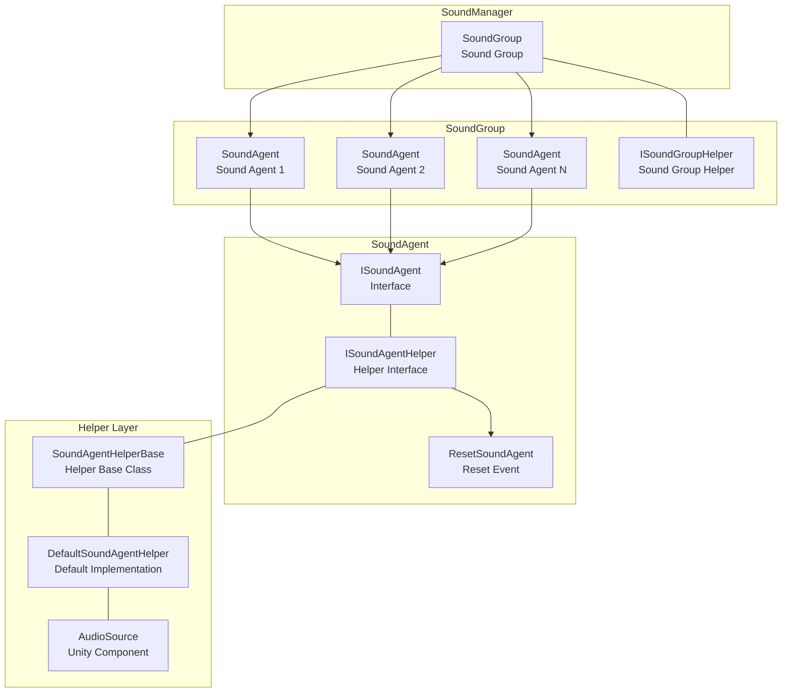
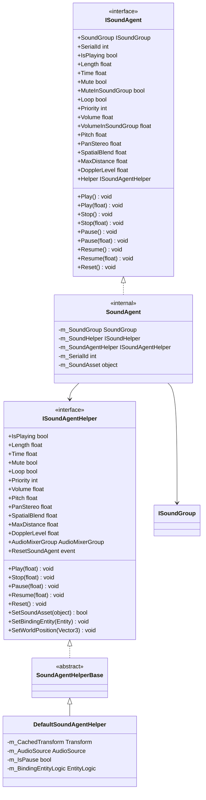
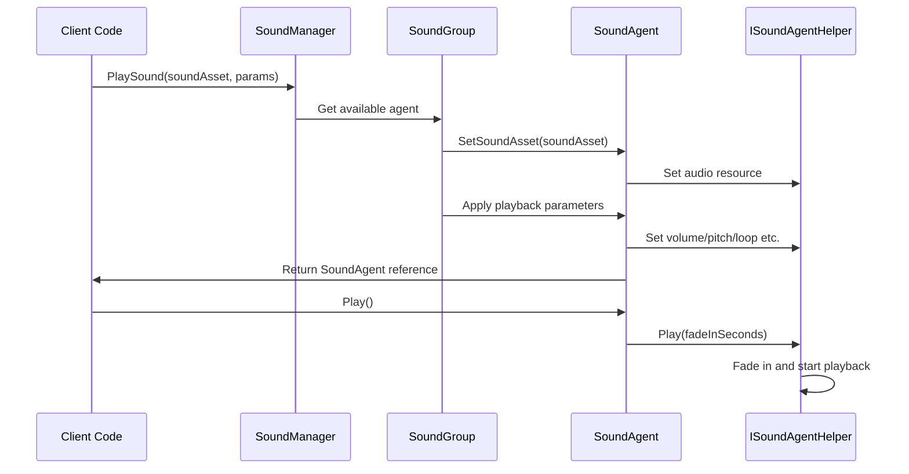
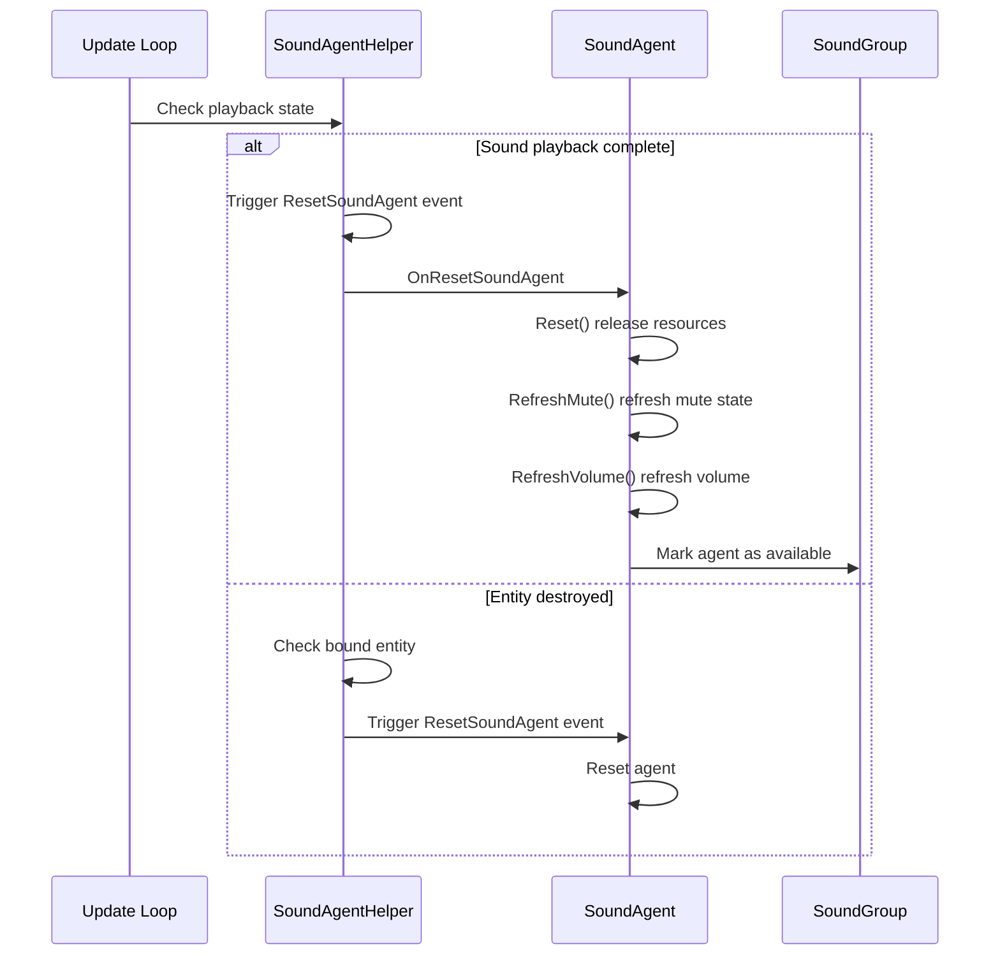

# Sound Agent

Sound Agent is the smallest playback unit in the GameFrameX sound system, responsible for managing the playback, control, and state of a single audio instance. Each sound agent represents a specific sound playback channel and can independently control properties such as volume, pitch, loop, and mute.

## Overview

Sound Agent is a core component in the sound system architecture, located one level below the SoundGroup. In games, when a sound effect or background music needs to be played, the sound system obtains an available sound agent from the corresponding sound group to execute the playback task.

### Design Intent

Sound Agent combines the Proxy Pattern and Object Pool ideas:

1. **Proxy Pattern**: Sound agent acts as an intermediary between upper-layer business logic and lower-layer audio implementation. Through the ISoundAgent interface, it encapsulates complex playback control logic
2. **Object Pool**: Sound groups pre-create a certain number of sound agents. When sound needs to be played, it is obtained from the pool and returned after playback completes, avoiding performance overhead from frequent creation and destruction
3. **Layered Design**: Through the ISoundAgentHelper interface, it isolates Unity-specific AudioSource implementation, facilitating extension and replacement

### Core Responsibilities

The main responsibilities of Sound Agent include:

- **Playback control**: Start, pause, resume, stop audio playback
- **Parameter adjustment**: Real-time adjustment of volume, pitch, stereo pan, spatial blend, and other parameters
- **State management**: Track playback state (whether playing, playback progress, etc.)
- **Resource management**: Load and release audio resources
- **Event notification**: Notify upper layers when events such as playback end or entity destruction occur

## Architecture

### Component Relationship Diagram



### Class Diagram



## Core Features

### Playback Control

Sound agent provides complete playback control methods, supporting playback transitions with fade in/out effects:

```csharp
// Direct play, using default fade in time
agent.Play();

// Play with fade in effect, fade in to target volume within 0.5 seconds
agent.Play(0.5f);

// Direct stop, using default fade out time
agent.Stop();

// Stop with fade out effect, fade out within 1 second
agent.Stop(1.0f);

// Pause playback
agent.Pause();

// Pause with fade out effect
agent.Pause(0.3f);

// Resume playback
agent.Resume();

// Resume with fade in effect
agent.Resume(0.3f);
```
> Source: [ISoundAgent.cs](https://github.com/GameFrameX/com.gameframex.unity.sound/blob/main/Runtime/Interface/ISoundAgent.cs#L125-L167)

### Volume Control

Sound agent uses a dual-layer volume control mechanism: agent's own volume x sound group's volume. This design allows adjusting the entire sound group's volume without changing the volume of individual sound effects:

```csharp
// Set agent's own volume (0.0 - 1.0)
agent.VolumeInSoundGroup = 0.8f;

// Get actual effective volume (agent volume x group volume)
float actualVolume = agent.Volume;
```
> Source: [SoundManager.SoundAgent.cs](https://github.com/GameFrameX/com.gameframex.unity.sound/blob/main/Runtime/Sound/Sound/SoundManager.SoundAgent.cs#L209-L217)

### Spatial Audio

Sound agent supports 3D spatial audio effects, automatically calculating volume attenuation based on the position relationship between sound source and listener:

```csharp
// Set spatial blend amount (0 = 2D, 1 = 3D)
agent.SpatialBlend = 1.0f;

// Set maximum attenuation distance
agent.MaxDistance = 50.0f;

// Set Doppler effect level
agent.DopplerLevel = 0.5f;
```
> Source: [ISoundAgent.cs](https://github.com/GameFrameX/com.gameframex.unity.sound/blob/main/Runtime/Interface/ISoundAgent.cs#L105-L118)

### Entity Binding

Sound agent can be bound to game entities, making the sound source position follow the entity movement:

```csharp
// Bind entity via helper
agent.Helper.SetBindingEntity(entity);

// Set world coordinate position
agent.Helper.SetWorldPosition(new Vector3(10, 0, 5));
```
> Source: [DefaultSoundAgentHelper.cs](https://github.com/GameFrameX/com.gameframex.unity.sound/blob/main/Runtime/Sound/DefaultSoundAgentHelper.cs#L295-L323)

### Playback Progress Control

```csharp
// Get total sound length
float length = agent.Length;

// Get or set current playback position (seconds)
agent.Time = 5.0f;  // Jump to 5 seconds
float currentTime = agent.Time;

// Get whether is playing
if (agent.IsPlaying)
{
    Debug.Log($"Playback progress: {agent.Time}/{agent.Length}");
}
```
> Source: [ISoundAgent.cs](https://github.com/GameFrameX/com.gameframex.unity.sound/blob/main/Runtime/Interface/ISoundAgent.cs#L50-L63)

## Core Flow

### Sound Playback Flow



### Sound End Reset Flow

When sound playback is complete, the system automatically triggers the reset flow, releasing the current agent for use by other sounds:


> Source: [DefaultSoundAgentHelper.cs](https://github.com/GameFrameX/com.gameframex.unity.sound/blob/main/Runtime/Sound/DefaultSoundAgentHelper.cs#L333-L367)

## Extend Custom Helper

You can implement custom sound agent helpers by inheriting `SoundAgentHelperBase` to support different audio implementation schemes (such as FMOD, Wwise, etc.):

```csharp
using UnityEngine;
using GameFrameX.Sound.Runtime;

public class CustomSoundAgentHelper : SoundAgentHelperBase
{
    private AudioSource m_AudioSource;
    private AudioClip m_CurrentClip;

    public override bool IsPlaying => m_AudioSource?.isPlaying ?? false;

    public override float Length => m_CurrentClip?.length ?? 0f;

    public override float Time
    {
        get => m_AudioSource?.time ?? 0f;
        set { if (m_AudioSource != null) m_AudioSource.time = value; }
    }

    // ... other property implementations

    public override void Play(float fadeInSeconds)
    {
        m_AudioSource.Play();
        // Implement custom fade in logic
    }

    public override bool SetSoundAsset(object soundAsset)
    {
        m_CurrentClip = soundAsset as AudioClip;
        if (m_CurrentClip == null) return false;

        m_AudioSource.clip = m_CurrentClip;
        return true;
    }

    // ... other method implementations
}
```
> Source: [SoundAgentHelperBase.cs](https://github.com/GameFrameX/com.gameframex.unity.sound/blob/main/Runtime/Sound/SoundAgentHelperBase.cs#L38-L162)

## Property Description

| Property | Type | Default | Description |
|----------|------|---------|-------------|
| SerialId | int | 0 | Sound's serial number, used to identify this playback request |
| IsPlaying | bool | - | Whether currently playing |
| Length | float | 0 | Sound total duration (seconds) |
| Time | float | 0 | Current playback position (seconds) |
| Mute | bool | false | Whether muted (read-only, controlled by group) |
| MuteInSoundGroup | bool | false | Whether muted within sound group |
| Loop | bool | false | Whether to loop playback |
| Priority | int | 0 | Sound priority (higher number = higher priority) |
| Volume | float | 1.0 | Actual effective volume (agent x group) |
| VolumeInSoundGroup | float | 1.0 | Agent's own volume |
| Pitch | float | 1.0 | Pitch (0.5-2.0) |
| PanStereo | float | 0 | Stereo pan (-1 left -> 1 right) |
| SpatialBlend | float | 0 | Spatial blend amount (0=2D -> 1=3D) |
| MaxDistance | float | 100 | Maximum attenuation distance in 3D mode |
| DopplerLevel | float | 1 | Doppler effect level |

> Source: [Constant.cs](https://github.com/GameFrameX/com.gameframex.unity.sound/blob/main/Runtime/Sound/Sound/Constant.cs#L38-L99)

## Related Links

- [SoundManager](./4-core-concepts.1-sound-manager) - Core manager of the sound system
- [SoundGroup](./4-core-concepts.2-sound-group) - Group managing multiple sound agents
- [Interface Definition](./5-api-reference.1-interfaces) - ISoundAgent and ISoundAgentHelper interface details
- [Event Args](./5-api-reference.3-event-args) - Sound-related event parameter description