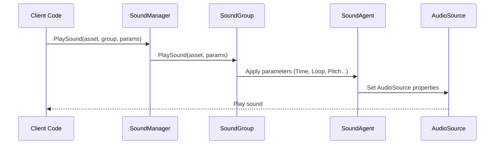

# Playback Parameters

The PlaySoundParams class is used to configure various properties of sound playback, including volume, pitch, loop, fade in/out, and other parameters. These parameters are passed to SoundManager when playing sounds to control the specific playback behavior of sounds.

## Overview

PlaySoundParams is the core parameter class of the sound system, encapsulating all configuration options needed when playing sounds. The class implements the IReference interface and supports object pool management, allowing reuse to reduce memory allocation.

When calling the ISoundManager.PlaySound method, you can pass a PlaySoundParams instance to customize the sound's playback behavior. If null is passed or parameters are not passed, the system will use default parameter values.

### Design Intent

PlaySoundParams uses the Parameter Object Pattern, encapsulating multiple related playback parameters into one object. This design:

- **Simplifies API**: Avoids passing a large number of independent parameters in PlaySound method
- **Improves readability**: Makes parameter meanings clear through named properties
- **Supports default values**: All parameters have reasonable default values, no need to set all
- **Object pool**: Implements IReference interface, supporting ReferencePool recycling and reuse

### Parameter Application Flow



## Parameter Description

### Playback Control Parameters

| Parameter | Type | Default | Description |
|-----------|------|---------|-------------|
| Time | float | 0f | Playback position (seconds), start playback from specified time |
| Loop | bool | false | Whether to loop playback |
| FadeInSeconds | float | 0f | Fade in time (seconds), gradual volume transition at playback start |

### Sound Group Parameters

| Parameter | Type | Default | Description |
|-----------|------|---------|-------------|
| MuteInSoundGroup | bool | false | Whether muted within its sound group |
| VolumeInSoundGroup | float | 1f | Volume within its sound group (0.0-1.0) |
| Priority | int | 0 | Sound priority, higher number means higher priority |

### Sound Effect Parameters

| Parameter | Type | Default | Description |
|-----------|------|---------|-------------|
| Pitch | float | 1f | Pitch, 1.0 is normal speed |
| PanStereo | float | 0f | Stereo position, -1 is left channel, 1 is right channel |

### Spatial Audio Parameters

| Parameter | Type | Default | Description |
|-----------|------|---------|-------------|
| SpatialBlend | float | 0f | Spatial blend amount, 0 is 2D sound, 1 is 3D sound |
| MaxDistance | float | 100f | Maximum attenuation distance (only effective for 3D sounds) |
| DopplerLevel | float | 1f | Doppler effect level, 0 is disabled |

## Detailed Parameter Explanation

### Time - Playback Position

Set the position where sound starts playing (in seconds). This is useful for implementing resume from break point, preview feature, or skipping intro.

```csharp
var playSoundParams = PlaySoundParams.Create();
playSoundParams.Time = 5.5f; // Start playback from 5.5 seconds
await soundManager.PlaySound("bgm_music", "MusicGroup", playSoundParams);
```
> Source: [PlaySoundParams.cs](https://github.com/GameFrameX/com.gameframex.unity.sound/blob/main/Runtime/Sound/Sound/PlaySoundParams.cs#L124-L128)

### Loop - Loop Playback

Control whether the sound loops. Set to true for background music or ambient sounds, false for one-time sound effects.

```csharp
// Play looping background music
var musicParams = PlaySoundParams.Create(isLoop: true);
// Or
var musicParams = PlaySoundParams.Create();
musicParams.Loop = true;
await soundManager.PlaySound("bgm_forest", "MusicGroup", musicParams);
```
> Source: [PlaySoundParams.cs](https://github.com/GameFrameX/com.gameframex.unity.sound/blob/main/Runtime/Sound/Sound/PlaySoundParams.cs#L142-L146)

### FadeInSeconds - Fade In Time

Set the fade in time when sound starts playing, making the volume gradually transition from 0 to target volume. This is very useful to avoid sudden sound bursts.

```csharp
var playSoundParams = PlaySoundParams.Create();
playSoundParams.FadeInSeconds = 2.0f; // 2 second fade in
await soundManager.PlaySound("ui_click", "UIGroup", playSoundParams);
```
> Source: [PlaySoundParams.cs](https://github.com/GameFrameX/com.gameframex.unity.sound/blob/main/Runtime/Sound/Sound/PlaySoundParams.cs#L169-L173)

### MuteInSoundGroup - Mute Within Group

Control whether this sound is muted within its sound group. Note: Even if set to mute, the sound still occupies the playback channel of the sound group.

```csharp
var playSoundParams = PlaySoundParams.Create();
playSoundParams.MuteInSoundGroup = true; // Temporary mute
await soundManager.PlaySound("voice_intro", "VoiceGroup", playSoundParams);
```
> Source: [PlaySoundParams.cs](https://github.com/GameFrameX/com.gameframex.unity.sound/blob/main/Runtime/Sound/Sound/PlaySoundParams.cs#L133-L137)

### VolumeInSoundGroup - Volume Within Group

Set the volume coefficient for this sound within its sound group. Final volume = sound group volume x individual volume.

```csharp
var playSoundParams = PlaySoundParams.Create();
playSoundParams.VolumeInSoundGroup = 0.5f; // 50% volume
await soundManager.PlaySound("effect_explosion", "EffectGroup", playSoundParams);
```
> Source: [PlaySoundParams.cs](https://github.com/GameFrameX/com.gameframex.unity.sound/blob/main/Runtime/Sound/Sound/PlaySoundParams.cs#L160-L164)

### Priority - Priority

Set the sound's priority. When no available playback channel is available in the sound group, low priority sounds will be replaced by high priority ones. Priority range recommendation: 0-255, higher number means higher priority.

```csharp
var playSoundParams = PlaySoundParams.Create();
playSoundParams.Priority = 100; // High priority
await soundManager.PlaySound("ui_important", "UIGroup", playSoundParams);
```
> Source: [PlaySoundParams.cs](https://github.com/GameFrameX/com.gameframex.unity.sound/blob/main/Runtime/Sound/Sound/PlaySoundParams.cs#L151-L155)

### Pitch - Pitch

Adjust the playback speed/pitch of sound. 1.0 is normal speed, less than 1.0 is slow/low pitch, greater than 1.0 is fast/high pitch.

```csharp
var playSoundParams = PlaySoundParams.Create();
playSoundParams.Pitch = 0.8f; // Slightly lower pitch
await soundManager.PlaySound("npc_voice", "VoiceGroup", playSoundParams);
```
> Source: [PlaySoundParams.cs](https://github.com/GameFrameX/com.gameframex.unity.sound/blob/main/Runtime/Sound/Sound/PlaySoundParams.cs#L178-L182)

### PanStereo - Stereo Position

Control the position of sound between left and right channels. -1.0 is complete left channel, 0.0 is centered, 1.0 is complete right channel.

```csharp
var playSoundParams = PlaySoundParams.Create();
playSoundParams.PanStereo = -0.5f; // Slightly left
await soundManager.PlaySound("footstep_left", "EffectGroup", playSoundParams);
```
> Source: [PlaySoundParams.cs](https://github.com/GameFrameX/com.gameframex.unity.sound/blob/main/Runtime/Sound/Sound/PlaySoundParams.cs#L187-L191)

### SpatialBlend - Spatial Blend

Control the transition of sound from 2D (stereo) to 3D (spatialized). 0.0 is complete 2D sound, 1.0 is complete 3D sound.

```csharp
var playSoundParams = PlaySoundParams.Create();
playSoundParams.SpatialBlend = 1.0f; // Complete 3D sound
playSoundParams.MaxDistance = 50f;
await soundManager.PlaySound("ambient_bird", "WorldGroup", playSoundParams);
```
> Source: [PlaySoundParams.cs](https://github.com/GameFrameX/com.gameframex.unity.sound/blob/main/Runtime/Sound/Sound/PlaySoundParams.cs#L196-L200)

### MaxDistance - Maximum Distance

Set the maximum attenuation distance for 3D sound. Beyond this distance, the sound volume will no longer attenuate.

```csharp
var playSoundParams = PlaySoundParams.Create();
playSoundParams.SpatialBlend = 1.0f;
playSoundParams.MaxDistance = 30f; // Cannot be heard after 30 meters
await soundManager.PlaySound("car_engine", "WorldGroup", playSoundParams);
```
> Source: [PlaySoundParams.cs](https://github.com/GameFrameX/com.gameframex.unity.sound/blob/main/Runtime/Sound/Sound/PlaySoundParams.cs#L205-L209)

### DopplerLevel - Doppler Level

Set the Doppler effect intensity for 3D sound. When the sound source and listener move relative to each other, a Doppler frequency shift effect is produced. 0.0 is disabled, 1.0 is normal intensity.

```csharp
var playSoundParams = PlaySoundParams.Create();
playSoundParams.SpatialBlend = 1.0f;
playSoundParams.DopplerLevel = 0.5f; // Reduce Doppler effect
await soundManager.PlaySound("car_passing", "WorldGroup", playSoundParams);
```
> Source: [PlaySoundParams.cs](https://github.com/GameFrameX/com.gameframex.unity.sound/blob/main/Runtime/Sound/Sound/PlaySoundParams.cs#L214-L218)

## Usage Method

### Create Playback Parameters

Using the static factory method `Create()` to create PlaySoundParams instances is recommended. This method obtains instances from the object pool:

```csharp
// Basic usage: use default parameters
var playSoundParams = PlaySoundParams.Create();

// With loop parameter
var loopParams = PlaySoundParams.Create(isLoop: true);
```
> Source: [PlaySoundParams.cs](https://github.com/GameFrameX/com.gameframex.unity.sound/blob/main/Runtime/Sound/Sound/PlaySoundParams.cs#L233-L239)

### Complete Usage Example

```csharp
// Create and configure playback parameters
var playSoundParams = PlaySoundParams.Create();
playSoundParams.Loop = true;                      // Loop playback
playSoundParams.VolumeInSoundGroup = 0.8f;        // 80% volume
playSoundParams.Priority = 100;                   // High priority
playSoundParams.FadeInSeconds = 1.0f;             // 1 second fade in
playSoundParams.Pitch = 1.0f;                      // Normal pitch

// Play sound
int serialId = await soundManager.PlaySound("bgm_battle", "MusicGroup", playSoundParams);
```
> Source: [ISoundManager.cs](https://github.com/GameFrameX/com.gameframex.unity.sound/blob/main/Runtime/Interface/ISoundManager.cs#L165-L167)

### Mapping to AudioSource

Parameters in PlaySoundParams are ultimately mapped to Unity's AudioSource component:

| PlaySoundParams | AudioSource | Description |
|-----------------|-------------|-------------|
| Time | time | Playback position |
| MuteInSoundGroup | mute x groupMute | Mute within group |
| Loop | loop | Loop playback |
| Priority | priority | Priority |
| VolumeInSoundGroup | volume x groupVolume | Volume within group |
| FadeInSeconds | Gradual change on Play() | Fade in time |
| Pitch | pitch | Pitch |
| PanStereo | panStereo | Stereo position |
| SpatialBlend | spatialBlend | Spatial blend |
| MaxDistance | maxDistance | Maximum distance |
| DopplerLevel | dopplerLevel | Doppler level |

> Source: [SoundManager.SoundGroup.cs](https://github.com/GameFrameX/com.gameframex.unity.sound/blob/main/Runtime/Sound/Sound/SoundManager.SoundGroup.cs#L216-L226)

## Notes

1. **Object Pool Management**: Parameters created using `PlaySoundParams.Create()` are automatically released back to the object pool after playback completes. No manual release needed.

2. **If Parameter is null**: When calling PlaySound with null parameter, the system automatically creates PlaySoundParams with default parameters.

3. **Priority and Channels**: When all channels in the sound group are occupied, low priority sounds being played are replaced by newly arriving high priority sounds.

4. **Volume Stacking**: Final volume = sound group volume (SoundGroup.Volume) x individual volume (VolumeInSoundGroup).

5. **Spatial Audio**: Spatial related parameters (MaxDistance, DopplerLevel) only take effect when SpatialBlend is set to a value greater than 0.

## Related Links

- [Interface Definition](./5-api-reference.1-interfaces) - ISoundManager and related interfaces
- [Event Args](./5-api-reference.3-event-args) - Playback event-related parameters
- [SoundManager](./4-core-concepts.1-sound-manager) - SoundManager details
- [SoundGroup](./4-core-concepts.2-sound-group) - SoundGroup management
- [SoundAgent](./4-core-concepts.3-sound-agent) - SoundAgent details