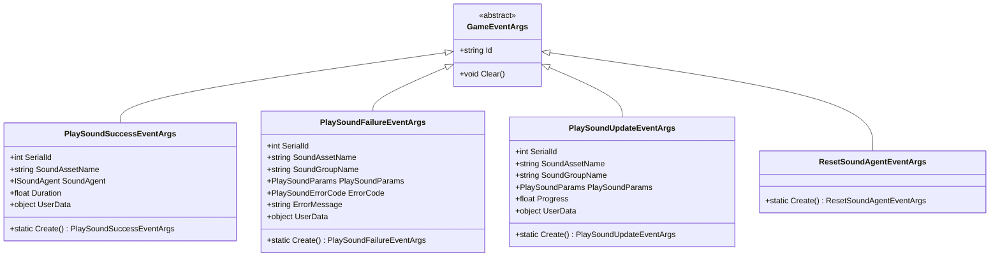
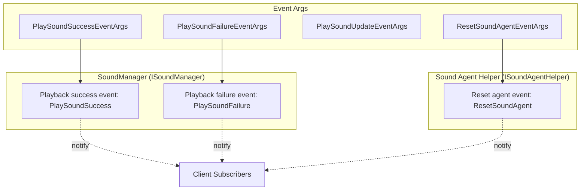
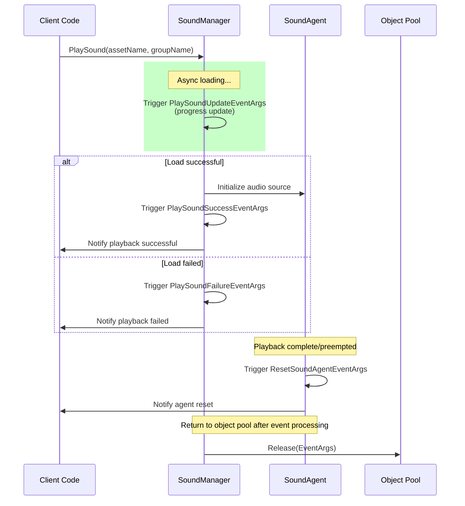

# Event Args

This section details the event parameter classes used in the GameFrameX sound system. These classes are used to pass event data during sound playback, enabling external components to respond to state changes such as playback success, failure, update, and sound agent reset.

## Overview

The GameFrameX sound system uses an event-driven architecture. When sound playback state changes, the system throws corresponding events with detailed event parameters. All event parameter classes inherit from the `GameFrameX.Event.Runtime.GameEventArgs` base class, providing a unified object pool management mechanism to optimize memory usage.

The main functions of event parameters in the system include:

- **State notification**: Notify subscribers of sound playback results (success or failure)
- **Progress tracking**: Provide async loading progress information for UI display
- **Error handling**: Carry error codes and error messages for easier problem diagnosis
- **Agent management**: Notify that sound agents need to be reset for resource reuse

## Event Parameter Class System

The GameFrameX sound system defines four core event parameter classes, corresponding to different sound system state changes.



### Event Flow and Component Relationships



## Core Event Parameter Details

### PlaySoundSuccessEventArgs

`PlaySoundSuccessEventArgs` is triggered when a sound successfully starts playing, containing complete result information of the playback operation.

```csharp
public sealed class PlaySoundSuccessEventArgs : GameEventArgs
{
    /// <summary>
    /// Gets the serial number of the sound.
    /// </summary>
    public int SerialId { get; private set; }

    /// <summary>
    /// Gets the sound resource name.
    /// </summary>
    public string SoundAssetName { get; private set; }

    /// <summary>
    /// Gets the sound agent used for playback.
    /// </summary>
    public ISoundAgent SoundAgent { get; private set; }

    /// <summary>
    /// Gets the loading duration.
    /// </summary>
    public float Duration { get; private set; }

    /// <summary>
    /// Gets the user-defined data.
    /// </summary>
    public object UserData { get; private set; }

    public static PlaySoundSuccessEventArgs Create(int serialId, string soundAssetName,
        ISoundAgent soundAgent, float duration, object userData)
    {
        // Get instance from object pool and initialize
    }
}
```
> Source: [PlaySoundSuccessEventArgs.cs](https://github.com/GameFrameX/com.gameframex.unity.sound/blob/main/Runtime/EventArgs/PlaySoundSuccessEventArgs.cs#L41-L98)

**Usage scenarios**: Subscribe to this event when you need to know whether a sound played successfully, get the SoundAgent agent instance used for controlling playback, or record loading time.

---

### PlaySoundFailureEventArgs

`PlaySoundFailureEventArgs` is triggered when sound playback fails, carrying detailed error information for problem diagnosis.

```csharp
public sealed class PlaySoundFailureEventArgs : GameEventArgs
{
    /// <summary>
    /// Gets the serial number of the sound.
    /// </summary>
    public int SerialId { get; private set; }

    /// <summary>
    /// Gets the sound resource name.
    /// </summary>
    public string SoundAssetName { get; private set; }

    /// <summary>
    /// Gets the sound group name.
    /// </summary>
    public string SoundGroupName { get; private set; }

    /// <summary>
    /// Gets the playback parameters.
    /// </summary>
    public PlaySoundParams PlaySoundParams { get; private set; }

    /// <summary>
    /// Gets the error code.
    /// </summary>
    public PlaySoundErrorCode ErrorCode { get; private set; }

    /// <summary>
    /// Gets the error message.
    /// </summary>
    public string ErrorMessage { get; private set; }

    /// <summary>
    /// Gets the user-defined data.
    /// </summary>
    public object UserData { get; private set; }

    public static PlaySoundFailureEventArgs Create(int serialId, string soundAssetName,
        string soundGroupName, PlaySoundParams playSoundParams, PlaySoundErrorCode errorCode,
        string errorMessage, object userData)
    {
        // Get instance from object pool and initialize
    }
}
```
> Source: [PlaySoundFailureEventArgs.cs](https://github.com/GameFrameX/com.gameframex.unity.sound/blob/main/Runtime/EventArgs/PlaySoundFailureEventArgs.cs#L41-L115)

**Error Code Enumeration (PlaySoundErrorCode)**:

| Error Code | Description |
|------------|-------------|
| `Unknown` | Unknown error |
| `SoundGroupNotExist` | Sound group does not exist |
| `SoundGroupHasNoAgent` | Sound group has no sound agents |
| `LoadAssetFailure` | Failed to load resource |
| `IgnoredDueToLowPriority` | Ignored due to low priority |
| `SetSoundAssetFailure` | Failed to set sound resource |

> Source: [PlaySoundErrorCode.cs](https://github.com/GameFrameX/com.gameframex.unity.sound/blob/main/Runtime/Sound/Sound/PlaySoundErrorCode.cs#L38-L69)

---

### PlaySoundUpdateEventArgs

`PlaySoundUpdateEventArgs` is periodically triggered during async loading of sound resources to report loading progress.

```csharp
public sealed class PlaySoundUpdateEventArgs : GameEventArgs
{
    /// <summary>
    /// Gets the serial number of the sound.
    /// </summary>
    public int SerialId { get; private set; }

    /// <summary>
    /// Gets the sound resource name.
    /// </summary>
    public string SoundAssetName { get; private set; }

    /// <summary>
    /// Gets the sound group name.
    /// </summary>
    public string SoundGroupName { get; private set; }

    /// <summary>
    /// Gets the playback parameters.
    /// </summary>
    public PlaySoundParams PlaySoundParams { get; private set; }

    /// <summary>
    /// Gets the loading sound progress.
    /// </summary>
    public float Progress { get; private set; }

    /// <summary>
    /// Gets the user-defined data.
    /// </summary>
    public object UserData { get; private set; }

    public static PlaySoundUpdateEventArgs Create(int serialId, string soundAssetName,
        string soundGroupName, PlaySoundParams playSoundParams, float progress, object userData)
    {
        // Get instance from object pool and initialize
    }
}
```
> Source: [PlaySoundUpdateEventArgs.cs](https://github.com/GameFrameX/com.gameframex.unity.sound/blob/main/Runtime/EventArgs/PlaySoundUpdateEventArgs.cs#L41-L106)

**Usage scenarios**: Display loading progress bar on UI, or other operations that need to know loading progress.

---

### ResetSoundAgentEventArgs

`ResetSoundAgentEventArgs` is a lightweight event parameter, triggered when a sound agent needs to be reset (e.g., playback completed or preempted).

```csharp
public sealed class ResetSoundAgentEventArgs : GameEventArgs
{
    /// <summary>
    /// Initializes a new instance of the ResetSoundAgentEventArgs.
    /// </summary>
    public ResetSoundAgentEventArgs()
    {
    }

    /// <summary>
    /// Creates a reset sound agent event.
    /// </summary>
    public static ResetSoundAgentEventArgs Create()
    {
        ResetSoundAgentEventArgs resetSoundAgentEventArgs = ReferencePool.Acquire<ResetSoundAgentEventArgs>();
        return resetSoundAgentEventArgs;
    }

    /// <summary>
    /// Clears the reset sound agent event.
    /// </summary>
    public override void Clear()
    {
    }

    public static readonly string EventId = typeof(ResetSoundAgentEventArgs).FullName;

    public override string Id => EventId;
}
```
> Source: [ResetSoundAgentEventArgs.cs](https://github.com/GameFrameX/com.gameframex.unity.sound/blob/main/Runtime/EventArgs/ResetSoundAgentEventArgs.cs#L41-L76)

**Usage scenarios**: Listen to sound agent reset state for resource cleanup or state synchronization.

---

## Event Subscription and Usage Examples

### Subscribe to Playback Success Event

```csharp
// Get sound manager instance
var soundManager = GameEntry.GetManager<ISoundManager>();

// Subscribe to playback success event
soundManager.PlaySoundSuccess += OnPlaySoundSuccess;

private void OnPlaySoundSuccess(object sender, PlaySoundSuccessEventArgs e)
{
    UnityEngine.Debug.Log($"Sound playback successful: {e.SoundAssetName}, Duration: {e.Duration}");
    // Can control playback via e.SoundAgent, such as pause, stop, etc.
    // e.UserData contains custom data passed during playback
}
```

> Source: [ISoundManager.cs](https://github.com/GameFrameX/com.gameframex.unity.sound/blob/main/Runtime/Interface/ISoundManager.cs#L50-L53)

### Subscribe to Playback Failure Event

```csharp
soundManager.PlaySoundFailure += OnPlaySoundFailure;

private void OnPlaySoundFailure(object sender, PlaySoundFailureEventArgs e)
{
    UnityEngine.Debug.LogError($"Sound playback failed: {e.SoundAssetName}, ErrorCode: {e.ErrorCode}, ErrorMessage: {e.ErrorMessage}");
    // Can perform different handling based on error code
    if (e.ErrorCode == PlaySoundErrorCode.SoundGroupNotExist)
    {
        // Handle case where sound group does not exist
    }
}
```

> Source: [ISoundManager.cs](https://github.com/GameFrameX/com.gameframex.unity.sound/blob/main/Runtime/Interface/ISoundManager.cs#L55-L58)

### Subscribe to Reset Sound Agent Event

```csharp
// Sound agent helper interface
public interface ISoundAgentHelper
{
    /// <summary>
    /// Reset sound agent event.
    /// </summary>
    event EventHandler<ResetSoundAgentEventArgs> ResetSoundAgent;
}
```
> Source: [ISoundAgentHelper.cs](https://github.com/GameFrameX/com.gameframex.unity.sound/blob/main/Runtime/Interface/ISoundAgentHelper.cs#L102-L105)

---

## Object Pool Mechanism

All event parameter classes use the object pool pattern for management, which is the memory optimization strategy of the GameFrameX framework:

1. **Create**: Use static `Create()` method to get instances from object pool
2. **Use**: Fill event properties
3. **Release**: After event processing is complete, the framework automatically calls `ReferencePool.Release()` to return to object pool
4. **Reset**: When returned, call `Clear()` method to reset all properties to default values

This design avoids frequent object allocation and garbage collection, improving performance, especially in scenarios where events are frequently triggered.

```csharp
// Event parameter creation example
PlaySoundSuccessEventArgs args = PlaySoundSuccessEventArgs.Create(
    serialId: 1,
    soundAssetName: "bgm_music",
    soundAgent: soundAgent,
    duration: 180.5f,
    userData: null
);

// Trigger event
soundManager.PlaySoundSuccess?.Invoke(this, args);

// Return to object pool
ReferencePool.Release(args);
```

---

## Event Trigger Timeline



---

## Related Links

- [Interface Definition](./5-api-reference.1-interfaces) - ISoundManager and ISoundAgentHelper interface detailed definitions
- [Playback Parameters](./5-api-reference.2-play-sound-params) - PlaySoundParams parameter configuration description
- [SoundManager](./4-core-concepts.1-sound-manager) - SoundManager core concepts and implementation
- [SoundAgent](./4-core-concepts.3-sound-agent) - SoundAgent component details