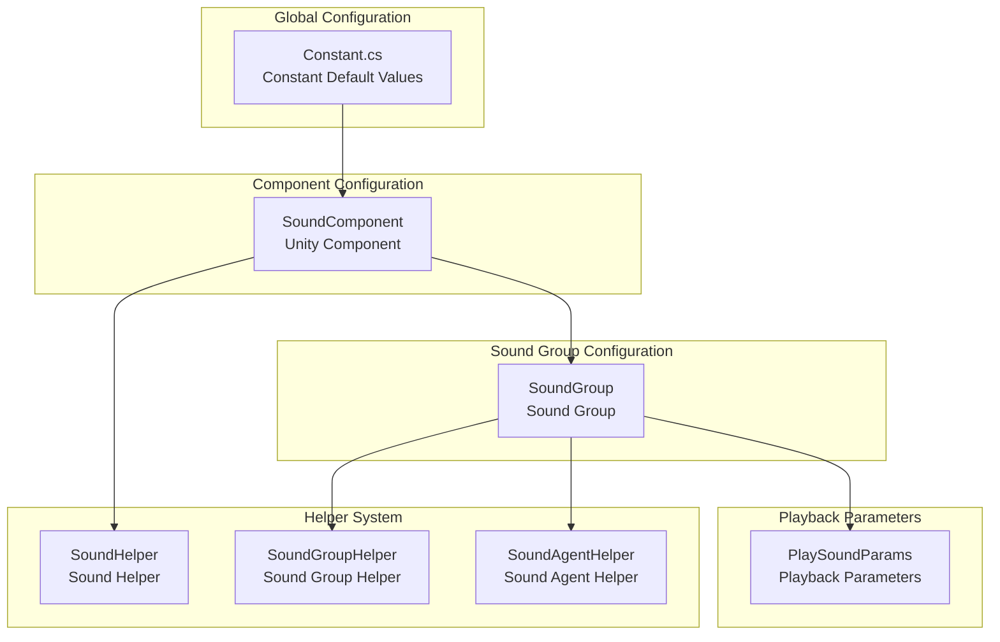
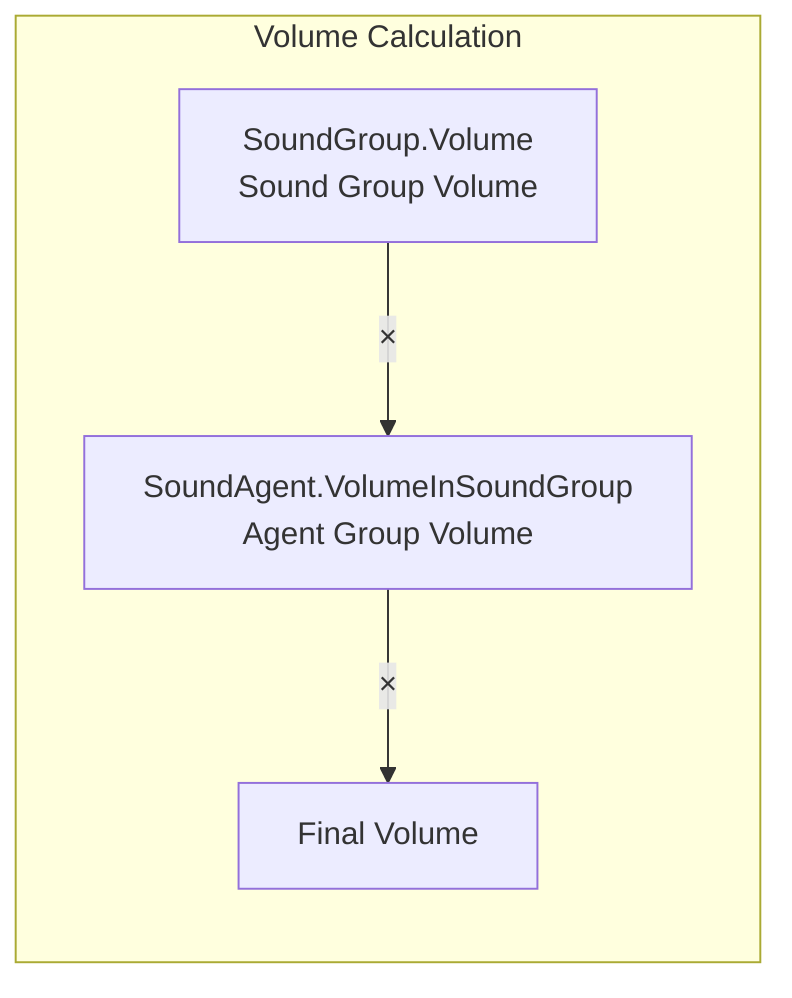

# Configuration Guide

This document provides detailed information about the GameFrameX Sound component configuration system, covering all configurable options and their default values.

## Overview

The GameFrameX Sound component uses a layered configuration architecture, from global default values to individual sound playback parameters, forming a complete configuration system. This design allows developers to set sound properties at different levels, either setting global defaults or overriding individual sound playback behavior when needed.

The configuration system mainly includes the following levels:

1. **Constant Default Values** - System-level global default values
2. **Sound Group Configuration** - Sound group's volume, mute, and same-priority replacement strategy
3. **Playback Parameter Configuration** - Individual sound's playback parameters
4. **Helper Configuration** - Extensible helper system

## Configuration Architecture



### Configuration Flow Description

When the system initializes, it first loads the constant default values from `Constant.cs` as the baseline for all sounds. Then when `SoundComponent` starts in the Unity scene, it creates sound groups based on the Inspector panel settings. Each sound group can independently configure volume, mute state, and agent count. When playing a sound, you can override the default playback parameters through `PlaySoundParams`.

## Constant Default Values

Constants are defined in the `Runtime/Sound/Sound/Constant.cs` file, and these values are the foundational defaults for the entire system.

> Source: [Constant.cs](https://github.com/GameFrameX/com.gameframex.unity.sound/blob/main/Runtime/Sound/Sound/Constant.cs#L38-L99)

| Constant | Type | Default | Description |
|----------|------|---------|-------------|
| DefaultTime | float | 0f | Playback position (seconds) |
| DefaultMute | bool | false | Default mute state |
| DefaultLoop | bool | false | Default loop playback |
| DefaultPriority | int | 0 | Sound loading priority |
| DefaultVolume | float | 1f | Default volume (0.0-1.0) |
| DefaultFadeInSeconds | float | 0f | Fade in time (seconds) |
| DefaultFadeOutSeconds | float | 0f | Fade out time (seconds) |
| DefaultPitch | float | 1f | Pitch (0.5-2.0) |
| DefaultPanStereo | float | 0f | Stereo pan (-1.0 to 1.0) |
| DefaultSpatialBlend | float | 0f | Spatial blend amount (0.0 to 1.0) |
| DefaultMaxDistance | float | 100f | Maximum distance |
| DefaultDopplerLevel | float | 1f | Doppler level |

## Sound Group Configuration

Sound groups (SoundGroup) are used to manage shared settings for a group of related sounds. Each sound group can independently control volume, mute state, and sound agent count.

### Sound Group Configuration in SoundComponent

In the Unity Editor, configure sound groups through the `SoundComponent` component's Inspector panel:

> Source: [SoundComponent.SoundGroup.cs](https://github.com/GameFrameX/com.gameframex.unity.sound/blob/main/Runtime/Sound/SoundComponent.SoundGroup.cs#L45-L111)

```csharp
[Serializable]
private sealed class SoundGroup
{
    [SerializeField] private string m_Name = null;
    [SerializeField] private bool m_AvoidBeingReplacedBySamePriority = false;
    [SerializeField] private bool m_Mute = false;
    [SerializeField, Range(0f, 1f)] private float m_Volume = 1f;
    [SerializeField] private int m_AgentHelperCount = 1;
}
```

### Sound Group Parameter Description

| Parameter | Type | Default | Description |
|-----------|------|---------|-------------|
| Name | string | - | Sound group name, used for identification and retrieval |
| AvoidBeingReplacedBySamePriority | bool | false | Whether to avoid being replaced by sounds of the same priority |
| Mute | bool | false | Whether the sound group is muted |
| Volume | float | 1f | Sound group volume (0.0-1.0) |
| AgentHelperCount | int | 1 | Number of sound agent helpers, determining the maximum number of simultaneous sounds |

### Runtime Dynamic Configuration

You can dynamically modify sound group configuration at runtime through the `ISoundGroup` interface:

> Source: [ISoundGroup.cs](https://github.com/GameFrameX/com.gameframex.unity.sound/blob/main/Runtime/Interface/ISoundGroup.cs#L38-L87)

```csharp
public interface ISoundGroup
{
    string Name { get; }
    int SoundAgentCount { get; }
    bool AvoidBeingReplacedBySamePriority { get; set; }
    bool Mute { get; set; }
    float Volume { get; set; }
    ISoundHelper Helper { get; }
}
```

### Configuration Example: Creating Sound Groups

```csharp
// Add sound groups through SoundComponent
var soundComponent = GameEntry.GetComponent<SoundComponent>();
soundComponent.AddSoundGroup("BackgroundMusic", 1);  // Name and agent count
soundComponent.AddSoundGroup("SoundEffects", 5);      // Support 5 simultaneous effects

// Add more detailed sound group configuration through SoundManager
soundComponent.AddSoundGroup(
    "Voice",                    // Sound group name
    true,                      // Avoid same priority replacement
    false,                     // Not muted
    0.8f,                      // Volume 80%
    3                          // 3 agents
);

// Get sound group and dynamically adjust
var soundGroup = soundComponent.GetSoundGroup("BackgroundMusic");
soundGroup.Volume = 0.5f;  // Adjust volume
soundGroup.Mute = true;    // Mute
```

## Playback Parameter Configuration

The `PlaySoundParams` class is used to configure playback parameters for individual sounds. These parameters are passed as optional parameters when calling the `PlaySound` method.

> Source: [PlaySoundParams.cs](https://github.com/GameFrameX/com.gameframex.unity.sound/blob/main/Runtime/Sound/Sound/PlaySoundParams.cs#L40-L258)

### PlaySoundParams Properties

| Property | Type | Default | Description |
|----------|------|---------|-------------|
| Time | float | 0f | Playback position, start playback from specified time |
| MuteInSoundGroup | bool | false | Whether muted within the sound group |
| Loop | bool | false | Whether to loop playback |
| Priority | int | 0 | Sound priority (higher number = higher priority) |
| VolumeInSoundGroup | float | 1f | Volume coefficient within the sound group |
| FadeInSeconds | float | 0f | Fade in time (seconds) |
| Pitch | float | 1f | Pitch (0.5-2.0, 1 is normal) |
| PanStereo | float | 0f | Stereo pan (-1 is left channel, 1 is right channel) |
| SpatialBlend | float | 0f | Spatial blend (0 is 2D, 1 is 3D) |
| MaxDistance | float | 100f | Maximum distance for 3D sound |
| DopplerLevel | float | 1f | Doppler effect level |

### Using PlaySoundParams

```csharp
// Create playback parameters
var playParams = PlaySoundParams.Create();

// Configure parameters
playParams.Loop = true;                    // Loop playback
playParams.VolumeInSoundGroup = 0.8f;      // 80% volume
playParams.Pitch = 1.2f;                   // Slightly faster
playParams.FadeInSeconds = 0.5f;           // 0.5 second fade in
playParams.Priority = 100;                  // High priority

// Pass parameters when playing sound
await soundComponent.PlaySound("bgm_music", "BackgroundMusic", playParams);

// Release after use (if reference counting is enabled)
if (playParams.Referenced)
{
    ReferencePool.Release(playParams);
}
```

## SoundComponent Configuration

`SoundComponent` is the main component used to initialize the sound system in Unity scenes. Configure it through the Inspector panel or code.

> Source: [SoundComponent.cs](https://github.com/GameFrameX/com.gameframex.unity.sound/blob/main/Runtime/Sound/SoundComponent.cs#L46-L75)

### Inspector Configurable Properties

| Property | Type | Default | Description |
|----------|------|---------|-------------|
| Instance Root | Transform | null | Root node for sound instances |
| Audio Mixer | AudioMixer | null | Unity audio mixer |
| Sound Helper Type Name | string | "GameFrameX.Sound.Runtime.DefaultSoundHelper" | Sound helper type |
| Custom Sound Helper | SoundHelperBase | null | Custom sound helper instance |
| Sound Group Helper Type Name | string | "GameFrameX.Sound.Runtime.DefaultSoundGroupHelper" | Sound group helper type |
| Custom Sound Group Helper | SoundGroupHelperBase | null | Custom sound group helper instance |
| Sound Agent Helper Type Name | string | "GameFrameX.Sound.Runtime.DefaultSoundAgentHelper" | Sound agent helper type |
| Custom Sound Agent Helper | SoundAgentHelperBase | null | Custom sound agent helper instance |
| Sound Groups | SoundGroup[] | null | Sound group array |

### Code Configuration for SoundComponent

```csharp
// Create SoundComponent and configure
var soundGameObject = new GameObject("Sound");
var soundComponent = soundGameObject.AddComponent<SoundComponent>();

// Configure helper types through code
// Note: These are usually configured in the Inspector
// soundComponent.m_SoundHelperTypeName = "MyCustomSoundHelper";
// soundComponent.m_SoundGroupHelperTypeName = "MyCustomSoundGroupHelper";
// soundComponent.m_SoundAgentHelperTypeName = "MyCustomSoundAgentHelper";

// Configure AudioMixer
// soundComponent.m_AudioMixer = myAudioMixer;

// Configure instance root
// soundComponent.m_InstanceRoot = myInstanceRoot;
```

## Helper System Configuration

The GameFrameX Sound uses the Helper pattern to achieve extensibility. Developers can create custom helpers by inheriting from base classes.

### Helper Types

| Helper | Base Class | Purpose |
|--------|-----------|---------|
| SoundHelper | SoundHelperBase | Manages sound resource loading and release |
| SoundGroupHelper | SoundGroupHelperBase | Manages sound group audio mixing |
| SoundAgentHelper | SoundAgentHelperBase | Controls individual sound playback behavior |

> Source: [SoundHelperBase.cs](https://github.com/GameFrameX/com.gameframex.unity.sound/blob/main/Runtime/Sound/SoundHelperBase.cs#L41-L48)

### Custom Helper Example

```csharp
// Custom sound agent helper
public class MyCustomSoundAgentHelper : SoundAgentHelperBase
{
    private AudioSource _audioSource;

    public override bool IsPlaying => _audioSource?.isPlaying ?? false;
    public override float Length => _audioSource?.clip?.length ?? 0;
    public override float Time { get => _audioSource?.time ?? 0; set { if (_audioSource) _audioSource.time = value; } }
    public override bool Mute { get => _audioSource?.mute ?? false; set { if (_audioSource) _audioSource.mute = value; } }
    public override bool Loop { get => _audioSource?.loop ?? false; set { if (_audioSource) _audioSource.loop = value; } }
    public override int Priority { get => _audioSource?.priority ?? 128; set { if (_audioSource) _audioSource.priority = value; } }
    public override float Volume { get => _audioSource?.volume ?? 1f; set { if (_audioSource) _audioSource.volume = value; } }
    public override float Pitch { get => _audioSource?.pitch ?? 1f; set { if (_audioSource) _audioSource.pitch = value; } }
    public override float PanStereo { get => _audioSource?.panStereo ?? 0; set { if (_audioSource) _audioSource.panStereo = value; } }
    public override float SpatialBlend { get => _audioSource?.spatialBlend ?? 0; set { if (_audioSource) _audioSource.spatialBlend = value; } }
    public override float MaxDistance { get => _audioSource?.maxDistance ?? 100f; set { if (_audioSource) _audioSource.maxDistance = value; } }
    public override float DopplerLevel { get => _audioSource?.dopplerLevel ?? 1f; set { if (_audioSource) _audioSource.dopplerLevel = value; } }
    public override AudioMixerGroup AudioMixerGroup { get; set; }

    public override event EventHandler<ResetSoundAgentEventArgs> ResetSoundAgent;

    public override void Play(float fadeInSeconds)
    {
        _audioSource.Play();
    }

    public override void Stop(float fadeOutSeconds)
    {
        _audioSource.Stop();
    }

    public override void Pause(float fadeOutSeconds)
    {
        _audioSource.Pause();
    }

    public override void Resume(float fadeInSeconds)
    {
        _audioSource.UnPause();
    }

    public override void Reset()
    {
        if (_audioSource)
        {
            _audioSource.clip = null;
            _audioSource.Stop();
        }
    }

    public override bool SetSoundAsset(object soundAsset)
    {
        if (soundAsset is AudioClip clip)
        {
            _audioSource.clip = clip;
            return true;
        }
        return false;
    }

    public override void SetBindingEntity(Entity.Runtime.Entity bindingEntity)
    {
        // Implement 3D sound binding logic
    }

    public override void SetWorldPosition(Vector3 worldPosition)
    {
        if (_audioSource)
        {
            _audioSource.transform.position = worldPosition;
        }
    }

    private void Awake()
    {
        _audioSource = gameObject.AddComponent<AudioSource>();
        _audioSource.spatialBlend = 1f; // Default to 3D sound
    }
}
```

## Volume Calculation Hierarchy

The final playback volume is determined by multiplying multiple levels:



Calculation formula: `Final Volume = SoundGroup.Volume × SoundAgent.VolumeInSoundGroup`

For example:
- Sound group volume = 0.8 (80%)
- Sound playback volume = 0.5 (50%)
- Final volume = 0.8 × 0.5 = 0.4 (40%)

## Complete Configuration Example

The following is a complete sound system configuration example:

```csharp
// 1. Initialize SoundComponent
var soundGameObject = new GameObject("SoundSystem");
var soundComponent = soundGameObject.AddComponent<SoundComponent>();

// 2. Configure sound groups (automatically handled in Start, showing equivalent code)
 // Add sound groups through code
soundComponent.AddSoundGroup("Music", 1);                    // Background music group, 1 agent
soundComponent.AddSoundGroup("SoundEffects", 10);                   // Sound effects group, 10 agents
soundComponent.AddSoundGroup("Voice", 3, true, false, 0.8f, 3); // Voice group, 3 agents, 80% volume

// 3. Play different types of sounds
// Play background music - looping
var bgmParams = PlaySoundParams.Create(true);
bgmParams.VolumeInSoundGroup = 0.6f;
bgmParams.FadeInSeconds = 1.0f;
await soundComponent.PlaySound("assets/audio/bgm_title", "Music", bgmParams);

// Play sound effects - one-time playback
var sfxParams = PlaySoundParams.Create(false);
sfxParams.VolumeInSoundGroup = 1.0f;
sfxParams.Priority = 100;  // High priority
await soundComponent.PlaySound("assets/audio/sfx_click", "SoundEffects", sfxParams);

// Play 3D sound effects
var posParams = PlaySoundParams.Create(false);
posParams.SpatialBlend = 1.0f;  // 3D sound
posParams.MaxDistance = 50f;
await soundComponent.PlaySound("assets/audio/sfx_footstep", "SoundEffects", posParams, Vector3.one * 10);

// 4. Runtime control
var musicGroup = soundComponent.GetSoundGroup("Music");
musicGroup.Volume = 0.5f;  // Adjust background music volume
musicGroup.Mute = false;   // Unmute

// 5. Stop sounds
soundComponent.StopAllLoadedSounds(0.5f);  // 0.5 second fade out
```

## Related Links

- [Core Concepts - Sound Manager](./4-core-concepts.1-sound-manager)
- [Core Concepts - Sound Group](./4-core-concepts.2-sound-group)
- [Core Concepts - Sound Agent](./4-core-concepts.3-sound-agent)
- [API Reference - Interface Definition](./5-api-reference.1-interfaces)
- [API Reference - Playback Parameters](./5-api-reference.2-play-sound-params)
- [Extending Guide](./7-extending)