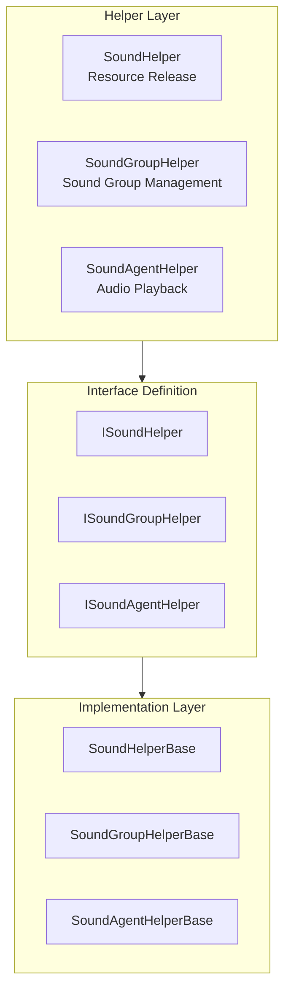

# Extending Guide

This document provides detailed information on how to extend the GameFrameX sound system, including custom sound helpers, sound group, and sound agent implementation methods.

## Overview

The GameFrameX sound system uses a modular design, providing multiple extension points to meet the needs of different projects. By extending these interfaces and base classes, developers can:

- Implement custom sound resource loading and release logic
- Create special sound group management methods
- Replace the default audio playback implementation (such as using FMOD, CRIWARE, and other third-party audio middleware)
- Dynamically add custom sound groups and sound agents

## Extension Point Architecture

The system provides three main extension layers, corresponding to different components of the sound system:



### Extension Point Description

| Extension Point | Interface | Base Class | Purpose |
|----------------|-----------|------------|---------|
| Sound Helper | ISoundHelper | SoundHelperBase | Custom resource release logic |
| Sound Group Helper | ISoundGroupHelper | SoundGroupHelperBase | Sound group management and mixing |
| Sound Agent Helper | ISoundAgentHelper | SoundAgentHelperBase | Audio playback implementation (main extension point) |

## Custom Sound Helper

The sound helper (SoundHelper) is responsible for sound resource release logic. The system provides a default implementation based on the Unity resource system.

### Interface Definition

> Source: [ISoundHelper.cs](https://github.com/GameFrameX/com.gameframex.unity.sound/blob/main/Runtime/Interface/ISoundHelper.cs#L35-L46)

```csharp
namespace GameFrameX.Sound.Runtime
{
    public interface ISoundHelper
    {
        void ReleaseSoundAsset(object soundAsset);
    }
}
```

### Base Class Implementation

> Source: [SoundHelperBase.cs](https://github.com/GameFrameX/com.gameframex.unity.sound/blob/main/Runtime/Sound/SoundHelperBase.cs#L38-L49)

```csharp
public abstract class SoundHelperBase : MonoBehaviour, ISoundHelper
{
    public abstract void ReleaseSoundAsset(object soundAsset);
}
```

### Implementation Example

The following example shows how to customize sound resource release logic:

```csharp
using GameFrameX.Sound.Runtime;
using UnityEngine;

public class CustomSoundHelper : SoundHelperBase
{
    public override void ReleaseSoundAsset(object soundAsset)
    {
        if (soundAsset == null)
        {
            return;
        }

        // Custom resource release logic
        // For example: use object pool to manage AudioClip
        AudioClip clip = soundAsset as AudioClip;
        if (clip != null)
        {
            // Example: delay release or put into object pool
            Resources.UnloadAsset(clip);
        }
    }
}
```

## Custom Sound Group Helper

The sound group helper (SoundGroupHelper) is used to manage sound groups, including configuration of the mixer group (AudioMixerGroup).

### Interface Definition

> Source: [ISoundGroupHelper.cs](https://github.com/GameFrameX/com.gameframex.unity.sound/blob/main/Runtime/Interface/ISoundGroupHelper.cs#L35-L41)

```csharp
namespace GameFrameX.Sound.Runtime
{
    public interface ISoundGroupHelper
    {
    }
}
```

### Base Class Implementation

> Source: [SoundGroupHelperBase.cs](https://github.com/GameFrameX/com.gameframex.unity.sound/blob/main/Runtime/Sound/SoundGroupHelperBase.cs#L38-L55)

```csharp
public abstract class SoundGroupHelperBase : MonoBehaviour, ISoundGroupHelper
{
    [SerializeField] private AudioMixerGroup m_AudioMixerGroup = null;

    public AudioMixerGroup AudioMixerGroup
    {
        get { return m_AudioMixerGroup; }
        set { m_AudioMixerGroup = value; }
    }
}
```

### Implementation Example

```csharp
using GameFrameX.Sound.Runtime;
using UnityEngine;
using UnityEngine.Audio;

public class CustomSoundGroupHelper : SoundGroupHelperBase
{
    [SerializeField] private float m_CustomVolume = 1.0f;

    protected override void Awake()
    {
        base.Awake();

        // Custom initialization logic
        if (AudioMixerGroup != null)
        {
            Debug.Log($"SoundGroup initialized with mixer: {AudioMixerGroup.name}");
        }
    }

    public float CustomVolume
    {
        get { return m_CustomVolume; }
        set { m_CustomVolume = value; }
    }
}
```

## Custom Sound Agent Helper (Main Extension Point)

The sound agent helper (SoundAgentHelper) is the core extension point of the system, responsible for the actual audio playback implementation. By customizing SoundAgentHelper, you can:

- Replace Unity AudioSource implementation
- Integrate third-party audio middleware (FMOD, CRIWARE, Wwise, etc.)
- Implement special audio processing effects
- Add custom spatial audio calculations

### Interface Definition

> Source: [ISoundAgentHelper.cs](https://github.com/GameFrameX/com.gameframex.unity.sound/blob/main/Runtime/Interface/ISoundAgentHelper.cs#L35-L143)

```csharp
namespace GameFrameX.Sound.Runtime
{
    public interface ISoundAgentHelper
    {
        // Properties
        bool IsPlaying { get; }
        float Length { get; }
        float Time { get; set; }
        bool Mute { get; set; }
        bool Loop { get; set; }
        int Priority { get; set; }
        float Volume { get; set; }
        float Pitch { get; set; }
        float PanStereo { get; set; }
        float SpatialBlend { get; set; }
        float MaxDistance { get; set; }
        float DopplerLevel { get; set; }

        // Events
        event EventHandler<ResetSoundAgentEventArgs> ResetSoundAgent;

        // Methods
        void Play(float fadeInSeconds);
        void Stop(float fadeOutSeconds);
        void Pause(float fadeOutSeconds);
        void Resume(float fadeInSeconds);
        void Reset();
        bool SetSoundAsset(object soundAsset);
    }
}
```

### Base Class Definition

> Source: [SoundAgentHelperBase.cs](https://github.com/GameFrameX/com.gameframex.unity.sound/blob/main/Runtime/Sound/SoundAgentHelperBase.cs#L38-L163)

The base class inherits from `MonoBehaviour`, and all custom implementations should inherit from this class.

### Implementation Example: Using Third-Party Audio Middleware

The following example shows how to create a SoundAgentHelper using a custom audio system:

```csharp
using GameFrameX.Sound.Runtime;
using GameFrameX.Entity.Runtime;
using GameFrameX.Runtime;
using UnityEngine;
using UnityEngine.Audio;
using System;

public class CustomAudioSourceAgentHelper : SoundAgentHelperBase
{
    private AudioSource m_AudioSource;
    private bool m_IsPlaying;
    private float m_CurrentVolume = 1.0f;
    private EventHandler<ResetSoundAgentEventArgs> m_ResetEventHandler;

    public override bool IsPlaying => m_IsPlaying;

    public override float Length => m_AudioSource?.clip?.length ?? 0f;

    public override float Time
    {
        get => m_AudioSource.time;
        set => m_AudioSource.time = value;
    }

    public override bool Mute
    {
        get => m_AudioSource.mute;
        set => m_AudioSource.mute = value;
    }

    public override bool Loop
    {
        get => m_AudioSource.loop;
        set => m_AudioSource.loop = value;
    }

    public override int Priority
    {
        get => 128 - m_AudioSource.priority;
        set => m_AudioSource.priority = 128 - value;
    }

    public override float Volume
    {
        get => m_CurrentVolume;
        set
        {
            m_CurrentVolume = value;
            m_AudioSource.volume = value;
        }
    }

    public override float Pitch
    {
        get => m_AudioSource.pitch;
        set => m_AudioSource.pitch = value;
    }

    public override float PanStereo
    {
        get => m_AudioSource.panStereo;
        set => m_AudioSource.panStereo = value;
    }

    public override float SpatialBlend
    {
        get => m_AudioSource.spatialBlend;
        set => m_AudioSource.spatialBlend = value;
    }

    public override float MaxDistance
    {
        get => m_AudioSource.maxDistance;
        set => m_AudioSource.maxDistance = value;
    }

    public override float DopplerLevel
    {
        get => m_AudioSource.dopplerLevel;
        set => m_AudioSource.dopplerLevel = value;
    }

    public override AudioMixerGroup AudioMixerGroup
    {
        get => m_AudioSource.outputAudioMixerGroup;
        set => m_AudioSource.outputAudioMixerGroup = value;
    }

    public override event EventHandler<ResetSoundAgentEventArgs> ResetSoundAgent
    {
        add => m_ResetEventHandler += value;
        remove => m_ResetEventHandler -= value;
    }

    public override void Play(float fadeInSeconds)
    {
        m_IsPlaying = true;
        m_AudioSource.Play();
        // You can add fade-in logic here
    }

    public override void Stop(float fadeOutSeconds)
    {
        m_IsPlaying = false;
        m_AudioSource.Stop();
    }

    public override void Pause(float fadeOutSeconds)
    {
        m_IsPlaying = false;
        m_AudioSource.Pause();
    }

    public override void Resume(float fadeInSeconds)
    {
        m_IsPlaying = true;
        m_AudioSource.UnPause();
    }

    public override void Reset()
    {
        m_IsPlaying = false;
        m_AudioSource.clip = null;
    }

    public override bool SetSoundAsset(object soundAsset)
    {
        if (soundAsset is AudioClip clip)
        {
            m_AudioSource.clip = clip;
            return true;
        }
        return false;
    }

    public override void SetBindingEntity(Entity bindingEntity)
    {
        // Implement entity binding logic
    }

    public override void SetWorldPosition(Vector3 worldPosition)
    {
        transform.position = worldPosition;
    }

    private void Awake()
    {
        m_AudioSource = gameObject.GetOrAddComponent<AudioSource>();
        m_AudioSource.playOnAwake = false;
    }
}
```

## Configuring Custom Extensions

There are three ways to configure custom extensions in SoundComponent:

### Method 1: Through Inspector (Recommended)

In the Unity Editor, select the GameObject with SoundComponent attached, and configure in the Inspector panel:

```csharp
// SoundComponent field descriptions
[SerializeField] private string m_SoundHelperTypeName = "GameFrameX.Sound.Runtime.DefaultSoundHelper";
[SerializeField] private SoundHelperBase m_CustomSoundHelper = null;

[SerializeField] private string m_SoundGroupHelperTypeName = "GameFrameX.Sound.Runtime.DefaultSoundGroupHelper";
[SerializeField] private SoundGroupHelperBase m_CustomSoundGroupHelper = null;

[SerializeField] private string m_SoundAgentHelperTypeName = "GameFrameX.Sound.Runtime.DefaultSoundAgentHelper";
[SerializeField] private SoundAgentHelperBase m_CustomSoundAgentHelper = null;
```

### Method 2: Dynamic Addition via Code

Dynamically add custom sound groups and agents at runtime:

```csharp
// Get SoundComponent
var soundComponent = GameEntry.GetComponent<SoundComponent>();

// Add custom sound group
soundComponent.AddSoundGroup("CustomGroup", 4);

// Get custom sound group
var customGroup = soundComponent.GetSoundGroup("CustomGroup");
```

### Method 3: Inherit SoundComponent

Create a subclass that inherits from SoundComponent with custom initialization logic:

```csharp
using GameFrameX.Sound.Runtime;
using UnityEngine;

public class CustomSoundComponent : SoundComponent
{
    protected override void Awake()
    {
        // Pre-initialization custom logic
        base.Awake();
        // Post-initialization custom logic
    }

    private void Start()
    {
        // Dynamically add custom sound groups
        AddSoundGroup("Music", 2);
        AddSoundGroup("SFX", 8);
        AddSoundGroup("Voice", 4);
    }
}
```

## Dynamic Sound Group Management

### Adding Sound Groups

```csharp
var soundComponent = GameEntry.GetComponent<SoundComponent>();

// Basic addition
soundComponent.AddSoundGroup("Music", 4);

// Full parameter addition
soundComponent.AddSoundGroup(
    "Music",                      // Sound group name
    false,                        // Avoid same priority replacement
    false,                        // Mute
    1.0f,                         // Volume
    4                             // Agent count
);
```

### Accessing Sound Groups

```csharp
var soundComponent = GameEntry.GetComponent<SoundComponent>();

// Get specified sound group
var musicGroup = soundComponent.GetSoundGroup("Music");

// Get all sound groups
var allGroups = soundComponent.GetAllSoundGroups();

// Check if sound group exists
if (soundComponent.HasSoundGroup("Music"))
{
    // Handle logic
}
```

### Controlling Sound Groups

```csharp
var musicGroup = soundComponent.GetSoundGroup("Music") as ISoundGroup;

// Set volume
musicGroup.Volume = 0.8f;

// Set mute
musicGroup.Mute = false;

// Stop all loaded sounds
musicGroup.StopAllLoadedSounds();

// Stop all loaded sounds (with fade out)
musicGroup.StopAllLoadedSounds(0.5f);
```

## Playback Parameter Extension

You can customize playback behavior through PlaySoundParams:

```csharp
using GameFrameX.Sound.Runtime;

// Create playback parameters
var playParams = PlaySoundParams.Create(isLoop: false);

// Configure playback parameters
playParams.Priority = 100;                    // Priority (0-255)
playParams.VolumeInSoundGroup = 1.0f;        // Group volume
playParams.Pitch = 1.0f;                      // Pitch
playParams.PanStereo = 0f;                    // Stereo (-1~1)
playParams.SpatialBlend = 0f;                 // Spatial blend (2D-3D)
playParams.MaxDistance = 50f;                 // Maximum distance
playParams.DopplerLevel = 1f;                 // Doppler level
playParams.FadeInSeconds = 0.3f;             // Fade in time
playParams.Loop = false;                      // Loop playback

// Play sound
int serialId = await soundComponent.PlaySound(
    "Assets/Audio/BGM_Main.mp3",
    "Music",
    playParams
);
```

## Extension Best Practices

### 1. Inherit the Correct Base Class

Always inherit from the base classes provided by the system rather than implementing interfaces directly. Base classes already handle most common logic:

```csharp
// Correct: inherit from base class
public class MySoundAgentHelper : SoundAgentHelperBase { }

// Wrong: implement interface directly
public class MySoundAgentHelper : MonoBehaviour, ISoundAgentHelper { }
```

### 2. Handle Resource References

Correctly handle audio resource lifecycle in custom SoundAgentHelper:

```csharp
public override void Reset()
{
    base.Reset();
    // Clean up audio resource references
    if (m_AudioSource != null)
    {
        m_AudioSource.clip = null;
    }
}
```

### 3. Event Triggering

When sound playback completes or needs to be reset, correctly trigger events:

```csharp
public override void Update()
{
    // Check for playback completion
    if (!IsPlaying && m_AudioSource.clip != null && m_ResetEventHandler != null)
    {
        var eventArgs = ResetSoundAgentEventArgs.Create();
        m_ResetEventHandler(this, eventArgs);
        ReferencePool.Release(eventArgs);
    }
}
```

### 4. Mixer Configuration

Correctly configure AudioMixerGroup to support mixing:

```csharp
public override AudioMixerGroup AudioMixerGroup
{
    get => m_AudioSource.outputAudioMixerGroup;
    set
    {
        m_AudioSource.outputAudioMixerGroup = value;
        // You can add additional mixer configuration logic here
    }
}
```

### 5. Third-Party Middleware Integration

Recommendations when integrating third-party audio middleware like FMOD:

```csharp
public class FmodSoundAgentHelper : SoundAgentHelperBase
{
    private FMOD.Studio.EventInstance m_EventInstance;

    public override bool IsPlaying
    {
        get
        {
            m_EventInstance.getPlaybackState(out var state);
            return state == FMOD.Studio.PLAYBACK_STATE.PLAYING;
        }
    }

    public override float Length
    {
        get
        {
            m_EventInstance.getDescription(out var description);
            description.getLength(out var length);
            return length / 1000f; // Convert to seconds
        }
    }

    public override void Play(float fadeInSeconds)
    {
        m_EventInstance.start();
    }

    public override void Stop(float fadeOutSeconds)
    {
        m_EventInstance.stop(FMOD.Studio.STOP_MODE.ALLOWFADEOUT);
    }

    public override bool SetSoundAsset(object soundAsset)
    {
        // Convert resource path to FMOD event
        string eventPath = soundAsset as string;
        if (!string.IsNullOrEmpty(eventPath))
        {
            FMODUnity.RuntimeManager.StudioSystem.createEvent(eventPath, out m_EventInstance);
            return true;
        }
        return false;
    }
}
```

## Related Links

- [Core Concepts - Sound Manager](./4-core-concepts.1-sound-manager)
- [Core Concepts - Sound Group](./4-core-concepts.2-sound-group)
- [Core Concepts - Sound Agent](./4-core-concepts.3-sound-agent)
- [API Reference - Interface Definition](./5-api-reference.1-interfaces)
- [API Reference - Playback Parameters](./5-api-reference.2-play-sound-params)
- [API Reference - Event Args](./5-api-reference.3-event-args)
- [Configuration Guide](./6-configuration)
- [Getting Started](./3-getting-started)