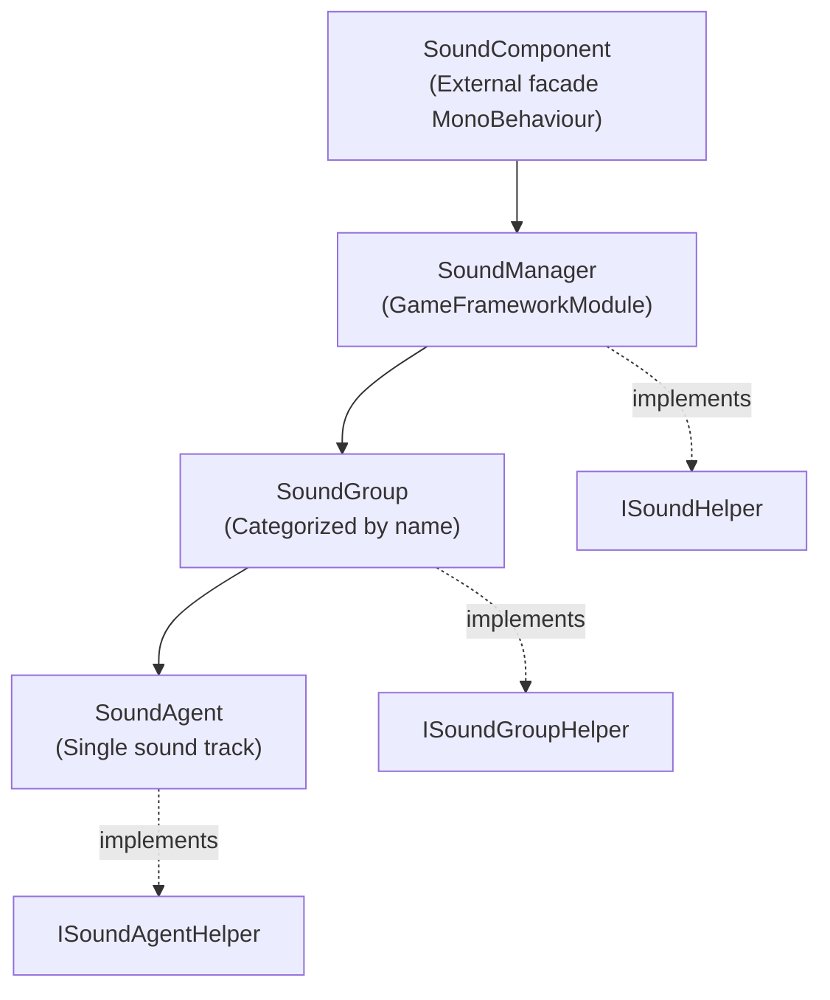

# Architecture Overview: Component / Manager / Group / Agent

The GameFrameX sound module adopts a four-layer hierarchical design: `SoundComponent` serves as the external facade that calls the framework module `SoundManager`; the manager internally categorizes resources by `SoundGroup` (sound groups), and each sound group has several `SoundAgent` (sound agents) mounted under it to actually play audio. Each layer is equipped with a `*Helper` interface for replacing the underlying implementation (e.g., integrating a different audio engine).

## How It Works

The four `*Helper` interfaces (`ISoundHelper` / `ISoundGroupHelper` / `ISoundAgentHelper` / `ISoundHelperBase`) are injection points; their default implementations can be found in [DefaultSoundHelper.cs](https://github.com/GameFrameX/com.gameframex.unity.sound/blob/main/Runtime/Sound/DefaultSoundHelper.cs#L1-L80), [DefaultSoundGroupHelper.cs](https://github.com/GameFrameX/com.gameframex.unity.sound/blob/main/Runtime/Sound/DefaultSoundGroupHelper.cs), and [DefaultSoundAgentHelper.cs](https://github.com/GameFrameX/com.gameframex.unity.sound/blob/main/Runtime/Sound/DefaultSoundAgentHelper.cs).

## Responsibilities of Each Layer

| Layer | Type / File | Responsibilities |
|------|------------|------|
| Component | [SoundComponent](https://github.com/GameFrameX/com.gameframex.unity.sound/blob/main/Runtime/Sound/SoundComponent.cs) inherits `MonoBehaviour` | External facade, receives calls from upper layers (e.g., UI, combat) and forwards them to `SoundManager`; provides APIs such as `PlaySound` / `StopSound` / volume adjustment, sound group registration, etc. |
| Manager | [SoundManager](https://github.com/GameFrameX/com.gameframex.unity.sound/blob/main/Runtime/Sound/Sound/SoundManager.cs) inherits `GameFrameworkModule` | Module core, manages the dictionary of all `SoundGroup`s, and uniformly handles loading, releasing, and success/failure events |
| Group | [SoundGroup](https://github.com/GameFrameX/com.gameframex.unity.sound/blob/main/Runtime/Sound/Sound/SoundManager.SoundGroup.cs) implements [ISoundGroup](https://github.com/GameFrameX/com.gameframex.unity.sound/blob/main/Runtime/Interface/ISoundGroup.cs) | Sound groups divided by name (e.g., BGM, UI, combat), determines how many sound tracks the group can play simultaneously (`SoundAgentCount`) as well as mixing properties |
| Agent | [SoundAgent](https://github.com/GameFrameX/com.gameframex.unity.sound/blob/main/Runtime/Sound/Sound/SoundManager.SoundAgent.cs) implements [ISoundAgent](https://github.com/GameFrameX/com.gameframex.unity.sound/blob/main/Runtime/Interface/ISoundAgent.cs) | Single sound playback agent, maintains playback state, volume, mute, group membership, and other properties |

## Key Call Chain

When `PlaySound` is called, the parameters are passed along this chain:

1. `SoundComponent.PlaySound(soundGroup, soundAssetName, ...)` collects `PlaySoundParams` and serializes them into a `serialId`.
2. `SoundManager.PlaySound(serialId, soundGroupName, ...)` looks up or creates the corresponding group in the `m_SoundGroups` dictionary.
3. The target `SoundGroup` requests/reuses an idle `SoundAgent` through its `Helper` (`ISoundGroupHelper`).
4. `SoundAgent` actually loads the resource (via the injected `IAssetManager`), and once loading completes, actually plays the audio through the `Helper`.
5. Load/play success and failure trigger the `PlaySoundSuccess` / `PlaySoundFailure` events respectively [SoundManager.cs#90-L103](https://github.com/GameFrameX/com.gameframex.unity.sound/blob/main/Runtime/Sound/Sound/SoundManager.cs#L90-L103).

## Interfaces and Extension Points

| Interface | Default Implementation | Replacement Scenarios |
|------|---------|---------|
| [ISoundHelper](https://github.com/GameFrameX/com.gameframex.unity.sound/blob/main/Runtime/Interface/ISoundHelper.cs) | [DefaultSoundHelper.cs](https://github.com/GameFrameX/com.gameframex.unity.sound/blob/main/Runtime/Sound/DefaultSoundHelper.cs) | Replace the audio backend (e.g., FMOD / Wwise) |
| [ISoundGroupHelper](https://github.com/GameFrameX/com.gameframex.unity.sound/blob/main/Runtime/Interface/ISoundGroupHelper.cs) | [DefaultSoundGroupHelper.cs](https://github.com/GameFrameX/com.gameframex.unity.sound/blob/main/Runtime/Sound/DefaultSoundGroupHelper.cs) | Customize group creation and recycling policies |
| [ISoundAgentHelper](https://github.com/GameFrameX/com.gameframex.unity.sound/blob/main/Runtime/Interface/ISoundAgentHelper.cs) | [DefaultSoundAgentHelper.cs](https://github.com/GameFrameX/com.gameframex.unity.sound/blob/main/Runtime/Sound/DefaultSoundAgentHelper.cs) | Customize playback, volume, mute, low-pass filtering, and other behaviors |
| `ISoundManager` | `SoundManager` (implementation) | Generally no need to replace |

In `Awake`, `SoundComponent` retains the default Helper types according to the `[Preserve]` reference list of the `GameFrameXSound` hook [GameFrameXSoundCroppingHelper.cs](https://github.com/GameFrameX/com.gameframex.unity.sound/blob/main/Runtime/GameFrameXSoundCroppingHelper.cs#L1-L36), preventing them from being stripped by code trimming.

## Next Steps

- Integration and initialization steps: see "How to Integrate the Sound Module"
- Playing a set of BGMs and switching between them: see "How to Play and Control Sounds"
- Troubleshooting playback failures, sounds being stripped, and other issues: see "What to Do When Sound Playback Fails"
- API and error code quick reference: see "API Reference"