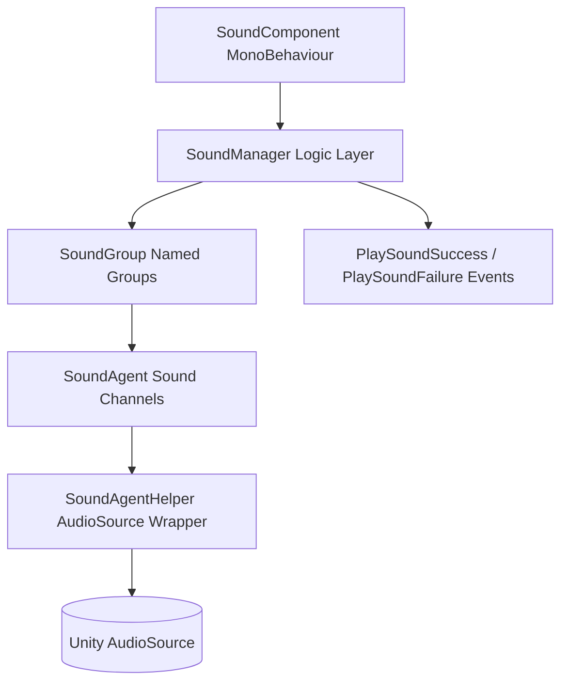

# Sound Module Introduction

GameFrameX Sound is the sound submodule of the GameFrameX framework, providing grouped playback based on Unity AudioSource, spatial audio, priority preemption, and event-driven notification capabilities, allowing games to efficiently manage multiple types of audio resources such as BGM, SFX, and Voice.

## Quick Start

### 1. Installation

Choose any one of the following methods to add `com.gameframex.unity.sound` to your Unity project:

1. Append scopedRegistries and dependencies in `Packages/manifest.json`:

```json
{
  "scopedRegistries": [
    {
      "name": "GameFrameX",
      "url": "https://gameframex.upm.alianblank.uk",
      "scopes": ["com.gameframex"]
    }
  ],
  "dependencies": {
    "com.gameframex.unity.sound": "1.2.0"
  }
}
```

Source: [README.zh-CN.md](https://github.com/GameFrameX/com.gameframex.unity.sound/blob/main/README.zh-CN.md#L38-L58)

2. Add the Git dependency directly:
```json
{
  "dependencies": {
    "com.gameframex.unity.sound": "https://github.com/gameframex/com.gameframex.unity.sound.git"
  }
}
```

Source: [README.zh-CN.md](https://github.com/GameFrameX/com.gameframex.unity.sound/blob/main/README.zh-CN.md#L60-L65)

3. Paste the `Git URL` in the Unity `Package Manager` to install, or place the repository directly into the project's `Packages` directory.

### 2. Minimal Playback Example

Get a group via `SoundManager` and call `PlaySound` to play an audio clip:

```csharp
using GameFrameX.Sound.Runtime;

SoundManager soundManager = GameFrameworkEntry.GetModule<SoundManager>();
soundManager.PlaySound("SFX", "Assets/Audio/click.wav");
```

Source: [ISoundManager.cs](https://github.com/GameFrameX/com.gameframex.unity.sound/blob/main/Runtime/Interface/ISoundManager.cs#L43-L80)

The main playback parameters are all concentrated in `PlaySoundParams`, where you can set properties such as volume, pitch, fade in/out, loop, priority, spatial blend, and more:

```csharp
PlaySoundParams param = new PlaySoundParams
{
    Loop = false,
    Volume = 1f,
    Pitch = 1f,
    FadeInSeconds = 0.2f,
    Priority = 0,
};
```

Source: [PlaySoundParams.cs](https://github.com/GameFrameX/com.gameframex.unity.sound/blob/main/Runtime/Sound/Sound/PlaySoundParams.cs#L40-L80)

### 3. Listening for Playback Results

Get asynchronous playback results through the `PlaySoundSuccess` and `PlaySoundFailure` events:

```csharp
soundManager.PlaySoundSuccess += (sender, e) => { /* Playback succeeded */ };
soundManager.PlaySoundFailure += (sender, e) => { /* Playback failed */ };
```

Source: [SoundManager.cs](https://github.com/GameFrameX/com.gameframex.unity.sound/blob/main/Runtime/Sound/Sound/SoundManager.cs#L90-L100)

## How It Works at a Glance

The sound module follows GameFrameX's classic "Manager + Helper + Agent" layered architecture, drilling down from the outermost MonoBehaviour component at runtime all the way to the actual `AudioSource`:



- **SoundGroup**: Named groups (e.g., `BGM`, `SFX`, `Voice`) that manage independent volume, mute state, and concurrent agent count.
- **SoundAgent**: Concurrent sound channels within a group; when all agents are busy, low-priority requests are automatically evicted.
- **SoundAgentHelper**: A wrapper around `AudioSource`, responsible for actual playback, fade in/out, and lifecycle management.
- **PlaySoundParams**: A pooled playback parameter object; all properties can be overridden as needed.
- **Event System**: Playback success/failure notifications are dispatched uniformly through the GameFrameX event bus, with event arguments also sourced from the reference pool.

## Features

| Feature | Description |
|---------|-------------|
| Sound Groups | Organize sounds into named groups (BGM, SFX, Voice, etc.), each with independent volume, mute, and agent count |
| Priority Playback | Asynchronous playback; automatically evicts low-priority sounds when agents are busy |
| Full Lifecycle | Supports play, pause, stop, and fade in/out |
| Spatial Audio | Sounds can be bound to game entities or placed at specified world coordinates |
| AudioMixer Integration | Groups can be routed to specified AudioMixer Groups for fine-grained mixing |
| Event-Driven Notifications | Dispatches playback success and failure notifications through the GameFrameX event system |
| Reference Pooling | All event arguments and playback parameters come from the reference pool, minimizing GC |

Source: [README.zh-CN.md](https://github.com/GameFrameX/com.gameframex.unity.sound/blob/main/README.zh-CN.md#L24-L32)

## Dependencies

| Package | Description |
|---------|-------------|
| `com.gameframex.unity` | Core framework (module system, reference pool, utilities) |
| `com.gameframex.unity.asset` | Asset loading (YooAsset integration) |
| `com.gameframex.unity.entity` | Entity system, used for spatial audio binding |
| `com.gameframex.unity.event` | Event system, used for playback notifications |

Source: [README.zh-CN.md](https://github.com/GameFrameX/com.gameframex.unity.sound/blob/main/README.zh-CN.md#L85-L93)

## Next Steps

- For how to load audio and trigger playback, see "How to Play Sounds" (to be added)
- For event subscription and failure reason codes, see "Playback Events and Error Code Reference" (to be added)
- For custom Helpers and group configuration, see "Group and Helper Extensions" (to be added)