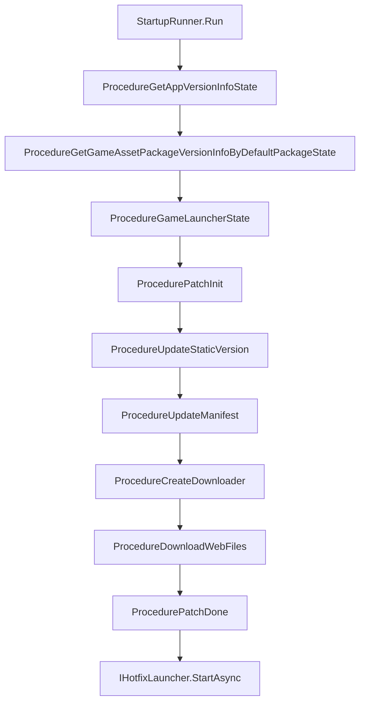

# Startup Flow Overview

`com.gameframex.unity.startup` breaks down the journey of "from game launch to playable" into a configurable, pluggable startup pipeline: first fetch global information via primary/backup URLs → validate App and asset versions → YooAsset patch flow (initialization → static version → manifest → download → completion) → launch the hotfix entry. Developers only need to implement `IStartupUIHandler` (prompt UI) and `IHotfixLauncher` (hotfix entry) to replace the default implementations.

## Quick Start

1. Add the dependency in `Packages/manifest.json`:

    ```json
    {
      "dependencies": {
        "com.gameframex.unity.startup": "1.1.0"
      },
      "scopedRegistries": [
        {
          "name": "GameFrameX",
          "url": "https://gameframex.upm.alianblank.uk",
          "scopes": ["com.gameframex"]
        }
      ]
    }
    ```

    `scopes` controls which packages are resolved through this registry; only packages starting with `com.gameframex` will be fetched from here.

2. In the Unity Editor, create a configuration asset via `Create > GameFrameX > Startup Options`, and fill in the primary/backup URLs, PlayMode, hotfix entry, HTTP common parameters, etc.

3. Implement `IStartupUIHandler` (FairyGUI / UGUI / custom UI all work) and `IHotfixLauncher` (HybridCLR or other hotfix solutions).

4. Call the one-line entry in your scene:

    ```csharp
    var result = await StartupRunner.Run(_options, uiHandler, hotfixLauncher);
    if (result.Success) { /* Startup complete, game ready */ }
    ```

    Source: [README.zh-CN.md](https://github.com/GameFrameX/com.gameframex.unity.startup/blob/main/README.zh-CN.md#L1-L100)

## How It Works (Quick Overview)

The startup pipeline organizes `Procedure` nodes as a finite state machine (FSM); each node completes its responsibility and then transitions to the next node via `ChangeState<T>`.



Node descriptions:

| Pipeline Node | Responsibility |
|----------|------|
| `ProcedureGetAppVersionInfoState` | Fetch global information (primary/backup URL failover) |
| `ProcedureGetGameAssetPackageVersionInfoByDefaultPackageState` | Get App and asset package versions |
| `ProcedureGameLauncherState` | Switch to the YooAsset resource mode |
| `ProcedurePatchInit` | Initialize the YooAsset asset package based on PlayMode |
| `ProcedureUpdateStaticVersion` | Request the asset package static version number |
| `ProcedureUpdateManifest` | Update the asset manifest |
| `ProcedureCreateDownloader` | Create the downloader |
| `ProcedureDownloadWebFiles` | Download patch files and update progress |
| `ProcedurePatchDone` | Complete the patch flow |
| `IHotfixLauncher.StartAsync` | Load hotfix assemblies and execute the entry |

Two completion notification paths are triggered simultaneously: the await result of `UniTask<StartupResult>`, and the `StartupCompletedEventArgs` / `StartupFailedEventArgs` events; developers can listen to either one.

## Key Configuration Quick Reference

Main fields of the `StartupOptions` ScriptableObject:

| Field | Purpose |
|------|------|
| `GlobalInfoUrls` | List of primary/backup URLs for the global information API, used together with the `MaxAttemptsPerUrl` retry strategy |
| `GamePlayMode` | Asset runtime mode; the startup flow syncs it to the Asset component before loading |
| `HotfixAssemblyName` / `HotfixEntryTypeName` / `HotfixEntryMethodName` | Hotfix entry (assembly / type / method) |
| `PackageName` / `Channel` / `SubChannel` | HTTP common parameters (pure data, no SDK dependency) |
| `LauncherUIResName` | Startup UI asset path, defaults to `UI/UILauncher` |
| `SkipRemoteStartupRequests` | Skip all remote startup requests; enable for WebGL standalone or backend-less deployments |

PlayMode adaptive branches: `EditorSimulateMode` / `OfflinePlayMode` / `HostPlayMode` / `WebPlayMode`; `ProcedurePatchInit` selects an empty URL or a real URL to initialize YooAsset based on the current mode:

Source: [ProcedurePatchInit.cs](https://github.com/GameFrameX/com.gameframex.unity.startup/blob/main/Runtime/Procedures/Patch/ProcedurePatchInit.cs#L33-L48)

## Next Steps

- Implement the startup UI: see "How to Implement IStartupUIHandler"
- Integrate HybridCLR: see "How to Implement IHotfixLauncher"
- Primary/backup URL retry strategy: see "URL Failover Reference"
- Standalone/backend-less deployment: enable `SkipRemoteStartupRequests`