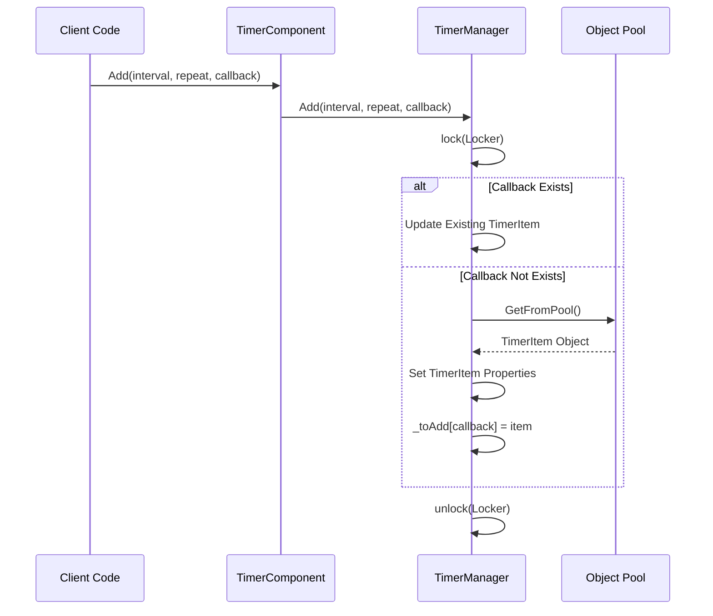
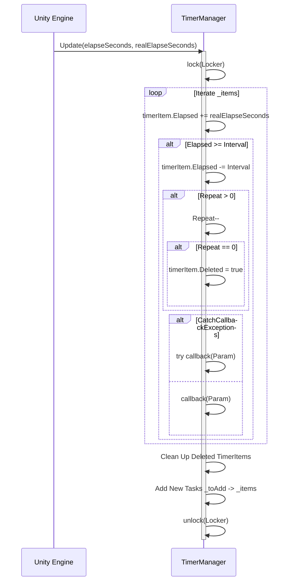

# Timer Component Overview

The Timer component is a timer management module provided by the GameFrameX framework for Unity game development. It provides the ability to add, manage, and execute timed tasks in games, supporting various timing modes such as single execution, repeated execution, and frame update execution.

## Overview

The Timer component is a foundational component in the GameFrameX architecture dedicated to time-based scheduling. During game development, developers often need to handle various time-related logic, such as:

- Delayed execution of certain operations
- Periodically triggering game events
- Countdown functionality
- Executing specific logic every frame

The Timer component provides an elegant API design that allows developers to easily implement these requirements, while also offering thread-safe implementation and performance optimization.

## Component Architecture

The Timer component uses a classic three-layer architecture design, including component layer, interface layer, and implementation layer:

```mermaid
flowchart TD
    subgraph Unity["Unity Component Layer"]
        TC[TimerComponent]
    end

    subgraph Interface["Interface Layer"]
        ITM[ITimerManager]
    end

    subgraph Implementation["Implementation Layer"]
        TM[TimerManager]
        Pool[Object Pool _pool]
    end

    subgraph Data["Data Layer"]
        Items["_items Dictionary"]
        ToAdd["_toAdd Dictionary"]
        ToRemove["_toRemove List"]
    end

    TC -->|"Call Methods"| ITM
    ITM <|..|"Implementation"| TM
    TM -->|"Object Reuse"| Pool
    TM -->|"Manage"| Items
    TM -->|"Manage"| ToAdd
    TM -->|"Manage"| ToRemove
```

### Architecture Description

| Layer | Class Name | Responsibility |
|------|------|------|
| Component Layer | TimerComponent | Exposed to the scene as a Unity component, providing user-facing API |
| Interface Layer | ITimerManager | Defines the abstract interface for timer management |
| Implementation Layer | TimerManager | Implements specific timer logic |

## Core Design

### Interface-Implementation Pattern

The Timer component uses an interface-implementation separation design for easier unit testing and extension:

```csharp
> Source: [ITimerManager.cs](https://github.com/GameFrameX/com.gameframex.unity.timer/blob/main/Runtime/Timer/ITimerManager.cs#L1-L54)

public interface ITimerManager
{
    void Add(float interval, int repeat, Action<object> callback, object callbackParam = null);
    void AddOnce(float interval, Action<object> callback, object callbackParam = null);
    void AddUpdate(Action<object> callback);
    void AddUpdate(Action<object> callback, object callbackParam);
    bool Exists(Action<object> callback);
    void Remove(Action<object> callback);
}
```

This design allows referencing timer functionality through the interface in different modules without depending on specific implementations.

### Object Pool Pattern

TimerManager internally uses an object pool to reuse TimerItem objects, reducing garbage collection pressure:

```csharp
> Source: [TimerManager.cs](https://github.com/GameFrameX/com.gameframex.unity.timer/blob/main/Runtime/Timer/TimerManager.cs#L266-L289)

private TimerItem GetFromPool()
{
    TimerItem t;
    int cnt = _pool.Count;
    if (cnt > 0)
    {
        t = _pool[cnt - 1];
        _pool.RemoveAt(cnt - 1);
        t.Deleted = false;
        t.Elapsed = 0;
    }
    else
    {
        t = new TimerItem();
    }
    return t;
}
```

### Thread Safety Design

TimerManager uses `lock` mechanism to ensure data safety in multi-threaded environments:

```csharp
> Source: [TimerManager.cs](https://github.com/GameFrameX/com.gameframex.unity.timer/blob/main/Runtime/Timer/TimerManager.cs#L38-L38)

private static readonly object Locker = new object();
```

All operations on shared data such as `_items`, `_toAdd`, `_toRemove` are protected by locks.

### Exception Handling Strategy

You can control whether exceptions in callbacks are caught through the static property `CatchCallbackExceptions`:

```csharp
> Source: [TimerManager.cs](https://github.com/GameFrameX/com.gameframex.unity.timer/blob/main/Runtime/Timer/TimerManager.cs#L40-L43)

/// <summary>
/// Whether to catch callback exceptions
/// </summary>
public static bool CatchCallbackExceptions = false;
```

When set to `true`, exceptions in callbacks are caught and warning logs are recorded, without interrupting the timer's main loop.

## Core Flow

### Task Addition Flow



### Task Execution Flow



## Core Features

The Timer component provides the following core features:

| Method | Feature Description |
|------|----------|
| Add | Add a timed recurring task |
| AddOnce | Add a one-time task |
| AddUpdate | Add a per-frame update task |
| Exists | Check if a specified task exists |
| Remove | Remove a specified task |

### Adding a Timed Task (Add)

Add a timed recurring task, supporting specified interval and repeat count:

```csharp
> Source: [README.md](https://github.com/GameFrameX/com.gameframex.unity.timer/blob/main/README.md#L30-L32)

Add(1000, 5, MyMethod);
```

Parameter description:
- `interval`: Interval time (in milliseconds)
- `repeat`: Repeat count, 0 means infinite repeat
- `callback`: Callback function
- `callbackParam`: Callback parameter (optional)

### Adding a One-Time Task (AddOnce)

Add a task that executes once after a delay:

```csharp
> Source: [README.md](https://github.com/GameFrameX/com.gameframex.unity.timer/blob/main/README.md#L46-L48)

AddOnce(5000, MyMethod);
```

### Adding a Frame Update Task (AddUpdate)

Add a task that executes every frame, suitable for scenarios requiring continuous monitoring or updates:

```csharp
> Source: [README.md](https://github.com/GameFrameX/com.gameframex.unity.timer/blob/main/README.md#L60-L63)

AddUpdate(MyMethod);
```

### Checking and Removing Tasks

Check if a task exists and remove it as needed:

```csharp
> Source: [README.md](https://github.com/GameFrameX/com.gameframex.unity.timer/blob/main/README.md#L78-L95)

bool exists = GetComponent<TimerComponent>().Exists(MyMethod);
GetComponent<TimerComponent>().Remove(MyMethod);
```

## Usage Example

The following is a complete usage example:

```csharp
// Assume this is the method you want to trigger
void MyMethod(object param)
{
    Debug.Log("Method triggered");
}

// Create a timed task, execute MyMethod every 1 second, 5 times total
GetComponent<TimerComponent>().Add(1000, 5, MyMethod);

// Create a timed task, execute MyMethod once after 5 seconds
GetComponent<TimerComponent>().AddOnce(5000, MyMethod);

// Check if a task exists
bool exists = GetComponent<TimerComponent>().Exists(MyMethod);

// Remove a specific task
GetComponent<TimerComponent>().Remove(MyMethod);
```

> Source: [README.md](https://github.com/GameFrameX/com.gameframex.unity.timer/blob/main/README.md#L101-L119)

## Configuration Options

The Timer component provides the following configurable options:

| Option | Type | Default Value | Description |
|------|------|--------|------|
| CatchCallbackExceptions | static bool | false | Whether to catch exceptions in callbacks, preventing timer main loop interruption |

### Configuration Example

```csharp
// Enable exception catching to prevent callback exceptions from interrupting the timer
TimerManager.CatchCallbackExceptions = true;
```

## Important Notes

1. **Initialization Requirement**: Before using the timer, ensure that `TimerManager` is correctly initialized and registered with the `GameFrameworkEntry` module.

2. **Performance Consideration**: Avoid using very small intervals (e.g., less than frame time), as this may cause performance issues. The minimum recommended interval is not lower than 100 milliseconds.

3. **Callback Signature**: All callback functions must conform to the `Action<object>` signature, i.e., accept one object parameter and return void.

4. **Thread Safety**: Although TimerManager internally implements thread-safe mechanisms, be mindful of callback function thread safety in multi-threaded environments.

## Related Links

- [Features](./1-overview.features) - Learn more about Timer component features
- [Installation](./2-installation) - How to install and configure the Timer component
- [Getting Started](./3-getting-started) - Quick start guide for Timer component
- [Add Timed Task](./4-core-functions.add-timer) - Detailed usage for timed tasks
- [Add One-Time Task](./4-core-functions.add-once) - Detailed usage for one-time tasks
- [Add Frame Update Task](./4-core-functions.add-update) - Detailed usage for frame update tasks
- [Check and Remove Tasks](./4-core-functions.exists-remove) - Detailed usage for task management
- [API Reference](./5-api-reference.timer-component) - Complete TimerComponent API
