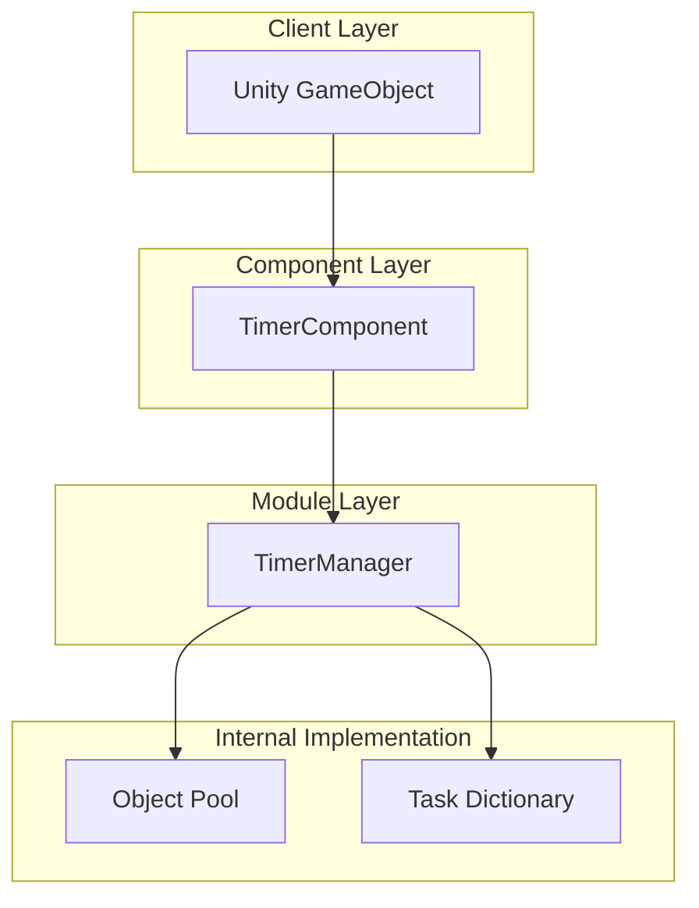

# Getting Started

The Timer component is a timer functionality module provided by the GameFrameX framework, used for managing and executing timed tasks in Unity projects. Whether it's periodic events, single delayed execution, or per-frame updates, the Timer component provides a simple and efficient solution for you.

## Overview

The Timer component provides the following core features:

- **Timed Tasks**: Tasks that repeatedly execute at specified time intervals
- **One-Time Tasks**: Tasks that execute once after a specified delay
- **Frame Update Tasks**: Tasks that execute every frame, suitable for high-frequency update scenarios
- **Task Management**: Check if a task exists, remove specified tasks

This component is designed based on the GameFrameX framework architecture, automatically integrated into the framework's module system, supporting thread-safe operations and object pool optimization.

## Architecture

The Timer component uses a layered architecture design, with core components including:



**Architecture Description:**

- **TimerComponent**: Unity component layer, providing interfaces directly for developers, inheriting from `GameFrameworkComponent`
- **TimerManager**: Core module layer, inheriting from `GameFrameworkModule`, implementing `ITimerManager` interface, responsible for timed task scheduling and execution
- **Object Pool**: Uses object pool pattern to manage TimerItems, reducing memory allocation and GC pressure
- **Task Dictionary**: Uses thread-safe dictionary to store tasks, supporting dynamic addition and removal

## Basic Usage

### Step 1: Add Component

In Unity Editor, select the GameObject that needs to use the timer, click **Add Component**, search for **Timer** and add:

> Source: [TimerComponent.cs](https://github.com/GameFrameX/com.gameframex.unity.timer/blob/main/Runtime/Timer/TimerComponent.cs#L11-L13)

```csharp
[DisallowMultipleComponent]
[AddComponentMenu("Game Framework/Timer")]
public class TimerComponent : GameFrameworkComponent
```

### Step 2: Get Component Instance

Get the TimerComponent instance in a script:

```csharp
// Get TimerComponent
var timerComponent = gameObject.GetComponent<TimerComponent>();
```

### Step 3: Use Timer Functions

#### Add Timed Task

Execute a task at specified intervals, with optional repeat count:

```csharp
// Execute every 1 second, total 5 times
timerComponent.Add(1f, 5, (param) => {
    Debug.Log("Timed task executed");
});

// Execute every 2 seconds, infinite repeat (repeat = 0)
timerComponent.Add(2f, 0, (param) => {
    Debug.Log("Infinite repeat task");
});
```

> Source: [TimerComponent.cs](https://github.com/GameFrameX/com.gameframex.unity.timer/blob/main/Runtime/Timer/TimerComponent.cs#L37-L40)

#### Add One-Time Task

Execute once after a specified delay:

```csharp
// Execute once after 5 seconds
timerComponent.AddOnce(5f, (param) => {
    Debug.Log("One-time task executed");
});
```

> Source: [TimerComponent.cs](https://github.com/GameFrameX/com.gameframex.unity.timer/blob/main/Runtime/Timer/TimerComponent.cs#L48-L51)

#### Add Frame Update Task

Tasks that execute every frame, suitable for high-frequency update scenarios:

```csharp
// Execute every frame
timerComponent.AddUpdate((param) => {
    // Per-frame logic
});

// Version with parameter
timerComponent.AddUpdate((param) => {
    int frameCount = (int)param;
    Debug.Log($"Current frame: {frameCount}");
}, 0);
```

> Source: [TimerComponent.cs](https://github.com/GameFrameX/com.gameframex.unity.timer/blob/main/Runtime/Timer/TimerComponent.cs#L57-L70)

#### Check if Task Exists

```csharp
// Check if a task with the specified callback exists
bool exists = timerComponent.Exists((param) => {
    Debug.Log("Task");
});

Debug.Log($"Task exists: {exists}");
```

> Source: [TimerComponent.cs](https://github.com/GameFrameX/com.gameframex.unity.timer/blob/main/Runtime/Timer/TimerComponent.cs#L77-L80)

#### Remove Task

```csharp
// Remove specified task
timerComponent.Remove((param) => {
    Debug.Log("Task to remove");
});
```

> Source: [TimerComponent.cs](https://github.com/GameFrameX/com.gameframex.unity.timer/blob/main/Runtime/Timer/TimerComponent.cs#L86-L89)

## Complete Example

The following is a complete script example showing how to use TimerComponent:

```csharp
using UnityEngine;
using GameFrameX.Timer.Runtime;

public class TimerExample : MonoBehaviour
{
    private TimerComponent _timerComponent;
    private int _executeCount = 0;

    void Start()
    {
        // Get TimerComponent
        _timerComponent = gameObject.AddComponent<TimerComponent>();

        // Example 1: Execute every 1 second, 10 times total
        _timerComponent.Add(1f, 10, OnTimerTick);

        // Example 2: Execute once after 5 seconds
        _timerComponent.AddOnce(5f, OnDelayComplete);

        // Example 3: Execute every frame
        _timerComponent.AddUpdate(OnFrameUpdate);
    }

    void OnTimerTick(object param)
    {
        _executeCount++;
        Debug.Log($"Timed task execution count: {_executeCount}");
    }

    void OnDelayComplete(object param)
    {
        Debug.Log("Delayed task execution complete");

        // Remove frame update task
        _timerComponent.Remove(OnFrameUpdate);
    }

    void OnFrameUpdate(object param)
    {
        // Per-frame logic
    }

    void OnDestroy()
    {
        // Clean up all tasks
        if (_timerComponent != null)
        {
            _timerComponent.Remove(OnTimerTick);
            _timerComponent.Remove(OnDelayComplete);
            _timerComponent.Remove(OnFrameUpdate);
        }
    }
}
```

> Source: [TimerComponent.cs](https://github.com/GameFrameX/com.gameframex.unity.timer/blob/main/Runtime/Timer/TimerComponent.cs#L1-L91)

## Important Notes

### Time Units

The Timer component's time parameters are **in seconds**, not milliseconds:

- `interval = 1f` means 1 second interval
- `interval = 0.5f` means 0.5 second interval
- `interval = 0.001f` means 1 millisecond interval (for frame updates)

### Thread Safety

TimerManager internally uses `lock` mechanism to ensure thread safety, and can be safely used in multi-threaded environments.

### Callback Exception Handling

You can control whether to catch exceptions in callbacks by setting `TimerManager.CatchCallbackExceptions`:

```csharp
// Catch callback exceptions to prevent exceptions from terminating the timer
TimerManager.CatchCallbackExceptions = true;
```

> Source: [TimerManager.cs](https://github.com/GameFrameX/com.gameframex.unity.timer/blob/main/Runtime/Timer/TimerManager.cs#L43)

## Related Links

- [Features](./1-overview.features) - Learn more about Timer component features
- [Installation](./2-installation) - View complete installation steps
- [Add Timed Task](./4-core-functions.add-timer) - Detailed usage for timed tasks
- [Add One-Time Task](./4-core-functions.add-once) - Detailed usage for one-time tasks
- [Add Frame Update Task](./4-core-functions.add-update) - Detailed usage for frame update tasks
- [Check and Remove Tasks](./4-core-functions.exists-remove) - Detailed usage for task management
- [API Reference - TimerComponent](./5-api-reference.timer-component) - Complete TimerComponent API
- [API Reference - ITimerManager](./5-api-reference.itimer-manager) - ITimerManager interface definition
- [API Reference - TimerManager](./5-api-reference.timer-manager) - TimerManager implementation details
- [Samples](./6-samples) - More usage examples
- [Troubleshooting](./7-troubleshooting) - FAQ
