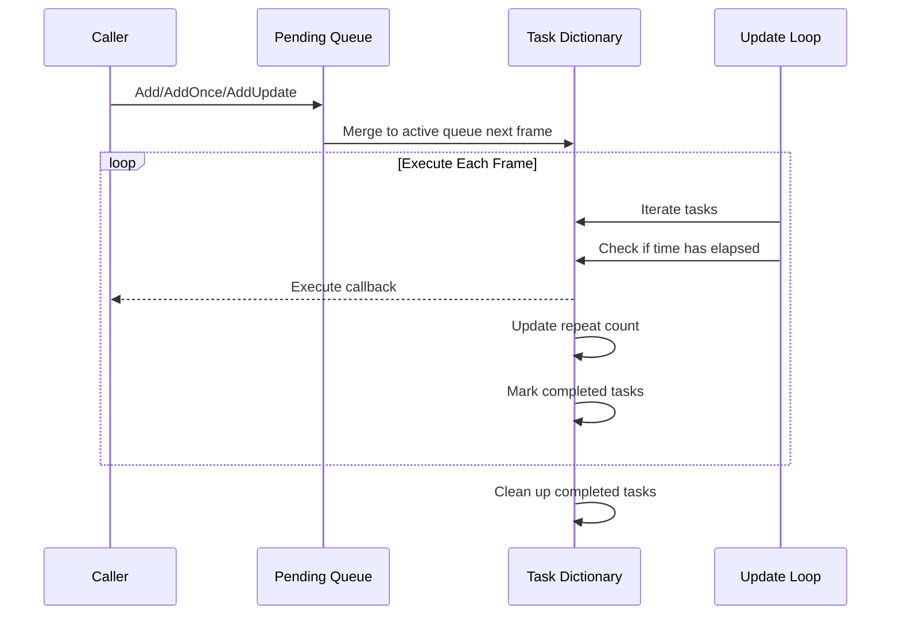

# Features

The Timer component is the timer module in the GameFrameX framework, providing a complete time-based scheduling solution that supports management of timed recurring tasks, one-time delayed tasks, and frame update tasks.

## Overview

The Timer component is specifically designed for Unity game development, providing high-precision, controllable timed task scheduling capabilities. This component uses a layered architecture design, with the upper layer providing TimerComponent for Unity scene usage, and the lower layer implementing core logic through TimerManager, with ITimerManager interface defining the standardized timer service.

## Core Features

### 1. Timed Recurring Tasks

Timed recurring tasks (Add method) allow developers to set an interval time and repeat count, and the task will execute repeatedly at the specified interval.

**Features:**
- Support for specifying repeat count (0 means infinite repeat)
- Precise time interval control (in seconds)
- Custom parameters passed during task execution

**Typical Use Cases:**
- Periodic health recovery
- Timed refresh of game items
- Periodic game data saving

### 2. One-Time Delayed Tasks

One-time tasks (AddOnce method) execute once after a specified delay time, suitable for scenarios requiring delayed execution.

**Features:**
- Precise and controllable delay time
- Automatically removed after execution, no manual management required
- Equivalent to Add(interval, 1, callback)

**Typical Use Cases:**
- Display a dialog a few seconds later
- End game after countdown completes
- Skill cooldown completion notification

### 3. Frame Update Tasks

Frame update tasks (AddUpdate method) execute every frame, suitable for high-frequency update scenarios.

**Features:**
- Minimum interval approximately 0.001 seconds (1 millisecond)
- Infinite repeated execution
- Commonly used for real-time monitoring or continuous checking

**Typical Use Cases:**
- Real-time progress bar updates
- Animation state machine updates
- Continuous detection of whether conditions are met

### 4. Task Existence Check

Exists method is used to check whether the specified callback function already exists in the task queue.

**Features:**
- Checks both pending queue and active queue
- Returns boolean indicating existence

**Typical Use Cases:**
- Prevent duplicate addition of the same task
- Verify task status before adding

### 5. Task Removal

Remove method is used to remove a specified task and stop its execution.

**Features:**
- Support removing tasks waiting to be executed
- Support removing tasks being executed (marked for deletion)
- Automatically recycle resources to object pool

**Typical Use Cases:**
- Stop all combat-related timed tasks when player dies
- Clean up related timed refreshes when closing a UI
- Cancel a countdown

## Architecture Design

```mermaid
graph TD
    subgraph Unity Layer
        TC[TimerComponent<br/>Unity Component]
    end

    subgraph Interface Layer
        ITM[ITimerManager<br/>Timer Interface]
    end

    subgraph Implementation Layer
        TM[TimerManager<br/>Timer Manager]
        GFM[GameFrameworkModule<br/>Framework Module Base]
    end

    subgraph Internal Implementation
        Pool[Object Pool]
        Dict[Task Dictionary]
    end

    TC --> ITM
    ITM <|.. TM
    TM --> GFM
    TM --> Pool
    TM --> Dict
```

**Component Description:**

| Component | Responsibility | Layer |
|------|------|------|
| TimerComponent | Unity component wrapper, providing timer functionality in scene | Unity Layer |
| ITimerManager | Defines standard timer interface, containing all core methods | Interface Layer |
| TimerManager | Implements timer core logic, including task scheduling and execution | Implementation Layer |
| Object Pool | Reuses TimerItem objects, reducing memory allocation | Internal Implementation |

## Task Execution Flow



## Technical Features

### Thread Safety

TimerManager internally uses `lock` keyword to protect all operations, ensuring safe operation in multi-threaded environments.

### Performance Optimization

- **Object Pool Pattern**: Uses `_pool` list to reuse TimerItem objects, avoiding frequent GC
- **Deferred Addition**: New tasks are added to `_toAdd` queue, merged into main queue during next frame Update
- **Incremental Time Processing**: Handles time drift, resets timer after task completion

### Exception Handling

Through `TimerManager.CatchCallbackExceptions` static property, control whether to catch exceptions in callbacks:
- `false` (default): Exceptions are thrown directly, potentially interrupting game loop
- `true`: Exceptions are caught and warning logs are output, task is marked for deletion

## Usage Methods

### Using via Component

In Unity scene, add TimerComponent to a GameObject to use:

```csharp
// Add timed task, execute every 1 second, 10 times total
GetComponent<TimerComponent>().Add(1f, 10, OnTimerTick);

// Add one-time task, execute after 5 seconds
GetComponent<TimerComponent>().AddOnce(5f, OnDelayedExecute);

// Add frame update task
GetComponent<TimerComponent>().AddUpdate(OnFrameUpdate);

// Check if task exists
bool exists = GetComponent<TimerComponent>().Exists(OnTimerTick);

// Remove task
GetComponent<TimerComponent>().Remove(OnTimerTick);
```

> Source: [TimerComponent.cs](https://github.com/GameFrameX/com.gameframex.unity.timer/blob/main/Runtime/Timer/TimerComponent.cs#L30-L89)

### Using via Module

Internally within the framework, you can get the ITimerManager module via GameFrameworkEntry:

```csharp
var timerManager = GameFrameworkEntry.GetModule<ITimerManager>();
timerManager.Add(1f, 5, OnTick);
```

> Source: [TimerManager.cs](https://github.com/GameFrameX/com.gameframex.unity.timer/blob/main/Runtime/Timer/TimerManager.cs#L156-L188)

## Callback Function Definition

All timed tasks use a unified callback function signature:

```csharp
void CallbackName(object param)
{
    // param is the passed parameter, can be any object
    // If no parameter is needed, pass null
}
```

> Source: [ITimerManager.cs](https://github.com/GameFrameX/com.gameframex.unity.timer/blob/main/Runtime/Timer/ITimerManager.cs#L18)

## Parameter Description

| Method | Parameter | Type | Description |
|------|------|------|------|
| Add | interval | float | Interval time (seconds) |
| Add | repeat | int | Repeat count (0=infinite) |
| Add | callback | Action\<object\> | Callback function |
| Add | callbackParam | object | Callback parameter |
| AddOnce | interval | float | Delay time (seconds) |
| AddOnce | callback | Action\<object\> | Callback function |
| AddOnce | callbackParam | object | Callback parameter |
| AddUpdate | callback | Action\<object\> | Callback function |
| AddUpdate | callbackParam | object | Callback parameter |
| Exists | callback | Action\<object\> | Callback to check |
| Remove | callback | Action\<object\> | Callback to remove |

## Related Links

- [Timer Component Overview](./1-overview.introduction)
- [Installation](./2-installation)
- [Getting Started](./3-getting-started)
- [Add Timed Task](./4-core-functions.add-timer)
- [Add One-Time Task](./4-core-functions.add-once)
- [Add Frame Update Task](./4-core-functions.add-update)
- [Check and Remove Tasks](./4-core-functions.exists-remove)
- [API Reference - TimerComponent](./5-api-reference.timer-component)
- [API Reference - ITimerManager](./5-api-reference.itimer-manager)
- [API Reference - TimerManager](./5-api-reference.timer-manager)
