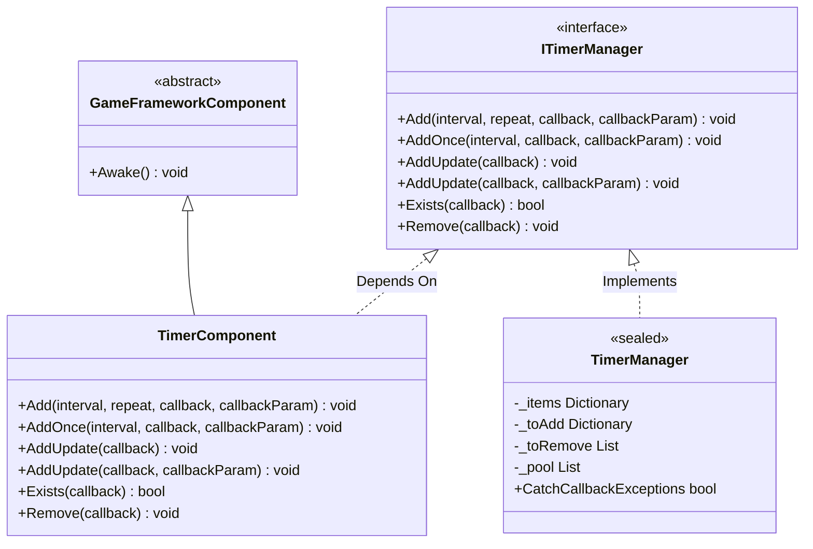
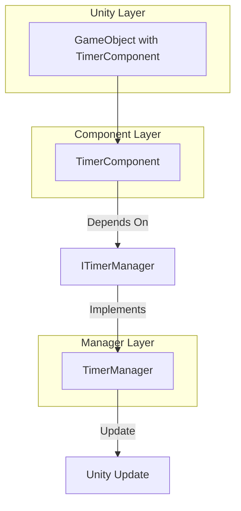
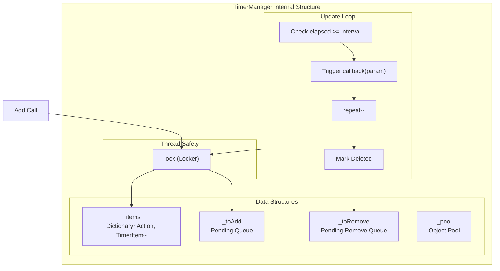

# TimerComponent

TimerComponent is the Unity component wrapper for the Timer module, providing timed task management functionality. As one of the core components of the GameFrameX framework, it allows developers to add various timed execution tasks, including recurring tasks, one-time tasks, and frame update tasks.

## Overview

TimerComponent inherits from GameFrameworkComponent, is a Unity component ([DisallowMultipleComponent]) that needs to be attached to a Unity GameObject for use. This component internally delegates to ITimerManager (implemented by TimerManager) for actual timed task logic, providing only a simple Unity API interface.

**Inheritance Hierarchy:**



## Architecture Description

TimerComponent is located at the **API Layer** in the architecture, providing convenient calling interfaces for Unity developers:



**Workflow:**
1. Developer attaches TimerComponent to GameObject in Unity Editor
2. Call TimerComponent's public methods to add timed tasks
3. TimerComponent forwards requests to TimerManager
4. TimerManager detects and triggers timed task callbacks in the Update loop

## API Reference

### `Add(interval, repeat, callback, callbackParam)`

Add a timed recurring task.

```csharp
public void Add(float interval, int repeat, Action<object> callback, object callbackParam = null)
```
> Source: [TimerComponent.cs](https://github.com/GameFrameX/com.gameframex.unity.timer/blob/main/Runtime/Timer/TimerComponent.cs#L37-L40)

**Parameters:**
| Parameter | Type | Required | Description |
|--------|------|------|------|
| interval | float | Yes | Interval time (in seconds) |
| repeat | int | Yes | Repeat count, 0 means infinite repeat |
| callback | Action\<object\> | Yes | Callback function to execute when triggered |
| callbackParam | object | No | Parameter passed to the callback function |

**Return Value:** None

**Usage Example:**

```csharp
// Execute every 1 second, 10 times total
timerComponent.Add(1f, 10, OnTimerTick, "tick data");

// Infinite repeat (every second)
timerComponent.Add(1f, 0, OnTimerTick);
```

---

### `AddOnce(interval, callback, callbackParam)`

Add a one-time task that executes only once.

```csharp
public void AddOnce(float interval, Action<object> callback, object callbackParam = null)
```
> Source: [TimerComponent.cs](https://github.com/GameFrameX/com.gameframex.unity.timer/blob/main/Runtime/Timer/TimerComponent.cs#L48-L51)

**Parameters:**
| Parameter | Type | Required | Description |
|--------|------|------|------|
| interval | float | Yes | Delay time (in seconds), executes once after delay |
| callback | Action\<object\> | Yes | Callback function to execute when delay ends |
| callbackParam | object | No | Parameter passed to the callback function |

**Return Value:** None

**Usage Example:**

```csharp
// Execute once after 5 seconds
timerComponent.AddOnce(5f, OnDelayedAction, "delayed");

// Execute once after 1 second
timerComponent.AddOnce(1f, OnGameStart);
```

---

### `AddUpdate(callback)`

Add a per-frame update task (version without parameter).

```csharp
public void AddUpdate(Action<object> callback)
```
> Source: [TimerComponent.cs](https://github.com/GameFrameX/com.gameframex.unity.timer/blob/main/Runtime/Timer/TimerComponent.cs#L57-L60)

**Parameters:**
| Parameter | Type | Required | Description |
|--------|------|------|------|
| callback | Action\<object\> | Yes | Callback function to execute every frame |

**Return Value:** None

**Note:** Internal implementation is an infinite repeat task with 0.001 second interval, actual execution frequency depends on Unity Update frame rate.

**Usage Example:**

```csharp
// Execute every frame
timerComponent.AddUpdate(OnFrameUpdate);
```

---

### `AddUpdate(callback, callbackParam)`

Add a per-frame update task (version with parameter).

```csharp
public void AddUpdate(Action<object> callback, object callbackParam)
```
> Source: [TimerComponent.cs](https://github.com/GameFrameX/com.gameframex.unity.timer/blob/main/Runtime/Timer/TimerComponent.cs#L67-L70)

**Parameters:**
| Parameter | Type | Required | Description |
|--------|------|------|------|
| callback | Action\<object\> | Yes | Callback function to execute every frame |
| callbackParam | object | Yes | Parameter passed to the callback function |

**Return Value:** None

**Usage Example:**

```csharp
// Execute every frame and pass parameter
timerComponent.AddUpdate(OnFrameUpdate, frameCounter);
```

---

### `Exists(callback)`

Check if the specified task exists.

```csharp
public bool Exists(Action<object> callback)
```
> Source: [TimerComponent.cs](https://github.com/GameFrameX/com.gameframex.unity.timer/blob/main/Runtime/Timer/TimerComponent.cs#L77-L80)

**Parameters:**
| Parameter | Type | Required | Description |
|--------|------|------|------|
| callback | Action\<object\> | Yes | Callback function to check |

**Return Value:** bool - Returns true if task exists, false otherwise

**Usage Example:**

```csharp
if (timerComponent.Exists(OnTimerTick))
{
    Debug.Log("Task is running");
}
```

---

### `Remove(callback)`

Remove the specified timed task.

```csharp
public void Remove(Action<object> callback)
```
> Source: [TimerComponent.cs](https://github.com/GameFrameX/com.gameframex.unity.timer/blob/main/Runtime/Timer/TimerComponent.cs#L86-L89)

**Parameters:**
| Parameter | Type | Required | Description |
|--------|------|------|------|
| callback | Action\<object\> | Yes | Callback function to remove |

**Return Value:** None

**Usage Example:**

```csharp
// Remove specified task
timerComponent.Remove(OnTimerTick);

// Remove frame update task
timerComponent.Remove(OnFrameUpdate);
```

---

## Internal Implementation Mechanism

### TimerManager Core Logic

The actual processing behind TimerComponent is done by TimerManager. TimerManager uses the following mechanisms to ensure efficiency and thread safety:



### Key Design Features

1. **Deferred Add/Remove Queues**: Uses `_toAdd` and `_toRemove` queues to avoid issues caused by modifying collections during Update iteration
2. **Object Pool Pattern**: `_pool` list reuses TimerItem objects, reducing GC overhead
3. **Thread Safety**: All operations are protected by `lock (Locker)`
4. **Exception Handling Option**: Controls whether to catch callback exceptions through `TimerManager.CatchCallbackExceptions` static property

## Common Usage Patterns

### Basic Pattern

```csharp
// Get component reference
var timer = GetComponent<TimerComponent>();

// Add recurring task
timer.Add(1f, 5, OnTick, "data");

// Define callback
void OnTick(object param)
{
    Debug.Log($"Timer tick: {param}");
}
```

### Common Game Development Scenarios

```csharp
// Delayed execution (one-time)
timerComponent.AddOnce(3f, OnLevelStart);

// Continuous effect (like poison damage)
timerComponent.Add(1f, 0, OnPoisonDamage, 10);

// Per-frame detection
timerComponent.AddUpdate(OnCheckInput);

// Conditional removal
if (timerComponent.Exists(myCallback))
{
    timerComponent.Remove(myCallback);
}
```

## Related Links

- [ITimerManager Interface Reference](./5-api-reference.itimer-manager)
- [TimerManager Implementation Reference](./5-api-reference.timer-manager)
- [Core Functions - Add Timed Task](./4-core-functions.add-timer)
- [Core Functions - Add One-Time Task](./4-core-functions.add-once)
- [Core Functions - Add Frame Update Task](./4-core-functions.add-update)
- [Core Functions - Check and Remove Tasks](./4-core-functions.exists-remove)
- [Getting Started](./3-getting-started)
