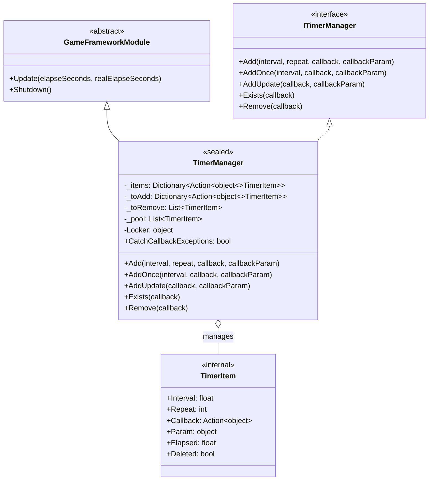
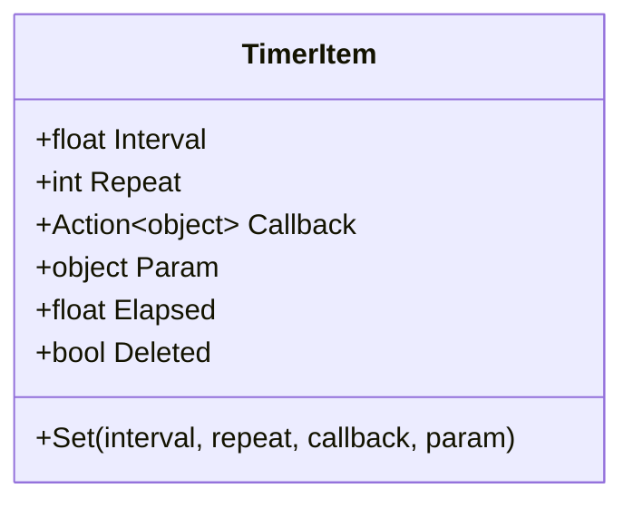

# TimerManager

TimerManager is the core implementation class of the GameFrameX timer module, responsible for scheduling and executing timed tasks. It inherits from `GameFrameworkModule` and implements `ITimerManager` interface, providing precise time interval control, repeat count management, and thread-safe operation mechanisms.

## Overview

TimerManager is the core engine of the entire timer system, responsible for managing the lifecycle of all timed tasks during game runtime. This class uses an object pool pattern to reduce garbage collection pressure, uses a double-buffering mechanism (pending add/pending remove lists) to ensure safe addition and deletion of tasks during the Update loop, and uses a lock mechanism to guarantee thread safety in multi-threaded environments.

As a core module of the GameFrameX framework, TimerManager iterates through all active tasks in each frame's Update callback, checks if trigger conditions are met, and executes the corresponding callback functions. It supports three types of timed tasks: fixed-interval recurring tasks, single delayed tasks, and per-frame update tasks.

### Core Responsibilities

- Manage addition, removal, and execution of timed tasks
- Maintain time accumulation and trigger logic for task execution
- Provide object pool reuse mechanism for performance optimization
- Ensure operation safety in multi-threaded environments

### Design Features

TimerManager adopts multiple optimization strategies in its design to ensure high performance and stability. First, object pool technology avoids frequent creation and destruction of TimerItem objects, significantly reducing GC (garbage collection) pressure. Second, the task double-buffering mechanism allows safe addition of new tasks and marking of deleted tasks during iteration without causing collection modification exceptions. Finally, thread locks ensure data consistency during multi-threaded access.



## Core Flow

TimerManager's core execution flow occurs in each frame's Update method. This flow ensures that timed tasks trigger at precise time intervals while handling dynamic task addition and removal.

```mermaid
flowchart TD
    subgraph UpdateLoop["Update Loop"]
        Start([Start Update]) --> Lock["Acquire Lock Locker"]
        Lock --> CheckItems{"_items Count\n> 0?"}

        CheckItems -->|Yes| Iterate["Iterate _items Collection"]
        CheckItems -->|No| CheckToRemove["Check _toRemove"]

        Iterate --> CheckDeleted{Current TimerItem\nDeleted?}
        CheckDeleted -->|Yes| AddToRemove["Add to _toRemove"]
        CheckDeleted -->|No| UpdateElapsed["Accumulate Elapsed"]

        UpdateElapsed --> CheckInterval{Elapsed \n>= Interval?}
        CheckInterval -->|No| ContinueIterate["Continue to Next"]
        CheckInterval -->|Yes| ResetElapsed["Reset Elapsed"]

        ResetElapsed --> CheckRepeat{Repeat \n> 0?}
        CheckRepeat -->|Yes| DecrementRepeat["Repeat--"]
        DecrementRepeat --> CheckRepeatZero{Repeat == 0?}
        CheckRepeatZero -->|Yes| MarkDeleted["Mark Deleted"]
        CheckRepeatZero -->|No| ExecuteCallback["Execute Callback"]

        MarkDeleted --> AddToRemove
        ExecuteCallback --> ContinueIterate

        AddToRemove --> ContinueIterate

        ContinueIterate --> HasNext{"More\nTasks?"}
        HasNext -->|Yes| Iterate
        HasNext -->|No| CheckToRemove

        CheckToRemove --> ProcessRemove{"_toRemove\nCount > 0?"}
        ProcessRemove -->|Yes| RemoveItems["Remove Marked Tasks\nReturn to Object Pool"]
        ProcessRemove -->|No| CheckToAdd

        RemoveItems --> CheckToAdd
        CheckToAdd --> ProcessAdd{"_toAdd\nCount > 0?"}
        ProcessAdd -->|Yes| AddNewItems["Add New Tasks\nto _items"]
        ProcessAdd -->|No| Release["Release Lock"]
        ProcessAdd -->|No| End([End Update])

        AddNewItems --> Release
        Release --> End
    end
```



### Flow Description

The Update method's execution flow is divided into four main stages. The first is task iteration, which iterates through all currently active tasks, accumulates elapsed time (Elapsed) for each task, and checks if the trigger interval is reached. The second is callback execution stage, where callback functions bound to tasks are executed when trigger conditions are met, and the repeat count is decremented based on the Repeat parameter. The third is removal processing stage, where tasks marked for deletion are removed from the collection and returned to the object pool for reuse. The fourth is addition processing stage, where new tasks in the pending queue are merged into the active task collection.

This design ensures that even if other tasks are added or removed during callback execution, the iteration's correctness is not affected, because actual addition and removal operations are only performed after iteration completes.

## Internal Class TimerItem

TimerItem is a nested class inside TimerManager, used to store complete state information for a single timed task. Each TimerItem object contains the task's execution interval, remaining repeat count, callback function, callback parameter, and internal state flags.



| Property | Type | Description |
|------|------|------|
| Interval | float | Task trigger interval in seconds |
| Repeat | int | Remaining repeat count, 0 means infinite repeat |
| Callback | Action\<object\> | Callback function executed when task triggers |
| Param | object | Parameter passed to the callback function |
| Elapsed | float | Time elapsed since last trigger |
| Deleted | bool | Flag indicating whether task has been deleted |

## Usage Examples

### Basic Usage

The following example shows how to add a simple recurring timed task:

```csharp
// Create a timed task, execute every 1 second, 10 times total
TimerManager.Instance.Add(1.0f, 10, callback: (param) =>
{
    Debug.Log($"Timed task executed, parameter: {param}");
}, callbackParam: "Hello Timer");
```
> Source: [TimerManager.cs](https://github.com/GameFrameX/com.gameframex.unity.timer/blob/main/Runtime/Timer/TimerManager.cs#L156-L188)

### One-Time Task Usage

Use AddOnce method to add a task that executes once after a delay:

```csharp
// Execute task once after 5 seconds
TimerManager.Instance.AddOnce(5.0f, callback: (param) =>
{
    Debug.Log("Task executes only once");
}, callbackParam: null);
```
> Source: [TimerManager.cs](https://github.com/GameFrameX/com.gameframex.unity.timer/blob/main/Runtime/Timer/TimerManager.cs#L197-L200)

### Per-Frame Update Task

Use AddUpdate method to add lightweight per-frame execution tasks:

```csharp
// Per-frame task (interval ~0.001 seconds)
TimerManager.Instance.AddUpdate(callback: (param) =>
{
    // Per-frame logic
    transform.Rotate(Vector3.up, 10f * Time.deltaTime);
});
```
> Source: [TimerManager.cs](https://github.com/GameFrameX/com.gameframex.unity.timer/blob/main/Runtime/Timer/TimerManager.cs#L206-L219)

### Task Checking and Removal

Use Exists and Remove methods to manage task lifecycle:

```csharp
private Action<object> _myTimerCallback;

void Start()
{
    // Add task and save callback reference
    _myTimerCallback = OnTimerTick;
    TimerManager.Instance.Add(1.0f, 5, _myTimerCallback, "test");
}

void OnTimerTick(object param)
{
    Debug.Log($"Tick: {param}");
}

// Check and remove in other methods
void StopTimer()
{
    if (TimerManager.Instance.Exists(_myTimerCallback))
    {
        TimerManager.Instance.Remove(_myTimerCallback);
        Debug.Log("Task removed");
    }
}
```
> Source: [TimerManager.cs](https://github.com/GameFrameX/com.gameframex.unity.timer/blob/main/Runtime/Timer/TimerManager.cs#L226-L264)

## API Reference

### `TimerManager`

Complete class declaration:

```csharp
public sealed class TimerManager : GameFrameworkModule, ITimerManager
```
> Source: [TimerManager.cs](https://github.com/GameFrameX/com.gameframex.unity.timer/blob/main/Runtime/Timer/TimerManager.cs#L12)

**Inheritance:**
- Parent Class: GameFrameworkModule
- Interface: ITimerManager

---

### `CatchCallbackExceptions`

```csharp
public static bool CatchCallbackExceptions = false;
```
> Source: [TimerManager.cs](https://github.com/GameFrameX/com.gameframex.unity.timer/blob/main/Runtime/Timer/TimerManager.cs#L43)

**Description:** Global static property controlling whether exceptions during callback function execution are caught.

**Default Value:** false

**Use Cases:**
- When set to `true`, exceptions during callback execution are caught and warning logs are recorded, and the task is marked for deletion
- When set to `false`, exceptions during callback execution are thrown directly, potentially causing application crash

---

### `Add(interval, repeat, callback, callbackParam)`

```csharp
public void Add(float interval, int repeat, Action<object> callback, object callbackParam = null)
```
> Source: [TimerManager.cs](https://github.com/GameFrameX/com.gameframex.unity.timer/blob/main/Runtime/Timer/TimerManager.cs#L156-L188)

**Description:** Add a timed recurring task.

**Parameters:**
| Parameter | Type | Required | Default | Description |
|--------|------|------|--------|------|
| interval | float | Yes | - | Task trigger interval in seconds |
| repeat | int | Yes | - | Repeat count, 0 means infinite repeat |
| callback | Action\<object\> | Yes | - | Callback function to execute when task triggers |
| callbackParam | object | No | null | Parameter passed to the callback function |

**Return Type:** void

**Internal Logic:**
1. Check if callback is null, log warning and return if so
2. Check if task already exists, update parameters and reset state if so
3. Get or create new TimerItem from object pool
4. Add task to pending queue, merge into active collection next frame

**Exception Handling:**
- When callback is null, log warning but don't throw exception

---

### `AddOnce(interval, callback, callbackParam)`

```csharp
public void AddOnce(float interval, Action<object> callback, object callbackParam = null)
```
> Source: [TimerManager.cs](https://github.com/GameFrameX/com.gameframex.unity.timer/blob/main/Runtime/Timer/TimerManager.cs#L197-L200)

**Description:** Add a one-time task. Essentially an Add call with repeat parameter of 1.

**Parameters:**
| Parameter | Type | Required | Default | Description |
|--------|------|------|--------|------|
| interval | float | Yes | - | Delay time in seconds |
| callback | Action\<object\> | Yes | - | Callback function to execute when task triggers |
| callbackParam | object | No | null | Parameter passed to the callback function |

**Return Type:** void

**Equivalent Implementation:**
```csharp
Add(interval, 1, callback, callbackParam);
```

---

### `AddUpdate(callback)`

```csharp
public void AddUpdate(Action<object> callback)
```
> Source: [TimerManager.cs](https://github.com/GameFrameX/com.gameframex.unity.timer/blob/main/Runtime/Timer/TimerManager.cs#L206-L209)

**Description:** Add a per-frame update task.

**Parameters:**
| Parameter | Type | Required | Description |
|--------|------|------|------|
| callback | Action\<object\> | Yes | Callback function to execute every frame |

**Return Type:** void

**Equivalent Implementation:**
```csharp
Add(0.001f, 0, callback);
```

**Note:** Interval is set to 0.001 seconds (approximately every frame), repeat of 0 means infinite repeat.

---

### `AddUpdate(callback, callbackParam)`

```csharp
public void AddUpdate(Action<object> callback, object callbackParam)
```
> Source: [TimerManager.cs](https://github.com/GameFrameX/com.gameframex.unity.timer/blob/main/Runtime/Timer/TimerManager.cs#L216-L219)

**Description:** Add a per-frame update task and pass a parameter.

**Parameters:**
| Parameter | Type | Required | Description |
|--------|------|------|------|
| callback | Action\<object\> | Yes | Callback function to execute every frame |
| callbackParam | object | Yes | Parameter passed to the callback function |

**Return Type:** void

**Equivalent Implementation:**
```csharp
Add(0.001f, 0, callback, callbackParam);
```

---

### `Exists(callback)`

```csharp
public bool Exists(Action<object> callback)
```
> Source: [TimerManager.cs](https://github.com/GameFrameX/com.gameframex.unity.timer/blob/main/Runtime/Timer/TimerManager.cs#L226-L243)

**Description:** Check if a task with the specified callback function exists.

**Parameters:**
| Parameter | Type | Required | Description |
|--------|------|------|------|
| callback | Action\<object\> | Yes | Callback function to check |

**Return Type:** bool

**Return Description:**
- If task exists in pending queue (_toAdd), returns true
- If task exists in active queue (_items) and is not marked for deletion, returns true
- Returns false in other cases

**Thread Safety:** This method internally acquires a lock to ensure thread safety.

---

### `Remove(callback)`

```csharp
public void Remove(Action<object> callback)
```
> Source: [TimerManager.cs](https://github.com/GameFrameX/com.gameframex.unity.timer/blob/main/Runtime/Timer/TimerManager.cs#L249-L264)

**Description:** Remove the task corresponding to the specified callback function.

**Parameters:**
| Parameter | Type | Required | Description |
|--------|------|------|------|
| callback | Action\<object\> | Yes | Callback function to remove |

**Return Type:** void

**Internal Logic:**
1. Check if task is in pending queue, remove from queue and return to object pool if so
2. Check if task is in active queue, mark as Deleted state if so, wait for next frame removal

**Note:** If a task is removed while its callback is executing, the callback will still complete execution, but the task will be cleaned up afterward.

---

### `Update(elapseSeconds, realElapseSeconds)`

```csharp
protected override void Update(float elapseSeconds, float realElapseSeconds)
```
> Source: [TimerManager.cs](https://github.com/GameFrameX/com.gameframex.unity.timer/blob/main/Runtime/Timer/TimerManager.cs#L45-L137)

**Description:** Framework Update method, automatically called by GameFrameX framework each frame.

**Parameters:**
| Parameter | Type | Description |
|--------|------|------|
| elapseSeconds | float | Elapsed game logic time (may be affected by time scaling) |
| realElapseSeconds | float | Actual elapsed real time |

**Return Type:** void

**Internal Logic:**
1. Acquire lock to ensure thread safety
2. Iterate through all active tasks, accumulate time and check trigger conditions
3. Execute callback functions that meet conditions
4. Handle task deletion and addition
5. Release lock

**Note:** This is a framework internal method and typically doesn't need to be called directly.

---

### `Shutdown()`

```csharp
protected override void Shutdown()
```
> Source: [TimerManager.cs](https://github.com/GameFrameX/com.gameframex.unity.timer/blob/main/Runtime/Timer/TimerManager.cs#L139-L147)

**Description:** Framework Shutdown method, called by GameFrameX framework when system shuts down.

**Return Type:** void

**Internal Logic:**
1. Acquire lock to ensure thread safety
2. Clear pending remove queue, pending add queue, and active task collection

**Note:** This is a framework internal method and typically doesn't need to be called directly.

---

### Internal Methods

#### `GetFromPool()`

```csharp
private TimerItem GetFromPool()
```
> Source: [TimerManager.cs](https://github.com/GameFrameX/com.gameframex.unity.timer/blob/main/Runtime/Timer/TimerManager.cs#L266-L283)

**Description:** Get a TimerItem instance from the object pool.

**Return Type:** TimerItem

**Internal Logic:**
1. Check if there are available instances in the object pool
2. If yes, reuse and reset state
3. If no, create a new instance

---

#### `ReturnToPool(timerItem)`

```csharp
private void ReturnToPool(TimerItem timerItem)
```
> Source: [TimerManager.cs](https://github.com/GameFrameX/com.gameframex.unity.timer/blob/main/Runtime/Timer/TimerManager.cs#L285-L289)

**Description:** Return a TimerItem instance to the object pool.

**Parameters:**
| Parameter | Type | Description |
|--------|------|------|
| timerItem | TimerItem | Instance to return |

**Return Type:** void

---

## Related Links

- [TimerComponent](./5-api-reference.timer-component) - Unity component wrapper
- [ITimerManager](./5-api-reference.itimer-manager) - Timer interface definition
- [Getting Started](./3-getting-started) - Quick start guide
- [Core Functions](./4-core-functions.add-timer) - Timed task operations
- [Samples](./6-samples) - More usage examples
