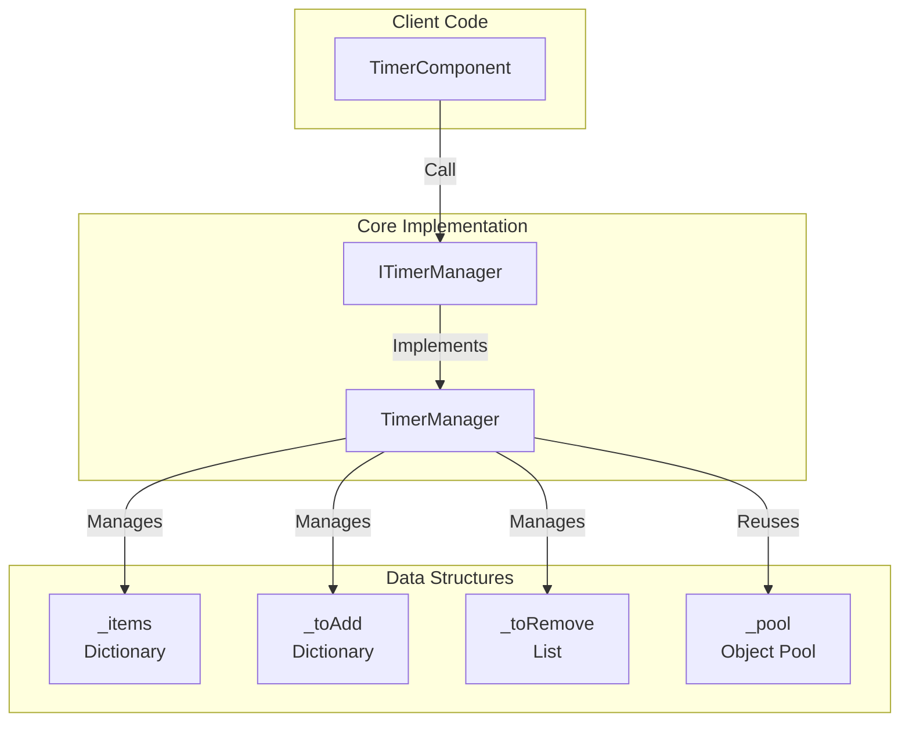
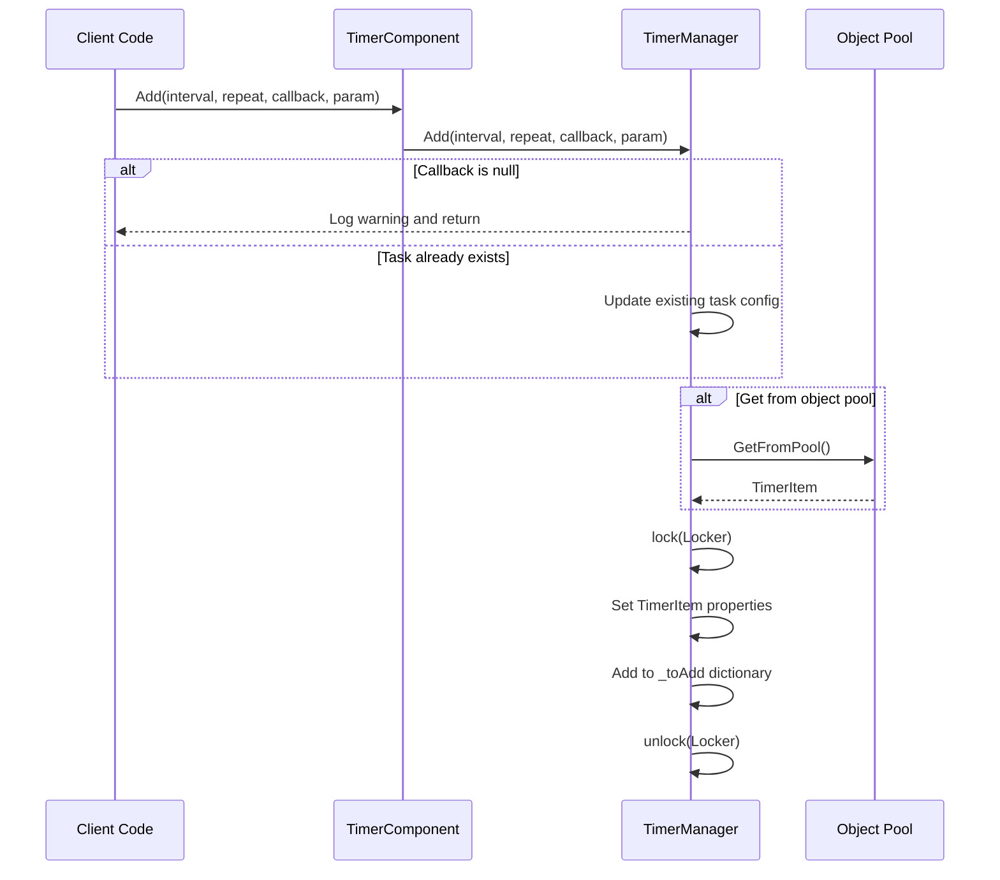
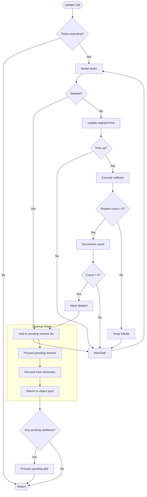

# Adding Timed Tasks

This document introduces how to add various timed tasks in the GameFrameX Timer component.

## Overview

The Timer component provides three ways to add timed tasks:

1. **Add Method** - Add a recurring timed task
2. **AddOnce Method** - Add a one-time task
3. **AddUpdate Method** - Add a per-frame task

All tasks are exposed to Unity components through TimerComponent, with internal timed logic implemented by TimerManager.

## Core Concepts

### Timed Task Parameters

| Parameter | Type | Description |
|------|------|------|
| interval | float | Interval time (seconds) |
| repeat | int | Repeat count (0 means infinite repeat) |
| callback | Action\<object\> | Callback function |
| callbackParam | object | Parameter passed to callback (optional) |

### Task State Management

TimerManager uses the following data structures to manage tasks:

- `_items` - Dictionary of tasks currently executing
- `_toAdd` - Tasks waiting to be added to the execution queue
- `_toRemove` - Tasks waiting to be removed
- `_pool` - Object pool for reusing TimerItem objects



## Task Addition Flow



### Task Execution Flow



## Usage Examples

### Basic Timed Task

Add a task that executes every 1 second, 10 times total:

```csharp
// Add timed task through TimerComponent
var timerComponent = gameObject.GetComponent<TimerComponent>();
timerComponent.Add(1.0f, 10, callback, null);

void callback(object param)
{
    Debug.Log("Timed task executed!");
}
```

> Source: [TimerComponent.cs](https://github.com/GameFrameX/com.gameframex.unity.timer/blob/main/Runtime/Timer/TimerComponent.cs#L37-L40)

### Infinite Repeat Task

Add an infinite loop task that executes every 2 seconds (repeat = 0 means infinite):

```csharp
// repeat of 0 means infinite repeat
timerComponent.Add(2.0f, 0, onInfiniteTick, "myData");

void onInfiniteTick(object param)
{
    string data = param as string;
    Debug.Log($"Infinite task executed, data: {data}");
}
```

> Source: [TimerManager.cs](https://github.com/GameFrameX/com.gameframex.unity.timer/blob/main/Runtime/Timer/TimerManager.cs#L156-L188)

### Task with Parameters

Pass custom data through callbackParam:

```csharp
// Pass complex data object
var myData = new { Name = "Player", Score = 100 };
timerComponent.Add(1.0f, 5, onScoreUpdate, myData);

void onScoreUpdate(object param)
{
    var data = param as dynamic;
    Debug.Log($"Player: {data.Name}, Score: {data.Score}");
}
```

> Source: [TimerManager.cs](https://github.com/GameFrameX/com.gameframex.unity.timer/blob/main/Runtime/Timer/TimerManager.cs#L24-L30)

## Internal Implementation Details

### TimerItem Data Structure

```csharp
class TimerItem
{
    public float Interval;      // Interval time
    public int Repeat;           // Remaining repeat count
    public Action<object> Callback;  // Callback function
    public object Param;        // Callback parameter

    public float Elapsed;       // Elapsed time
    public bool Deleted;        // Deletion flag
}
```

> Source: [TimerManager.cs](https://github.com/GameFrameX/com.gameframex.unity.timer/blob/main/Runtime/Timer/TimerManager.cs#L14-L31)

### Time Precision Handling

TimerManager processes time accumulation in Update:

```csharp
timerItem.Elapsed += realElapseSeconds;
if (timerItem.Elapsed < timerItem.Interval)
{
    continue;  // Time not up, skip
}

timerItem.Elapsed -= timerItem.Interval;
// Handle time drift: reset if elapsed is too small or too large
if (timerItem.Elapsed < 0 || timerItem.Elapsed > 0.03f)
    timerItem.Elapsed = 0;
```

This design ensures:
- Tasks execute at precise intervals
- Accumulated time errors are automatically corrected
- Relatively accurate timing even with frame rate fluctuations

> Source: [TimerManager.cs](https://github.com/GameFrameX/com.gameframex.unity.timer/blob/main/Runtime/Timer/TimerManager.cs#L63-L71)

### Object Pool Mechanism

To reduce garbage collection pressure, TimerManager implements an object pool:

```csharp
private TimerItem GetFromPool()
{
    if (_pool.Count > 0)
    {
        var item = _pool[_pool.Count - 1];
        _pool.RemoveAt(_pool.Count - 1);
        item.Deleted = false;
        item.Elapsed = 0;
        return item;
    }
    return new TimerItem();
}

private void ReturnToPool(TimerItem t)
{
    t.Callback = null;
    _pool.Add(t);
}
```

> Source: [TimerManager.cs](https://github.com/GameFrameX/com.gameframex.unity.timer/blob/main/Runtime/Timer/TimerManager.cs#L266-L289)

### Thread Safety

All operations on the task dictionary use lock protection:

```csharp
private static readonly object Locker = new object();

public void Add(float interval, int repeat, Action<object> callback, object callbackParam = null)
{
    lock (Locker)
    {
        // ... Add task logic
    }
}
```

> Source: [TimerManager.cs](https://github.com/GameFrameX/com.gameframex.unity.timer/blob/main/Runtime/Timer/TimerManager.cs#L38)

## Exception Handling

TimerManager provides static configuration to control callback exception handling:

```csharp
// By default, exceptions are not caught and are thrown directly
public static bool CatchCallbackExceptions = false;

// Enable exception catching
TimerManager.CatchCallbackExceptions = true;
```

When enabled, exceptions are caught and warning logs are recorded, and the task is automatically deleted.

> Source: [TimerManager.cs](https://github.com/GameFrameX/com.gameframex.unity.timer/blob/main/Runtime/Timer/TimerManager.cs#L42-L43)

## Related Links

- [Add One-Time Task](./4-core-functions.add-once) - Learn more about AddOnce method
- [Add Frame Update Task](./4-core-functions.add-update) - Learn more about AddUpdate method
- [Check and Remove Tasks](./4-core-functions.exists-remove) - Learn how to check and remove tasks
- [TimerComponent API Reference](./5-api-reference.timer-component) - Complete API documentation
- [ITimerManager Interface](./5-api-reference.itimer-manager) - Interface definition
- [TimerManager Implementation](./5-api-reference.timer-manager) - Internal implementation details
