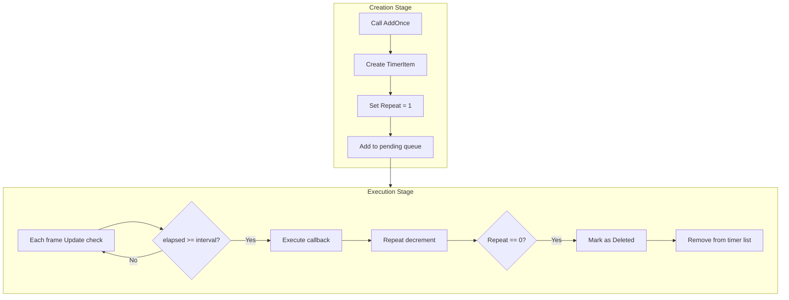

# Adding One-Time Tasks

The one-time task feature allows developers to add a task that executes only once, suitable for delayed execution, one-time event triggering, and other scenarios.

## Overview

`AddOnce` is one of the core methods provided by the Timer component, used to add a task that executes only once. This method triggers the callback function after a specified delay time, and automatically removes itself from the timer list after execution.

**Use Cases:**
- Delayed execution of an operation (e.g., display a prompt after a few seconds)
- One-time event triggering (e.g., game start countdown)
- Delayed initialization of some components
- Timed reminder functionality

## Core Implementation

The internal implementation of `AddOnce` is very simple - it reuses the `Add` method with repeat count set to 1:

```csharp
// TimerManager.cs lines 197-200
public void AddOnce(float interval, Action<object> callback, object callbackParam = null)
{
    Add(interval, 1, callback, callbackParam);
}
```

> Source: [TimerManager.cs](https://github.com/GameFrameX/com.gameframex.unity.timer/blob/main/Runtime/Timer/TimerManager.cs#L197-L200)

**Design Intent:** By reusing the `Add` method, the code is simpler and leverages the existing object pool and thread-safe mechanisms, reducing duplicate code and potential bugs.

## How It Works



## Usage Examples

### Basic Usage

Add a task that executes after 3 seconds:

```csharp
// Get TimerComponent
var timerComponent = GetComponent<TimerComponent>();

// Add a task that executes once after 3 seconds
timerComponent.AddOnce(3f, OnTimerComplete);

// Callback method
private void OnTimerComplete(object param)
{
    Debug.Log("Timed task completed!");
}
```

> Source: [README.md](https://github.com/GameFrameX/com.gameframex.unity.timer/blob/main/README.md#L44-L52)

### Passing Parameters

Custom parameters can be passed to the callback function:

```csharp
// Add one-time task with parameters
timerComponent.AddOnce(5f, OnDelayedAction, "Custom Parameter");

// Callback method receives parameter
private void OnDelayedAction(object param)
{
    string message = param as string;
    Debug.Log($"Received parameter: {message}");
}
```

### Usage at Manager Level

Use the `ITimerManager` interface directly:

```csharp
// Get TimerManager module
var timerManager = GameFrameworkEntry.GetModule<ITimerManager>();

// Add one-time task
timerManager.AddOnce(2f, OnManagerTimer, null);
```

> Source: [ITimerManager.cs](https://github.com/GameFrameX/com.gameframex.unity.timer/blob/main/Runtime/Timer/ITimerManager.cs#L26)

## API Reference

### `TimerComponent.AddOnce`

```csharp
public void AddOnce(float interval, Action<object> callback, object callbackParam = null)
```

**Function Description:** Add a task that executes only once.

**Parameter Description:**

| Parameter | Type | Required | Default | Description |
|------|------|------|--------|------|
| `interval` | float | Yes | - | Delay time in seconds |
| `callback` | Action\<object\> | Yes | - | Callback function to execute when task triggers |
| `callbackParam` | object | No | null | Parameter passed to the callback function |

**Example:**

```csharp
timerComponent.AddOnce(3f, MyCallback, "test");
```

### `ITimerManager.AddOnce`

```csharp
void AddOnce(float interval, Action<object> callback, object callbackParam = null);
```

**Function Description:** Add a one-time task at the timer manager level.

**Detailed Description:** Refer to [TimerComponent.AddOnce](#timercomponentaddonce) parameter description, both signatures are identical.

> Source: [ITimerManager.cs](https://github.com/GameFrameX/com.gameframex.unity.timer/blob/main/Runtime/Timer/ITimerManager.cs#L20-L26)

## Important Notes

1. **Time Unit**: The `interval` parameter is in **seconds**, not milliseconds. For example, passing `5f` means execute after 5 seconds.

2. **Callback Signature**: The callback function must accept one `object` type parameter, even if the parameter is not used:

   ```csharp
   // Correct
   void MyCallback(object param) { }

   // Incorrect - signature mismatch
   void MyCallback() { }
   ```

3. **Auto Removal**: The task is automatically removed from the timer list after execution, no manual `Remove` call needed.

4. **Duplicate Addition**: If `AddOnce` is called again with the same callback function, the existing task's parameters (interval and callback parameter) will be updated.

5. **Thread Safety**: The `AddOnce` method internally uses a lock mechanism and can be safely called in multi-threaded environments.

## Related Links

- [Add Timed Task](./4-core-functions.add-timer) - Learn how to add recurring timed tasks
- [Add Frame Update Task](./4-core-functions.add-update) - Learn how to add per-frame tasks
- [Check and Remove Tasks](./4-core-functions.exists-remove) - Learn how to check and remove tasks
- [TimerComponent API Reference](./5-api-reference.timer-component) - Complete TimerComponent API documentation
- [ITimerManager API Reference](./5-api-reference.itimer-manager) - Complete ITimerManager interface documentation
- [TimerManager API Reference](./5-api-reference.timer-manager) - Complete TimerManager implementation documentation
