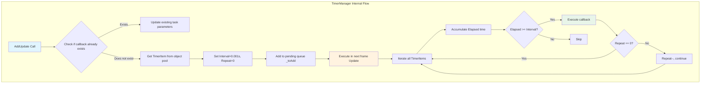
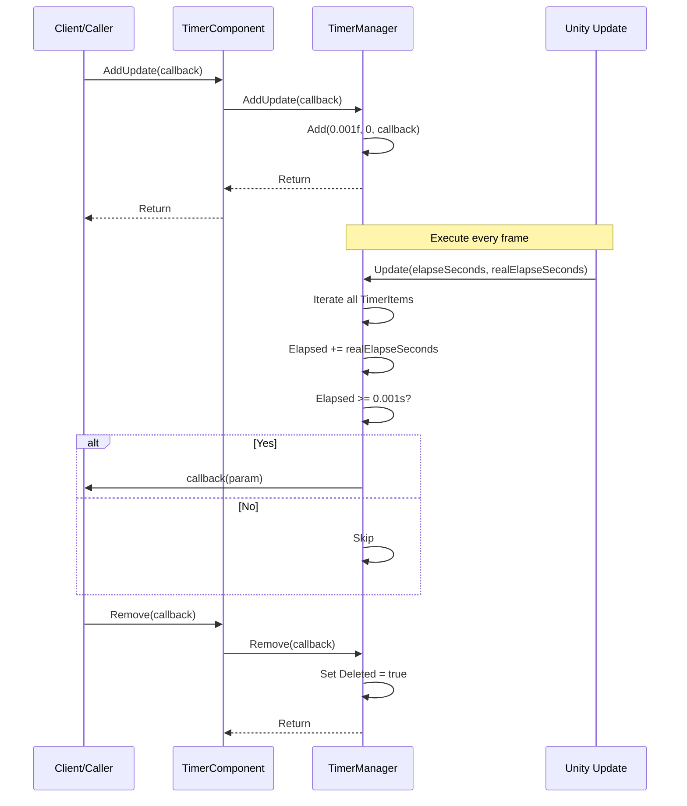

# Adding Frame Update Tasks

Adding frame update tasks is one of the core features of the Timer component, used to register a callback function that executes on every frame. Unlike timed tasks and one-time tasks, frame update tasks are suitable for operations that require continuous high-frequency execution, such as input detection in games, animation updates, or logic that needs to run every frame.

## Overview

Frame update tasks (AddUpdate) are a special type of timed task. The internal implementation sets the interval time to an extremely small value (0.001 seconds) and the repeat count to infinite (0 means infinite repeat). This means the registered callback function will be called in every Unity frame update.



### Core Features

- **Infinite Execution**: repeat parameter is 0, meaning the task continues executing until manually removed
- **High-Frequency Invocation**: Executes every frame (approximately every 16ms, depending on frame rate)
- **Parameter Support**: Supports passing custom parameters to callback functions
- **Duplicate Registration Detection**: If the same callback already exists, parameters are automatically updated instead of creating a new task

## How It Works

### Internal Implementation

Frame update tasks are essentially a special timed task, implemented by:

> Source: [TimerManager.cs#L206-L219](https://github.com/GameFrameX/com.gameframex.unity.timer/blob/main/Runtime/Timer/TimerManager.cs#L206-L219)

```csharp
/// <summary>
/// Add a per-frame update task
/// </summary>
/// <param name="callback">Callback function to execute</param>
public void AddUpdate(Action<object> callback)
{
    Add(0.001f, 0, callback);
}

/// <summary>
/// Add a per-frame update task
/// </summary>
/// <param name="callback">Callback function to execute</param>
/// <param name="callbackParam">Parameters for the callback function</param>
public void AddUpdate(Action<object> callback, object callbackParam)
{
    Add(0.001f, 0, callback, callbackParam);
}
```

Core logic analysis:
1. **Interval = 0.001f**: Set to an extremely small interval (approximately 1 millisecond) to ensure triggering every frame
2. **Repeat = 0**: Set to 0 means infinite repeat, task will not auto-remove
3. **Add Method**: Reuses existing timed task addition logic for unified management

### Execution Flow



## Usage Examples

### Basic Usage

The following example shows how to execute a method every frame in a game loop:

```csharp
using GameFrameX.Timer.Runtime;
using UnityEngine;

public class PlayerController : MonoBehaviour
{
    private TimerComponent _timerComponent;

    private void Start()
    {
        // Get TimerComponent
        _timerComponent = GetComponent<TimerComponent>();

        // Register per-frame task
        _timerComponent.AddUpdate(OnEveryFrame);
    }

    private void OnEveryFrame(object param)
    {
        // Per-frame logic
        // Example: process input, update animation state, etc.
        Debug.Log("Executing every frame");
    }

    private void OnDestroy()
    {
        // Remove frame update task to avoid memory leak
        if (_timerComponent != null)
        {
            _timerComponent.Remove(OnEveryFrame);
        }
    }
}
```

### Usage with Parameters

If you need to pass custom parameters in the callback, use the overload with parameters:

```csharp
public class GameManager : MonoBehaviour
{
    private TimerComponent _timerComponent;
    private int _frameCount = 0;

    private void Start()
    {
        _timerComponent = GetComponent<TimerComponent>();

        // Pass current object as parameter
        _timerComponent.AddUpdate(OnUpdateWithParam, this);
    }

    private void OnUpdateWithParam(object param)
    {
        // Convert parameter back to original type
        var gameManager = param as GameManager;
        if (gameManager != null)
        {
            gameManager._frameCount++;
            if (gameManager._frameCount % 60 == 0)
            {
                Debug.Log($"Has run for {gameManager._frameCount} frames");
            }
        }
    }
}
```

### Using Lambda Expressions

For simple logic, lambda expressions can be used to simplify code:

```csharp
private TimerComponent _timerComponent;

private void Start()
{
    _timerComponent = GetComponent<TimerComponent>();

    // Use lambda expression
    _timerComponent.AddUpdate(param =>
    {
        var deltaTime = (float)param;
        // Execute frame-based logic
    }, Time.deltaTime);
}
```

### Checking if Task Exists

Before adding a frame update task, you can check if the same callback already exists:

```csharp
private void Start()
{
    _timerComponent = GetComponent<TimerComponent>();

    // Check if task exists
    if (!_timerComponent.Exists(OnEveryFrame))
    {
        _timerComponent.AddUpdate(OnEveryFrame);
    }
}

private void OnEveryFrame(object param)
{
    // Business logic
}
```

## API Reference

### `TimerComponent.AddUpdate`

> See [TimerComponent API Reference](./5-api-reference.timer-component) for full details

### `ITimerManager.AddUpdate`

> See [ITimerManager API Reference](./5-api-reference.itimer-manager) for full details

### `TimerManager.AddUpdate`

> See [TimerManager API Reference](./5-api-reference.timer-manager) for full details

## Important Notes

1. **Performance Consideration**: Callbacks that execute every frame should remain simple and avoid time-consuming operations
2. **Timely Removal**: When frame update tasks are no longer needed, you must manually call `Remove()` to remove them, otherwise it will cause memory leaks and continuous performance consumption
3. **Duplicate Registration**: The system automatically handles duplicate registrations (updates existing task parameters), but it is recommended to use `Exists()` to check before adding
4. **Frame Rate Dependency**: Task execution frequency depends on the game's frame rate; execution frequency will decrease in low frame rate situations

## Best Practices

| Scenario | Recommended Approach |
|------|----------|
| Input Detection | Use AddUpdate, check input state every frame |
| Animation State Machine | Use AddUpdate, update animation parameters |
| Long-Running Tasks | Periodically check and call Remove() when appropriate |
| Conditional Triggering | Combine with Exists() method to manage task lifecycle |

## Related Links

- [Add Timed Task](./4-core-functions.add-timer)
- [Add One-Time Task](./4-core-functions.add-once)
- [Check and Remove Tasks](./4-core-functions.exists-remove)
- [TimerComponent API Reference](./5-api-reference.timer-component)
- [ITimerManager API Reference](./5-api-reference.itimer-manager)
- [TimerManager API Reference](./5-api-reference.timer-manager)
