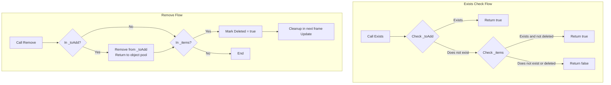

# Checking and Removing Tasks

In the Timer component, in addition to adding timed tasks, functionality is also provided to check if a task exists and to remove tasks. These functions are very useful for dynamically managing timed tasks, avoiding duplicate additions, or canceling tasks under specific conditions.

## Overview

TimerComponent provides two core methods for checking and removing tasks:

- **Exists** - Check if a task corresponding to the specified callback function exists
- **Remove** - Remove (cancel) the task corresponding to the specified callback function

Both methods use the callback function reference (`Action<object>`) to identify and operate on tasks, so it is important to ensure the same delegate instance is passed.

## Core Functions

### Check if Task Exists

The `Exists` method is used to check whether the specified callback function corresponds to a valid timed task.

```csharp
public bool Exists(Action<object> callback)
```

**Implementation Principle:**

> Source: [TimerManager.cs](https://github.com/GameFrameX/com.gameframex.unity.timer/blob/main/Runtime/Timer/TimerManager.cs#L226-L243)

```csharp
public bool Exists(Action<object> callback)
{
    lock (Locker)
    {
        // Step 1: Check pending addition list
        if (_toAdd.ContainsKey(callback))
        {
            return true;
        }

        // Step 2: Check active tasks list
        if (_items.TryGetValue(callback, out var at))
        {
            // Only tasks not marked as deleted are considered existing
            return !at.Deleted;
        }

        return false;
    }
}
```

**Check Logic Description:**

1. **Pending Queue (`_toAdd`)**: Check if the task is in the queue waiting to be added - newly created but not yet effective
2. **Active Tasks List (`_items`)**: Check if the task is in the currently active tasks list
3. **Deletion Flag (`Deleted`)**: Only tasks not marked for deletion return true

### Remove Specified Task

The `Remove` method is used to remove (cancel) a specified timed task. This method uses a delayed deletion mechanism - it does not remove from the dictionary immediately, but cleans up in the next frame Update.

```csharp
public void Remove(Action<object> callback)
```

**Implementation Principle:**

> Source: [TimerManager.cs](https://github.com/GameFrameX/com.gameframex.unity.timer/blob/main/Runtime/Timer/TimerManager.cs#L249-L264)

```csharp
public void Remove(Action<object> callback)
{
    lock (Locker)
    {
        // If task is still in pending queue, cancel directly and return to object pool
        if (_toAdd.TryGetValue(callback, out var t))
        {
            _toAdd.Remove(callback);
            ReturnToPool(t);
        }

        // If task is already in active list, mark as deleted
        if (_items.TryGetValue(callback, out t))
        {
            t.Deleted = true;
        }
    }
}
```

**Removal Logic Description:**

1. **Pending Queue**: If the task has not yet started executing (still in `_toAdd`), remove directly from the queue and return to object pool
2. **Active List**: If the task is executing in the active list, mark it as `Deleted = true`
3. **Delayed Cleanup**: In the next frame's `Update()` loop, all tasks marked as Deleted are automatically cleaned up

## Workflow Diagram



## Usage Examples

### Basic Usage

```csharp
using GameFrameX.Timer.Runtime;
using UnityEngine;

public class TimerExample : MonoBehaviour
{
    private TimerComponent _timer;

    private void Start()
    {
        _timer = GetComponent<TimerComponent>();

        // Define a callback method
        void OnTick(object param)
        {
            Debug.Log($"Tick at {Time.time}");
        }

        // Add a timed task, execute every second
        _timer.Add(1.0f, 0, OnTick);

        // Check if task exists
        bool exists = _timer.Exists(OnTick);
        Debug.Log($"Task exists: {exists}"); // Output: True

        // Remove task
        _timer.Remove(OnTick);

        // Check again
        exists = _timer.Exists(OnTick);
        Debug.Log($"Task exists: {exists}"); // Output: False
    }
}
```

> Source: [TimerComponent.cs](https://github.com/GameFrameX/com.gameframex.unity.timer/blob/main/Runtime/Timer/TimerComponent.cs#L72-L89)

### Dynamic Task Management

In real applications, you may need to dynamically add and remove tasks based on game state:

```csharp
public class GameTimerManager : MonoBehaviour
{
    private TimerComponent _timer;
    private Action<object> _gameLoopTask;

    private void Start()
    {
        _timer = GetComponent<TimerComponent>();
        _gameLoopTask = OnGameLoop;
    }

    // Stop loop task when pausing game
    public void PauseGame()
    {
        if (_timer.Exists(_gameLoopTask))
        {
            _timer.Remove(_gameLoopTask);
            Debug.Log("Game loop task paused");
        }
    }

    // Restart loop task when resuming game
    public void ResumeGame()
    {
        if (!_timer.Exists(_gameLoopTask))
        {
            _timer.AddUpdate(_gameLoopTask);
            Debug.Log("Game loop task resumed");
        }
    }

    private void OnGameLoop(object param)
    {
        // Game loop logic
    }
}
```

### Notes on Lambda Expressions

When using lambda expressions, you need to be particularly careful because each lambda expression creates a new delegate instance, resulting in inability to correctly match and remove tasks:

```csharp
// Incorrect example: Lambda expression creates new instance each time
_timer.Add(1.0f, 5, (param) => Debug.Log("Tick"));
_timer.Exists((param) => Debug.Log("Tick")); // Returns False because it's a different delegate instance
_timer.Remove((param) => Debug.Log("Tick"));  // Cannot remove because it's a different delegate instance

// Correct example: Use named method or save delegate reference
Action<object> myTick = (param) => Debug.Log("Tick");
_timer.Add(1.0f, 5, myTick);
_timer.Exists(myTick);  // Returns True
_timer.Remove(myTick);   // Correctly removes
```

## Thread Safety

Both `Exists` and `Remove` methods use `lock (Locker)` to ensure thread safety. Since TimerManager's Update method also executes operations within the lock, these methods can be safely called from any thread.

> Source: [TimerManager.cs](https://github.com/GameFrameX/com.gameframex.unity.timer/blob/main/Runtime/Timer/TimerManager.cs#L38)

```csharp
private static readonly object Locker = new object();
```

## API Reference

### TimerComponent

#### `Exists(callback: Action<object>): bool`

Check if the specified task exists.

**Parameters:**
- `callback` (`Action<object>`): Callback function to check

**Returns:**
- `bool`: Returns true if task exists and is not marked for deletion, otherwise returns false

#### `Remove(callback: Action<object>): void`

Remove the specified task.

**Parameters:**
- `callback` (`Action<object>`): Callback function to remove

**Description:**
- If the task is in the pending queue, it is removed immediately
- If the task is in the active list, it is marked for deletion, cleaned up in the next frame

### ITimerManager

> Source: [ITimerManager.cs](https://github.com/GameFrameX/com.gameframex.unity.timer/blob/main/Runtime/Timer/ITimerManager.cs#L41-L52)

The interface definition is identical:

```csharp
bool Exists(Action<object> callback);
void Remove(Action<object> callback);
```

## Common Issues

### Why does Exists still return true after Remove?

If Exists is called immediately after Remove, it may still return true because:
1. The task is marked as Deleted but has not been cleaned up in the next frame Update
2. Solution: Wait one frame after Remove, or use other mechanisms to confirm

### What to do if Lambda expression cannot match task?

As mentioned earlier, each lambda expression creates a new delegate instance. Solutions:
1. Use named methods instead of lambdas
2. Save and reuse delegate references

### Will multiple Remove calls cause problems?

No. The Remove method is designed to be idempotent - multiple calls will not cause errors. If the task does not exist, the method silently returns.

## Related Links

- [Timer Component Overview](../1-overview.introduction)
- [Features](../1-overview.features)
- [Add Timed Task](./4-core-functions.add-timer)
- [Add One-Time Task](./4-core-functions.add-once)
- [Add Frame Update Task](./4-core-functions.add-update)
- [API Reference - TimerComponent](./5-api-reference.timer-component)
- [API Reference - ITimerManager](./5-api-reference.itimer-manager)
