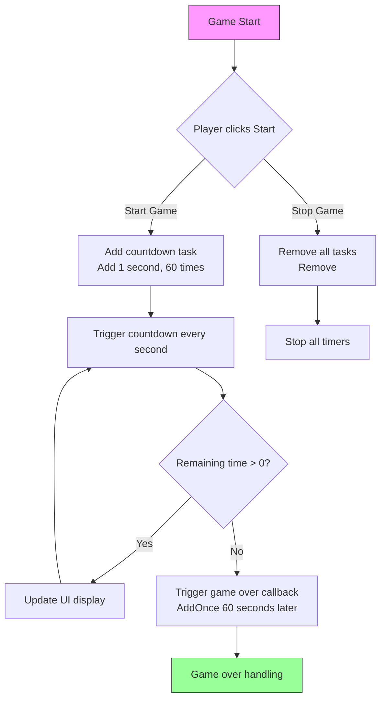

# Samples

This chapter provides complete usage examples of the Timer component, demonstrating how to practically apply various timed task functions in Unity projects.

## Overview

The Timer component provides a complete set of timed task solutions, supporting the following timing modes:
- **Recurring Timed Tasks**: Execute repeatedly at fixed intervals
- **One-Time Timed Tasks**: Execute once after a specified delay
- **Frame Update Tasks**: Execute once per frame, suitable for scenarios requiring continuous monitoring

These examples are based on actual source code and can be used directly in your projects.

## Basic Usage Examples

### Adding Recurring Timed Task

The following example shows how to create a timed task that executes every 1 second, 10 times total:

```csharp
using GameFrameX.Timer.Runtime;
using UnityEngine;

public class TimerExample : MonoBehaviour
{
    private TimerComponent _timerComponent;

    private void Start()
    {
        // Get TimerComponent
        _timerComponent = GetComponent<TimerComponent>();

        // Add timed task: every 1 second, 10 times total
        _timerComponent.Add(1f, 5, OnTimerTick, "Hello Timer");
    }

    private void OnTimerTick(object param)
    {
        Debug.Log($"Timed task triggered, parameter: {param}");
    }
}
```
> Source: [TimerComponent.cs](https://github.com/GameFrameX/com.gameframex.unity.timer/blob/main/Runtime/Timer/TimerComponent.cs#L37-L40)

### Adding One-Time Timed Task

Use `AddOnce` method to add a task that executes once after a delay:

```csharp
using GameFrameX.Timer.Runtime;
using UnityEngine;

public class DelayedTaskExample : MonoBehaviour
{
    private TimerComponent _timerComponent;

    private void Start()
    {
        _timerComponent = GetComponent<TimerComponent>();

        // Execute once after 5 seconds
        _timerComponent.AddOnce(5f, OnDelayedExecute, "Delayed task completed");
    }

    private void OnDelayedExecute(object param)
    {
        Debug.Log($"Delayed task executed: {param}");
        // Logic after delay can be placed here, such as showing settlement screen, etc.
    }
}
```
> Source: [TimerComponent.cs](https://github.com/GameFrameX/com.gameframex.unity.timer/blob/main/Runtime/Timer/TimerComponent.cs#L48-L51)

### Adding Frame Update Task

Use `AddUpdate` to add a task that executes every frame:

```csharp
using GameFrameX.Timer.Runtime;
using UnityEngine;

public class FrameUpdateExample : MonoBehaviour
{
    private TimerComponent _timerComponent;
    private int _frameCount = 0;

    private void Start()
    {
        _timerComponent = GetComponent<TimerComponent>();

        // Execute task once per frame
        _timerComponent.AddUpdate(OnFrameUpdate, null);
    }

    private void OnFrameUpdate(object param)
    {
        _frameCount++;
        if (_frameCount % 60 == 0) // Print once every 60 frames
        {
            Debug.Log($"Has run for {_frameCount} frames");
        }
    }
}
```
> Source: [TimerComponent.cs](https://github.com/GameFrameX/com.gameframex.unity.timer/blob/main/Runtime/Timer/TimerComponent.cs#L57-L70)

## Checking and Removing Tasks

### Checking if Task Exists

In practical applications, you may need to check if a timed task is still running:

```csharp
using GameFrameX.Timer.Runtime;
using UnityEngine;

public class CheckTimerExample : MonoBehaviour
{
    private TimerComponent _timerComponent;
    private Action<object> _myTimerCallback;

    private void Start()
    {
        _timerComponent = GetComponent<TimerComponent>();

        // Save callback reference for later checking
        _myTimerCallback = OnTimerTick;

        // Add timed task
        _timerComponent.Add(1f, 10, _myTimerCallback, null);

        // Check if task exists
        bool exists = _timerComponent.Exists(_myTimerCallback);
        Debug.Log($"Task exists: {exists}");
    }

    private void OnTimerTick(object param)
    {
        Debug.Log("Timed task executing...");
    }
}
```
> Source: [TimerComponent.cs](https://github.com/GameFrameX/com.gameframex.unity.timer/blob/main/Runtime/Timer/TimerComponent.cs#L77-L80)

### Removing Specified Task

Timed tasks can be removed via the callback function reference:

```csharp
using GameFrameX.Timer.Runtime;
using UnityEngine;

public class RemoveTimerExample : MonoBehaviour
{
    private TimerComponent _timerComponent;
    private Action<object> _repeatTimerCallback;
    private bool _shouldStop = false;

    private void Start()
    {
        _timerComponent = GetComponent<TimerComponent>();

        // Create callback to remove
        _repeatTimerCallback = OnRepeatTick;

        // Add infinitely repeating timed task
        _timerComponent.Add(1f, 0, _repeatTimerCallback, null);

        // Remove task after 10 seconds
        _timerComponent.AddOnce(10f, OnStopTimer, null);
    }

    private void OnRepeatTick(object param)
    {
        if (_shouldStop) return;
        Debug.Log("Repeating task executing...");
    }

    private void OnStopTimer(object param)
    {
        _shouldStop = true;
        // Remove timed task
        _timerComponent.Remove(_repeatTimerCallback);
        Debug.Log("Timed task removed");
    }
}
```
> Source: [TimerComponent.cs](https://github.com/GameFrameX/com.gameframex.unity.timer/blob/main/Runtime/Timer/TimerComponent.cs#L86-L89)

## Complete Usage Example

The following is a more complete example demonstrating how to practically apply the Timer component in game development:

```csharp
using GameFrameX.Timer.Runtime;
using UnityEngine;
using UnityEngine.UI;

public class GameTimerController : MonoBehaviour
{
    [Header("UI Components")]
    public Text timerText;
    public Button startButton;
    public Button stopButton;

    private TimerComponent _timerComponent;
    private int _remainingSeconds;
    private Action<object> _countdownCallback;
    private Action<object> _gameOverCallback;

    private void Awake()
    {
        _timerComponent = GetComponent<TimerComponent>();

        // Initialize callback references
        _countdownCallback = OnCountdownTick;
        _gameOverCallback = OnGameOver;
    }

    private void Start()
    {
        // Bind button events
        startButton.onClick.AddListener(StartGame);
        stopButton.onClick.AddListener(StopGame);

        UpdateTimerDisplay(0);
    }

    private void StartGame()
    {
        // Countdown: execute every second, 60 seconds total
        _remainingSeconds = 60;
        _timerComponent.Add(1f, 60, _countdownCallback, null);

        // Trigger when game ends
        _timerComponent.AddOnce(60f, _gameOverCallback, "Time's up!");
    }

    private void StopGame()
    {
        // Stop all timed tasks
        _timerComponent.Remove(_countdownCallback);
        _timerComponent.Remove(_gameOverCallback);
        Debug.Log("Game stopped");
    }

    private void OnCountdownTick(object param)
    {
        _remainingSeconds--;
        UpdateTimerDisplay(_remainingSeconds);
    }

    private void OnGameOver(object param)
    {
        Debug.Log(param);
        UpdateTimerDisplay(0);
        // Game over handling logic
    }

    private void UpdateTimerDisplay(int seconds)
    {
        if (timerText != null)
        {
            int minutes = seconds / 60;
            int secs = seconds % 60;
            timerText.text = $"{minutes:D2}:{secs:D2}";
        }
    }
}
```

### Task Flow Diagram



## Exception Handling

TimerManager provides a global exception catching function to prevent game crashes caused by exceptions in timed tasks:

```csharp
using GameFrameX.Timer.Runtime;
using UnityEngine;

public class ExceptionHandlingExample : MonoBehaviour
{
    private TimerComponent _timerComponent;

    private void Start()
    {
        _timerComponent = GetComponent<TimerComponent>();

        // Enable exception catching
        TimerManager.CatchCallbackExceptions = true;

        // Add timed task that may throw exceptions
        _timerComponent.Add(2f, 3, OnRiskyTask, null);
    }

    private void OnRiskyTask(object param)
    {
        // Simulate possible exception
        if (Random.value > 0.5f)
        {
            throw new System.Exception("Simulated timed task exception");
        }
        Debug.Log("Task executed safely");
    }
}
```
> Source: [TimerManager.cs](https://github.com/GameFrameX/com.gameframex.unity.timer/blob/main/Runtime/Timer/TimerManager.cs#L43)

## Parameter Passing Example

All timed tasks support parameter passing, which can be received in the callback:

```csharp
using GameFrameX.Timer.Runtime;
using UnityEngine;

public class ParameterExample : MonoBehaviour
{
    private TimerComponent _timerComponent;

    private void Start()
    {
        _timerComponent = GetComponent<TimerComponent>();

        // Pass custom parameter object
        var gameData = new GameTimerData
        {
            levelId = 1,
            score = 1000
        };

        _timerComponent.Add(1f, 5, OnGameTimerTick, gameData);
    }

    private void OnGameTimerTick(object param)
    {
        if (param is GameTimerData data)
        {
            Debug.Log($"Level: {data.levelId}, Score: {data.score}");
            data.score += 100;
        }
    }
}

public class GameTimerData
{
    public int levelId;
    public int score;
}
```
> Source: [TimerComponent.cs](https://github.com/GameFrameX/com.gameframex.unity.timer/blob/main/Runtime/Timer/TimerComponent.cs#L37-L40)

## Usage Scenario Summary

| Scenario | Recommended Method | Description |
|------|----------|------|
| Timed Data Refresh | Add | Execute periodically at fixed intervals |
| Delayed Execution | AddOnce | Execute once after a specified delay |
| Per-Frame Detection | AddUpdate | Suitable for input detection, state monitoring |
| Countdown Function | Add + AddOnce | Cyclic countdown display, trigger end callback at completion |
| Skill Cooldown | Add | Periodically check cooldown time |
| Animation Playback | AddOnce | Delayed playback or sprite sheet animation |

## Related Links

- [Timer Component Overview](../1-overview.introduction)
- [Features](../1-overview.features)
- [Add Timed Task](../4-core-functions.add-timer)
- [Add One-Time Task](../4-core-functions.add-once)
- [Add Frame Update Task](../4-core-functions.add-update)
- [Check and Remove Tasks](../4-core-functions.exists-remove)
- [TimerComponent API Reference](../5-api-reference.timer-component)
- [ITimerManager API Reference](../5-api-reference.itimer-manager)
- [TimerManager API Reference](../5-api-reference.timer-manager)
- [Troubleshooting](../7-troubleshooting)
