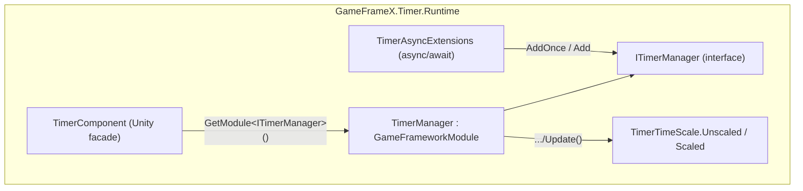

# Overview: What GameFrameX Timer Can Do

GameFrameX Timer is a lightweight timer/task scheduling module for Unity: with a single line of code you can register delayed calls, repeating calls, per-frame updates, and async/await waits. It supports managing lifecycles by ID/callback/tag, and provides pause/resume, remaining time queries, and a timeScale compatibility mode. The runtime core consists of `TimerManager` (module implementation), `TimerComponent` (Unity component facade), and `TimerAsyncExtensions` (async extensions).

## Quick Start

1. Confirm that this package (`com.gameframex.unity.timer`) is installed in the project; the assembly is `GameFrameX.Timer.Runtime`.
2. When the GameFrameX base components already exist in the scene, `TimerComponent` automatically obtains the manager via `GameFrameworkEntry.GetModule<ITimerManager>()`; you can also add it manually via the menu `GameFrameX/Timer` (it is marked with `[DisallowMultipleComponent]`, and only one is allowed per scene).

   ```csharp
   // Wiring logic of TimerComponent.Awake
   [DisallowMultipleComponent]
   [AddComponentMenu("GameFrameX/Timer")]
   [GameFrameXAutoComponent(-5000)]
   public class TimerComponent : GameFrameworkComponent
   {
       ITimerManager _timerManager;

       protected override void Awake()
       {
           ImplementationComponentType = Utility.Assembly.GetType(componentType);
           InterfaceComponentType = typeof(ITimerManager);
           base.Awake();
           _timerManager = GameFrameworkEntry.GetModule<ITimerManager>();
           if (_timerManager == null)
           {
               Log.Fatal("Timer manager is invalid.");
               return;
           }
       }
   }
   ```

   Source: [Runtime/Timer/TimerComponent.cs](https://github.com/GameFrameX/com.gameframex.unity.timer/blob/main/Runtime/Timer/TimerComponent.cs#L12-L31)

3. Get `TimerComponent` in your business scripts and register your first timer:

   ```csharp
   // Execute once after 3 seconds, carrying a parameter
   int id = timerComponent.AddOnce(3f, param => Debug.Log($"done: {param}"), "hello");

   // Repeat 5 times every 1 second, with a tag for batch management; Unscaled means it is not affected by Time.timeScale
   timerComponent.Add(1f, 5, _ => Debug.Log("tick"), null, "battle", TimerTimeScale.Unscaled, onComplete: () => Debug.Log("finished"));
   ```

4. Manage timers as needed:

   ```csharp
   timerComponent.Pause(id);      // Pause (no time accumulates while paused)
   timerComponent.Resume(id);     // Resume
   float left = timerComponent.GetRemaining(id); // Remaining seconds; returns -1 if it does not exist
   timerComponent.Remove(id);     // Remove by ID
   timerComponent.RemoveByTag("battle"); // Batch remove by tag
   ```

   All of the above APIs are actual signatures on `TimerComponent`, such as `public int Add(float interval, int repeat, Action<object> callback, object callbackParam = null, string tag = null, TimerTimeScale timeScale = TimerTimeScale.Unscaled, Action onComplete = null)`, see [Runtime/Timer/TimerComponent.cs](https://github.com/GameFrameX/com.gameframex.unity.timer/blob/main/Runtime/Timer/TimerComponent.cs#L44-L69).

## Capability Quick Reference

| Capability | Entry API | Description |
|------|----------|------|
| One-shot delay | `AddOnce(interval, callback, callbackParam)` | Executes once when due, then automatically removed |
| Repeating calls | `Add(interval, repeat, callback, ...)` | `repeat = 0` means infinite repetition |
| Per-frame update | `AddUpdate(callback)` / `AddUpdate(callback, callbackParam)` | interval is treated as 0, triggers every frame |
| async waits | `WaitForSecondsAsync` / `WaitForNextFrameAsync` / `WaitForFramesAsync` | Completes on the main thread, supports `CancellationToken` |
| Pause/Resume | `Pause(id)` / `Resume(id)` / `IsPaused(id)` | Also by tag: `PauseByTag` / `ResumeByTag` |
| Query state | `Exists(id|callback)` / `HasTag(tag)` / `GetRemaining` / `GetElapsed` / `GetRepeatLeft` | Returns `-1` for numeric values when the timer does not exist |
| Batch removal | `Remove(id|callback)` / `RemoveByTag(tag)` | Triggers `onComplete` on completion |
| Time scaling | `TimerTimeScale.Unscaled` / `Scaled` | Defaults to `Unscaled` (not affected by `Time.timeScale`) |

## How It Works at a Glance



Every frame, `TimerManager.Update(elapseSeconds, realElapseSeconds)` iterates over timer items inside a lock: it accumulates either `elapseSeconds` (Scaled) or `realElapseSeconds` (Unscaled) according to `TimeScaleMode`; items with `interval <= 0` are treated as per-frame triggers; callbacks of due items are first collected into the `_pendingCallbacks` list and then dispatched together, avoiding modifying the collection while iterating the dictionary. For data structures, `Dictionary<Action<object>, TimerItem>` stores active items, `Dictionary<int, Action<object>>` provides the ID mapping, `Dictionary<string, List<int>>` provides the tag index, and `Stack<TimerItem>` pools and reuses items; see [Runtime/Timer/TimerManager.cs](https://github.com/GameFrameX/com.gameframex.unity.timer/blob/main/Runtime/Timer/TimerManager.cs#L42-L49).

`TimerTimeScale` is a two-value enum; `Unscaled = 0` is the default, compatible with existing behavior; only `Scaled = 1` is affected by `UnityEngine.Time.timeScale`; see [Runtime/Timer/TimerTimeScale.cs](https://github.com/GameFrameX/com.gameframex.unity.timer/blob/main/Runtime/Timer/TimerTimeScale.cs#L6-L13).

## What's Next

- For complete parameter descriptions and common variants of creating/removing/pausing timers, see the task page "How to Use Timers".
- async/await usage (see [Runtime/Timer/TimerAsyncExtensions.cs](https://github.com/GameFrameX/com.gameframex.unity.timer/blob/main/Runtime/Timer/TimerAsyncExtensions.cs#L20-L37) for the implementation of the three extensions such as `WaitForSecondsAsync`).
- For troubleshooting issues such as timers not firing or callback parameters being lost, see the troubleshooting page "What to Do When Timers Don't Work".
- For editor extensions (Inspector debug view), see [Editor/Inspector/TimerComponentInspector.cs](https://github.com/GameFrameX/com.gameframex.unity.timer/blob/main/Editor/Inspector/TimerComponentInspector.cs).
- For version history, see [CHANGELOG.md](https://github.com/GameFrameX/com.gameframex.unity.timer/blob/main/CHANGELOG.md).