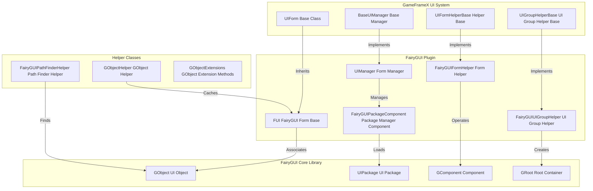

# Introduction

The GameFrameX UI FairyGUI Component is an official UI extension plugin for the GameFrameX framework, specifically designed to provide integration support for the FairyGUI UI system in Unity projects. This plugin encapsulates FairyGUI's core functionality, enabling seamless integration with GameFrameX's UI management subsystem, and implements complete lifecycle management for UI forms including loading, display, hiding, and hierarchy management.

## Overview

FairyGUI is a powerful cross-platform UI editor for Unity. Compared to traditional code-based UI development, FairyGUI provides a visual UI editor supporting multi-platform export (iOS, Android, Windows, Web, etc.) with high-performance rendering efficiency. The GameFrameX UI FairyGUI Component builds on this foundation with deep integration with other GameFrameX framework modules (such as resource management, event system, object pooling, etc.), enabling developers to efficiently develop FairyGUI-based game interfaces.

The core design philosophy of this plugin is to bridge FairyGUI's UI objects (GObject) with GameFrameX's UI abstraction (IUIForm). This preserves FairyGUI's powerful UI editing capabilities while fully utilizing the unified UI management mechanism provided by the GameFrameX framework. Through this plugin, developers can implement features such as asynchronous loading of UI forms, object pool reuse, automatic resource release, and UI group hierarchy management.

## Architecture Design



As shown above, the plugin's architecture follows a clear layered design. The top layer is the UI system interface layer defined by the GameFrameX framework, including UI form base class, UI manager base class, UI form helper base class, and UI group helper base class. These abstract interfaces define standard behaviors and extension points for the UI system.

The middle layer is the FairyGUI plugin's specific implementation layer. The `FUI` class inherits from GameFrameX's `UIForm` base class, implementing FairyGUI-specific form functionality. `UIManager` inherits from `BaseUIManager`, implementing form open and close logic. `FairyGUIFormHelper` inherits from `UIFormHelperBase`, responsible for form instantiation, creation, and release. `FairyGUIUIGroupHelper` inherits from `UIGroupHelperBase`, responsible for UI group creation and depth management.

The bottom layer is FairyGUI's core library, including classes like GObject, UIPackage, GComponent, and GRoot. These are the low-level UI objects and containers provided by FairyGUI. The plugin implements complete UI functionality through interaction with these low-level classes.

The plugin also provides several helper classes, including `GObjectHelper` (for FUI object caching and management), `FairyGUIPathFinderHelper` (for UI object path lookup and parsing), and `GObjectExtensions` (GObject extension methods).

## Core Components

### FUI Form Base Class

`FUI` is the base class for all FairyGUI forms, inheriting from GameFrameX's `UIForm` base class. It encapsulates FairyGUI's GObject and provides core functionalities like form display, hiding, and visibility state management.

```csharp
public class FUI : UIForm
{
    public GObject GObject { get; private set; }
    public Action<bool> OnVisibleChanged { get; set; }

    public override void Show(IUIFormShowHandler handler, Action complete);
    public override void Hide(IUIFormHideHandler handler, Action complete);
    protected override void InternalSetVisible(bool value);
    public override bool Visible { get; protected set; }
    protected override void MakeFullScreen();

    public FUI(GObject gObject, bool isRoot = false);
    public void SetGObject(GObject gObject);
}
```

> Source: [FUI.cs](https://github.com/GameFrameX/com.gameframex.unity.ui.fairygui/blob/main/Runtime/FUI.cs#L42-L197)

### UIManager Form Manager

`UIManager` is responsible for managing the lifecycle of all forms, including form opening, closing, loading, and unloading. It inherits from `BaseUIManager` and implements the UI management interfaces defined by GameFrameX.

```csharp
internal sealed partial class UIManager : BaseUIManager
{
    private FairyGUIPackageComponent FairyGuiPackage { get; set; }

    public override void SetResourceManager(IAssetManager assetManager);
}
```

> Source: [UIManager.cs](https://github.com/GameFrameX/com.gameframex.unity.ui.fairygui/blob/main/Runtime/UIManager.cs#L43-L93)

### FairyGUIPackageComponent Package Manager Component

`FairyGUIPackageComponent` is the FairyGUI package management component, responsible for managing the loading, caching, and unloading of all UI packages. It is a Unity component that can be attached to a GameObject.

```csharp
public sealed class FairyGUIPackageComponent : GameFrameworkComponent
{
    private readonly Dictionary<string, UIPackageData> m_UILoadedPackages = new Dictionary<string, UIPackageData>(32);
    private readonly Dictionary<string, TaskCompletionSource<UIPackage>> m_UIPackageLoading = new Dictionary<string, TaskCompletionSource<UIPackage>>(32);

    public Task<UIPackage> AddPackageAsync(string descFilePath, bool isLoadAsset = true);
    public void AddPackageSync(string descFilePath, bool isLoadAsset = true);
    public void RemovePackage(string packageName);
    public void RemoveAllPackages();
    public bool Has(string uiPackageName);
    public UIPackage Get(string uiPackageName);
}
```

> Source: [FairyGUIPackageComponent.cs](https://github.com/GameFrameX/com.gameframex.unity.ui.fairygui/blob/main/Runtime/FairyGUIPackageComponent.cs#L48-L307)

### FairyGUIFormHelper Form Helper

`FairyGUIFormHelper` inherits from `UIFormHelperBase` and is responsible for form instantiation, creation, and release. It serves as a bridge between the GameFrameX UI system and FairyGUI's core library.

```csharp
public class FairyGUIFormHelper : UIFormHelperBase
{
    public override object InstantiateUIForm(object uiFormAsset);
    public override IUIForm CreateUIForm(object uiFormInstance, Type uiFormType, object userData);
    public override void ReleaseUIForm(object uiFormAsset, object uiFormInstance, object assetHandle, string uiFormAssetPath, string uiFormAssetName);
}
```

> Source: [FairyGUIFormHelper.cs](https://github.com/GameFrameX/com.gameframex.unity.ui.fairygui/blob/main/Runtime/FairyGUIFormHelper.cs#L47-L232)

### FairyGUIUIGroupHelper UI Group Helper

`FairyGUIUIGroupHelper` inherits from `UIGroupHelperBase` and is responsible for UI group creation and depth management. It uses FairyGUI's GComponent to implement the UI group container functionality.

```csharp
public sealed class FairyGUIUIGroupHelper : UIGroupHelperBase
{
    public override int Depth { get; protected set; }
    public override void SetDepth(int depth);
    public override IUIGroupHelper Handler(Transform root, string groupName, string uiGroupHelperTypeName, IUIGroupHelper customUIGroupHelper, int depth = 0);
}
```

> Source: [FairyGUIUIGroupHelper.cs](https://github.com/GameFrameX/com.gameframex.unity.ui.fairygui/blob/main/Runtime/FairyGUIUIGroupHelper.cs#L43-L97)

### GObjectHelper Helper Class

`GObjectHelper` is a static helper class providing FUI object caching and management functionality. Through it, you can implement GObject to FUI mapping and lookup.

```csharp
public static class GObjectHelper
{
    private static readonly Dictionary<GObject, FUI> s_GObjectToFuiMap = new Dictionary<GObject, FUI>();

    public static void ClearAll();
    public static T Get<T>(this GObject self) where T : FUI;
    public static void Add(this GObject self, FUI fui);
    public static FUI Remove(this GObject self);
}
```

> Source: [GObjectHelper.cs](https://github.com/GameFrameX/com.gameframex.unity.ui.fairygui/blob/main/Runtime/GObjectHelper.cs#L42-L115)

### FairyGUIPathFinderHelper Path Finder Helper

`FairyGUIPathFinderHelper` provides UI object path lookup and parsing functionality, supporting quick location of UI elements through path strings.

```csharp
public static class FairyGUIPathFinderHelper
{
    public static string GetUIPath(GObject o);
    public static GObject GetUIFromPath(string path);
    public static bool SearchPathInclude(string path, GObject gObject);
}

public static class GObjectExtensions
{
    public static string GetUIPath(this GObject self);
}
```

> Source: [FairyGUIPathFinderHelper.cs](https://github.com/GameFrameX/com.gameframex.unity.ui.fairygui/blob/main/Runtime/FairyGUIPathFinderHelper.cs#L43-L278)

## Form Open Flow

```mermaid
sequenceDiagram
    participant Client as Client Code
    participant UIMgr as UIManager
    party Package as FairyGUIPackageComponent
    party FormHelper as FairyGUIFormHelper
    party FUI as FUI Form
    party GComp as GComponent

    Client->>UIMgr: OpenUIFormAsync()
    UIMgr->>UIMgr: InnerOpenUIFormAsync()

    alt Exists in Object Pool
        UIMgr->>UIMgr: Get from Object Pool
    else Not in Object Pool
        UIMgr->>Package: Check if UI package is loaded
        alt Package not loaded
            alt Synchronous Load
                Package->>Package: AddPackageSync()
            else Asynchronous Load
                Package->>Package: AddPackageAsync()
            end
        end

        UIMgr->>FormHelper: InstantiateUIForm()
        FormHelper->>GComp: UIPackage.CreateObject()
        GComp-->>FormHelper: Return GComponent instance
    end

    FormHelper->>FUI: CreateUIForm()

    alt Form Type Marked
        FUI->>FUI: Apply ShowAnimation Attribute
        FUI->>FUI: Apply HideAnimation Attribute
    end

    FUI->>GComp: AddChild()
    FUI->>FUI: OnOpen()
    FUI->>FUI: BindEvent()
    FUI->>FUI: LoadData()

    alt Show Animation Enabled
        FUI->>FUI: Show()
    end

    UIMgr-->>Client: Return IUIForm Instance
```

As shown above, form opening involves collaboration of multiple components. When the client calls the `OpenUIFormAsync` method to open a form, UIManager first checks whether a reusable form instance exists in the object pool. If it exists, it is retrieved directly from the pool. If not, the loading flow is entered.

In the loading flow, UIManager checks whether the FairyGUI package has been loaded. If not loaded, the UI package is loaded synchronously or asynchronously based on configuration. After the package is loaded, the form instance is created through FairyGUIFormHelper.

After the form instance is created, a series of initialization operations are performed, including applying UI group, applying animation attributes, binding events, and loading data. Finally, if show animation is enabled, the animation effect is executed.

## Resource Management Strategy

The plugin uses multiple resource management strategies to optimize memory usage and loading performance:

1. **Package Caching**: FairyGUIPackageComponent maintains a cache of loaded packages to avoid repeatedly loading the same UI package.

2. **Object Pool Reuse**: UIManager uses an object pool to manage form instances. Closed forms are not immediately destroyed but recycled to the pool for reuse the next time they are opened.

3. **Asynchronous Resource Loading**: Supports asynchronous loading of UI packages and form resources to avoid blocking the main thread.

4. **Automatic Resource Release**: When forms are closed and no longer needed, the helper automatically releases related resource handles.

## Integration with GameFrameX Framework

The plugin deeply integrates with multiple core modules of the GameFrameX framework:

- **Resource Management**: Loads form resources through the IAssetManager interface, supporting the YooAsset resource system
- **Event System**: Publishes form visibility change events through EventSubscriber
- **Reference Pool**: Uses ReferencePool to manage temporary objects, reducing GC pressure
- **Path Helper**: Uses PathHelper to handle resource paths

## Related Links

- [Features](./04.features.md)
- [Installation](./02.installation.md)
- [Dependencies](./05.dependencies.md)
- [FUI Base Class](./06.fui-base-class.md)
- [UI Manager](./08.ui-manager.md)
- [Package Manager](./09.package-manager.md)
- [Form Helper](./10.form-helper.md)
- [UI Group Helper](./11.ui-group-helper.md)
