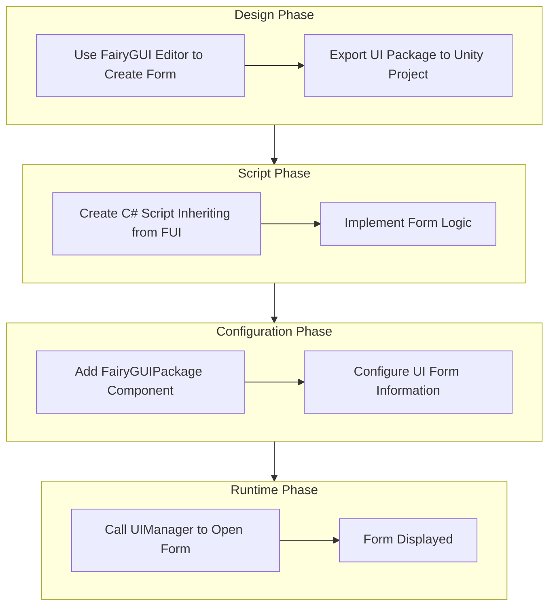
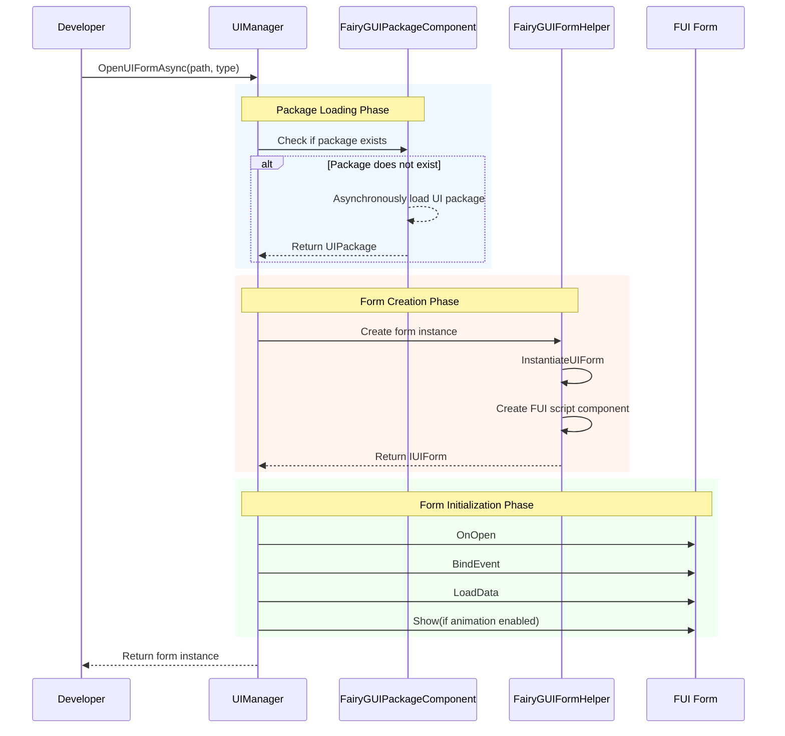
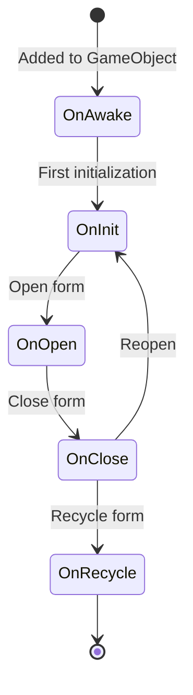

# Getting Started

This guide will help you create your first UI form using the GameFrameX FairyGUI plugin. Through this guide, you will learn the complete process from designing a form in the FairyGUI editor to opening the form in code.

## Overview

Before creating a UI form using the FairyGUI plugin, you need to understand the architecture of the entire UI system. The GameFrameX FairyGUI plugin is built on the following core components:

- **FUI**: The base class for FairyGUI forms, inheriting from UIForm, providing form display/hide, GObject management, and other features
- **FairyGUIPackageComponent**: UI package manager, responsible for loading, caching, and unloading UI resource packages
- **UIManager**: Form manager, responsible for form opening, closing, and lifecycle management
- **FairyGUIFormHelper**: Form helper, responsible for creating, instantiating, and releasing form instances

The entire UI system is designed following dependency injection and component-based design patterns, making form creation and management simple and controllable.

## Creation Flow

The complete flow for creating your first FairyGUI form is as follows:



## Step 1: Create a Form Using FairyGUI Editor

First, you need to design and create a UI form using the FairyGUI editor. FairyGUI provides a powerful visual editor to help you quickly build UI.

### 1.1 Install FairyGUI Editor

Download and install the FairyGUI editor from [FairyGUI Official Website](https://www.fairygui.com/).

### 1.2 Create a New Project

Create a new project in the FairyGUI editor, selecting the appropriate resolution and settings.

### 1.3 Design the Form

Use various components provided by the editor (buttons, text, images, lists, etc.) to design your form. After completing the design, save the project.

### 1.4 Export UI Package

Export the designed form as a Unity-compatible resource package:

1. Click menu "Publish" -> "Publish Settings"
2. Select Unity as the publishing platform
3. Set the output path (usually set to the `Assets/Res/FairyGUI` directory of your Unity project)
4. Click the publish button

After export, `.bytes` description files and related image resources will be generated in the output directory.

## Step 2: Create FUI Form Script

Create a C# script inheriting from `FUI` in your Unity project. FUI is the base class for FairyGUI forms, providing core functionality for interacting with FairyGUI GObject.

### 2.1 Create Form Class

```csharp
using GameFrameX.UI.FairyGUI.Runtime;
using FairyGUI;
using GameFrameX.UI.Runtime;

/// <summary>
/// Main Menu Form
/// </summary>
public class MainMenuForm : FUI
{
    /// <summary>
    /// Initialize form
    /// </summary>
    protected override void OnInit()
    {
        base.OnInit();

        // Get buttons in the form and add click events
        var startButton = GObject.asCom.GetChild("btn_start");
        startButton.onClick.Add(OnStartButtonClick);
    }

    /// <summary>
    /// Start button click event
    /// </summary>
    private void OnStartButtonClick()
    {
        // Handle click logic
    }

    /// <summary>
    /// Callback when form opens, can receive passed data here
    /// </summary>
    /// <param name="userData">Data passed when opening the form</param>
    protected override void OnOpen(object userData)
    {
        base.OnOpen(userData);
        // Initialization logic when form opens
    }

    /// <summary>
    /// Callback when form closes
    /// </summary>
    protected override void OnClose(bool isShutdown, bool isVisible)
    {
        // Cleanup logic when form closes
        base.OnClose(isShutdown, isVisible);
    }
}
```
> Source: [FUI.cs](https://github.com/GameFrameX/com.gameframex.unity.ui.fairygui/blob/main/Runtime/FUI.cs#L43-L197)

### 2.2 Core Features Provided by FUI Class

FUI class inherits from UIForm and is the base class for all FairyGUI forms. It provides the following core features:

| Feature | Description |
|------|------|
| GObject | Get associated FairyGUI GObject |
| Visible | Get or set form visibility |
| Show | Display form, supports animation |
| Hide | Hide form, supports animation |
| OnVisibleChanged | Visibility change callback |

## Step 3: Configure FairyGUIPackageComponent

FairyGUIPackageComponent is the UI package manager component, which needs to be added to the scene to load UI packages.

### 3.1 Add Package Manager Component

In the Unity Editor, follow these steps:

1. Create an empty GameObject and name it `FairyGUIPackage`
2. Click the Add Component button
3. Search and add the `FairyGUIPackage` component (actually FairyGUIPackageComponent)
4. Ensure this component is correctly initialized as a subclass of GameFrameworkComponent

### 3.2 Core Methods of Package Manager

```csharp
// Asynchronously load UI package
public Task<UIPackage> AddPackageAsync(string descFilePath, bool isLoadAsset = true)

// Synchronously load UI package
public void AddPackageSync(string descFilePath, bool isLoadAsset = true)

// Remove UI package with specified name
public void RemovePackage(string packageName)

// Check if UI package exists
public bool Has(string uiPackageName)
```
> Source: [FairyGUIPackageComponent.cs](https://github.com/GameFrameX/com.gameframex.unity.ui.fairygui/blob/main/Runtime/FairyGUIPackageComponent.cs#L138-L290)

## Step 4: Open the Form

Using UIManager to open the form is the final step. UIManager automatically handles package loading, form creation, and display.

### 4.1 Basic Method to Open Forms

```csharp
// Asynchronously open form
await GameEntry.UI.OpenUIFormAsync("UI/MainMenu", typeof(MainMenuForm));

// Open form with user data
var userData = new StartGameData { LevelId = 1 };
await GameEntry.UI.OpenUIFormAsync("UI/MainMenu", typeof(MainMenuForm), userData);
```

### 4.2 Complete Flow for Opening Forms



### 4.3 Form Parameter Description

| Parameter | Description |
|------|------|
| uiFormAssetPath | Form resource path, e.g., "UI/MainMenu" |
| uiFormType | Form type, pass the Type of the form class |
| pauseCoveredUIForm | Whether to pause covered forms |
| userData | User custom data, passed to the form's OnOpen method |
| isFullScreen | Whether to display full screen |

## Form Lifecycle

Understanding form lifecycle is very important for correctly managing UI. FUI forms have the following lifecycle methods:



| Lifecycle Method | When Called | Purpose |
|-------------|----------|------|
| OnAwake | When script is added to GameObject | One-time initialization |
| OnInit | When form is first created | Initialize form components and events |
| OnOpen | Every time form is opened | Receive data, refresh form |
| OnClose | When form closes | Cleanup resources, save state |
| OnRecycle | When form is recycled | Complete memory cleanup |

## Closing Forms

Use UIManager to close forms:

```csharp
// Close specified form
GameEntry.UI.CloseUIForm(mainMenuForm);

// Close all forms
GameEntry.UI.CloseAllUIForms();
```
> Source: [UIManager.Close.cs](https://github.com/GameFrameX/com.gameframex.unity.ui.fairygui/blob/main/Runtime/UIManager.Close.cs)

## Common Issues

### Q1: Form displays blank after opening

Please check the following:
1. Whether the UI package is correctly exported and placed in the correct directory of the Unity project
2. Whether FairyGUIPackageComponent has been added to the scene
3. Whether the form resource path is correct

### Q2: Click events not responding

Ensure events are correctly bound in the OnInit method, and the GObject name exactly matches the name in the FairyGUI editor.

### Q3: Form cannot be closed

Check if the base class's OnClose method is correctly called in the OnClose method, ensuring resources are correctly released.

## Related Links

- [FUI Base Class](./06.fui-base-class.md) - Learn all features of FUI base class
- [UI Manager](./08.ui-manager.md) - Learn UIManager features in depth
- [Package Manager](./09.package-manager.md) - Learn UI package management mechanism
- [Form Helper](./10.form-helper.md) - Learn form creation and release mechanism
- [Open and Close Forms](./07.open-close-ui.md) - Continue learning form open and close operations
