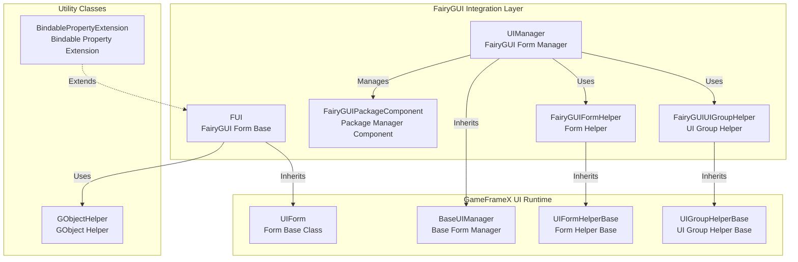
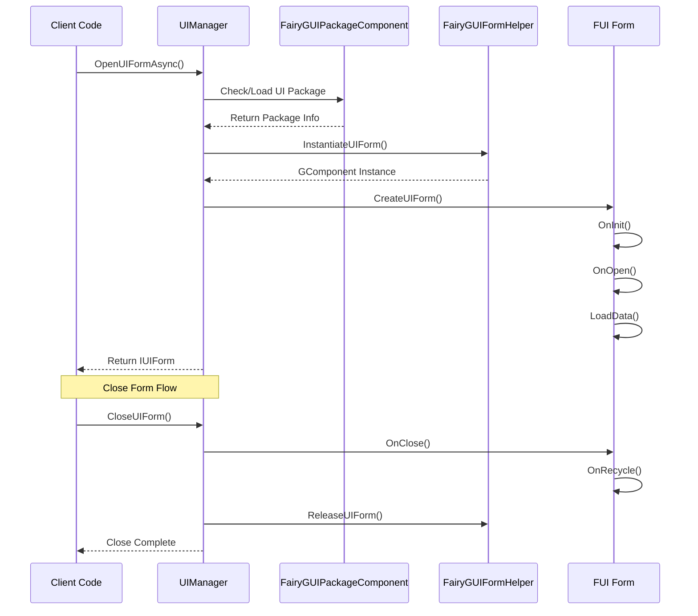

# Features

The GameFrameX UI FairyGUI plugin is a FairyGUI UI component integration solution designed specifically for the Unity game engine, providing complete form management, lifecycle control, and package resource management.

## Overview

This plugin perfectly integrates the GameFrameX core framework's UI system with FairyGUI, providing the following core capabilities:

- **Form Lifecycle Management**: Complete form opening, closing, display, and hiding mechanism
- **Resource Package Management**: Supports asynchronous/synchronous loading, caching, and unloading of UI packages
- **Form Group System**: Supports multi-level form grouping and depth control
- **Object Pool**: Supports form instance reuse, reducing memory overhead
- **Animation System**: Supports flexible configuration of show/hide animations
- **Extension Support**: Provides FairyGUI-specific data binding extensions

## Core Architecture



### Architecture Description

| Component | Responsibility | Inherit/Implement |
|------|------|----------|
| **FUI** | FairyGUI form base class, handles GObject association and visibility | Inherits UIForm |
| **UIManager** | Form manager, handles form open/close/lifecycle | Inherits BaseUIManager |
| **FairyGUIPackageComponent** | Package manager component, async/sync loading of UI packages | Inherits GameFrameworkComponent |
| **FairyGUIFormHelper** | Form helper, instantiate/create/release forms | Implements UIFormHelperBase |
| **FairyGUIUIGroupHelper** | UI group helper, manages form hierarchy depth | Inherits UIGroupHelperBase |
| **GObjectHelper** | GObject utility class, FUI object cache management | Static class |

## Core Features

### 1. Form Base Class (FUI)

FUI is the FairyGUI-specific form base class, providing the following features:

- **GObject Association**: Seamless association with FairyGUI's GObject
- **Visibility Management**: Control form display/hide through `Visible` property
- **Animation Support**: Support show/hide animation configuration
- **Full-Screen Display**: Support full-screen mode setting
- **Event System**: Provides visibility change event callbacks

```csharp
// FUI Usage Example
public class MainMenuForm : FUI
{
    protected override void OnInit(object userData)
    {
        base.OnInit(userData);
        // Set GObject association
        GObject.onClick.Add(() => { /* click handling */ });
    }
}
```
> Source: [FUI.cs](https://github.com/GameFrameX/com.gameframex.unity.ui.fairygui/blob/main/Runtime/FUI.cs#L36-L197)

### 2. Package Management System

FairyGUIPackageComponent is responsible for managing FairyGUI UI resource packages:

- **Asynchronous Loading**: `AddPackageAsync()` supports asynchronous loading of UI packages
- **Synchronous Loading**: `AddPackageSync()` supports synchronous loading of UI packages
- **Package Caching**: Loaded packages are cached to avoid repeated loading
- **Resource Preloading**: Supports `LoadAllAssets()` to preload all resources
- **Package Removal**: `RemovePackage()` / `RemoveAllPackages()` supports package unloading

```csharp
// Package Management Example
var package = await FairyGuiPackage.AddPackageAsync("UI/MainMenu");
var package = FairyGuiPackage.AddPackageSync("UI/Settings");
```
> Source: [FairyGUIPackageComponent.cs](https://github.com/GameFrameX/com.gameframex.unity.ui.fairygui/blob/main/Runtime/FairyGUIPackageComponent.cs#L138-L254)

### 3. Form Lifecycle

UIManager provides complete form lifecycle management:



### 4. Form Helper

FairyGUIFormHelper is responsible for form instantiation and release:

- **Instantiation**: Create GComponent instances through `InstantiateUIForm()`
- **Form Creation**: Wrap instances as IUIForm through `CreateUIForm()`
- **Resource Release**: Release forms and related resources through `ReleaseUIForm()`
- **Animation Configuration**: Automatically read animation configuration from form type attributes

> Source: [FairyGUIFormHelper.cs](https://github.com/GameFrameX/com.gameframex.unity.ui.fairygui/blob/main/Runtime/FairyGUIFormHelper.cs#L46-L232)

### 5. Form Group System

FairyGUIUIGroupHelper provides form hierarchy management:

- **Depth Control**: Set form display hierarchy through `SetDepth()`
- **Full-Screen Adaptation**: Automatically set full-screen size adaptation
- **Relationship Binding**: Automatically establish width/height relationship with GRoot

```csharp
// Form Group Depth Management
public override void SetDepth(int depth)
{
    Depth = depth;
    transform.localPosition = new Vector3(0, 0, depth * 100);
}
```
> Source: [FairyGUIUIGroupHelper.cs](https://github.com/GameFrameX/com.gameframex.unity.ui.fairygui/blob/main/Runtime/FairyGUIUIGroupHelper.cs#L62-L96)

### 6. GObject Helper

GObjectHelper provides FUI object caching and management:

- **Get Associated FUI**: `Get<T>()` gets associated FUI from GObject
- **Add Mapping**: `Add()` associates GObject with FUI
- **Remove Mapping**: `Remove()` removes GObject and FUI association
- **Clear Cache**: `ClearAll()` clears all caches

```csharp
// GObject and FUI Mapping Example
GObject obj = package.CreateObject("MainMenu", "MainMenuForm");
MainMenuForm fui = new MainMenuForm(obj);
obj.Add(fui);  // Establish mapping

// Subsequent Retrieval
MainMenuForm cached = obj.Get<MainMenuForm>();
```
> Source: [GObjectHelper.cs](https://github.com/GameFrameX/com.gameframex.unity.ui.fairygui/blob/main/Runtime/GObjectHelper.cs#L42-L114)

### 7. Data Binding Extension

BindablePropertyExtension provides property binding in FairyGUI environment:

- **Automatic Unregistration**: Automatically clears binding events when GObject is destroyed
- **Lifecycle Linkage**: Links property changes with form lifecycle

```csharp
// Using Bindable Property in FairyGUI
BindableProperty<int> score = new BindableProperty<int>(0);
score.Register(newValue => { textField.text = newValue.ToString(); });
score.ClearWithGObjectDestroyed(textField);
```
> Source: [BindablePropertyExtension.cs](https://github.com/GameFrameX/com.gameframex.unity.ui.fairygui/blob/main/Runtime/BindablePropertyExtension.cs#L41-L57)

## Feature Comparison

| Feature | Description | Related Component |
|------|------|----------|
| Form Base Class | FairyGUI-specific form base class | FUI |
| Form Management | Open/close/lifecycle management | UIManager |
| Package Management | UI resource package async/sync loading | FairyGUIPackageComponent |
| Form Instantiation | Form creation/instantiation/release | FairyGUIFormHelper |
| Form Group Management | Form hierarchy/depth control | FairyGUIUIGroupHelper |
| Object Cache | GObject and FUI mapping management | GObjectHelper |
| Property Binding | Bindable property extension support | BindablePropertyExtension |

## Design Advantages

1. **Layered Design**: Clear layered architecture, easy to extend and maintain
2. **Interface-Oriented**: Extensive use of interfaces, easy to replace implementations
3. **Object Pool Reuse**: Form instance reuse, reducing memory allocation
4. **Async Support**: Complete async loading support, improving performance
5. **Attribute Configuration**: Use attributes to configure animations and form groups, simplifying code
6. **Event-Driven**: Based on event system, decoupling component dependencies

## Related Links

- [Introduction](./01.overview.md) - Learn plugin overview and design philosophy
- [Installation](./02.installation.md) - Quick plugin installation guide
- [FUI Base Class](./06.fui-base-class.md) - FUI complete API reference
- [UI Manager](./08.ui-manager.md) - UI Manager core concepts
- [Package Manager](./09.package-manager.md) - Package Manager core concepts
