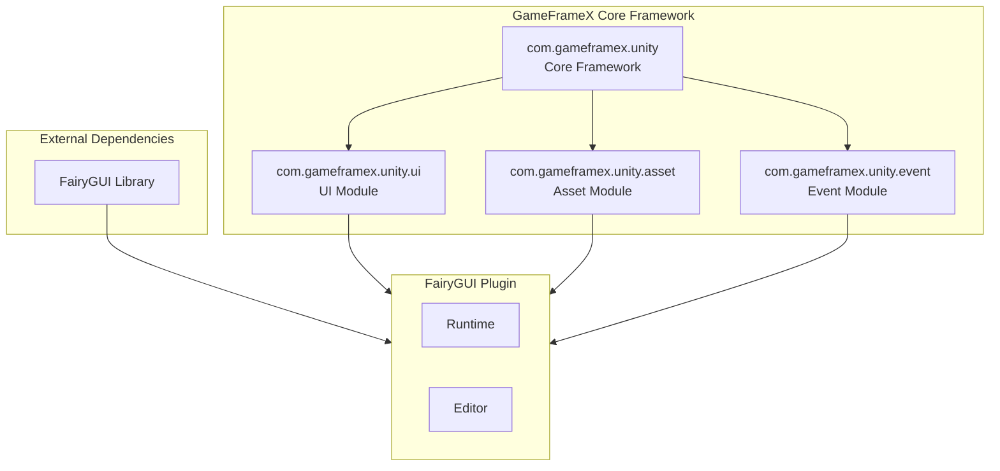
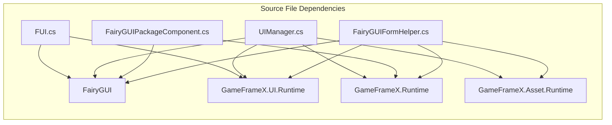

# Dependencies

This document describes the dependency configuration requirements for the GameFrameX UI FairyGUI Component, including required core framework dependencies and external library dependencies.

## Overview

The GameFrameX UI FairyGUI Component is a Unity UI function package based on FairyGUI. It depends on the GameFrameX core framework and the FairyGUI third-party library. Correctly configuring these dependencies is a prerequisite for ensuring the plugin works properly.

## Dependency Architecture



## Core Dependencies

### GameFrameX Framework Dependencies

| Dependency Package | Minimum Version | Description |
|--------|----------|------|
| com.gameframex.unity | 1.1.1 | GameFrameX core framework, provides basic architecture and component system |
| com.gameframex.unity.ui | 1.0.0 | UI base module, defines core classes like UIForm, UIComponent |
| com.gameframex.unity.asset | 1.0.6 | Resource management module, responsible for resource loading and unloading |
| com.gameframex.unity.event | 1.0.0 | Event system module, provides event subscription and publishing functions |

### Dependencies in package.json

```json
{
  "dependencies": {
    "com.gameframex.unity": "1.1.1",
    "com.gameframex.unity.ui": "1.0.0",
    "com.gameframex.unity.asset": "1.0.6",
    "com.gameframex.unity.event": "1.0.0"
  }
}
```
> Source: [package.json](https://github.com/GameFrameX/com.gameframex.unity.ui.fairygui/blob/main/package.json#L21-L26)

## External Dependencies

### FairyGUI Library

FairyGUI is the core dependency of the plugin, providing a complete UI framework.

| Component | Description |
|------|------|
| FairyGUI.Runtime | FairyGUI runtime library, provides core classes like GObject, GComponent, UIPackage |
| FairyGUI.Editor | FairyGUI editor extension, for editing UI in Unity Editor |

**How to Obtain:**
- Download the official Unity integration package from [FairyGUI Official Website](https://www.fairygui.com/)
- Import FairyGUI through Unity Package Manager

### FairyGUI Integration with GameFrameX

The FairyGUI plugin integrates into the GameFrameX framework through the following namespaces:

```csharp
using FairyGUI;                           // FairyGUI core library
using GameFrameX.Runtime;                 // GameFrameX core runtime
using GameFrameX.Asset.Runtime;           // Resource management
using GameFrameX.UI.Runtime;              // UI base module
using GameFrameX.UI.FairyGUI.Runtime;     // FairyGUI plugin runtime
```
> Source: [FairyGUIPackageComponent.cs](https://github.com/GameFrameX/com.gameframex.unity.ui.fairygui/blob/main/Runtime/FairyGUIPackageComponent.cs#L30-L35)

## System Requirements

### Unity Version Requirements

| Requirement | Specification |
|------|------|
| Minimum Version | Unity 2019.4 |
| Recommended Version | Unity 2021.3 LTS or higher |

### Dependency Relationship Details



### Core Class Dependency Table

| Plugin Class | Depends on GameFrameX Class | Depends on FairyGUI Class |
|--------|---------------------|-------------------|
| FUI | UIForm | GObject |
| UIManager | BaseUIManager | UIPackage |
| FairyGUIPackageComponent | GameFrameworkComponent | UIPackage |
| FairyGUIFormHelper | UIFormHelperBase | GComponent |
| GObjectHelper | - | GObject, FUI |

## Unity Project Configuration

### 1. Install GameFrameX Core Framework

Install GameFrameX core framework and its dependencies in your Unity project:

```json
// manifest.json example
{
  "dependencies": {
    "com.gameframex.unity": "1.1.1",
    "com.gameframex.unity.ui": "1.0.0",
    "com.gameframex.unity.asset": "1.0.6",
    "com.gameframex.unity.event": "1.0.0"
  }
}
```

### 2. Install FairyGUI

Download and import the Unity package from the FairyGUI official website, ensuring it includes:
- Runtime directory (core runtime)
- Editor directory (editor extension)

### 3. Install FairyGUI Plugin

Add the GameFrameX UI FairyGUI Component to your project:

```json
{
  "dependencies": {
    "com.gameframex.unity.ui.fairygui": "https://github.com/gameframex/com.gameframex.unity.ui.fairygui.git"
  }
}
```

> For detailed installation steps, refer to the [Installation](./02.installation.md) document.

## Dependency Verification

After installation, the following classes should be accessible:

```csharp
// GameFrameX core classes
using GameFrameX.Runtime;
using GameFrameX.Asset.Runtime;
using GameFrameX.UI.Runtime;

// FairyGUI classes
using FairyGUI;

// FairyGUI plugin classes
using GameFrameX.UI.FairyGUI.Runtime;
```

## Version Compatibility

| Plugin Version | Unity Version | GameFrameX Version | FairyGUI Version |
|----------|-----------|-----------------|---------------|
| 3.2.x | 2019.4+ | 1.1.x | Latest official version |
| 3.1.x | 2019.4+ | 1.0.x | Latest official version |

## Common Issues

### Q1: Namespace Not Found Error After Installation

**Solution:** Ensure all GameFrameX dependency packages are correctly installed. Check if all required dependencies are included in manifest.json.

### Q2: FairyGUI Classes Not Found

**Solution:** Ensure FairyGUI official package is installed and FairyGUI.dll is correctly placed in the project.

### Q3: Version Incompatibility Warning

**Solution:** Check if Unity version meets the minimum requirement (2019.4), and ensure all GameFrameX dependency package versions meet the requirements.

## Related Links

- [Installation](./02.installation.md) - Detailed installation steps
- [Introduction](./01.overview.md) - Plugin feature overview
- [System Requirements](./04.features.md) - System requirements details
- [GitHub Repository](https://github.com/GameFrameX/com.gameframex.unity.ui.fairygui.git) - Official repository
- [Official Documentation](https://gameframex.doc.alianblank.com/) - GameFrameX Documentation Center
