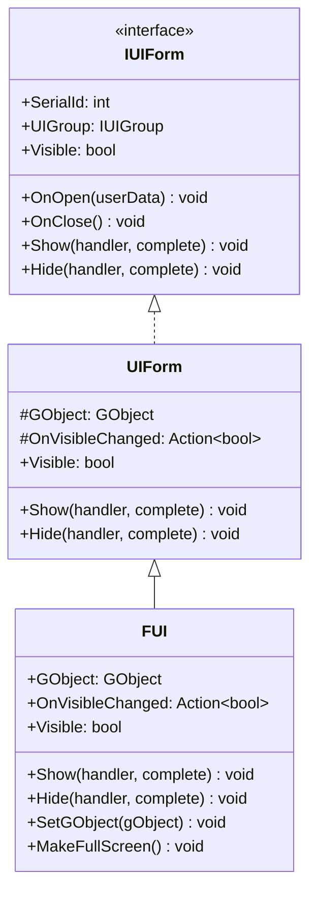
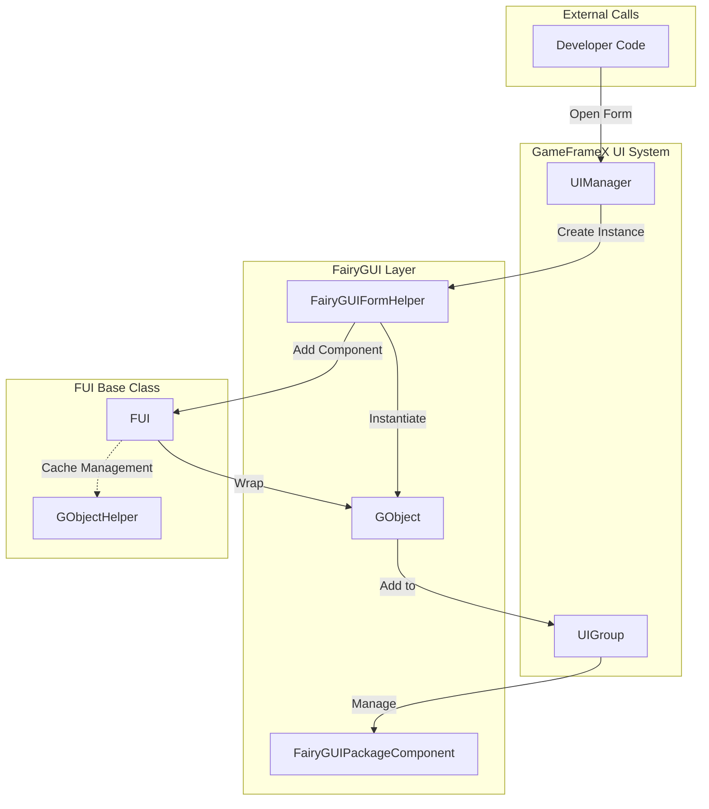
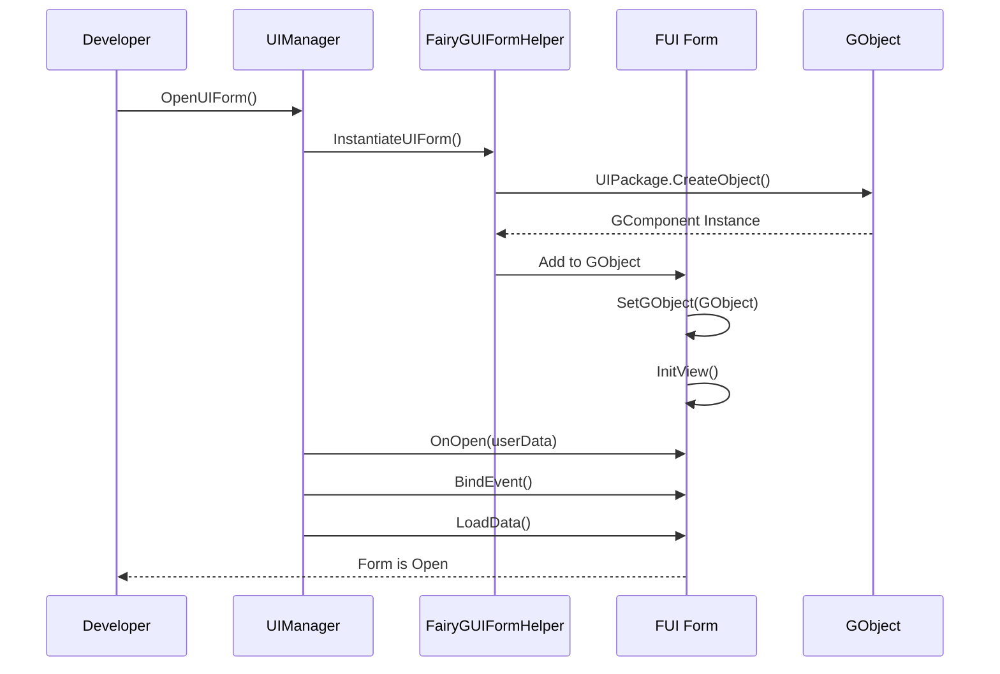

# FUI Form Base Class

FUI is the base class for FairyGUI forms in the GameFrameX plugin, inheriting from UIForm, and provides FairyGUI-specific form functionality implementation.

## Overview

The `FUI` class is the core base class of the FairyGUI form system. It bridges FairyGUI's `GObject` with GameFrameX's UI system. By inheriting `FUI`, developers can create FairyGUI forms following a unified architecture and automatically gain the following features:

- Seamless integration with GameFrameX UI system
- Unified display/hide animation support
- Visibility state management and event callbacks
- Full-screen display mode support
- GObject lifecycle management

### Inheritance



## Architecture Design

### Core Component Interaction



### Form Lifecycle



## Core Functions

### 1. GObject Association

FUI associates with FairyGUI's UI objects through the `GObject` property, which is the core entry point for interaction with the FairyGUI system.

```csharp
// Source: Runtime/FUI.cs#L45-L53
[UnityEngine.Scripting.Preserve]
public class FUI : UIForm
{
    /// <summary>
    /// Gets the associated FairyGUI GObject.
    /// </summary>
    [UnityEngine.Scripting.Preserve]
    public GObject GObject { get; private set; }
```
> Source: [FUI.cs](https://github.com/GameFrameX/com.gameframex.unity.ui.fairygui/blob/main/Runtime/FUI.cs#L45-L53)

### 2. Visibility Management

FUI provides complete visibility management mechanism, including internal setting and property access.

```csharp
// Source: Runtime/FUI.cs#L115-L155
/// <summary>
/// Internally sets the form's display state without firing events.
/// </summary>
[UnityEngine.Scripting.Preserve]
protected override void InternalSetVisible(bool value)
{
    if (GObject.visible == value)
    {
        return;
    }

    GObject.visible = value;
    OnVisibleChanged?.Invoke(value);
    EventSubscriber?.Fire(UIFormVisibleChangedEventArgs.EventId, UIFormVisibleChangedEventArgs.Create(this, value));
}

/// <summary>
/// Gets or sets whether the form is visible.
/// </summary>
[UnityEngine.Scripting.Preserve]
public override bool Visible
{
    get
    {
        if (GObject == null)
        {
            return false;
        }

        return GObject.visible;
    }
    protected set
    {
        if (GObject == null)
        {
            return;
        }

        InternalSetVisible(value);
    }
}
```
> Source: [FUI.cs](https://github.com/GameFrameX/com.gameframex.unity.ui.fairygui/blob/main/Runtime/FUI.cs#L115-L155)

### 3. Show/Hide Animation

FUI inherits animation configuration from UIForm, supporting show and hide animations.

```csharp
// Source: Runtime/FUI.cs#L74-L105
/// <summary>
/// Shows the form.
/// </summary>
[UnityEngine.Scripting.Preserve]
public override void Show(IUIFormShowHandler handler, Action complete)
{
    if (handler != null)
    {
        handler.Handler(GObject, EnableShowAnimation, ShowAnimationName, complete);
    }
    else
    {
        complete?.Invoke();
    }
}

/// <summary>
/// Hides the form.
/// </summary>
[UnityEngine.Scripting.Preserve]
public override void Hide(IUIFormHideHandler handler, Action complete)
{
    if (handler != null)
    {
        handler.Handler(GObject, EnableHideAnimation, HideAnimationName, complete);
    }
    else
    {
        complete?.Invoke();
    }
}
```
> Source: [FUI.cs](https://github.com/GameFrameX/com.gameframex.unity.ui.fairygui/blob/main/Runtime/FUI.cs#L74-L105)

### 4. Full-Screen Display

The `MakeFullScreen()` method sets the form to full-screen display mode.

```csharp
// Source: Runtime/FUI.cs#L165-L168
/// <summary>
/// Sets the current UI object to full-screen display.
/// </summary>
[UnityEngine.Scripting.Preserve]
protected override void MakeFullScreen()
{
    GObject?.asCom?.MakeFullScreen();
}
```
> Source: [FUI.cs](https://github.com/GameFrameX/com.gameframex.unity.ui.fairygui/blob/main/Runtime/FUI.cs#L165-L168)

## Creating Custom Forms

### Basic Steps

1. Create a class inheriting from `FUI`
2. Implement the `InitView()` method to initialize the form
3. Override lifecycle methods such as `OnOpen`, `OnClose`, etc.

### Sample Code

```csharp
using FairyGUI;
using GameFrameX.UI.FairyGUI.Runtime;

public class MainMenuForm : FUI
{
    private GButton _startButton;
    private GTextField _titleText;

    public MainMenuForm(GObject gObject, bool isRoot = false) : base(gObject, isRoot)
    {
    }

    protected override void InitView()
    {
        base.InitView();

        // Get form components
        _startButton = GObject.GetChild("btn_start");
        _titleText = GObject.GetChild("txt_title");

        // Bind events
        _startButton.onClick.Add(OnStartButtonClick);
    }

    private void OnStartButtonClick()
    {
        // Handle start button click
    }

    protected override void OnOpen(object userData)
    {
        base.OnOpen(userData);
        // Logic when form opens
    }

    protected override void OnClose()
    {
        // Cleanup logic when form closes
        _startButton.onClick.Remove(OnStartButtonClick);
        base.OnClose();
    }
}
```
> Source: [FUI.cs](https://github.com/GameFrameX/com.gameframex.unity.ui.fairygui/blob/main/Runtime/FUI.cs#L179-L197)

## GObjectHelper Utility Class

`GObjectHelper` provides FUI object caching and management functionality, facilitating mapping relationships between GObject and FUI.

```csharp
// Source: Runtime/GObjectHelper.cs#L42-L115
namespace GameFrameX.UI.FairyGUI.Runtime
{
    /// <summary>
    /// GObject helper class, provides FUI object caching and management.
    /// </summary>
    [UnityEngine.Scripting.Preserve]
    public static class GObjectHelper
    {
        private static readonly Dictionary<GObject, FUI> s_GObjectToFuiMap = new Dictionary<GObject, FUI>();

        /// <summary>
        /// Gets the associated FUI object from the component pool.
        /// </summary>
        [UnityEngine.Scripting.Preserve]
        public static T Get<T>(this GObject self) where T : FUI
        {
            if (self != null && s_GObjectToFuiMap.TryGetValue(self, out var pair))
            {
                return pair as T;
            }

            return default(T);
        }

        /// <summary>
        /// Adds an FUI object to the component pool.
        /// </summary>
        [UnityEngine.Scripting.Preserve]
        public static void Add(this GObject self, FUI fui)
        {
            if (self != null && fui != null)
            {
                s_GObjectToFuiMap[self] = fui;
            }
        }

        /// <summary>
        /// Removes an FUI object from the component pool.
        /// </summary>
        [UnityEngine.Scripting.Preserve]
        public static FUI Remove(this GObject self)
        {
            if (self != null && s_GObjectToFuiMap.TryGetValue(self, out var value))
            {
                s_GObjectToFuiMap.Remove(self);
                return value;
            }

            return default;
        }

        /// <summary>
        /// Clears all cached FUI objects.
        /// </summary>
        [UnityEngine.Scripting.Preserve]
        public static void ClearAll()
        {
            s_GObjectToFuiMap.Clear();
        }
    }
}
```
> Source: [GObjectHelper.cs](https://github.com/GameFrameX/com.gameframex.unity.ui.fairygui/blob/main/Runtime/GObjectHelper.cs#L42-L115)

## Bindable Property Extension

`BindablePropertyExtension` provides convenient methods for using bindable properties in the FairyGUI environment, automatically handling property cleanup when GObject is destroyed.

```csharp
// Source: Runtime/BindablePropertyExtension.cs#L42-L57
namespace GameFrameX.UI.FairyGUI.Runtime
{
    public static class BindablePropertyExtension
    {
        /// <summary>
        /// In FairyGUI environment, use this method to automatically unregister bindable property events when GObject is destroyed.
        /// </summary>
        [UnityEngine.Scripting.Preserve]
        public static void ClearWithGObjectDestroyed<T>(this BindableProperty<T> bindableProperty, GObject gObject)
        {
            gObject.onRemovedFromStage.Add(bindableProperty.Clear);
        }
    }
}
```
> Source: [BindablePropertyExtension.cs](https://github.com/GameFrameX/com.gameframex.unity.ui.fairygui/blob/main/Runtime/BindablePropertyExtension.cs#L42-L57)

## API Reference

### FUI Class

#### Properties

| Property | Type | Read | Write | Description |
|--------|------|------|------|------|
| `GObject` | `GObject` | Yes | No | Gets the associated FairyGUI GObject |
| `OnVisibleChanged` | `Action<bool>` | Yes | Yes | Gets or sets visibility change event callback |
| `Visible` | `bool` | Yes | Yes | Gets or sets form visibility |
| `EnableShowAnimation` | `bool` | Yes | Yes | Whether show animation is enabled (inherited from UIForm) |
| `ShowAnimationName` | `string` | Yes | Yes | Show animation name (inherited from UIForm) |
| `EnableHideAnimation` | `bool` | Yes | Yes | Whether hide animation is enabled (inherited from UIForm) |
| `HideAnimationName` | `string` | Yes | Yes | Hide animation name (inherited from UIForm) |

#### Methods

| Method | Return Type | Description |
|--------|----------|------|
| `Show(handler, complete)` | `void` | Shows the form |
| `Hide(handler, complete)` | `void` | Hides the form |
| `InternalSetVisible(value)` | `void` | Internally sets visibility |
| `MakeFullScreen()` | `void` | Sets to full-screen display |
| `SetGObject(gObject)` | `void` | Sets associated GObject |
| `InitView()` | `void` | Initializes view (can be overridden) |
| `OnOpen(userData)` | `void` | Form open callback (can be overridden) |
| `OnClose()` | `void` | Form close callback (can be overridden) |
| `OnPause()` | `void` | Form pause callback (can be overridden) |
| `OnResume()` | `void` | Form resume callback (can be overridden) |

### GObjectHelper Static Class

| Method | Return Type | Description |
|--------|----------|------|
| `Get<T>(GObject)` | `T` | Gets associated FUI from cache |
| `Add(GObject, FUI)` | `void` | Adds FUI object to cache |
| `Remove(GObject)` | `FUI` | Removes FUI from cache |
| `ClearAll()` | `void` | Clears all cache |

## Related Links

- [UI Manager](./08.ui-manager.md)
- [Package Manager](./09.package-manager.md)
- [Form Helper](./10.form-helper.md)
- [UI Group Helper](./11.ui-group-helper.md)
- [Getting Started](./03.getting-started.md)
