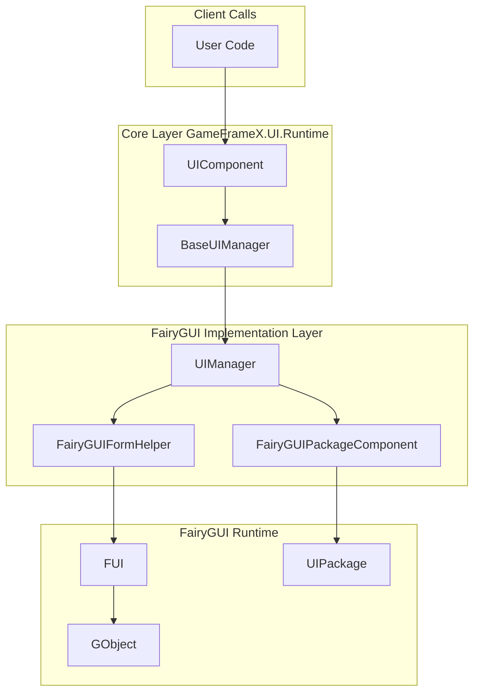
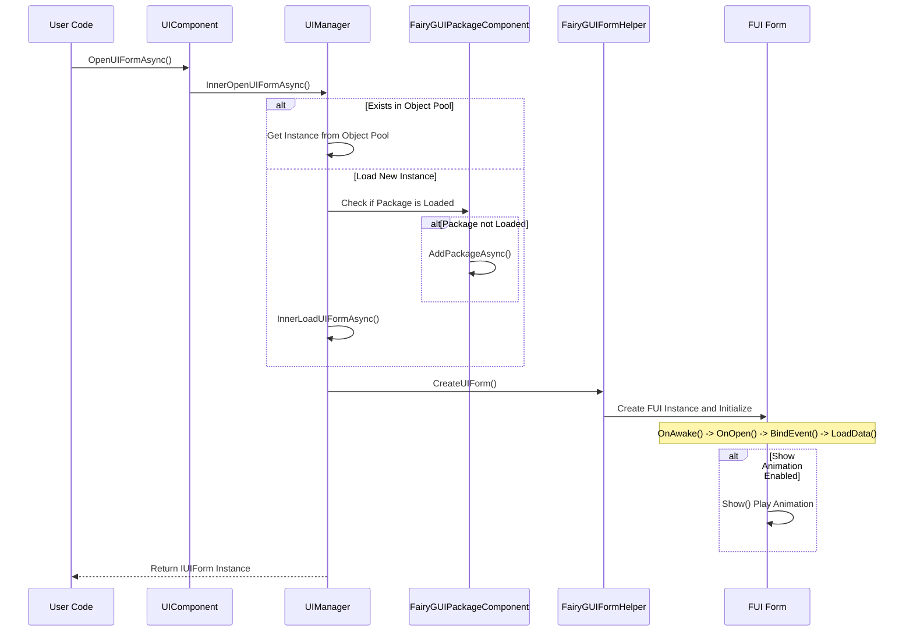
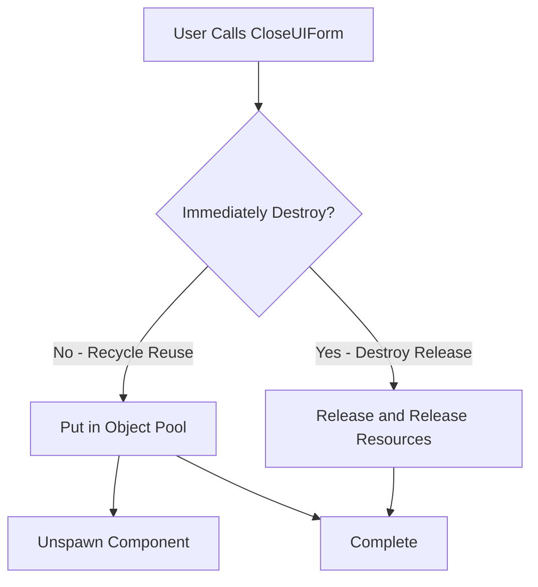
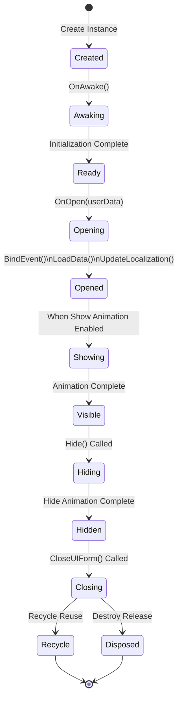

# Open and Close Forms

This document introduces how to open and close forms using the FairyGUI plugin in the GameFrameX framework.

## Overview

In the GameFrameX framework, form open and close operations are centrally managed by the core UIComponent, and the FairyGUI plugin implements specific functionality through `UIManager`. Understanding form lifecycle management is crucial for building a smooth UI system.

Form management uses an asynchronous loading mechanism, supporting:
- Object pool reuse for improved performance
- On-demand package loading to reduce initial loading time
- Display/hide animations for enhanced user experience
- Form group management for hierarchy control

## Architecture

Form opening and closing involves collaboration of the following core components:



### Component Responsibilities

| Component | Responsibility |
|------|------|
| UIComponent | Provides public Open/Close interfaces |
| UIManager | Implements form open and close specific logic |
| FairyGUIFormHelper | Creates and releases UI form instances |
| FairyGUIPackageComponent | Manages UI package loading and caching |
| FUI | Form base class, wraps GObject and provides lifecycle methods |

## Form Open Flow

Form opening is an asynchronous process involving resource loading, package management, instance creation, and form initialization.

### Core Flow



### Open Form Example

```csharp
using GameFrameX.UI.Runtime;
using GameFrameX.UI.FairyGUI.Runtime;

// Asynchronously open form
var uiForm = await GameEntry.UI.OpenUIFormAsync(
    "UI/TestUI",           // Form Resource Path
    typeof(TestUIForm),    // Form Logic Type
    "MainUI"               // Form Group Name
);

// Or open with user data
var userData = new OpenFormData { Id = 1001, Name = "Player" };
var uiFormWithData = await GameEntry.UI.OpenUIFormAsync(
    "UI/PlayerInfo",
    typeof(PlayerInfoForm),
    "MainUI",
    false,                 // Whether to pause covered forms
    userData               // Data passed to the form
);
```

> Source: [UIManager.Open.cs](https://github.com/GameFrameX/com.gameframex.unity.ui.fairygui/blob/main/Runtime/UIManager.Open.cs#L66-L107)

### Open Parameter Description

| Parameter | Type | Description |
|------|------|------|
| uiFormAssetPath | string | Form resource path, e.g., "UI/TestUI" |
| uiFormType | Type | Form logic class type |
| uiGroupName | string | Form group name, used for hierarchy control |
| pauseCoveredUIForm | bool | Whether to pause covered forms |
| userData | object | Custom data passed to the form |
| isFullScreen | bool | Whether to display full screen |

## Form Close Flow

Form closing supports two modes: recycle reuse and destroy release.

### Core Flow



### Close Form Example

```csharp
// Close by form instance
var uiForm = GameEntry.UI.GetUIForm(serialId);
GameEntry.UI.CloseUIForm(uiForm);

// Close by form type (close all forms of that type)
GameEntry.UI.CloseUIForm(typeof(TestUIForm));

// Close all forms
GameEntry.UI.CloseAllUIForms();

// Close specified form and pass data simultaneously
GameEntry.UI.CloseUIForm(uiForm, closeFormData);
```

> Source: [UIManager.Close.cs](https://github.com/GameFrameX/com.gameframex.unity.ui.fairygui/blob/main/Runtime/UIManager.Close.cs#L50-L79)

## Form Lifecycle

FUI forms have a complete lifecycle, with corresponding callback methods triggered at each stage.

### Lifecycle Stages



### Stage Description

| Stage | Method | Description |
|------|------|------|
| Create | Constructor | Form object instantiation |
| Awake | OnAwake() | Called when form logic first executes |
| Open | OnOpen(userData) | Called when form opens, can receive passed data |
| Event Binding | BindEvent() | Bind form event listeners |
| Data Loading | LoadData() | Load data required by the form |
| Localization | UpdateLocalization() | Update form text localization |
| Show | Show() | Play show animation (if enabled) |
| Hide | Hide() | Play hide animation (if enabled) |
| Recycle | OnRecycle() | Called when form is recycled to object pool |
| Destroy | OnClose() | Called when form is truly destroyed |

### Lifecycle Method Example

```csharp
using FairyGUI;
using GameFrameX.UI.FairyGUI.Runtime;

public class TestUIForm : FUI
{
    // Called when form is first created
    protected override void OnAwake()
    {
        base.OnAwake();
        // Initialize form component references
    }

    // Called when form opens
    protected override void OnOpen(object userData)
    {
        base.OnOpen(userData);

        // Receive data passed when opening
        if (userData is OpenFormData data)
        {
            // Handle passed data
        }
    }

    // Called when form closes
    protected override void OnClose()
    {
        base.OnClose();
        // Cleanup data, unsubscribe events, etc.
    }

    // Called when form is recycled
    protected override void OnRecycle()
    {
        base.OnRecycle();
        // Reset form state, prepare for reuse
    }
}
```

> Source: [FUI.cs](https://github.com/GameFrameX/com.gameframex.unity.ui.fairygui/blob/main/Runtime/FUI.cs#L43-L197)

## Form Group Management

Form groups are used to manage forms of different levels and types, implementing display priority control for forms.

### Form Group Configuration

Form groups are specified on form classes through `[OptionUIGroup]` attribute:

```csharp
using GameFrameX.UI.Runtime;

[OptionUIGroup("MainUI")]
public class MainMenuForm : FUI
{
    // Form implementation
}
```

### Form Group Usage Example

```csharp
// Specify group when opening form
await GameEntry.UI.OpenUIFormAsync(
    "UI/MainMenu",
    typeof(MainMenuForm),
    "MainUI"  // Form group name
);

// Get form group
var uiGroup = GameEntry.UI.GetUIGroup("MainUI");

// Get all forms in the group
var allForms = uiGroup.GetAllUIForms();
```

## Advanced Usage

### Custom Show Animation

You can configure form show and hide animations through attributes:

```csharp
using GameFrameX.UI.Runtime;

[OptionUIGroup("DialogUI")]
[OptionUIShowAnimation(true, "DialogOpen")]
[OptionUIHideAnimation(true, "DialogClose")]
public class DialogForm : FUI
{
    // Form implementation
}
```

### Get FUI Object

Using the GObjectHelper utility class can conveniently get the FUI object corresponding to GObject:

```csharp
using GameFrameX.UI.FairyGUI.Runtime;

// Get FUI through GObject extension method
TestUIForm fui = GObject.Get<TestUIForm>();

// Associate FUI with GObject
GObject.Add(fui);

// Remove FUI association
GObject.Remove();
```

> Source: [GObjectHelper.cs](https://github.com/GameFrameX/com.gameframex.unity.ui.fairygui/blob/main/Runtime/GObjectHelper.cs#L42-L114)

### Form Visibility Change Listening

```csharp
public class TestUIForm : FUI
{
    protected override void OnAwake()
    {
        base.OnAwake();

        // Subscribe to visibility change event
        OnVisibleChanged = OnVisibleChangedHandler;
    }

    private void OnVisibleChangedHandler(bool visible)
    {
        if (visible)
        {
            // Form is visible
        }
        else
        {
            // Form is hidden
        }
    }
}
```

> Source: [FUI.cs](https://github.com/GameFrameX/com.gameframex.unity.ui.fairygui/blob/main/Runtime/FUI.cs#L62-L63)

## Common Issues

### Form Open Failed

If form opening fails, please check:
1. Is the form resource path correct
2. Is the FairyGUI package correctly added to the project
3. Does the form class inherit from FUI
4. Is the form group name configured

### Data Not Reset After Form Closes

Ensure to reset form state in `OnRecycle()` method:

```csharp
protected override void OnRecycle()
{
    base.OnRecycle();
    // Reset input field, list, and other control states
    // Clear cached data
}
```

### Form Animation Not Playing

Check if the following conditions are met:
1. Is `[OptionUIShowAnimation]` configured on the form class
2. Is the corresponding animation created in the FairyGUI editor
3. Is animation function enabled in the form manager

## Related Links

- [Getting Started](./03.getting-started.md) - Learn how to create new forms
- [FUI Base Class](./06.fui-base-class.md) - Learn FUI base class in depth
- [UI Manager](./08.ui-manager.md) - UIManager detailed documentation
- [Form Helper](./10.form-helper.md) - FairyGUIFormHelper documentation
- [Package Manager](./09.package-manager.md) - FairyGUIPackageComponent documentation
- [UI Group Configuration](./13.ui-group-config.md) - Form group configuration guide
