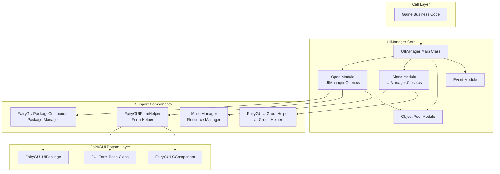
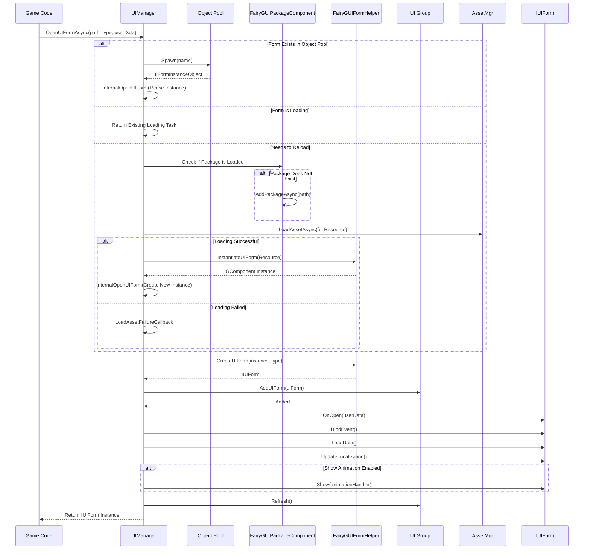

# UI Manager

UIManager is the core component of the FairyGUI plugin, responsible for form opening, closing, and lifecycle management. It inherits from `BaseUIManager` and provides FairyGUI-specific form management implementation, supporting features such as asynchronous loading, object pool reuse, and form group management.

## Overview

UIManager is the FairyGUI-specific implementation in the GameFrameX UI system, responsible for managing the complete lifecycle of all FairyGUI forms. Developers can easily open, close, show, and hide forms through UIManager, while the system automatically handles resource loading, caching, and recycling.

### Core Responsibilities

- **Form Loading and Instantiation**: Supports asynchronously loading UI resources from Resources directory or AssetBundle
- **Object Pool Management**: Implements form instance reuse through object pooling, reducing memory allocation and GC overhead
- **Form Group Management**: Supports assigning forms to different groups, implementing grouped display and hiding
- **Lifecycle Management**: Manages state transitions such as form initialization, opening, closing, and recycling

### Design Intent

UIManager organizes code using partial classes, separating different functional modules into independent files:
- `UIManager.cs`: Basic initialization and resource manager setup
- `UIManager.Open.cs`: Form opening and async loading logic
- `UIManager.Close.cs`: Form closing and resource recycling logic
- `UIManager.OpenUIFormInfoData.cs`: Data structure for form opening information

This design makes the code easier to maintain and extend, with each file focused on a single responsibility.

## Architecture Design



### Component Relationship Description

| Component | Responsibility | Depends On |
|------|------|--------|
| UIManager | Form management core | Game business code |
| FairyGUIPackageComponent | FairyGUI package loading and management | UIManager |
| FairyGUIFormHelper | Form instantiation and release | UIManager |
| FairyGUIUIGroupHelper | Form group management | UIManager |
| IAssetManager | Resource loading | UIManager.Open.cs |

## Core Flow

### Form Open Flow

When calling `OpenUIFormAsync` to open a form, the system goes through the following flow:



### Form Close and Recycle Flow

```mermaid
flowchart TD
    Start([Call CloseUIForm]) --> Check{Immediately Destroy?}

    Check -->|No| Recycle[Call RecycleUIForm]
    Check -->|Yes| Dispose[Call RecycleUIForm(isDispose=true)]

    Recycle --> OnRecycle[uiForm.OnRecycle()]
    OnRecycle --> GetHandle[Get Handle]
    GetHandle --> GetDisplayInfo[Get DisplayObjectInfo]
    GetDisplayInfo --> Unspawn[Object Pool Unspawn]

    Dispose --> OnRecycle2[uiForm.OnRecycle()]
    OnRecycle2 --> Unspawn2[Object Pool Unspawn]
    Unspawn2 --> Release[Object Pool Release]

    Unspawn --> End([Complete])
    Release --> End
```

## Core Functions Detail

### Asynchronous Form Loading

UIManager supports a fully asynchronous form loading mechanism, which is particularly important for loading large UI resources, avoiding blocking the main thread:

```csharp
// Asynchronously open form
var uiForm = await UIManager.Instance.OpenUIFormAsync("UI/MainMenu", typeof(MainMenuForm), userData);
```

> Source: [UIManager.Open.cs](https://github.com/GameFrameX/com.gameframex.unity.ui.fairygui/blob/main/Runtime/UIManager.Open.cs#L66-L107)

The system first checks whether a reusable form instance exists in the object pool. If it exists, it is reused directly to avoid repeated creation. If not, it enters the asynchronous loading flow.

### Object Pool Management

UIManager has a built-in object pool to manage form instances, which brings the following advantages:

- **Reduced Memory Allocation**: Avoids frequently creating and destroying form objects
- **Improved Loading Speed**: Reusing instances can achieve instant form opening
- **Reduced GC Pressure**: Reduces garbage object generation

Object pool initialization is done in the constructor:

```csharp
public UIManager()
{
    m_InstancePool = null;  // Object pool instance
    m_RecycleTime = 0;
    if (m_RecycleInterval < 10)
    {
        m_RecycleInterval = 10;  // Default recycle interval 10 seconds
    }
}
```

> Source: [UIManager.cs](https://github.com/GameFrameX/com.gameframex.unity.ui.fairygui/blob/main/Runtime/UIManager.cs#L62-L77)

### Form Resource Path Resolution

The system supports two resource loading methods:

1. **Load from Resources**: When the path does not contain "Bundles" directory, load from Resources directory
2. **Load from AssetBundle**: When the path contains "Bundles" directory, use YooAsset for async loading

```csharp
// Determine resource loading method
if (assetPath.IndexOf(Utility.Asset.Path.BundlesDirectoryName, StringComparison.OrdinalIgnoreCase) < 0)
{
    // Load from Resources
    if (!hasUIPackage)
    {
        FairyGuiPackage.AddPackageSync(assetPath);
    }
    return LoadAssetSuccessCallback(...);
}
```

> Source: [UIManager.Open.cs](https://github.com/GameFrameX/com.gameframex.unity.ui.fairygui/blob/main/Runtime/UIManager.Open.cs#L137-L146)

### Form Group Support

Each form belongs to a form group (UIGroup), and the form group determines the form's display level and display strategy:

```csharp
var uiGroup = uiForm.UIGroup;
if (!uiGroup.InternalHasInstanceUIForm(uiFormAssetName, uiForm))
{
    uiGroup.AddUIForm(uiForm);
}
uiGroup.Refresh();
```

> Source: [UIManager.Open.cs](https://github.com/GameFrameX/com.gameframex.unity.ui.fairygui/blob/main/Runtime/UIManager.Open.cs#L236-L250)

### Form Recycling Mechanism

When closing a form, the system decides whether to recycle or destroy based on configuration:

```csharp
protected override void RecycleUIForm(IUIForm uiForm, bool isDispose = false)
{
    uiForm.OnRecycle();
    var formHandle = uiForm.Handle as GameObject;
    if (!formHandle) return;

    var displayObjectInfo = formHandle.GetComponent<DisplayObjectInfo>();
    if (!displayObjectInfo) return;

    var component = displayObjectInfo.displayObject.gOwner as GComponent;
    if (component == null) return;

    m_InstancePool.Unspawn(component);
    if (isDispose)
    {
        m_InstancePool.ReleaseObject(component);
    }
}
```

> Source: [UIManager.Close.cs](https://github.com/GameFrameX/com.gameframex.unity.ui.fairygui/blob/main/Runtime/UIManager.Close.cs#L52-L79)

## Open Form Info Data

OpenUIFormInfoData is a reference type data class used to pass information during form loading:

```csharp
internal sealed class OpenUIFormInfoData : IReference
{
    private int m_SerialId = 0;
    private bool m_PauseCoveredUIForm = false;
    private object m_UserData = null;
    private string m_PackageName;
    private string m_UIName;
    private Type m_FormType;

    public static OpenUIFormInfoData Create(int serialId, string packageName, string uiName,
        Type uiFormType, bool pauseCoveredUIForm, object userData)
    {
        // Get instance from reference pool
        OpenUIFormInfoData openUIFormInfo = ReferencePool.Acquire<OpenUIFormInfoData>();
        // ... Initialize fields
        return openUIFormInfo;
    }

    public void Clear()
    {
        // Reset all fields
    }
}
```

> Source: [UIManager.OpenUIFormInfoData.cs](https://github.com/GameFrameX/com.gameframex.unity.ui.fairygui/blob/main/Runtime/UIManager.OpenUIFormInfoData.cs#L41-L177)

## Event System

UIManager provides a complete event system for notifying form open success or failure:

```csharp
// Form open success event
m_OpenUIFormSuccessEventHandler = null;

// Form open failure event
m_OpenUIFormFailureEventHandler = null;
```

When a form is successfully opened, a success event is triggered:

```csharp
if (m_OpenUIFormSuccessEventHandler != null)
{
    OpenUIFormSuccessEventArgs openUIFormSuccessEventArgs =
        OpenUIFormSuccessEventArgs.Create(uiForm, duration, userData);
    m_OpenUIFormSuccessEventHandler(this, openUIFormSuccessEventArgs);
}
```

> Source: [UIManager.Open.cs](https://github.com/GameFrameX/com.gameframex.unity.ui.fairygui/blob/main/Runtime/UIManager.Open.cs#L252-L258)

## Initialization Configuration

UIManager needs to be correctly initialized at runtime, typically done through dependency injection at game startup:

```csharp
public override void SetResourceManager(IAssetManager assetManager)
{
    base.SetResourceManager(assetManager);
    // Get FairyGUI package management component
    FairyGuiPackage = GameEntry.GetComponent<FairyGUIPackageComponent>();
    GameFrameworkGuard.NotNull(FairyGuiPackage, nameof(FairyGuiPackage));
}
```

> Source: [UIManager.cs](https://github.com/GameFrameX/com.gameframex.unity.ui.fairygui/blob/main/Runtime/UIManager.cs#L87-L92)

## Related Links

- [FUI Base Class](./06.fui-base-class.md) - Learn the base class implementation for all FairyGUI forms
- [Package Manager](./09.package-manager.md) - Learn FairyGUI package loading and management
- [Form Helper](./10.form-helper.md) - Learn form instantiation and release mechanism
- [UI Group Helper](./11.ui-group-helper.md) - Learn UI group management mechanism
- [Open and Close Forms](./07.open-close-ui.md) - Practice tutorial
