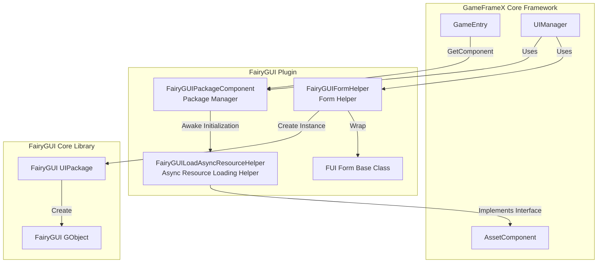
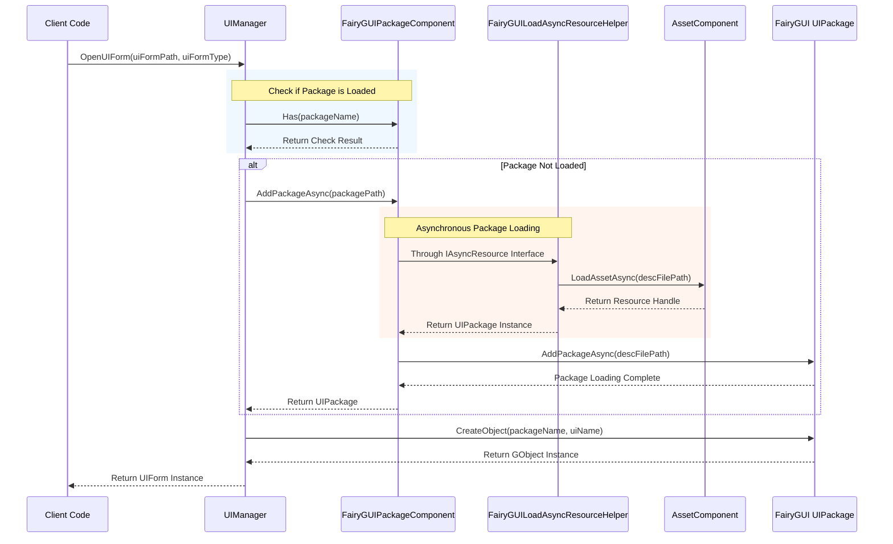

# Package Manager

The Package Manager is a core component of the FairyGUI plugin, responsible for managing all UI package loading, caching, and unloading operations. It provides both synchronous and asynchronous loading methods, and is deeply integrated with GameFrameX's resource management system.

## Overview

`FairyGUIPackageComponent` is a Unity component that inherits from `GameFrameworkComponent`, serving as a bridge between FairyGUI and the GameFrameX resource system. Its main responsibilities include:

- **Package Loading Management**: Supports both synchronous and asynchronous loading of UI packages
- **Package Caching Mechanism**: Loaded packages are cached to avoid repeated loading
- **Resource Cleanup**: Provides package unloading functionality to release memory resources
- **Asynchronous Resource Loading**: Implements FairyGUI's async resource loading needs through the `IAsyncResource` interface

### Core Responsibilities

The design goal of the Package Manager is to simplify UI package management, allowing developers to focus on form logic rather than resource loading details. When a UI form needs to be displayed, the Package Manager automatically checks whether the target package is loaded:

- If the package is loaded -> Directly use the cached package to create form instances
- If the package is not loaded -> Automatically load the package before creating form instances

This design greatly simplifies the UI development process and improves development efficiency.

## Architecture Design

The Package Manager's position and interaction relationships in the system are as follows:



### Core Class Description

| Class Name | Responsibility | Access Level |
|------|------|----------|
| `FairyGUIPackageComponent` | UI package management core component | `public` |
| `FairyGUILoadAsyncResourceHelper` | Implements IAsyncResource interface, handles async resource loading | `internal` |
| `UIPackageData` | Stores loaded package information | `public` (nested class) |

## Core Functions

### Package Loading Mechanism

The Package Manager uses a dual loading strategy, supporting both synchronous and asynchronous loading:

#### Asynchronous Loading (Recommended)

```csharp
/// <summary>
/// Asynchronously add UI package.
/// </summary>
/// <param name="descFilePath">Description file path</param>
/// <param name="isLoadAsset">Whether to load assets</param>
/// <returns>Async task representing the UI package</returns>
public Task<UIPackage> AddPackageAsync(string descFilePath, bool isLoadAsset = true)
```

Asynchronous loading is the recommended approach, especially suitable for scenarios requiring dynamic loading of large amounts of UI resources. The loading process does not block the main thread, maintaining a smooth user experience.

> Source: [FairyGUIPackageComponent.cs#L148-L179](https://github.com/GameFrameX/com.gameframex.unity.ui.fairygui/blob/main/Runtime/FairyGUIPackageComponent.cs#L148-L179)

#### Synchronous Loading

```csharp
/// <summary>
/// Synchronously add UI package.
/// </summary>
/// <param name="descFilePath">Description file path</param>
/// <param name="isLoadAsset">Whether to load assets</param>
public void AddPackageSync(string descFilePath, bool isLoadAsset = true)
```

Synchronous loading is suitable for editor environment or pre-loading scenarios at game startup.

> Source: [FairyGUIPackageComponent.cs#L190-L203](https://github.com/GameFrameX/com.gameframex.unity.ui.fairygui/blob/main/Runtime/FairyGUIPackageComponent.cs#L190-L203)

### Package Query Operations

```csharp
/// <summary>
/// Check if a UI package with the specified name exists.
/// </summary>
public bool Has(string uiPackageName)

/// <summary>
/// Get the UI package with the specified name.
/// </summary>
public UIPackage Get(string uiPackageName)
```

> Source: [FairyGUIPackageComponent.cs#L265-L290](https://github.com/GameFrameX/com.gameframex.unity.ui.fairygui/blob/main/Runtime/FairyGUIPackageComponent.cs#L265-L290)

### Package Unloading Mechanism

The Package Manager provides fine-grained unload control:

```csharp
/// <summary>
/// Remove UI package with the specified name.
/// </summary>
public void RemovePackage(string packageName)

/// <summary>
/// Remove all UI packages.
/// </summary>
public void RemoveAllPackages()
```

The unload operation performs the following steps:
1. Call `Package.UnloadAssets()` to unload resources
2. Remove package from FairyGUI
3. Release underlying resources through the resource helper
4. Remove record from cache dictionary

> Source: [FairyGUIPackageComponent.cs#L213-L254](https://github.com/GameFrameX/com.gameframex.unity.ui.fairygui/blob/main/Runtime/FairyGUIPackageComponent.cs#L213-L254)

## Loading Flow

When the Form Manager (UIManager) opens a UI form, the Package Manager's call flow is as follows:



### Key Design Points

1. **Automatic Package Loading**: Form Manager automatically checks and loads required UI packages, eliminating the need for manual management
2. **Concurrent Loading Control**: The `m_UIPackageLoading` dictionary prevents duplicate loading requests for the same package
3. **Resource Type Differentiation**: Different loading strategies are used based on resource types (images, audio, fonts, etc.)

## Asynchronous Resource Loading Helper

`FairyGUILoadAsyncResourceHelper` is an internal component of the Package Manager that implements FairyGUI's `IAsyncResource` interface. Its main functions are:

- Encapsulating GameFrameX's `AssetComponent` for use by FairyGUI
- Managing async loading of UI package resources
- Handling loading logic for different resource types (images, atlases, fonts, audio, etc.)

### Supported Resource Types

| Resource Type | FairyGUI Type | Loading Method |
|----------|---------------|--------|
| Image | `PackageItemType.Image` | Texture |
| Atlas | `PackageItemType.Atlas` | Texture |
| Audio | `PackageItemType.Sound` | AudioClip |
| Font | `PackageItemType.Font` | Font |
| Spine Animation | `PackageItemType.Spine` | TextAsset |
| DragonBones Animation | `PackageItemType.DragoneBones` | DragonBonesData |

> Source: [FairyGUILoadAsyncResourceHelper.cs#L124-L252](https://github.com/GameFrameX/com.gameframex.unity.ui.fairygui/blob/main/Runtime/FairyGUILoadAsyncResourceHelper.cs#L124-L252)

## Usage Examples

### Get Package Manager Instance

```csharp
var packageComponent = GameEntry.GetComponent<FairyGUIPackageComponent>();
```

### Check if Package Exists

```csharp
bool exists = packageComponent.Has("MyUIPackage");
```

### Manually Load Package

```csharp
// Asynchronous loading
var package = await packageComponent.AddPackageAsync("UIPackages/MyUIPackage");

// Synchronous loading
packageComponent.AddPackageSync("UIPackages/MyUIPackage");
```

### Get Loaded Package

```csharp
var package = packageComponent.Get("MyUIPackage");
if (package != null)
{
    // Use package to create object
    var obj = package.CreateObject("MainPanel");
}
```

### Unload Package

```csharp
// Unload specified package
packageComponent.RemovePackage("MyUIPackage");

// Unload all packages
packageComponent.RemoveAllPackages();
```

## Internal Implementation Details

### Package Data Storage

Each loaded package creates a `UIPackageData` instance for storage:

```csharp
[Serializable]
public sealed class UIPackageData
{
    public string DescFilePath { get; }      // Description file path
    public bool IsLoadAsset { get; }          // Whether to load assets
    public UIPackage Package { get; }         // Package instance
    public string Name { get; }               // Package name
}
```

> Source: [FairyGUIPackageComponent.cs#L64-L136](https://github.com/GameFrameX/com.gameframex.unity.ui.fairygui/blob/main/Runtime/FairyGUIPackageComponent.cs#L64-L136)

### Component Initialization

The Package Manager initializes in the `Awake` phase:

```csharp
protected override void Awake()
{
    IsAutoRegister = false;
    base.Awake();
    m_ResourceHelper = new FairyGUILoadAsyncResourceHelper();
    UIPackage.SetAsyncLoadResource(m_ResourceHelper);
}
```

Here, `IsAutoRegister = false` is set, indicating it will not automatically register with GameEntry. This is for manual control of initialization order.

> Source: [FairyGUIPackageComponent.cs#L300-L306](https://github.com/GameFrameX/com.gameframex.unity.ui.fairygui/blob/main/Runtime/FairyGUIPackageComponent.cs#L300-L306)

## API Reference

### `FairyGUIPackageComponent` Class

#### Methods

| Method | Return Type | Description |
|------|----------|------|
| `AddPackageAsync(string, bool)` | `Task<UIPackage>` | Asynchronously add UI package |
| `AddPackageSync(string, bool)` | `void` | Synchronously add UI package |
| `RemovePackage(string)` | `void` | Remove UI package with specified name |
| `RemoveAllPackages()` | `void` | Remove all UI packages |
| `Has(string)` | `bool` | Check if UI package with specified name exists |
| `Get(string)` | `UIPackage` | Get UI package with specified name |

#### Properties

| Property | Type | Description |
|------|------|------|
| `m_UILoadedPackages` | `Dictionary<string, UIPackageData>` | Cache dictionary for loaded packages |
| `m_UIPackageLoading` | `Dictionary<string, TaskCompletionSource<UIPackage>>` | Dictionary for packages being loaded |

### `UIPackageData` Nested Class

| Property | Type | Description |
|------|------|------|
| `DescFilePath` | `string` | Gets the description file path |
| `IsLoadAsset` | `bool` | Gets whether to load assets |
| `Package` | `UIPackage` | Gets the UI package instance |
| `Name` | `string` | Gets the UI package name |

## Common Issues

### Package Loading Failed

If package loading fails, please check:
1. Is the description file path correct
2. Does the package resource exist in the specified path
3. Is the resource system correctly initialized

### Memory Leaks

Ensure to call `RemovePackage` or `RemoveAllPackages` to release when UI packages are no longer needed, avoiding memory leaks.

### Resource Type Not Supported

The current version supports images, atlases, audio, fonts, Spine, and DragonBones animations. To support other types, please refer to the loading logic in `FairyGUILoadAsyncResourceHelper` for extension.

## Related Links

- [FUI Base Class](./06.fui-base-class.md) - Learn how to create FairyGUI forms
- [UI Manager](./08.ui-manager.md) - Learn the form opening and closing flow
- [Form Helper](./10.form-helper.md) - Learn form instantiation and release mechanism
