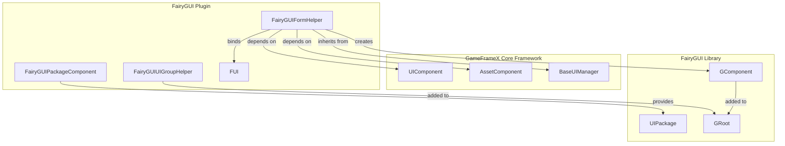
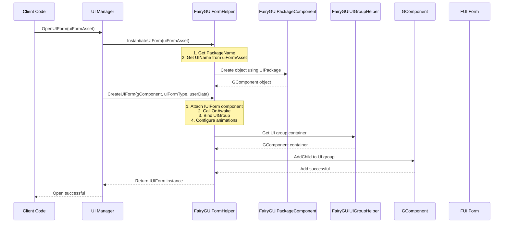
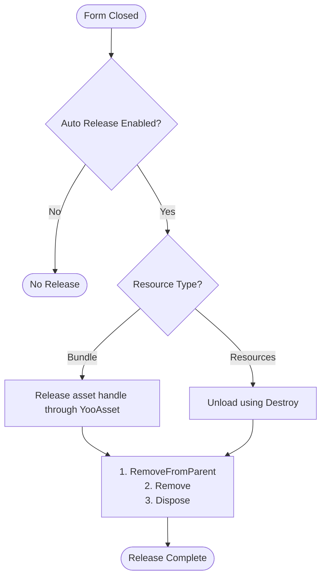

# Form Helper

`FairyGUIFormHelper` is the core component responsible for FairyGUI form instantiation, creation, and release in the GameFrameX plugin. It inherits from `UIFormHelperBase` and provides seamless integration with other parts of the framework for FairyGUI forms.

## Overview

The form helper is a critical component in the UI system, responsible for handling the lifecycle management of UI forms. In the FairyGUI plugin of GameFrameX, `FairyGUIFormHelper` undertakes the following core responsibilities:

- **Form Instantiation**: Converts UI resources into interactive form objects
- **Form Creation**: Attaches form logic types to view objects and completes form group binding
- **Form Release**: Properly cleans up form resources, including view objects and associated assets

This component provides FairyGUI-specific form management implementation by implementing the abstract methods defined in `UIFormHelperBase`.

> Source: [FairyGUIFormHelper.cs](https://github.com/GameFrameX/com.gameframex.unity.ui.fairygui/blob/main/Runtime/FairyGUIFormHelper.cs#L1-L233)

## Architecture

### Component Relationships

The position of `FairyGUIFormHelper` in the UI system is as follows:



### Design Intent

**Why is a form helper needed?**

1. **Decoupling View and Logic**: FairyGUI uses GComponent as the view layer, while game business logic needs to be handled by classes implementing the `IUIForm` interface. The form helper serves as a bridge between them.

2. **Unified Resource Management**: Through integration with `AssetComponent`, the form helper can properly manage UI resource loading and release, avoiding resource leaks.

3. **Configuration-Driven**: Using attributes to configure form behavior (such as form group, show/hide animations) decouples form configuration from code.

## Core Functions

### 1. Instantiate Form

The `InstantiateUIForm` method is responsible for converting UI resource data into FairyGUI's GComponent object:

```csharp
public override object InstantiateUIForm(object uiFormAsset)
{
    var openUIFormInfoData = (OpenUIFormInfoData)uiFormAsset;
    GameFrameworkGuard.NotNull(openUIFormInfoData, nameof(uiFormAsset));

    return UIPackage.CreateObject(openUIFormInfoData.PackageName, openUIFormInfoData.UIName);
}
```

> Source: [FairyGUIFormHelper.cs#L63-L69](https://github.com/GameFrameX/com.gameframex.unity.ui.fairygui/blob/main/Runtime/FairyGUIFormHelper.cs#L63-L69)

**Key Points**:
- Receives `OpenUIFormInfoData` object containing package name and form name
- Uses FairyGUI's `UIPackage.CreateObject()` method to create the object
- Returns `GComponent` instance for subsequent processing

### 2. Create Form

The `CreateUIForm` method attaches UI logic type to GComponent and completes form group binding:

```csharp
public override IUIForm CreateUIForm(object uiFormInstance, Type uiFormType, object userData)
{
    GComponent component = uiFormInstance as GComponent;
    if (component == null)
    {
        Log.Error("UI form instance is invalid.");
        return null;
    }

    // Add UI logic type as component to GameObject
    var componentType = component.displayObject.gameObject.GetOrAddComponent(uiFormType);
    var uiForm = componentType as IUIForm;
    if (uiForm == null)
    {
        Log.Error("UI form instance is invalid.");
        return null;
    }

    // Call OnAwake for initialization
    if (uiForm.IsAwake == false)
    {
        uiForm.OnAwake();
    }

    // Get or create form group
    var uiGroup = uiForm.UIGroup;
    if (uiGroup == null)
    {
        var attribute = uiFormType.GetCustomAttribute(typeof(OptionUIGroupAttribute));
        if (attribute is OptionUIGroupAttribute optionUIGroup)
        {
            uiGroup = m_UIComponent.GetUIGroup(optionUIGroup.GroupName);
        }
        uiForm.UIGroup = uiGroup;
    }

    // Configure show animation
    var showAnimationAttribute = uiFormType.GetCustomAttribute(typeof(OptionUIShowAnimationAttribute));
    if (showAnimationAttribute is OptionUIShowAnimationAttribute optionShowAnimation)
    {
        uiForm.EnableShowAnimation = optionShowAnimation.Enable;
        uiForm.ShowAnimationName = optionShowAnimation.AnimationName;
    }
    else
    {
        uiForm.EnableShowAnimation = m_UIComponent.IsEnableUIShowAnimation;
    }

    // Configure hide animation
    var hideAnimationAttribute = uiFormType.GetCustomAttribute(typeof(OptionUIHideAnimationAttribute));
    if (hideAnimationAttribute is OptionUIHideAnimationAttribute optionHideAnimation)
    {
        uiForm.EnableHideAnimation = optionHideAnimation.Enable;
        uiForm.HideAnimationName = optionHideAnimation.AnimationName;
    }
    else
    {
        uiForm.EnableHideAnimation = m_UIComponent.IsEnableUIHideAnimation;
    }

    // Validate form group
    if (uiGroup == null)
    {
        Log.Error("UI group is invalid.");
        return null;
    }

    // Get form group container and add child component
    DisplayObjectInfo displayObjectInfo = ((MonoBehaviour)uiGroup.Helper).gameObject.GetComponent<DisplayObjectInfo>();
    if (displayObjectInfo == null)
    {
        Log.Error("Display object info is invalid.");
        return null;
    }

    var uiGroupComponent = displayObjectInfo.displayObject.gOwner as GComponent;
    if (uiGroupComponent == null)
    {
        Log.Error("UI group component is invalid.");
        return null;
    }

    uiGroupComponent.AddChild(component);
    return uiForm;
}
```

> Source: [FairyGUIFormHelper.cs#L82-L161](https://github.com/GameFrameX/com.gameframex.unity.ui.fairygui/blob/main/Runtime/FairyGUIFormHelper.cs#L82-L161)

**Key Processing Flow**:

1. **Type Conversion**: Convert UI instance to `GComponent`
2. **Component Attachment**: Use `GetOrAddComponent` to add UI logic type to GameObject
3. **Initialization Call**: Call `OnAwake()` method to complete form initialization
4. **Form Group Binding**: Get form group through attribute or default configuration
5. **Animation Configuration**: Read from attributes or use global configuration to set show/hide animations
6. **Container Addition**: Add component to form group's GComponent container

### 3. Release Form

The `ReleaseUIForm` method is responsible for properly releasing form resources:

```csharp
public override void ReleaseUIForm(object uiFormAsset, object uiFormInstance, object assetHandle, string uiFormAssetPath, string uiFormAssetName)
{
    if (!m_UIComponent.EnableAutoReleaseUIForm)
    {
        return;
    }

    if (uiFormInstance is GComponent component)
    {
        component.RemoveFromParent();
        component.Remove();
        component.Dispose();
    }

    if (uiFormAssetPath.IndexOf(Utility.Asset.Path.BundlesDirectoryName, StringComparison.OrdinalIgnoreCase) >= 0)
    {
        if (assetHandle is YooAsset.AssetHandle handle)
        {
            handle.Release();
        }
        m_AssetComponent.UnloadAsset(uiFormAssetPath);
    }
    else
    {
        // Resources unload: only destroy Unity object when instance is not GComponent
        if (!(uiFormInstance is GComponent) && uiFormInstance is UnityEngine.Object unityObject)
        {
            Destroy(unityObject);
            UnityEngine.Resources.UnloadAsset(unityObject);
        }
    }
}
```

> Source: [FairyGUIFormHelper.cs#L175-L207](https://github.com/GameFrameX/com.gameframex.unity.ui.fairygui/blob/main/Runtime/FairyGUIFormHelper.cs#L175-L207)

**Resource Release Logic**:

1. **Auto-Release Switch**: Check if auto-release is enabled
2. **GComponent Cleanup**: Remove from parent, remove child objects, dispose resources
3. **Bundle Resources**: Handle resource handles and unload through YooAsset
4. **Resources Resources**: Use Unity's Destroy and UnloadAsset methods

## Form Creation Flow

The following sequence diagram shows the complete flow from opening a form to its full creation:



## Form Release Flow



## Configuration Options

### Form Group Configuration

The form group can be specified using attributes:

```csharp
[OptionUIGroup("MainUI")]
public class MainForm : FUI
{
    // Form logic
}
```

### Show/Hide Animation Configuration

Form show and hide animations can be configured through attributes:

```csharp
[OptionUIShowAnimation(true, "FadeIn")]
[OptionUIHideAnimation(true, "FadeOut")]
public class MainForm : FUI
{
    // Form logic
}
```

> Note: These attributes are defined in the GameFrameX.Runtime package. For specific usage, refer to related documentation.

## Dependency Components

`FairyGUIFormHelper` depends on the following components at runtime:

| Component | Description |
|-----------|-------------|
| `UIComponent` | Gets form group information, animation configuration, global release settings |
| `AssetComponent` | Unloads UI resources (in Bundle mode) |

These components are automatically obtained through the `Awake()` method:

```csharp
private void Awake()
{
    m_AssetComponent = GameEntry.GetComponent<AssetComponent>();
    if (m_AssetComponent == null)
    {
        Log.Fatal("Asset component is invalid.");
        return;
    }

    m_UIComponent = GameEntry.GetComponent<UIComponent>();
    if (m_UIComponent == null)
    {
        Log.Fatal("UI component is invalid.");
        return;
    }
}
```

> Source: [FairyGUIFormHelper.cs#L216-L231](https://github.com/GameFrameX/com.gameframex.unity.ui.fairygui/blob/main/Runtime/FairyGUIFormHelper.cs#L216-L231)

## Related Links

- [FUI Base Class](./06.fui-base-class.md) - Base class implementation for FairyGUI forms
- [UI Manager](./08.ui-manager.md) - Responsible for form opening, closing, and lifecycle management
- [Package Manager](./09.package-manager.md) - Manages FairyGUI package loading and unloading
- [UI Group Helper](./11.ui-group-helper.md) - Manages form group creation and depth
- [GObjectHelper Utility](./12.gobject-helper.md) - GObject and FUI mapping management