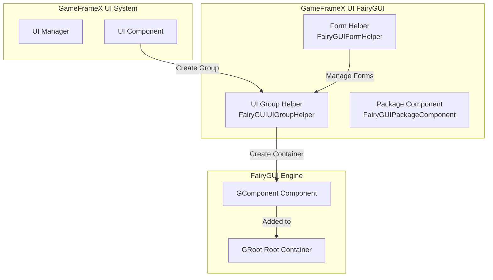
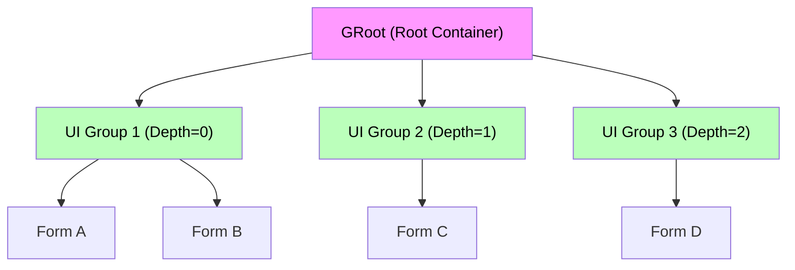
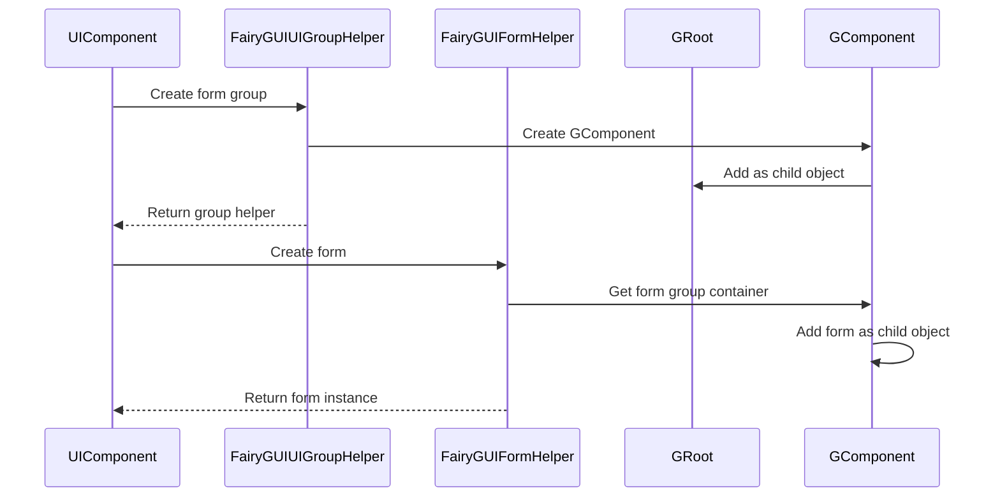

# UI Group Helper

`FairyGUIUIGroupHelper` is one of the core components of the GameFrameX UI FairyGUI plugin, responsible for creating and managing UI form groups in the FairyGUI rendering engine. Form groups are containers for organizing and managing multiple UI forms (windows), controlling the display hierarchy through depth (Z-order).

## Overview

The UI group helper is a bridge component between the GameFrameX UI system and the FairyGUI rendering engine. It inherits from the `UIGroupHelperBase` abstract class and provides FairyGUI-specific form group implementation. In the UI system, form groups are used to organize related UI forms together and control the occlusion relationships and display order of forms through depth values.

**Core Responsibilities:**
- Create FairyGUI form group containers (GComponent)
- Manage form group depth (Z-order)
- Set form group full-screen display
- Integrate with GameFrameX core system

> Source: [FairyGUIUIGroupHelper.cs](https://github.com/GameFrameX/com.gameframex.unity.ui.fairygui/blob/main/Runtime/FairyGUIUIGroupHelper.cs#L36-L97)

## Architecture Design

### Class Diagram

```mermaid
classDiagram
    class UIGroupHelperBase {
        <<abstract>>
        +Depth: int { get; protected set; }
        +Handler(root, groupName, helperTypeName, customHelper, depth) IUIGroupHelper
        +SetDepth(depth) void
    }
    
    class FairyGUIUIGroupHelper {
        +Depth: int { get; protected set; }
        +Handler(root, groupName, helperTypeName, customHelper, depth) IUIGroupHelper
        +SetDepth(depth) void
    }
    
    class GComponent {
        +name: string
        +opaque: bool
        +displayObject: DisplayObject
        +AddRelation(target, type) void
        +MakeFullScreen() void
    }
    
    class GRoot {
        +inst: GRoot
    }
    
    UIGroupHelperBase <|-- FairyGUIUIGroupHelper
    FairyGUIUIGroupHelper --> GComponent : creates
    GComponent --> GRoot : added as child
```

### System Integration Architecture



### Form Group Hierarchy



## Core Functions

### Create Form Group

The `Handler` method is the core method of the form group helper, responsible for creating and initializing a new FairyGUI form group.

```csharp
public override IUIGroupHelper Handler(Transform root, string groupName, string uiGroupHelperTypeName, IUIGroupHelper customUIGroupHelper, int depth = 0)
{
    SetDepth(depth);
    GComponent component = new GComponent();
    GRoot.inst.AddChild(component);
    var comName = groupName;
    component.displayObject.name = comName;
    component.gameObjectName = comName;
    component.name = comName;
    component.opaque = false;
    component.AddRelation(GRoot.inst, RelationType.Width);
    component.AddRelation(GRoot.inst, RelationType.Height);
    component.MakeFullScreen();
    return GameFrameX.Runtime.Helper.CreateHelper(component.displayObject.gameObject, uiGroupHelperTypeName, (UIGroupHelperBase)customUIGroupHelper, 0);
}
```

> Source: [FairyGUIUIGroupHelper.cs](https://github.com/GameFrameX/com.gameframex.unity.ui.fairygui/blob/main/Runtime/FairyGUIUIGroupHelper.cs#L82-L96)

**Creation Flow Description:**

1. **Set Depth**: Call `SetDepth(depth)` to set the Z-order of the form group
2. **Create Component**: Use `new GComponent()` to create a FairyGUI container component
3. **Add to Root**: Add the component to `GRoot.inst` (FairyGUI global root container)
4. **Set Name**: Set the component's `name`, `gameObjectName`, and `displayObject.name`
5. **Set Transparent**: Set `opaque = false` to make the form group container itself transparent
6. **Full-Screen Setup**: Add width and height relations, use `MakeFullScreen()` to make the component fill the screen
7. **Create Helper**: Use `GameFrameX.Runtime.Helper.CreateHelper` to create the actual helper instance

### Set Form Depth

The `SetDepth` method is used to set the depth value of the form group, which determines the display hierarchy.

```csharp
public override void SetDepth(int depth)
{
    Depth = depth;
    transform.localPosition = new Vector3(0, 0, depth * 100);
}
```

> Source: [FairyGUIUIGroupHelper.cs](https://github.com/GameFrameX/com.gameframex.unity.ui.fairygui/blob/main/Runtime/FairyGUIUIGroupHelper.cs#L63-L67)

**Depth Setting Principle:**
- FairyGUI uses Z-axis coordinates to control display hierarchy
- Each depth level corresponds to 100 units of Z-axis distance
- Larger depth values mean the form displays more in front (overlaying forms with smaller depth values)

## Form Group and Form Relationship

The relationship between form groups and UI forms is a one-to-many containment:



### Form Group Assignment

In the FairyGUI system, forms are assigned to specified form groups through the `OptionUIGroupAttribute`:

```csharp
[OptionUIGroup("MainUI")]
public class MainMenuForm : FUI
{
    // Form logic
}
```

> Source: [FairyGUIFormHelper.cs](https://github.com/GameFrameX/com.gameframex.unity.ui.fairygui/blob/main/Runtime/FairyGUIFormHelper.cs#L108-L115)

The system retrieves the corresponding form group instance based on the group name specified in the `OptionUIGroup` attribute and adds the form to that form group's GComponent container.

## Usage Examples

### Basic Configuration

Before using the form group helper, register the FairyGUI-related components in the GameFrameX startup configuration:

```csharp
// Configure in GameFrameworkComponent
// Use FairyGUIUIGroupHelper as form group helper implementation
```

### Form Group Definition Example

```csharp
// Form groups are automatically created at runtime by UIManager
// The following is the internal creation logic of the system

// 1. When a new form needs to be created, check if the corresponding form group exists
// 2. If it doesn't exist, use FairyGUIUIGroupHelper to create a new form group
// 3. The depth of the form group is assigned by the system based on configuration or auto-increment
```

## API Reference

### `FairyGUIUIGroupHelper` Class

**Namespace:** `GameFrameX.UI.FairyGUI.Runtime`

**Inheritance:** `UIGroupHelperBase`

---

### Properties

#### `Depth`

```csharp
public override int Depth { get; protected set; }
```

Gets the depth value of the form group.

- **Type:** `int`
- **Description:** Represents the Z-axis depth of the form group, used to control the display hierarchy of forms

---

### Methods

#### `Handler`

```csharp
public override IUIGroupHelper Handler(
    Transform root,
    string groupName,
    string uiGroupHelperTypeName,
    IUIGroupHelper customUIGroupHelper,
    int depth = 0
)
```

Creates and initializes a FairyGUI form group.

**Parameters:**
- `root` (Transform): Root node (not used in current implementation)
- `groupName` (string): Name of the form group
- `uiGroupHelperTypeName` (string): Type name of the form group helper
- `customUIGroupHelper` (IUIGroupHelper): Custom form group helper instance
- `depth` (int): Depth value of the form group, default is 0

**Return Value:**
- `IUIGroupHelper`: Created form group helper instance

**Implementation Notes:**
1. Set form group depth
2. Create `GComponent` as form group container
3. Add container to `GRoot.inst`
4. Configure full-screen display properties
5. Create and return helper instance

---

#### `SetDepth`

```csharp
public override void SetDepth(int depth)
```

Sets the depth of the form group.

**Parameters:**
- `depth` (int): Depth value of the form group

**Implementation Notes:**
Depth is set by modifying the Z coordinate of `transform.localPosition`. The Z coordinate calculation formula is: `depth * 100`. This design ensures sufficient Z-axis spacing between forms of different depths, avoiding rendering conflicts.

---

## Related Links

- [FUI Base Class](./06.fui-base-class.md) - Base class implementation for FairyGUI forms
- [UI Manager](./08.ui-manager.md) - Core manager of the form system
- [Package Manager](./09.package-manager.md) - FairyGUI resource package management
- [Form Helper](./10.form-helper.md) - Form creation and release management
- [UI Group Config](./13.ui-group-config.md) - Form group configuration options
- [GitHub Repository](https://github.com/GameFrameX/com.gameframex.unity.ui.fairygui.git) - Plugin source code