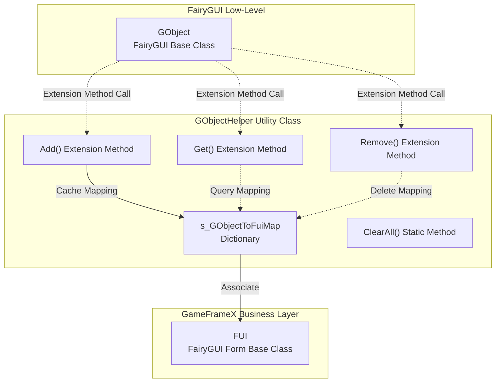
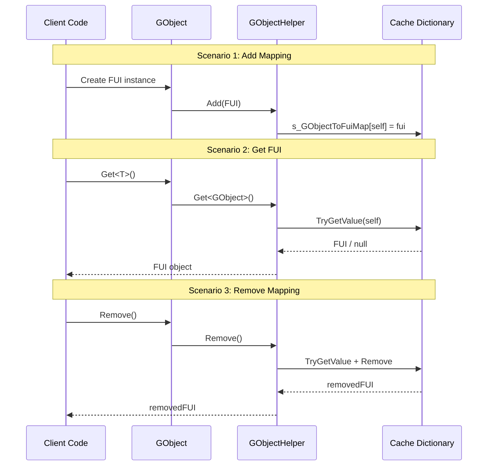

# GObjectHelper Utility Class

GObjectHelper is a static utility class used to manage the mapping relationship between FairyGUI's GObject objects and FUI form objects, providing caching and lookup functionality.

## Overview

GObjectHelper is a bridge in the GameFrameX plugin that connects FairyGUI's low-level objects (GObject) with the business logic layer (FUI form classes). In the FairyGUI form system, each form is represented by a GObject instance, and GObjectHelper provides the capability to quickly retrieve the corresponding FUI object from a GObject at runtime.

**Design Intent:**
- Solve the association problem between FairyGUI's GObject and business layer FUI objects
- Provide efficient lookup mechanism to avoid traversing complex form trees layer by layer
- Support resource management during dynamic form creation and destruction

**Usage Scenarios:**
- Needing to retrieve the form object that triggered an event in an event callback
- Needing to quickly associate to the corresponding FUI when operating at the component level
- Cleaning up related resources when unloading forms

## Architecture



**Architecture Notes:**
- GObjectHelper maintains a private static dictionary `s_GObjectToFuiMap` to store the mapping relationship between GObject and FUI
- Adds Get, Add, and Remove methods to GObject through C# extension methods
- All operations are thread-safe (internally using Dictionary)

## Core Functions

### 1. Get Associated FUI Object

Through GObject extension methods, you can quickly retrieve the FUI object associated with it:

```csharp
// Suppose there is a GObject instance
GObject gObject = someComponent.GetChild("Button");

// Get associated FUI object (type casting required)
MyFUI fui = gObject.Get<MyFUI>();
```
> Source: [GObjectHelper.cs](https://github.com/GameFrameX/com.gameframex.unity.ui.fairygui/blob/main/Runtime/GObjectHelper.cs#L69-L77)

**Method Signature:**
```csharp
public static T Get<T>(this GObject self) where T : FUI
```

### 2. Add FUI Mapping

Add the FUI object to the cache pool, establishing the association between GObject and FUI:

```csharp
// Create FUI instance
FUI fui = new MyFUI(gObject);

// Add to cache
gObject.Add(fui);
```
> Source: [GObjectHelper.cs](https://github.com/GameFrameX/com.gameframex.unity.ui.fairygui/blob/main/Runtime/GObjectHelper.cs#L88-L94)

### 3. Remove FUI Mapping

Remove the specified FUI mapping from the cache and return the removed FUI object:

```csharp
// Remove mapping and get the deleted FUI
FUI removedFui = gObject.Remove();
```
> Source: [GObjectHelper.cs](https://github.com/GameFrameX/com.gameframex.unity.ui.fairygui/blob/main/Runtime/GObjectHelper.cs#L105-L114)

### 4. Clear All Cache

When closing or reinitializing the form system, clear all cached mapping relationships:

```csharp
// Clear all cache
GObjectHelper.ClearAll();
```
> Source: [GObjectHelper.cs](https://github.com/GameFrameX/com.gameframex.unity.ui.fairygui/blob/main/Runtime/GObjectHelper.cs#L54-L57)

## Usage Flow



## Usage Examples

### Basic Usage

```csharp
using FairyGUI;
using GameFrameX.UI.FairyGUI.Runtime;

// Suppose there is a button component
GObject buttonObj = container.GetChild("SubmitButton");

// Get associated FUI
MainPanelFUI fui = buttonObj.Get<MainPanelFUI>();

if (fui != null)
{
    // Can operate on FUI
    fui.Visible = true;
}
```

### Mapping During Form Creation

```csharp
// When FairyGUIFormHelper creates a form
public override IUIForm CreateUIForm(object uiFormInstance, Type uiFormType, object userData)
{
    GComponent component = uiFormInstance as GComponent;
    var componentType = component.displayObject.gameObject.GetOrAddComponent(uiFormType);
    var uiForm = componentType as IUIForm;
    
    // Establish mapping relationship
    component.Add(uiForm as FUI);
    
    return uiForm;
}
```

### Resource Cleanup

```csharp
// When game exits or reloads scene
private void OnDestroy()
{
    // Clear all FUI mappings
    GObjectHelper.ClearAll();
}
```

## API Reference

### `Get<T>(this GObject self): T`

Gets the FUI object associated with the current GObject from the cache.

**Generic Parameters:**
- `T`: Derived type of FUI

**Parameters:**
- `self` (GObject): GObject instance calling the extension method

**Returns:**
- Associated FUI object; returns type default value (null for reference types) if not found

**Example:**
```csharp
MyPanelFUI fui = gObject.Get<MyPanelFUI>();
```

---

### `Add(this GObject self, FUI fui): void`

Adds an FUI object to the cache, establishing the mapping relationship between GObject and FUI.

**Parameters:**
- `self` (GObject): GObject instance calling the extension method
- `fui` (FUI): FUI object to add

**Example:**
```csharp
gObject.Add(new MyPanelFUI(gObject));
```

---

### `Remove(this GObject self): FUI`

Removes the FUI mapping of the specified GObject from the cache and returns the removed FUI object.

**Parameters:**
- `self` (GObject): GObject instance calling the extension method

**Returns:**
- Removed FUI object; returns default value if not found

**Example:**
```csharp
FUI removed = gObject.Remove();
```

---

### `ClearAll(): void`

Clears all cached FUI mapping relationships.

**Note:** This operation is irreversible. After calling, all associations between GObject and FUI will be cleared.

**Example:**
```csharp
GObjectHelper.ClearAll();
```

## Related Links

- [FUI Class](./06.fui-base-class.md) - FairyGUI form base class
- [FairyGUIFormHelper Class](./10.form-helper.md) - Form helper
- [FairyGUIPackageComponent Class](./09.package-manager.md) - Package manager component
- [UI Manager](./08.ui-manager.md) - Core concept of form management
- [Getting Started: Open and Close Forms](./07.open-close-ui.md)