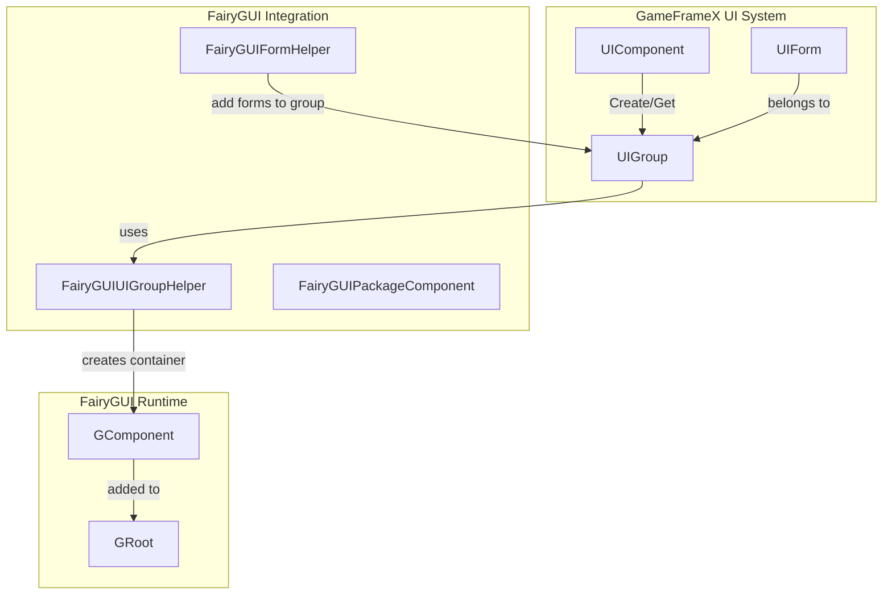
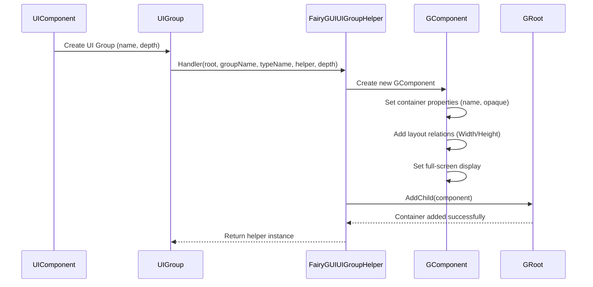
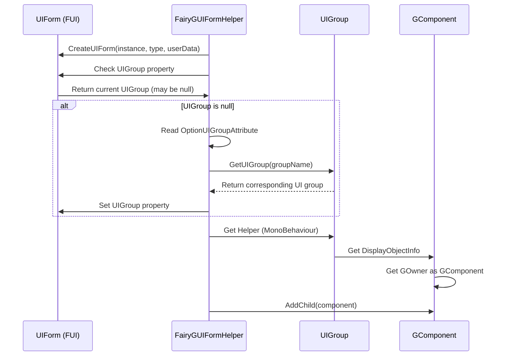

# UI Group Configuration

UI Groups are a core mechanism in the GameFrameX framework for managing UI form hierarchy and display order. The FairyGUI plugin provides the `FairyGUIUIGroupHelper` class to implement form group functionality conforming to FairyGUI rendering characteristics.

## Overview

UI group configuration is primarily used for:

- **Hierarchy Management**: Control the display hierarchy of different types of forms (e.g., popups, dialogs, main interface, etc.)
- **Depth Control**: Determine the front-back order of forms by setting Z-axis positions
- **Container Organization**: Organize related forms in the same container for easier management and control

In FairyGUI integration, UI groups are implemented through GComponent containers. Each group corresponds to an independent container, and forms are added as child elements to the corresponding group container.

## Architecture



**Architecture Notes:**

1. **UIComponent**: GameFrameX core component, responsible for managing all UI groups and form instances
2. **UIGroup**: Form group abstraction, holds reference to `IUIGroupHelper`
3. **FairyGUIUIGroupHelper**: FairyGUI-specific form group helper implementation, responsible for creating GComponent containers and managing depth
4. **FairyGUIFormHelper**: Form helper, responsible for adding form instances to the corresponding form group container
5. **GRoot**: FairyGUI's root container, all form group containers are added here

## Core Mechanisms

### Form Group Creation Flow



### Form Assignment to Group



## Configuration Options

### FairyGUIUIGroupHelper Properties

| Property | Type | Description |
|---------|------|-------------|
| `Depth` | int | Gets or sets the form group depth, used to control Z-axis order |

### FairyGUIUIGroupHelper Methods

#### `SetDepth(int depth)`

Sets the form group depth. This method implements depth control by modifying the Z coordinate of transform.localPosition.

```csharp
public override void SetDepth(int depth)
{
    Depth = depth;
    transform.localPosition = new Vector3(0, 0, depth * 100);
}
```

> Source: [FairyGUIUIGroupHelper.cs](https://github.com/GameFrameX/com.gameframex.unity.ui.fairygui/blob/main/Runtime/FairyGUIUIGroupHelper.cs#L63-L67)

**Parameters:**
- `depth` (int): Form group depth value; larger values display more in front

#### `Handler(Transform root, string groupName, string uiGroupHelperTypeName, IUIGroupHelper customUIGroupHelper, int depth = 0)`

Creates a form group handler.

```csharp
public override IUIGroupHelper Handler(Transform root, string groupName, string uiGroupHelperTypeName, IUIGroupHelper customUIGroupHelper, int depth = 0)
{
    SetDepth(depth);
    GComponent component = new GComponent();
    GRoot.inst.AddChild(component);
    var comName = groupName;
    component.displayObject.name = comName;
    component.gameObjectName = comName;
    component.name = comName;
    component.opaque = false;
    component.AddRelation(GRoot.inst, RelationType.Width);
    component.AddRelation(GRoot.inst, RelationType.Height);
    component.MakeFullScreen();
    return GameFrameX.Runtime.Helper.CreateHelper(component.displayObject.gameObject, uiGroupHelperTypeName, (UIGroupHelperBase)customUIGroupHelper, 0);
}
```

> Source: [FairyGUIUIGroupHelper.cs](https://github.com/GameFrameX/com.gameframex.unity.ui.fairygui/blob/main/Runtime/FairyGUIUIGroupHelper.cs#L82-L96)

**Parameters:**
- `root` (Transform): Root node
- `groupName` (string): Form group name
- `uiGroupHelperTypeName` (string): Form group helper type name
- `customUIGroupHelper` (IUIGroupHelper): Custom form group helper
- `depth` (int): Form group depth, default is 0

**Return Value:** Created form group helper instance

## Usage

### Declare Form's Group

Mark the form to belong to a specified form group using the `OptionUIGroupAttribute`:

```csharp
using GameFrameX.UI.Runtime;

[OptionUIGroup("Dialog")]
public class MyDialogForm : FUI
{
    // Form implementation
}
```

> Source: [FairyGUIFormHelper.cs](https://github.com/GameFrameX/com.gameframex.unity.ui.fairygui/blob/main/Runtime/FairyGUIFormHelper.cs#L108-L114)

**Notes:**
- Form group names are configured in UIComponent of the GameFrameX core framework
- FairyGUIUIGroupHelper automatically creates a GComponent container with the corresponding name
- Depth value determines the display order of forms; larger values display more in front

### Configure Form Group Depth

Form group depth is typically configured during game framework initialization:

```csharp
// Set form group depth in UIComponent configuration
// Different form groups can use different depth values to achieve hierarchy separation
// For example: Background=0, Normal=10, Dialog=20, Toast=30
```

## Common Scenarios

### Scenario 1: Dialog Form Group

Put all dialog-type forms in an independent form group to ensure dialogs always display above normal forms:

```csharp
[OptionUIGroup("Dialog")]
public class ConfirmDialog : FUI { }

[OptionUIGroup("Dialog")]
public class AlertDialog : FUI { }
```

### Scenario 2: Toast Group

Place temporary notification messages at the highest level:

```csharp
[OptionUIGroup("Toast")]
public class ToastForm : FUI { }
```

### Scenario 3: Background Form Group

Place background forms at the lowest level:

```csharp
[OptionUIGroup("Background")]
public class MainBackground : FUI { }
```

## Related Links

- [FUI Base Class](./06.fui-base-class.md)
- [UI Manager](./08.ui-manager.md)
- [Form Helper](./10.form-helper.md)
- [Package Manager](./09.package-manager.md)
- [Editor Config](./14.editor-config.md)