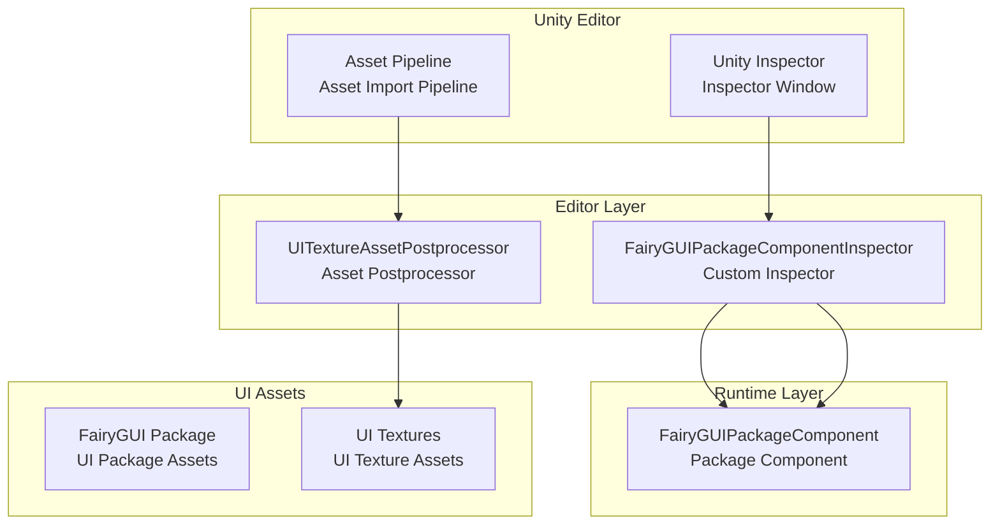
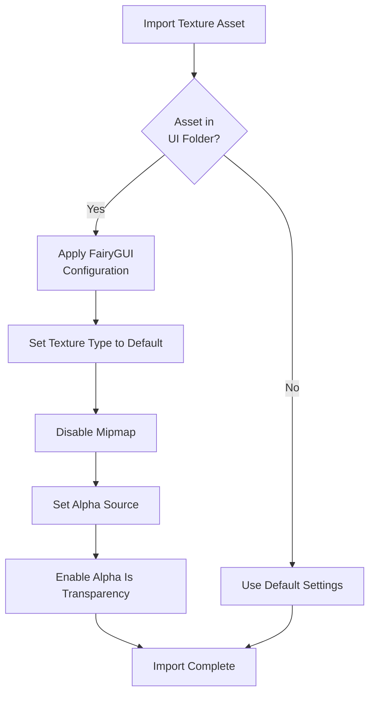

# Editor Configuration

The editor configuration document introduces the configuration capabilities of the GameFrameX UI FairyGUI plugin in the Unity Editor, including custom inspectors and asset postprocessors.

## Overview

The GameFrameX UI FairyGUI plugin provides a complete editor configuration mechanism to simplify the UI development workflow in the Unity Editor. These editor features include the following two core components:

1. **Custom Inspector** - Provides a visual configuration interface for FairyGUIPackageComponent
2. **Asset Postprocessor** - Automatically configures import settings for UI texture assets

These editor configuration features can significantly improve development efficiency, reduce manual configuration work, and ensure UI assets use best practices.

## Architecture



## Custom Inspector

### FairyGUIPackageComponentInspector

The custom inspector inherits from the GameFrameX base editor framework and provides a visual configuration interface for the FairyGUIPackageComponent component.

```csharp
// Source: Editor/Inspector/FairyGUIPackageComponentInspector.cs
using GameFrameX.Editor;
using GameFrameX.UI.FairyGUI.Runtime;
using UnityEditor;

namespace GameFrameX.UI.FairyGUI.Editor
{
    [CustomUnityEditor(typeof(FairyGUIPackageComponent))]
    internal sealed class UIFairyGUIPackageComponentInspector : GameFrameworkInspector
    {
        public override void OnInspectorGUI()
        {
            base.OnInspectorGUI();
            Repaint();
        }
    }
}
```

> Source: [FairyGUIPackageComponentInspector.cs](https://github.com/GameFrameX/com.gameframex.unity.ui.fairygui/blob/main/Editor/Inspector/FairyGUIPackageComponentInspector.cs#L38-L46)

**Features:**
- Automatically integrated into Unity Inspector panel
- Inherits from GameFrameworkInspector base class, providing a unified editor interface style
- Supports runtime configuration viewing for components
- Adds `GameFrameX/FairyGUIPackage` menu item for quick component creation

**Usage:**
1. Create an empty GameObject in Unity scene
2. Add `FairyGUIPackageComponent` component (can be quickly added via menu `GameFrameX/FairyGUIPackage`)
3. View and configure component properties in the Inspector panel

## Asset Postprocessor

### UITextureAssetPostprocessor

The asset postprocessor is a core component of editor configuration. It automatically applies the correct settings when UI texture assets are imported, ensuring UI assets meet FairyGUI requirements.

```csharp
// Source: Editor/UITextureAssetPostprocessor.cs
#if ENABLE_UI_FAIRYGUI
using GameFrameX.Runtime;
using UnityEditor;

namespace GameFrameX.UI.FairyGUI.Editor
{
    internal sealed class UITextureAssetPostprocessor : AssetPostprocessor
    {
        void OnPreprocessTexture()
        {
            if (assetPath.Contains(PathHelper.Combine(Utility.Asset.Path.BundlesPath, "UI")))
            {
                TextureImporter textureImporter = (TextureImporter)assetImporter;
                if (textureImporter.textureType != TextureImporterType.Default)
                {
                    textureImporter.textureType = TextureImporterType.Default;
                }

                if (textureImporter.mipmapEnabled)
                {
                    textureImporter.mipmapEnabled = false;
                }

                textureImporter.alphaSource = TextureImporterAlphaSource.FromInput;
                textureImporter.alphaIsTransparency = true;
            }
        }
    }
}
#endif
```

> Source: [UITextureAssetPostprocessor.cs](https://github.com/GameFrameX/com.gameframex.unity.ui.fairygui/blob/main/Editor/UITextureAssetPostprocessor.cs#L41-L59)

### Automatic Configuration Property Description

| Setting | Value | Description |
|---------|-------|-------------|
| Texture Type | Default | Uses default texture type, ensuring FairyGUI can correctly identify |
| Mipmap | Disabled | UI textures typically don't need Mipmap; disabling saves memory |
| Alpha Source | FromInput | Reads Alpha information from texture channels |
| Alpha Is Transparency | Enabled | Treats Alpha channel as transparency for optimized rendering |

### Processing Scope

The asset postprocessor only processes texture assets located in the UI folder. The UI folder path is determined by `PathHelper.Combine(Utility.Asset.Path.BundlesPath, "UI")`, typically `Assets/Bundles/UI`.

### Workflow



## Configuration Summary

### Editor Assembly Definition

Editor code is located in a separate assembly, separated from runtime code:

```json
// Source: Editor/GameFrameX.UI.FairyGUI.Editor.asmdef
{
  "name": "GameFrameX.UI.FairyGUI.Editor",
  "references": [
    "GameFrameX.UI.FairyGUI.Runtime",
    "GameFrameX.Editor",
    "GameFrameX.Runtime",
    "FairyGUI.Editor",
    "FairyGUI.Runtime"
  ],
  "includePlatforms": [
    "Editor"
  ]
}
```

> Source: [GameFrameX.UI.FairyGUI.Editor.asmdef](https://github.com/GameFrameX/com.gameframex.unity.ui.fairygui/blob/main/Editor/GameFrameX.UI.FairyGUI.Editor.asmdef#L1-L21)

### Compilation Condition

Editor code is controlled by the `ENABLE_UI_FAIRYGUI` compilation symbol, ensuring relevant code is only compiled when the FairyGUI module is enabled.

## Common Configuration Issues

### Texture Import Issues

If UI textures are not automatically applying correct configuration:

1. **Verify UI asset path**: Textures must be in the UI folder (e.g., `Assets/Bundles/UI/`)
2. **Check compilation symbol**: Confirm `ENABLE_UI_FAIRYGUI` is defined
3. **Refresh asset database**: In Unity, select `Assets > Refresh` or press `Ctrl+R` to force refresh

### Inspector Not Showing Custom Panel

If the custom inspector is not displaying correctly:

1. Confirm GameFrameX.Editor dependency package is installed
2. Check if FairyGUIPackageComponentInspector class is correctly inherited
3. Ensure assembly definition correctly includes Editor platform

## Related Links

- [FUI Base Class](./06.fui-base-class.md) - Learn how to use the FUI base class
- [FairyGUIPackageComponent Class](./09.package-manager.md) - Detailed API documentation for the package manager component
- [UI Manager](./08.ui-manager.md) - Learn UI manager configuration and usage
- [Installation](./02.installation.md) - Plugin installation instructions
- [Dependencies](./05.dependencies.md) - Dependency configuration instructions