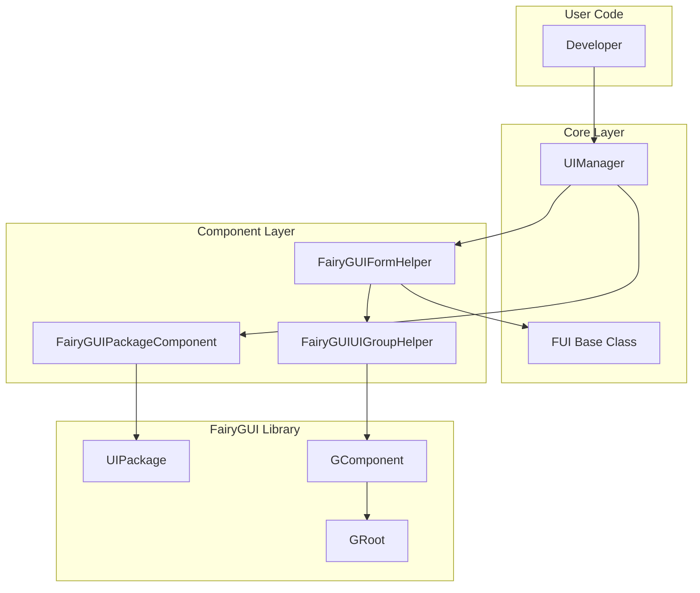

# Troubleshooting

This document collects common issues and their solutions encountered during the use of the GameFrameX Unity UI FairyGUI plugin.

## Overview

The GameFrameX Unity UI FairyGUI plugin provides integrated encapsulation of FairyGUI UI components for Unity games. During use, developers may encounter issues such as form loading failures, components not found, and resource path errors. This document aims to help developers quickly locate and resolve these common issues.

## Installation and Configuration Issues

### Q1: How to properly install the FairyGUI plugin?

**Problem Description**: Compilation errors or abnormal functionality after installing the plugin in a Unity project.

**Solution**:
1. Ensure all dependencies are installed:
   - `com.gameframex.unity` (1.1.1+)
   - `com.gameframex.unity.ui` (1.0.0+)
   - `com.gameframex.unity.asset` (1.0.6+)
   - `com.gameframex.unity.event` (1.0.0+)

2. Installation method (choose one):
   - Add to `manifest.json`:
     ```json
     {"com.gameframex.unity.ui.fairygui": "https://github.com/GameFrameX/com.gameframex.unity.ui.fairygui.git"}
     ```
   - Add via Git URL in Unity's Package Manager: `https://github.com/gameframex/com.gameframex.unity.ui.fairygui.git`
   - Directly download the repository and place it in the Unity project's `Packages` directory

3. Unity version requirement: 2019.4 or higher

> For details, refer to [Installation](./02.installation.md)

---

### Q2: FairyGUIPackageComponent component not found?

**Problem Description**: Runtime error like `FairyGuiPackage is invalid` or similar.

**Solution**:
1. Ensure the FairyGUIPackageComponent component exists in the scene
2. This component must be attached to a GameObject
3. Check if the component is correctly initialized

> For details, refer to [Package Manager](./09.package-manager.md)

---

## Form Loading Issues

### Q3: Form opening failed, prompt "Load UI form failure"?

**Problem Description**: Failure when calling form opening method, error message contains "Load UI form failure".

**Possible Causes**:
1. Resource path incorrect
2. FairyGUI package not loaded correctly
3. Resource file does not exist

**Solution**:
1. Confirm resource path format is correct
2. Ensure FairyGUI package (.bin file) is placed in the correct directory
3. Check if UI resources are packaged

> For details, refer to [Open and Close Forms](./07.open-close-ui.md)

---

### Q4: UI package loading failed?

**Problem Description**: Prompt UI package loading failed or package name is empty.

**Possible Causes**:
1. Package path format incorrect
2. Package name does not match resource name

**Solution**:
1. Resource path format: `{packageName}/{resourceName}` or `{packageName}`
2. Ensure package name matches the package name published in the FairyGUI editor
3. Check if resources are in the correct directory (Resources or Bundles)

---

### Q5: Form is blank when loading asynchronously?

**Problem Description**: Form displays when opened asynchronously but content is empty.

**Possible Causes**:
1. Package loading timing too early
2. Resources not yet fully loaded

**Solution**:
1. Ensure to use `await` to wait for package loading to complete
2. Check if `isLoadAsset` parameter is correctly set

```csharp
// Correct example
var package = await FairyGuiPackage.AddPackageAsync("uipackage");
var ui = UIPackage.CreateObject("uipackage", "MainForm");
```

> For details, refer to [FairyGUIPackageComponent](./09.package-manager.md)

---

## Form Component Issues

### Q6: Prompt "UI form instance is invalid"?

**Problem Description**: Form instantiation failed, prompt "UI form instance is invalid".

**Possible Causes**:
1. Form type does not inherit from FUI base class
2. FairyGUIFormHelper not configured correctly

**Solution**:
1. Ensure form class inherits from FUI:
   ```csharp
   public class MainForm : FUI
   {
       // Form logic
   }
   ```
2. Ensure FairyGUIFormHelper is added to the scene

> For details, refer to [FUI Base Class](./06.fui-base-class.md)

---

### Q7: Prompt "UI group is invalid"?

**Problem Description**: Form cannot be added to form group, prompt "UI group is invalid".

**Possible Causes**:
1. Form group not created correctly
2. Form group name does not match

**Solution**:
1. Correctly configure form group in UI configuration
2. Use `[OptionUIGroup]` attribute to specify form group:
   ```csharp
   [OptionUIGroup("MainUI")]
   public class MainForm : FUI
   {
   }
   ```

> For details, refer to [UI Group Configuration](./13.ui-group-config.md)

---

### Q8: Prompt "Display object info is invalid"?

**Problem Description**: Form display object info is invalid.

**Possible Causes**:
1. Form group helper not initialized correctly
2. GComponent not correctly added to GRoot

**Solution**:
1. Ensure FairyGUIUIGroupHelper is created correctly
2. Check if GRoot is initialized

> For details, refer to [UI Group Helper](./11.ui-group-helper.md)

---

## Resource Loading Issues

### Q9: Resource loading failed, prompt "Unknown file type"?

**Problem Description**: Prompt unknown file type when loading resources.

**Possible Causes**:
1. Resource type not in supported list
2. File extension incorrect

**Solution**:
FairyGUIPackageComponent supports the following resource types:
- `.bytes` - Binary resource
- `.atlas` - Atlas resource
- `.png` / `.jpg` - Image resource
- Spine animation resources
- DragonBones animation resources

Ensure resource file extensions are correct and have been added to the FairyGUI package.

> For details, refer to [FairyGUIPackageComponent](./09.package-manager.md)

---

### Q10: YooAsset resource unloading failed?

**Problem Description**: Resources not correctly released after form is closed.

**Possible Causes**:
1. EnableAutoReleaseUIForm not enabled
2. Resource handle not passed correctly

**Solution**:
1. Ensure UIComponent's EnableAutoReleaseUIForm is set to true
2. Check if resource path contains "Bundles" directory identifier

```csharp
// Resource path format examples
string uiFormAssetPath = "Bundles/UI/MainForm";  // YooAsset resource
// or
string uiFormAssetPath = "Resources/UI/MainForm";  // Resources resource
```

---

## Path Finding Issues

### Q11: Prompt "Invalid UI path"?

**Problem Description**: Failed when using path to find form component.

**Possible Causes**:
1. Path format incorrect
2. Component name does not exist
3. Index out of range

**Solution**:
1. Use correct path format: `"parentComponent/childComponent"` or `"componentName[index]"`
2. Ensure component name exists
3. Check if index value is within valid range

```csharp
// Correct examples
var button = UIForm.GObject.GetChild("Btn_Confirm");
var dialog = UIForm.GObject.asCom.GetChildAt(0);

// Path finding
var deepChild = FairyGUIPathFinderHelper.GetChild(UIForm.GObject, "Panel/Content/Button");
```

> For details, refer to [GObjectHelper](./12.gobject-helper.md)

---

## Component Initialization Issues

### Q12: Asset Component or UI Component not found?

**Problem Description**: Runtime error "Asset component is invalid" or "UI component is invalid".

**Solution**:
1. Ensure GameEntry is correctly initialized
2. Ensure the following components are added to GameEntry:
   - AssetComponent
   - UIComponent
   - FairyGUIPackageComponent

> For details, refer to [Editor Configuration](./14.editor-config.md)

---

## Architecture Diagram



## Common Error Code Table

| Error Message | Possible Cause | Solution |
|--------------|---------------|----------|
| UI form instance is invalid | Form type does not inherit from FUI | Ensure form class inherits from FUI |
| UI group is invalid | Form group not configured | Configure form group or use attribute |
| Display object info is invalid | Form group helper not initialized | Check FairyGUIUIGroupHelper |
| Asset component is invalid | AssetComponent not registered | Ensure GameEntry initialization |
| UI component is invalid | UIComponent not registered | Ensure GameEntry initialization |
| Load UI form failure | Resource path error | Check resource path and package name |
| Invalid UI path | Path format error | Use correct path format |

## Related Links

- [Overview](./01.overview.md)
- [Features](./04.features.md)
- [System Requirements](./04.features.md)
- [Installation](./02.installation.md)
- [Dependencies](./05.dependencies.md)
- [Getting Started](./03.getting-started.md)
- [Open and Close Forms](./07.open-close-ui.md)
- [FUI Base Class](./06.fui-base-class.md)
- [UI Manager](./08.ui-manager.md)
- [Package Manager](./09.package-manager.md)
- [Form Helper](./10.form-helper.md)
- [UI Group Helper](./11.ui-group-helper.md)
- [GObjectHelper](./12.gobject-helper.md)
- [UI Group Config](./13.ui-group-config.md)
- [Editor Config](./14.editor-config.md)