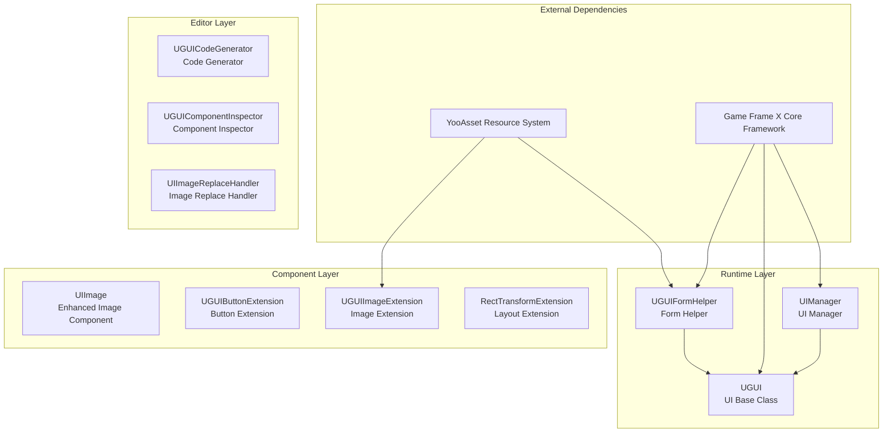
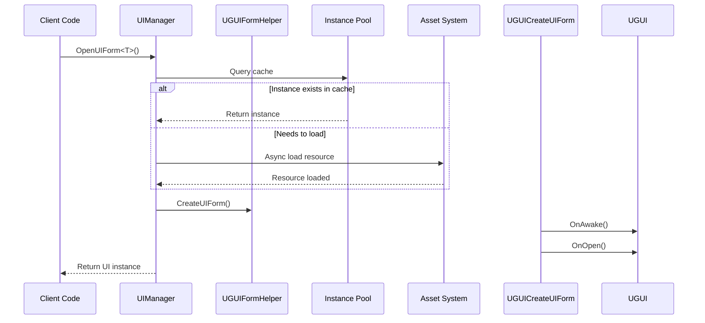

# Introduction

Game Frame X UGUI Component is a Unity UI feature package that provides encapsulation of UGUI components, making UGUI component usage simpler and more efficient. This plugin is a core component of the Game Frame X game development framework, specifically optimized and feature-extended for Unity's UGUI system.

## Overview

Game Frame X UGUI plugin aims to provide a complete, efficient, and extensible UI solution for Unity game developers. By encapsulating Unity's native UGUI system, this plugin provides more convenient API calling methods, while having a built-in powerful code generator that can significantly improve UI development efficiency.

As part of the Game Frame X framework, this plugin depends on the core framework (`com.gameframex.unity`), UI base package (`com.gameframex.unity.ui`), asset management package (`com.gameframex.unity.asset`), and event system (`com.gameframex.unity.event`). Through modular design, developers can selectively use the plugin's various functional modules as needed.

This plugin supports Unity 2019.4 and above, distributed under dual licenses MIT and Apache License 2.0.

## Core Architecture



### Architecture Layer Description

**Runtime Layer** contains the core business logic of the plugin:

- **UIManager**: Responsible for UI form open, close, and lifecycle management, supports form instance pool and auto-recycle mechanism
- **UGUI**: Abstract UI base class, provides UI display state control, form show/hide animation support
- **UGUIFormHelper**: UI form helper, handles UI instantiation and creation, supports configuration of UI grouping and animation via attributes

**Component Layer** provides extension functions:

- **UIImage**: Inherits from Unity's Image component, supports async icon loading via resource path
- **Extension Methods**: Include button extension, image extension, and RectTransform extension to simplify common operations

**Editor Layer** provides development efficiency tools:

- **UGUICodeGenerator**: Auto-generates code from UGUI prefabs
- **UGUIComponentInspector**: Visually inspects component properties in the editor
- **UIImageReplaceHandler**: Batch processes image resource replacement

## Main Features

### UGUI Component Encapsulation

The plugin provides high-level encapsulation of Unity's native UGUI components, offering a more object-oriented interface design. Developers don't need to directly manipulate Unity's GameObject and Component; instead, they create their own UI forms by inheriting the `UGUI` base class, enjoying unified lifecycle management and event callback mechanisms.

```csharp
using GameFrameX.UI.UGUI.Runtime;
using UnityEngine;

public class MainMenuUI : UGUI
{
    protected override void OnInit(object userData)
    {
        base.OnInit(userData);
        // Initialize UI logic
    }
    
    protected override void OnOpen(object userData)
    {
        base.OnOpen(userData);
        // Logic when UI opens
    }
    
    protected override void OnClose(bool isShutdown, object userData)
    {
        base.OnClose(isShutdown, userData);
        // Logic when UI closes
    }
}
```
> Source: [README.md](https://github.com/GameFrameX/com.gameframex.unity.ui.ugui/blob/main/README.md#L78-L101)

### UI Manager

`UIManager` is the core manager of the entire plugin, responsible for handling the complete lifecycle of UI forms. It inherits from `BaseUIManager`, providing complete functions for form loading, caching, and recycling. Through instance pool technology, it can effectively reduce performance overhead from frequent UI form creation and destruction.



### Code Generator

The editor tool `UGUICodeGenerator` can greatly improve UI development efficiency. Developers only need to create a UGUI prefab in Unity editor, select it, right-click and choose `GameObject/UI/Generate UGUI Code(生成UGUI代码)` menu item to automatically generate the corresponding C# code file.

Generated code includes:
- Serialized field references for all child components
- Button click event binding methods
- Component retrieval completion callback methods

### Extension Methods

The plugin provides rich extension methods to simplify daily UI development work:

**Button Extension** - Simplify event binding:
```csharp
startButton.onClick.Add(OnStartButtonClick);
startButton.onClick.Clear();
startButton.onClick.Set(OnClickHandler);
```
> Source: [UGUIButtonExtension.cs](https://github.com/GameFrameX/com.gameframex.unity.ui.ugui/blob/main/Runtime/UGUIButtonExtension.cs#L52-L101)

**Image Extension** - Async icon loading:
```csharp
iconImage.SetIconAsync("UI/Icons/StartIcon");
```
> Source: [UGUIImageExtension.cs](https://github.com/GameFrameX/com.gameframex.unity.ui.ugui/blob/main/Runtime/UGUIImageExtension.cs#L56-L74)

**Layout Extension** - Fullscreen setup:
```csharp
panel.MakeFullScreen();
```
> Source: [RectTransformExtension.cs](https://github.com/GameFrameX/com.gameframex.unity.ui.ugui/blob/main/Runtime/RectTransformExtension.cs#L56-L62)

## Dependencies

This plugin depends on the following Game Frame X components:

| Dependency | Minimum Version | Description |
|-----------|-----------------|-------------|
| com.gameframex.unity | 1.1.1 | Core framework, provides basic services |
| com.gameframex.unity.ui | 1.0.0 | UI base package, defines UIForm interface |
| com.gameframex.unity.asset | 1.0.6 | Resource management system |
| com.gameframex.unity.event | 1.0.0 | Event system |

## Quick Start

### Basic Usage Flow

1. **Create UI Form Class**: Inherit `UGUI` base class, implement lifecycle methods
2. **Configure UI Prefab**: Add component inheriting from `UGUI` on the prefab
3. **Open form via Manager**: Use `UIManager` to open/close forms

```csharp
// Open form
var mainMenu = await UIManager.Instance.OpenUIForm<MainMenuUI>("UI/");

// Close form
UIManager.Instance.CloseUIForm(mainMenu);
```

### Using UIImage Component

`UIImage` component supports async image resource loading by setting the `icon` property:

```csharp
public class IconDisplay : MonoBehaviour
{
    [SerializeField] private UIImage iconImage;
    
    void Start()
    {
        // Set icon, supports async loading
        iconImage.icon = "UI/Icons/PlayerAvatar";
    }
}
```
> Source: [README.md](https://github.com/GameFrameX/com.gameframex.unity.ui.ugui/blob/main/README.md#L143-L156)

## Related Links

- [Features](./1-overview.features) - Detailed feature list
- [Dependencies](./2-installation.dependencies) - Dependency details
- [Installation](./2-installation.methods) - Installation configuration guide
- [Create UI](./3.getting-started.md) - UI creation tutorial
- [Code Generator](./10.code-generator.md) - Code generator usage
- [UGUI Base Class](./06.ugui-base.md) - UGUI base class details
- [UI Manager](./07.ui-manager.md) - Manager API reference
- [Form Helper](./08.form-helper.md) - Helper details
- [UIImage Component](./09.uiimage.md) - Enhanced image component
- [Extension Methods](./12.extensions.md) - Extension methods API
- [Code Generator Tool](./10.code-generator.md) - Editor tools
- [Component Inspector](./11.inspector.md) - Inspector description
- [Image Replace Handler](./15.image-replace.md) - Resource processing tool
- [Configuration](./14.configuration.md) - Framework configuration
- [Troubleshooting](./16.troubleshooting.md) - FAQ
- [Official Documentation](https://gameframex.doc.alianblank.com)
- [GitHub Repository](https://github.com/GameFrameX/com.gameframex.unity.ui.ugui)