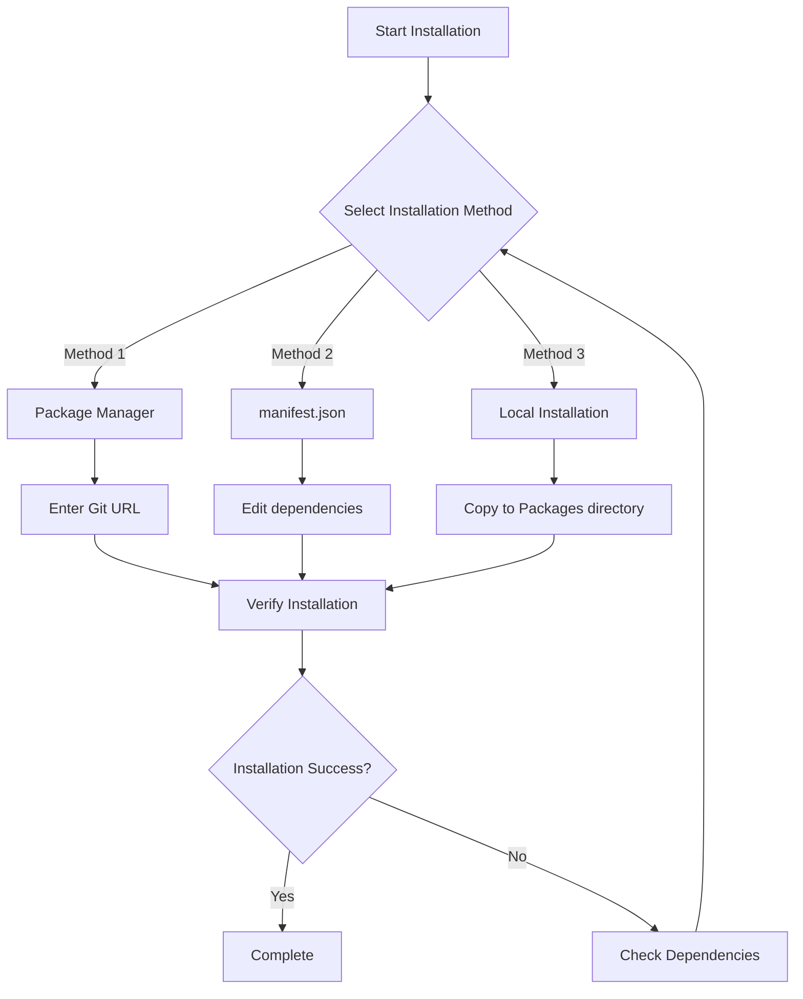
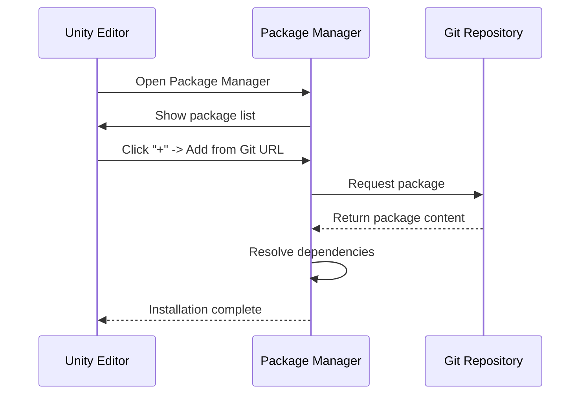

# Installation

This document introduces multiple installation methods for Game Frame X UI UGUI package to help developers choose the most suitable installation method based on project requirements.

## Overview

Game Frame X UI UGUI is an enhanced component library for Unity UGUI, providing UI manager, code generator, extension methods and other functional modules. The package follows Unity Package Manager (UPM) standards and supports multiple installation methods.

**Package Information:**
- Package Name: `com.gameframex.unity.ui.ugui`
- Current Version: 2.3.6
- Unity Version Requirement: 2019.4+
- Git Repository: https://github.com/GameFrameX/com.gameframex.unity.ui.ugui.git

## Installation Flow Overview



## Prerequisites

Before installing this package, ensure the following dependency packages are correctly installed:

| Dependency Package | Version Requirement | Description |
|--------|----------|------|
| com.gameframex.unity | 1.1.1 | Core framework |
| com.gameframex.unity.ui | 1.0.0 | UI base package |
| com.gameframex.unity.asset | 1.0.6 | Asset management |
| com.gameframex.unity.event | 1.0.0 | Event system |

> **Note**: The above dependencies will be automatically resolved when installing this package. If dependency installation fails, refer to the [Dependencies](./05.dependencies.md) document for manual handling.

## Installation Methods

### Method 1: Package Manager (Recommended)

Using Unity's Package Manager to install via Git URL is the officially recommended method with the following advantages:
- Automatic version management
- Automatic dependency resolution
- Easy update to latest version

**Steps:**

1. Open Unity editor
2. Navigate to `Window` -> `Package Manager` (Window -> Package Manager)
3. Click the **+** button in the top left corner of Package Manager
4. Select **Add package from git URL** (Add package from git URL)
5. Paste the following address in the input field:
   ```
   https://github.com/GameFrameX/com.gameframex.unity.ui.ugui.git
   ```
6. Click **Add** (Add) button and wait for installation to complete



### Method 2: Directly Edit manifest.json

This method is suitable for scenarios where you need to lock a specific version or develop without network access.

**Steps:**

1. Find the `Packages/manifest.json` file in your project
2. Open the file with a text editor
3. Add the following content under the `dependencies` node:

```json
{
  "dependencies": {
    "com.gameframex.unity.ui.ugui": "https://github.com/GameFrameX/com.gameframex.unity.ui.ugui.git",
    "com.gameframex.unity": "1.1.1",
    "com.gameframex.unity.ui": "1.0.0",
    "com.gameframex.unity.asset": "1.0.6",
    "com.gameframex.unity.event": "1.0.0"
  }
}
```

> Source: [README.md](https://github.com/GameFrameX/com.gameframex.unity.ui.ugui/blob/main/README.md#L66-L69)

4. Save the file and return to Unity editor
5. Wait for Unity to automatically reimport the package

**Version Locking Method:**

If you need to install a specific version, you can use Git's version tags:

```json
{
  "dependencies": {
    "com.gameframex.unity.ui.ugui": "https://github.com/GameFrameX/com.gameframex.unity.ui.ugui.git#2.3.6"
  }
}
```

### Method 3: Local Installation

Suitable for scenarios where you cannot access external network or need offline development.

**Steps:**

1. Clone or download the Git repository:
   ```
   https://github.com/GameFrameX/com.gameframex.unity.ui.ugui.git
   ```
2. Copy the repository folder to your Unity project's `Packages` directory
3. Unity will automatically recognize and load the package

> Source: [README.md](https://github.com/GameFrameX/com.gameframex.unity.ui.ugui/blob/main/README.md#L71-L72)

**Directory Structure Requirements:**

```
YourUnityProject/
└── Packages/
    └── com.gameframex.unity.ui.ugui/    <- Package root directory
        ├── package.json                  <- Required
        ├── Runtime/                      <- Runtime assembly
        │   └── GameFrameX.UI.UGUI.Runtime.asmdef
        ├── Editor/                       <- Editor assembly
        │   └── GameFrameX.UI.UGUI.Editor.asmdef
        └── ...
```

## Installation Verification

After installation, you can verify success through the following methods:

### Method 1: Check Package Manager

In the Package Manager window, search for `Game Frame X UI UGUI` and confirm the package is displayed in the list.

### Method 2: Check Assemblies

In your Unity project, confirm the following assemblies are correctly loaded:
- `GameFrameX.UI.UGUI.Runtime`
- `GameFrameX.UI.UGUI.Editor`

### Method 3: Create Test Script

Create a simple test script to verify the namespace is available:

```csharp
using GameFrameX.UI.UGUI.Runtime;

public class InstallationTest : MonoBehaviour
{
    void Start()
    {
        Debug.Log("Game Frame X UI UGUI installed successfully!");
    }
}
```

> Source: [README.md](https://github.com/GameFrameX/com.gameframex.unity.ui.ugui/blob/main/README.md#L78-L102)

## Common Issues

### Q1: Dependency errors after installation

**Cause**: Incompatible dependency package versions or not installed

**Solution**:
1. Open `Window` -> `Package Manager`
2. Check if all dependency packages are correctly installed
3. Refer to [Dependencies](./05.dependencies.md) to manually install missing dependencies

### Q2: Cannot install from Git URL

**Cause**: Network issues or incorrect Git credential configuration

**Solution**:
1. Confirm your network can access GitHub
2. Try local installation method
3. Configure Git Credential Manager

### Q3: What does the version suffix ".git" mean?

This is the URL suffix for a Git repository, indicating pulling code from the remote repository. Using this format, Unity will automatically pull the latest version. If you need a specific version, use `#version` format to specify the version tag.

## Related Links

- [Dependencies](./05.dependencies.md) - Detailed dependency instructions
- [Official Documentation](https://gameframex.doc.alianblank.com)
- [GitHub Repository](https://github.com/GameFrameX/com.gameframex.unity.ui.ugui)
- [Quick Start](./03.getting-started.md)
- [Core Concepts](./06.ugui-base.md)