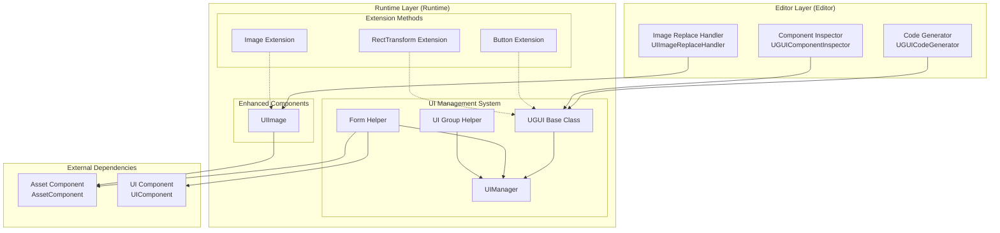
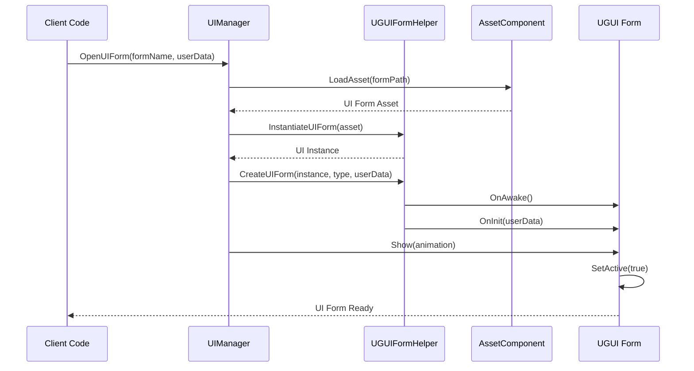
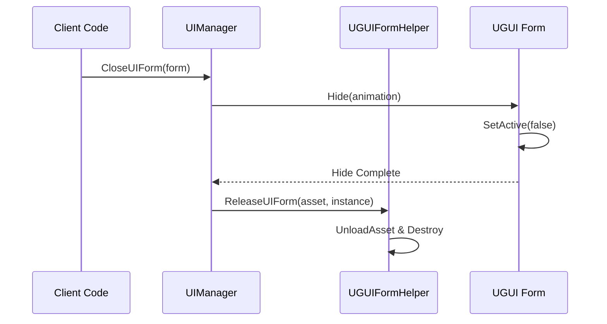

# Features

GameFrameX UGUI Component is a Unity UI feature package that provides high-level encapsulation of Unity UGUI components, making UGUI component usage simpler and more efficient. The plugin seamlessly integrates with the Game Frame X framework, providing complete UI form management, code generation, and extension methods.

## Overview

This plugin provides a complete UGUI solution for Unity game development, mainly including the following core functional modules:

- **UGUI Component Encapsulation**: Provides high-level encapsulation of Unity UGUI components, simplifying UI development process
- **UI Manager**: Complete UI form management system, handles form open, close, and lifecycle management
- **Code Generator**: Auto-generates code from UI prefabs, greatly improving development efficiency
- **Extension Methods**: Provides rich chain extension methods for common UGUI components
- **Form Helper**: Auxiliary tool for UI form creation and management

These functional modules collaborate with each other, together forming a complete UGUI development solution. The plugin follows Game Frame X framework's architectural specifications and can seamlessly integrate with other framework components (such as resource management, event system).

## Architecture

The plugin uses a layered architecture design, mainly divided into runtime layer and editor layer. Runtime layer contains core UI management logic and extension functions, editor layer provides visual development tools.



### Architecture Description

**Editor Layer** provides three main development tools: code generator for auto-generating UI code, component inspector for visualizing UI component operations in Inspector panel, image replace handler for replacing standard Image components with enhanced UIImage components.

**Runtime Layer** is the core of the plugin, containing three main parts: UI management system responsible for form lifecycle management, enhanced components providing functionally extended UI elements, extension methods adding convenient operations for common UGUI components.

**External Dependencies** shows the plugin's integration relationship with other components of the Game Frame X framework, including asset component and UI component.

## Core Features Detail

### UI Management System

UI management system is the core of the plugin, responsible for managing the lifecycle of all UI forms in the game. This system consists of four main classes: UGUI as the base class for all UI forms, UIManager as the form manager, UGUIFormHelper as the form helper, and UGUIUIGroupHelper as the UI group helper.

**UGUI Base Class** inherits from UIForm, providing UGUI-specific form functionality implementation. It handles form display and hide operations, with optional animation effects to enhance user experience, while providing visibility control.

```csharp
public class MainMenuUI : UGUI
{
    protected override void OnInit(object userData)
    {
        base.OnInit(userData);
        // Initialize UI logic
    }
    
    protected override void OnOpen(object userData)
    {
        base.OnOpen(userData);
        // Logic when UI opens
    }
    
    protected override void OnClose(bool isShutdown, object userData)
    {
        base.OnClose(isShutdown, userData);
        // Logic when UI closes
    }
}
```
> Source: [README.md](https://github.com/GameFrameX/com.gameframex.unity.ui.ugui/blob/main/README.md#L78-L102)

**UIManager** is the concrete implementation of the form manager, inherits from BaseUIManager, handles UI form loading, caching, and lifecycle management. It closely integrates with the framework's UI component, providing unified form access interface.

**UGUIFormHelper** is the default form helper, implements UIFormHelperBase interface. It handles UI form instantiation, creation, and release. When creating forms, it automatically handles form group assignment, animation configuration, and other details.

**UGUIUIGroupHelper** is the UI group helper, manages UI group layers and hierarchy. It provides depth setting functionality to ensure correct occlusion relationships between different UI groups.

### Enhanced Components

**UIImage** is an extension of Unity's standard Image component, adding async icon loading via resource paths. When setting the icon property, it automatically loads textures from the resource system and creates Sprites.

```csharp
[DisallowMultipleComponent]
public class UIImage : UnityEngine.UI.Image
{
    public string icon
    {
        get { return m_icon; }
        set
        {
            if (m_icon != value)
            {
                m_icon = value;
                _ = this.SetIconAsync(m_icon);
            }
        }
    }
}
```
> Source: [Runtime/UIImage.cs](https://github.com/GameFrameX/com.gameframex.unity.ui.ugui/blob/main/Runtime/UIImage.cs#L40-L72)

Using UIImage component simplifies icon loading code:

```csharp
public class IconDisplay : MonoBehaviour
{
    [SerializeField] private UIImage iconImage;
    
    void Start()
    {
        // Set icon, supports async loading
        iconImage.icon = "UI/Icons/PlayerAvatar";
    }
}
```
> Source: [README.md](https://github.com/GameFrameX/com.gameframex.unity.ui.ugui/blob/main/README.md#L143-L156)

### Extension Methods

The plugin provides three main extension method classes for Button, Image, and RectTransform components.

**UGUIButtonExtension** provides convenient extension methods for button click events, including add, remove, clear, and set click events.

```csharp
public static class UGUIBOttonExtension
{
    // Add button click event
    public static void Add(this Button.ButtonClickedEvent self, UnityAction action);
    
    // Remove button click event
    public static void Remove(this Button.ButtonClickedEvent self, UnityAction action);
    
    // Clear button click event
    public static void Clear(this Button.ButtonClickedEvent self);
    
    // Set button click event (replace existing event)
    public static void Set(this Button.ButtonClickedEvent self, UnityAction action);
}
```
> Source: [Runtime/UGUIButtonExtension.cs](https://github.com/GameFrameX/com.gameframex.unity.ui.ugui/blob/main/Runtime/UGUIButtonExtension.cs#L42-L101)

Example of using extension methods:

```csharp
startButton.onClick.Add(OnStartButtonClick);
```
> Source: [README.md](https://github.com/GameFrameX/com.gameframex.unity.ui.ugui/blob/main/README.md#L119-L119)

**UGUIImageExtension** provides async icon setting functionality, loading textures and creating Sprites through the resource system.

```csharp
public static class UGUIImageExtension
{
    public static async Task SetIconAsync(this UnityEngine.UI.Image self, string icon)
    {
        var assetComponent = GameEntry.GetComponent<AssetComponent>();
        using (var valueHandle = await assetComponent.LoadAssetAsync<Texture2D>(icon))
        {
            if (valueHandle.IsDone && valueHandle.Status == EOperationStatus.Succeed)
            {
                var texture2D = valueHandle.GetAssetObject<Texture2D>();
                self.sprite = Sprite.Create(texture2D, new Rect(0, 0, texture2D.width, texture2D.height), new Vector2(0.5f, 0.5f));
            }
        }
    }
}
```
> Source: [Runtime/UGUIImageExtension.cs](https://github.com/GameFrameX/com.gameframex.unity.ui.ugui/blob/main/Runtime/UGUIImageExtension.cs#L44-L74)

**RectTransformExtension** provides MakeFullScreen method, which can set RectTransform to fullscreen.

```csharp
public static class RectTransformExtension
{
    public static void MakeFullScreen(this RectTransform rectTransform)
    {
        rectTransform.anchorMin = Vector2.zero;
        rectTransform.anchorMax = Vector2.one;
        rectTransform.anchoredPosition = Vector2.zero;
        rectTransform.sizeDelta = Vector2.zero;
    }
}
```
> Source: [Runtime/RectTransformExtension.cs](https://github.com/GameFrameX/com.gameframex.unity.ui.ugui/blob/main/Runtime/RectTransformExtension.cs#L56-L62)

### Editor Tools

The plugin provides three editor tools to improve development efficiency.

**UGUICodeGenerator** is the UGUI code generator, can auto-generate code from UI prefabs. Accessed via menu item `GameObject/UI/Generate UGUI Code(生成UGUI代码)`, automatically scans all UI components in the prefab and generates corresponding code.

```csharp
[MenuItem("GameObject/UI/Generate UGUI Code(生成UGUI代码)", false, 1)]
static void Code()
{
    // Code generation logic
}
```
> Source: [Editor/UGUICodeGenerator.cs](https://github.com/GameFrameX/com.gameframex.unity.ui.ugui/blob/main/Editor/UGUICodeGenerator.cs#L56-L73)

Generated code features:

- Auto-identify all UI child nodes and generate property declarations
- Use `UGUIElementPropertyAttribute` to mark each control's path
- Generate `InitView()` method for initialization binding
- Support custom type conversion handlers

**UGUIComponentInspector** is the custom inspector for UGUI components, providing two main function buttons: "Regenerate Code" and "Rebind List".

```csharp
[CustomEditor(typeof(Runtime.UGUI), true)]
internal sealed class UGUIComponentInspector : GameFrameworkInspector
{
    public override void OnInspectorGUI()
    {
        // Provide "Regenerate Code" and "Rebind List" functions
    }
}
```
> Source: [Editor/UGUIComponentInspector.cs](https://github.com/GameFrameX/com.gameframex.unity.ui.ugui/blob/main/Editor/UGUIComponentInspector.cs#L43-L153)

**UIImageReplaceHandler** provides functionality to replace standard Image components with UIImage components, accessed via menu item `CONTEXT/Image/Replace To UIImage(替换为UIImage)`.

```csharp
[MenuItem("CONTEXT/Image/Replace To UIImage(替换为UIImage)", false, 10)]
static void Run()
{
    // Replace logic, preserve all original Image properties
}
```
> Source: [Editor/UIImageReplaceHandler.cs](https://github.com/GameFrameX/com.gameframex.unity.ui.ugui/blob/main/Editor/UIImageReplaceHandler.cs#L42-L76)

### Attribute Features

**UGUIElementPropertyAttribute** is used to mark the path of UI controls in prefabs, used together with the code generator.

```csharp
public sealed class UGUIElementPropertyAttribute : Attribute
{
    public string Path { get; }
    
    public UGUIElementPropertyAttribute(string path)
    {
        Path = path;
    }
}
```
> Source: [Runtime/UGUIElementPropertyAttribute.cs](https://github.com/GameFrameX/com.gameframex.unity.ui.ugui/blob/main/Runtime/UGUIElementPropertyAttribute.cs#L40-L64)

## Form Open and Close Flow

UI forms in games follow a specific flow for opening and closing, involving collaboration of multiple components.



When closing a form, the flow is as follows:



## Usage Examples

### Create Custom UI Form

Inherit UGUI base class to create custom forms, override lifecycle methods to handle business logic:

```csharp
using GameFrameX.UI.UGUI.Runtime;
using UnityEngine;

public class MainMenuUI : UGUI
{
    protected override void OnInit(object userData)
    {
        base.OnInit(userData);
        // Initialize UI logic
    }
    
    protected override void OnOpen(object userData)
    {
        base.OnOpen(userData);
        // Logic when UI opens
    }
    
    protected override void OnClose(bool isShutdown, object userData)
    {
        base.OnClose(isShutdown, userData);
        // Logic when UI closes
    }
}
```
> Source: [README.md](https://github.com/GameFrameX/com.gameframex.unity.ui.ugui/blob/main/README.md#L78-L102)

### Use Extension Methods

Use extension methods in MonoBehaviour to simplify UI operations:

```csharp
using GameFrameX.UI.UGUI.Runtime;
using UnityEngine.UI;

public class UIController : MonoBehaviour
{
    [SerializeField] private Button startButton;
    [SerializeField] private Image iconImage;
    [SerializeField] private RectTransform panel;
    
    void Start()
    {
        // Button extension method
        startButton.onClick.Add(OnStartButtonClick);
        
        // Image extension method
        iconImage.SetIcon("UI/Icons/StartIcon");
        
        // RectTransform extension method
        panel.MakeFullScreen();
    }
    
    private void OnStartButtonClick()
    {
        Debug.Log("Start button clicked!");
    }
}
```
> Source: [README.md](https://github.com/GameFrameX/com.gameframex.unity.ui.ugui/blob/main/README.md#L106-L133)

### Use Code Generator

1. Select a UGUI prefab in Hierarchy
2. Right-click and select `GameObject/UI/Generate UGUI Code(生成UGUI代码)`
3. Code will be automatically generated to `Assets/Hotfix/UI/UGUI/` directory

Generated code structure:

```csharp
[DisallowMultipleComponent]
[OptionUIConfig(null, "Assets/Prefabs/UI")]
public sealed partial class MainMenuUI : UGUI
{
    public GameObject self { get; private set; }

    [SerializeField] [UGUIElementProperty("Background")]
    private UnityEngine.UI.Image m_Background;

    [SerializeField] [UGUIElementProperty("StartButton")]
    private UnityEngine.UI.Button m_StartButton;

    protected override void InitView()
    {
        if (_isInitView) return;
        _isInitView = true;
        this.self = this.gameObject;
        m_Background = gameObject.transform.FindChildName("Background").GetComponent<UnityEngine.UI.Image>();
        m_StartButton = gameObject.transform.FindChildName("StartButton").GetComponent<UnityEngine.UI.Button>();
    }
}
```
> Source: [Editor/UGUICodeGenerator.cs](https://github.com/GameFrameX/com.gameframex.unity.ui.ugui/blob/main/Editor/UGUICodeGenerator.cs#L199-L230)

## Related Links

- [Introduction](./01.overview.md) - Learn plugin overview and design philosophy
- [Installation](./02.installation.md) - Get plugin installation steps
- [UGUI Base Class](./06.ugui-base.md) - UGUI base class details
- [UI Manager](./07.ui-manager.md) - UI manager details
- [Form Helper](./08.form-helper.md) - Form helper details
- [UIImage Component](./09.uiimage.md) - UIImage component details
- [Extension Methods](./12.extensions.md) - Extension method details
- [Code Generator](./10.code-generator.md) - Code generator details
- [Component Inspector](./11.inspector.md) - Component inspector details
- [Image Replace Handler](./15.image-replace.md) - Image replace handler details