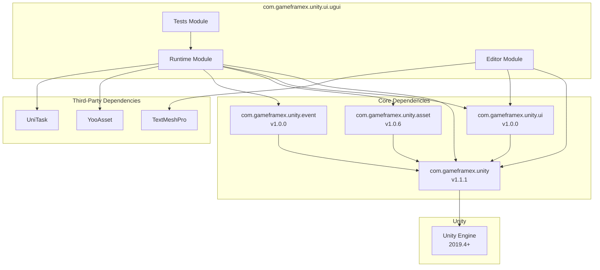

# Dependencies

This document details all dependency requirements for the Game Frame X UGUI component package, including Unity version requirements, package dependencies, and assembly references.

## Overview

Game Frame X UGUI component package is a high-level UI framework based on Unity UGUI, requiring dependencies on Game Frame X core framework and other related component packages. Understanding these dependency requirements is the first step for proper installation and usage.

## Unity Version Requirements

| Item | Requirement |
|------|-------------|
| Minimum Unity Version | 2019.4 |
| Recommended Unity Version | 2020.3 LTS or higher |

> Source: [package.json](https://github.com/GameFrameX/com.gameframex.unity.ui.ugui/blob/main/package.json#L7)

## Package Dependencies

Before installing the UGUI component package, ensure the following dependency packages are correctly installed. These dependency packages are managed through Unity Package Manager.

### Core Dependencies

| Package | Minimum Version | Description |
|--------|------------|-------------|
| com.gameframex.unity | 1.1.1 | Game Frame X core framework, provides basic architecture and common functionality |
| com.gameframex.unity.ui | 1.0.0 | Game Frame X UI base package, provides UI abstraction layer and base interfaces |
| com.gameframex.unity.asset | 1.0.6 | Game Frame X asset management package, provides asset loading and management functionality |
| com.gameframex.unity.event | 1.0.0 | Game Frame X event system package, provides event dispatching and listening functionality |

> Source: [package.json](https://github.com/GameFrameX/com.gameframex.unity.ui.ugui/blob/main/package.json#L21-L26)

### Installing Dependencies

Add the following dependencies in your Unity project's `manifest.json`:

```json
{
  "dependencies": {
    "com.gameframex.unity": "1.1.1",
    "com.gameframex.unity.ui": "1.0.0",
    "com.gameframex.unity.asset": "1.0.6",
    "com.gameframex.unity.event": "1.0.0",
    "com.gameframex.unity.ui.ugui": "2.3.6"
  }
}
```

## Assembly References

### Runtime Assembly

The UGUI runtime assembly needs to reference the following assemblies:

| Assembly | Description |
|---------|-------------|
| GameFrameX.Runtime | Core runtime |
| GameFrameX.Asset.Runtime | Asset management runtime |
| GameFrameX.Event.Runtime | Event system runtime |
| GameFrameX.UI.Runtime | UI base runtime |
| YooAsset.Runtime | YooAsset resource engine runtime |
| YooAsset | YooAsset main assembly |
| UniTask.Runtime | UniTask async runtime |

> Source: [Runtime/GameFrameX.UI.UGUI.Runtime.asmdef](https://github.com/GameFrameX/com.gameframex.unity.ui.ugui/blob/main/Runtime/GameFrameX.UI.UGUI.Runtime.asmdef#L4-L11)

### Editor Assembly

The UGUI editor assembly needs to reference the following assemblies:

| Assembly | Description |
|---------|-------------|
| GameFrameX.Editor | Core editor |
| GameFrameX.Runtime | Core runtime |
| GameFrameX.UI.Runtime | UI base runtime |
| GameFrameX.UI.UGUI.Runtime | UGUI runtime |
| Unity.TextMeshPro | TextMeshPro (conditional dependency) |

> Source: [Editor/GameFrameX.UI.UGUI.Editor.asmdef](https://github.com/GameFrameX/com.gameframex.unity.ui.ugui/blob/main/Editor/GameFrameX.UI.UGUI.Editor.asmdef#L4-L9)

#### TextMeshPro Conditional Reference

The editor assembly uses version definition to conditionally reference TextMeshPro:

```json
{
  "name": "com.unity.textmeshpro",
  "expression": "",
  "define": "ENABLE_UI_TEXT_MESH_PRO"
}
```

This means TextMeshPro is an optional dependency; when the project has TextMeshPro, related functions are automatically enabled.

> Source: [Editor/GameFrameX.UI.UGUI.Editor.asmdef](https://github.com/GameFrameX/com.gameframex.unity.ui.ugui/blob/main/Editor/GameFrameX.UI.UGUI.Editor.asmdef#L20-L26)

## Dependency Diagram



## Installation Order

To ensure correct dependency resolution, install in the following order:

1. **Step 1: Install Core Dependencies**
   - com.gameframex.unity (1.1.1)
   - com.gameframex.unity.ui (1.0.0)
   - com.gameframex.unity.asset (1.0.6)
   - com.gameframex.unity.event (1.0.0)

2. **Step 2: Install Third-Party Dependencies**
   - YooAsset (automatically introduced via Asset or UI package)
   - UniTask (install manually if not auto-introduced)

3. **Step 3: Install UGUI Component**
   - com.gameframex.unity.ui.ugui (2.3.6)

4. **Step 4 (Optional): Install Editor Enhancement**
   - TextMeshPro (if enhanced text functionality is needed)

## Version Compatibility

| UGUI Version | Unity Version | Core Framework Version | Package Status |
|--------------|---------------|----------------------|----------------|
| 2.3.6 | 2019.4+ | 1.1.1 | Current stable |
| 2.0.0 | 2019.4+ | 1.0.0 | Historical version |

## Common Issues

### Q1: What to do if missing dependencies are prompted during installation?

Ensure all dependency packages are installed in the order listed above. If using Git URL installation, dependencies are usually automatically downloaded.

### Q2: Where to get YooAsset and UniTask?

These packages are usually automatically introduced as part of the Game Frame X ecosystem. If not auto-introduced:
- YooAsset: Available from GitHub repository `YooAsset`
- UniTask: Available from Unity Package Manager as `com.cysharp.unitask`

### Q3: Is TextMeshPro required?

No. TextMeshPro is an optional dependency and does not affect core functionality usage. However, it is recommended to install for complete text processing capability.

## Related Links

- [Installation](./02.installation.md) - Detailed installation steps
- [Introduction](./01.overview.md) - Plugin feature overview
- [Features](./04.features.md) - Complete feature list
- [Game Frame X Official Documentation](https://gameframex.doc.alianblank.com)
- [GitHub Repository](https://github.com/gameframex/com.gameframex.unity.ui.ugui.git)