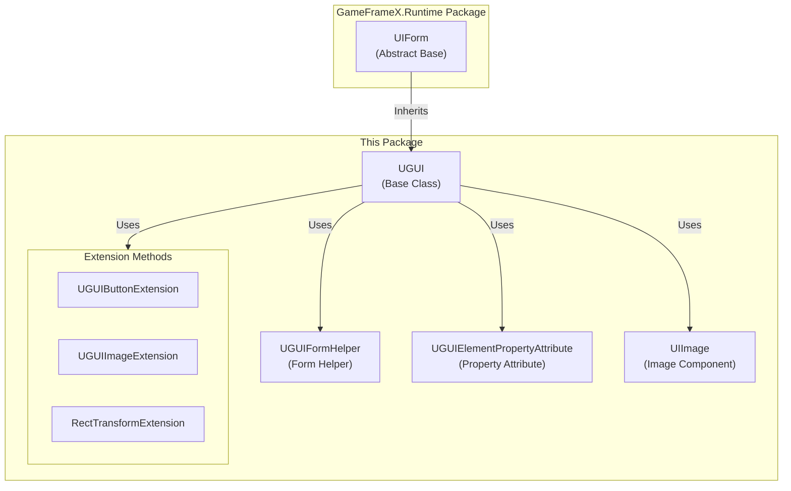
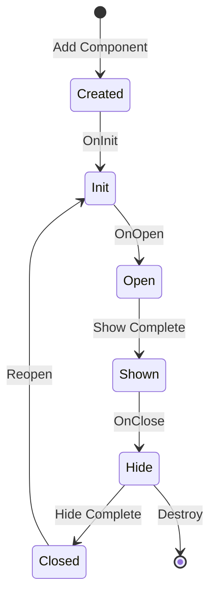

# UGUI Base Class

The UGUI base class is the core class of the GameFrameX UGUI module, providing UGUI-specific form functionality. All UGUI forms need to inherit from this class to gain complete UI lifecycle management and visibility control capabilities.

## Overview

The `UGUI` class is the base class for Unity UGUI forms, inheriting from `UIForm`. It encapsulates Unity UGUI-specific implementation and provides core features such as form show/hide, visibility control, and full-screen layout. By inheriting this base class, developers can quickly create, manage, and manipulate UGUI forms, while seamlessly integrating with GameFrameX's UI management system.

The class uses the `[DisallowMultipleComponent]` attribute to ensure only one UGUI component can be added to each GameObject, preventing logic errors from duplicate additions.

## Core Features

### Form Show and Hide

The UGUI base class overrides the parent class's show and hide methods, supporting form transition effects with animations:

- **Show method**: Displays the form, supports handling show animations via `IUIFormShowHandler`
- **Hide method**: Hides the form, supports handling hide animations via `IUIFormHideHandler`

### Visibility Management

Two methods are provided to control form visibility:

1. **Protected InternalSetVisible method**: Sets the UI display state without firing any events, suitable for internal state synchronization
2. **Public Visible property**: Gets or sets the form visibility, triggering the GameObject's active/inactive state

### Full-Screen Layout

The `MakeFullScreen` method can set a UI element to full-screen mode, automatically configuring anchor points, position, and size:
- Anchor points set to (0,0) to (1,1)
- Anchor position set to (0,0)
- Size delta set to Vector2.zero

## Architecture Design



### Class Relationship Description

| Component | Role | Description |
|------|------|------|
| UIForm | Parent Abstract Base | Provides abstract interface and lifecycle management for UI forms |
| UGUI | Core Class | UGUI-specific form implementation, handles Unity UGUI details |
| UGUIFormHelper | Helper | Handles UI form instantiation, creation, and release |
| UGUIElementPropertyAttribute | Attribute | Marks the path of UI controls in prefabs |
| UIImage | Component | Extended image component with async icon loading |
| Extension Methods | Utility Set | Provides convenient component operation methods |

## Form Lifecycle



## Usage Examples

### Creating a Custom UGUI Form

```csharp
using GameFrameX.UI.UGUI.Runtime;
using UnityEngine;

public class MainMenuUI : UGUI
{
    protected override void OnInit(object userData)
    {
        base.OnInit(userData);
        // Initialize UI logic
    }

    protected override void OnOpen(object userData)
    {
        base.OnOpen(userData);
        // Logic when UI opens
    }

    protected override void OnClose(bool isShutdown, object userData)
    {
        base.OnClose(isShutdown, userData);
        // Logic when UI closes
    }
}
```
> Source: [UGUI.cs](https://github.com/GameFrameX/com.gameframex.unity.ui.ugui/blob/main/Runtime/UGUI.cs#L46-L179)

### Using UGUIElementPropertyAttribute for Control Binding

```csharp
using GameFrameX.UI.UGUI.Runtime;
using UnityEngine;
using UnityEngine.UI;

public class GameStartUI : UGUI
{
    // Mark control path using attribute
    [SerializeField]
    [UGUIElementProperty("StartButton")]
    private Button m_StartButton;

    [SerializeField]
    [UGUIElementProperty("Title/Text")]
    private Text m_TitleText;

    public Button StartButton => m_StartButton;
    public Text TitleText => m_TitleText;

    protected override void OnInit(object userData)
    {
        base.OnInit(userData);
        // Bind button events
        m_StartButton.onClick.AddListener(OnStartClick);
    }

    private void OnStartClick()
    {
        Debug.Log("Start game button clicked");
    }
}
```
> Source: [UGUIElementPropertyAttribute.cs](https://github.com/GameFrameX/com.gameframex.unity.ui.ugui/blob/main/Runtime/UGUIElementPropertyAttribute.cs#L40-L64)

### Setting Full-Screen UI

```csharp
using GameFrameX.UI.UGUI.Runtime;
using UnityEngine;

public class FullScreenPanel : MonoBehaviour
{
    private void Start()
    {
        // Get or add RectTransform and set to full screen
        gameObject.GetOrAddComponent<RectTransform>().MakeFullScreen();
    }
}
```
> Source: [RectTransformExtension.cs](https://github.com/GameFrameX/com.gameframex.unity.ui.ugui/blob/main/Runtime/RectTransformExtension.cs#L56-L62)

## Code Generator Integration

The UGUI base class is tightly integrated with the code generator. The code generator automatically generates code classes inheriting from UGUI for UGUI prefabs:

```csharp
// Code structure generated by code generator
namespace Hotfix.UI
{
    /// <summary>
    /// Auto-generated UI code for MainMenu
    /// </summary>
    [DisallowMultipleComponent]
    [OptionUIConfig(null, "Assets/Prefabs/UI/MainMenu")]
    public sealed partial class MainMenu : UGUI
    {
        public GameObject self { get; private set; }

        [SerializeField]
        [UGUIElementProperty("Panel/StartButton")]
        private Button m_StartButton;

        public Button m_StartButton => m_StartButton;

        private bool _isInitView = false;

        protected override void InitView()
        {
            if (_isInitView)
            {
                return;
            }

            _isInitView = true;
            this.self = this.gameObject;
            m_StartButton = gameObject.transform.FindChildName("Panel/StartButton").GetComponent<Button>();
        }
    }
}
```
> Source: [UGUICodeGenerator.cs](https://github.com/GameFrameX/com.gameframex.unity.ui.ugui/blob/main/Editor/UGUICodeGenerator.cs#L195-L230)

## Related Links

- [UI Manager](./07.ui-manager.md) - Learn about the overall UI form management system
- [Form Helper](./08.form-helper.md) - Learn about UI form creation and management tools
- [UIImage Component](./09.uiimage.md) - Learn about the extended image component
- [Extension Methods](./12.extensions.md) - Learn about button, image, and RectTransform extension methods
- [Code Generator](./10.code-generator.md) - Learn about automatic UGUI code generation
- [Official Documentation](https://gameframex.doc.alianblank.com) - Get more detailed information
